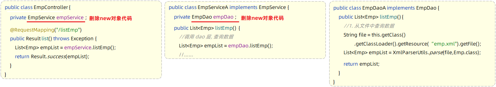
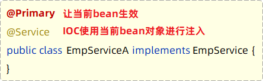

# 分层与解耦

## 三层架构

一般项目代码可以分为三层：

- Controller：控制层

	接收前端发送的请求，对请求进行处理，并响应数据。

- Service：业务逻辑层

	处理具体的业务逻辑。

- Dao：数据访问层(Data Access Object)，也称为持久层

	负责数据访问操作，包括数据的增、删、改、查。

基于三层架构的程序执行流程：


- 前端发起的请求，由Controller层接收（Controller响应数据给前端）
- Controller层调用Service层来进行逻辑处理（Service层处理完后，把处理结果返回给Controller层）
- Serivce层调用Dao层（逻辑处理过程中需要用到的一些数据要从Dao层获取）
- Dao层操作文件中的数据（Dao拿到的数据会返回给Service层）

各层代码可独立修改。

### 案例

- 控制层包名：xxxx.controller
- 业务逻辑层包名：xxxx.service
- 数据访问层包名：xxxx.dao


其中：

- dao 中的 EmpDao 是接口。
- service 中的 EmpService 是接口。
- impl 包含实现该接口的类。

案例代码如下：

#### 控制层

接收前端发送的请求，对请求进行处理，并响应数据

```java
@RestController
public class EmpController {
    //业务层对象，用 接口对象 引用 实现了接口的对象
    private EmpService empService = new EmpServiceA();

    @RequestMapping("/listEmp")
    public Result list(){
        //1. 调用service层, 获取数据
        List<Emp> empList = empService.listEmp();

        //3. 响应数据
        return Result.success(empList);
    }
}
```

#### 业务逻辑层

处理具体的业务逻辑

- 业务接口

~~~java
//业务逻辑接口（制定业务标准）
public interface EmpService {
    //获取员工列表
    public List<Emp> listEmp();
}
~~~

- 业务实现类

```java
//业务逻辑实现类（按照业务标准实现）
public class EmpServiceA implements EmpService {
    //dao层对象，用 接口对象 引用 实现了接口的对象
    private EmpDao empDao = new EmpDaoA();

    @Override
    public List<Emp> listEmp() {
        //1. 调用dao, 获取数据
        List<Emp> empList = empDao.listEmp();

        //2. 对数据进行转换处理 - gender, job
        empList.stream().forEach(emp -> {
            //处理 gender 1: 男, 2: 女
            String gender = emp.getGender();
            if("1".equals(gender)){
                emp.setGender("男");
            }else if("2".equals(gender)){
                emp.setGender("女");
            }

            //处理job - 1: 讲师, 2: 班主任 , 3: 就业指导
            String job = emp.getJob();
            if("1".equals(job)){
                emp.setJob("讲师");
            }else if("2".equals(job)){
                emp.setJob("班主任");
            }else if("3".equals(job)){
                emp.setJob("就业指导");
            }
        });
        return empList;
    }
}
```

#### 数据访问层

负责数据的访问操作，包含数据的增、删、改、查

- 数据访问接口

~~~java
//数据访问层接口（制定标准）
public interface EmpDao {
    //获取员工列表数据
    public List<Emp> listEmp();
}
~~~

- 数据访问实现类

```java
//数据访问实现类
public class EmpDaoA implements EmpDao {
    @Override
    public List<Emp> listEmp() {
        //1. 加载并解析emp.xml（获取数据）
        String file = this.getClass().getClassLoader().getResource("emp.xml").getFile();
        System.out.println(file);
        List<Emp> empList = XmlParserUtils.parse(file, Emp.class);
        return empList;
    }
}
```


## 解耦

### 耦合问题

在上述案例中，会有耦合问题：把业务类变为 EmpServiceB 时，需要修改 controller 层的代码：


我们在编写代码时，需要什么对象，就直接 new 一个就可以了，但这种做法会导致层与层之间代码耦合，当 service 层的实现改变之后， 还需要修改 controller 层的代码。

### 解耦方式

首先不能在 EmpController 中直接 new 对象。代码如下：


此时，就存在另一个问题了，不能 new，就意味着没有业务层对象（程序运行就报错），怎么办呢？

解决方法：

- 提供一个容器，容器中存储一些对象(例：EmpService对象)
- controller 程序从容器中获取 EmpService 类型的对象

实现上述解耦操作，就涉及到Spring中的两个核心概念：

- **控制反转：** Inversion Of Control，简称 IOC

	对象的创建控制权由程序自身转移到外部（容器），这种思想称为控制反转。

	> 对象的创建权由程序员主动创建转移到容器(由容器创建、管理对象)。这个容器称为：IOC容器或Spring容器

- **依赖注入：** Dependency Injection，简称 DI

	容器为应用程序提供运行时所依赖的资源，称之为依赖注入。

	> 程序运行时需要某个资源，此时容器就为其提供这个资源。
	>
	> 例：EmpController程序运行时需要EmpService对象，Spring容器就为其提供并注入EmpService对象

IOC 容器中创建、管理的对象，称之为：bean 对象。

## 使用 IOC & DI 解耦

### 实现示例

对上述案例代码做如下修改，以完成 Controller 层、Service 层、Dao 层的代码解耦。

思路：

1. 删除 Controller 层、Service 层中 new 对象的代码
2. Service 层及 Dao 层的实现类，交给 IOC 容器管理（@Component）
3. 为 Controller 及 Service 注入运行时依赖的对象（@Autowired）
	- Controller 程序中注入依赖的 Service 层对象
	- Service 程序中注入依赖的 Dao 层对象

第1步：删除 Controller 层、Service 层中 new 对象的代码



第2步：Service 层及 Dao 层的实现类，交给 IOC 容器管理

- 使用 Spring 提供的注解：`@Component`，就可以实现类交给 IOC 容器管理


第3步：为 Controller 及 Service 注入运行时依赖的对象

- 使用 Spring 提供的注解：`@Autowired` ，就可以实现程序运行时 IOC 容器自动注入需要的依赖对象


### IOC 详解

IOC 控制反转，就是将对象的控制权交给 Spring 的 IOC 容器，由 IOC 容器创建及管理对象。

IOC 容器创建的对象称为 bean 对象。

Spring 框架为了更好的标识 web 应用程序开发当中，bean 对象到底归属于哪一层，又提供了 @Component 的衍生注解：

| 注解        | 说明                 | 位置                                           |
| :---------- | -------------------- | ---------------------------------------------- |
| @Controller | @Component的衍生注解 | 标注在 Controller 类上                         |
| @Service    | @Component的衍生注解 | 标注在 Service 类上                            |
| @Repository | @Component的衍生注解 | 标注在 DAO 类上（由于与 mybatis 整合，用的少） |
| @Component  | 声明bean的基础注解   | 不属于以上三类时，用此注解                     |

注意，使用以上四个注解都可以声明 bean，但是在 springboot 集成 web 开发中，声明控制器 bean 只能用 @Controller 。（不能用 @Componet）

在 IOC 容器中，每个 Bean 都有唯一的名字，可以通过注解的 value 属性指定 bean 的名字，如果没有指定，默认为首字母小写的类名：


#### 组件扫描

使用前面四个注解声明的 bean，不一定会生效，bean 想要生效，还需要保证被组件扫描到。

将定义的 controller，service，dao 这些包，都放在引导类（也就是启动类）所在包 com.itheima 或其子包下，这样定义的 bean 就会被自动扫描到：


- 在启动类中，@SpringBootApplication 已经包含了 @ComponentScan 注解，默认扫描范围是 SpringBoot 启动类所在包及其子包。
- 对于其它位置的包，可以手动配置 @ComponentScan 注解，指定要扫描的包。（不推荐）

### DI 详解

依赖注入，是指 IOC 容器要为应用程序去提供运行时所依赖的资源，而资源指的就是对象。

@Autowired 注解，默认是按照**接口类型**进行自动装配的（去IOC容器中找某个接口类型的对象，然后完成注入操作）

当在 IOC 容器中存在多个相同接口类型的 bean 对象时：（同一接口有多个不同实现类）


可以使用以下注解：

- @Primary
	- 当存在多个相同接口类型的 Bean 注入时，加上 @Primary 注解，来确定默认（优先）的实现。

- @Qualifier
	- 可在 @Qualifier 的 value 属性中，指定注入的 bean 的名称。

	- @Qualifier 注解不能单独使用，必须配合 @Autowired 使用。

- @Resource
	- 按照 bean 的名称进行注入。
	- 通过 name 属性指定要注入的 bean 的名称。


@Primary：

 

@Qualifier：


@Resource：


注意， @Autowird 与 @Resource 的区别：

- @Autowired 是 spring 框架提供的注解，而 @Resource 是 JDK 提供的注解
- @Autowired 默认是按照类型注入，而 @Resource 是按照名称注入

