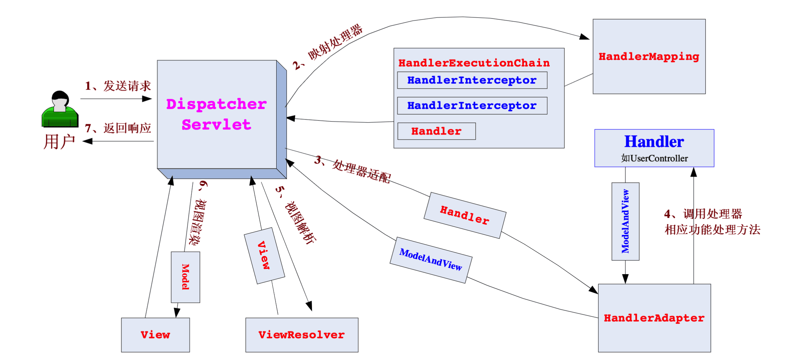

# Spring

- Spring

	Spring 全家桶，包括 Spring Framework，Spring Boot，Spring Data 等。

- Spring Framework（时常简称 Spring）

	一个 Java 开源轻量级框架，用以整合各类框架，可管理项目，管理类的实例化与生命周期等。

Spring 的每个模块（或组件，也可以是框架）都可以单独存在，或者与其它一个或多个模块联合实现，下图是 Spring 5.x ：

## 核心功能

- 控制反转（Inversion of Control，IOC）

	Spring 在运行时，依据 xml 配置文件和注解等，动态地调用、创建对象与使用方法，将对象交由 IOC 容器统一管理（从用户管理 Bean 转到框架管理 Bean）。

	- IOC 包含依赖注入（Dependency Injection，DI）和依赖查找（Dependency Lookup，DL）两种方式。
	- Spring 采用 DI 。
	- IOC 是设计思想，DI 是实现方式。

- 面向切面编程（Aspect-oriented Programming，AOP）

	将代码逻辑进一步模块化，使其更便于管理与使用。

## 模块介绍

### Core Container

- Beans

	提供了 BeanFactory 以及 IOC 和 DI，是工厂模式的一个经典实现，Spring 将被管理对象称为 Bean 。

- Core

	封装了 Spring 框架的底层部分，包括资源访问、类型转换及一些常用工具类。

- Context

	建立在 Core 和 Beans 模块的基础之上，集成 Beans 模块功能并添加资源绑定、数据验证、国际化、Java EE 支持、容器生命周期、事件传播等。ApplicationContext 接口是上下文模块的焦点。

- SpEL（Spring Extension Language）

	提供强大的表达式语言支持，支持访问和修改属性值，方法调用，支持访问及修改数组、容器和索引器，命名变量，支持算数和逻辑运算，支持从 Spring 容器获取 Bean，它也支持列表投影、选择和一般的列表聚合等。

### Data Access/Integration

（数据访问／集成）

- JDBC 模块

	提供了一个 JDBC 的样例模板，使用这些模板能消除传统冗长的 JDBC 编码还有必须的事务控制，而且能使用 Spring 管理事务。

- ORM 模块

	提供与流行的“对象-关系”映射框架无缝集成的 API，包括 JPA、JDO、Hibernate 和 MyBatis 等。而且还可以使用 Spring 事务管理，无需额外控制事务。

- OXM 模块

	提供了一个支持 Object /XML 映射的抽象层实现，如 JAXB、Castor、XMLBeans、JiBX 和 XStream 。将 Java 对象映射成 XML 数据，或者将 XML 数据映射成 Java 对象。

- JMS 模块

	指 Java 消息服务，提供一套 “消息生产者、消息消费者”模板用于更加简单的使用 JMS，JMS 在两个应用程序之间，或分布式系统中发送消息，进行异步通信。

- Transactions 事务模块

	支持编程和声明式事务管理。

### Web

- Web 模块

	提供了基本的 Web 开发集成特性，例如多文件上传功能、使用的 Servlet 监听器的 IOC 容器初始化以及 Web 应用上下文。

- Servlet 模块

	提供了一个 Spring MVC Web 框架实现。Spring MVC 框架提供了基于注解的请求资源注入、更简单的数据绑定、数据验证等及一套非常易用的 JSP 标签，用于与 Spring 其他技术协作。

- WebSocket 模块

	提供了简单的接口，用户只要实现响应的接口就可以快速的搭建 WebSocket Server，从而实现双向通讯。

- Webflux 模块

	Spring WebFlux 是 Spring Framework 5.x中引入的新的响应式web框架。与Spring MVC不同，它不需要Servlet API，是完全异步且非阻塞的，并且通过Reactor项目实现了Reactive Streams规范。Spring WebFlux 用于创建基于事件循环执行模型的完全异步且非阻塞的应用程序。

此外Spring4.x中还有Portlet 模块，在Spring 5.x中已经移除：

- Portlet 模块

	提供了在 Portlet 环境中使用 MVC 实现，类似 Web-Servlet 模块的功能。

### AOP、Aspects、Instrumentation 和 Messaging

- AOP 模块

	提供了面向切面编程实现，提供比如日志记录、权限控制、性能统计等通用功能和业务逻辑分离的技术，并且能动态的把这些功能添加到需要的代码中，这样各司其职，降低业务逻辑和通用功能的耦合。

- Aspects 模块

	提供与 AspectJ 的集成，是一个功能强大且成熟的面向切面编程（AOP）框架。

- Instrumentation 模块

	提供了类工具的支持和类加载器的实现，可以在特定的应用服务器中使用。

- messaging 模块

	Spring 4.0 以后新增了消息（Spring-messaging）模块，该模块提供了对消息传递体系结构和协议的支持。

- jcl 模块

	Spring 5.x 中新增了日志框架集成的模块。

### Test

- Test 模块

	Spring 支持 Junit 和 TestNG 测试框架，而且还额外提供了一些基于 Spring 的测试功能，比如在测试 Web 框架时，模拟 Http 请求的功能。包含 Mock Objects, TestContext Framework, Spring MVC Test, WebTestClient 。

## Spring MVC

Spring MVC 是 Spring 的符合 MVC 规范的 Web 开发模块（Spring Web），用于简化原始 Servlet 程序（传统 Java Web）。

### Spring MVC 请求处理的核心流程

其中：

- `servlet.xml` 是 servlet 的配置文件。
- HandlerMapping 对请求进行映射，处理，选择处理器等操作。
- ModelAndView 是一个对象（包含模型数据、逻辑视图名）。
- ViewResolver 把逻辑视图名解析为具体的 View ，这里可以支持不同技术的 ViewResolver 。
- View 会根据传进来的 Model （模型数据）进行渲染，此处的 Model 是一个 Map 数据结构，因此很容易支持其他视图技术；

常见另一版本流程图：

其中：

- HandlerMapping 将会把请求映射为 HandlerExecutionChain 对象（包含一个Handler 处理器（页面控制器）对象、多个HandlerInterceptor 拦截器）对象，通过这种策略模式，很容易添加新的映射策略；
- HandlerAdapter 把处理器包装为适配器，从而支持多种类型的处理器， 即适配器设计模式的应用，从而很容易支持很多类型的处理器；
