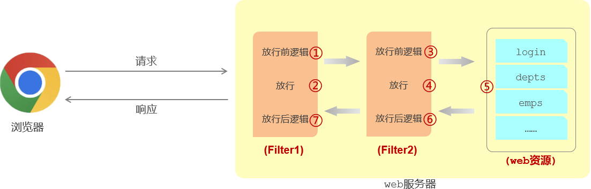
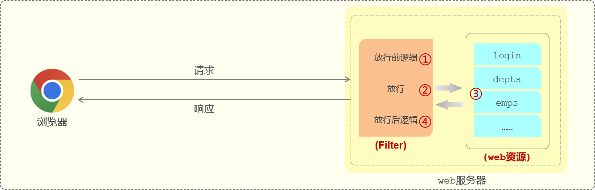
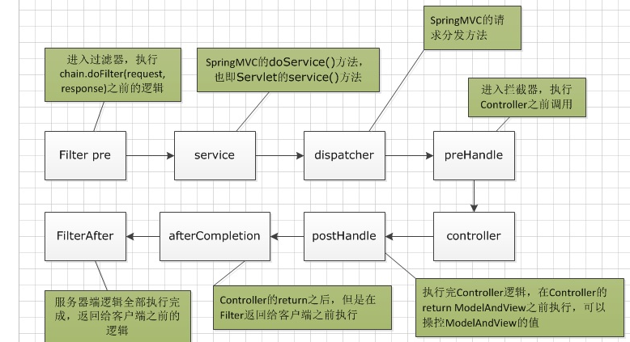

# 过滤器与拦截器

## 过滤器 Filter

Filter 是 JavaWeb 三大组件（Servlet、Filter、Listener）之一。

过滤器一般完成一些通用的操作，比如：登录校验、统一编码处理、敏感字符处理等。


### 定义 Filter

步骤：

1. 定义一个过滤器类，实现 Filter 接口，并重写其所有方法。
2. 配置过滤器，在 Filter 类上加 @WebFilter 注解，配置拦截资源的路径。（有 @WebFilter 注解，filter 类才会生效）
3. 引导类上加 @ServletComponentScan 开启 Servlet 组件支持。

```java
@WebFilter(urlPatterns = "/*") //配置过滤器要拦截的请求路径（ /* 表示拦截浏览器的所有请求 ）
public class DemoFilter implements Filter {
    @Override //初始化方法, 只调用一次
    public void init(FilterConfig filterConfig) throws ServletException {
        System.out.println("init 初始化方法执行了");
    }

    @Override //拦截到请求之后调用, 调用多次
    public void doFilter(ServletRequest servletRequest, ServletResponse servletResponse, FilterChain filterChain) throws IOException, ServletException {
        
        System.out.println("DemoFilter   放行前逻辑.....");

        //放行请求
        filterChain.doFilter(servletRequest,servletResponse);

        System.out.println("DemoFilter   放行后逻辑.....");
        
    }

    @Override //销毁方法, 只调用一次
    public void destroy() {
        System.out.println("destroy 销毁方法执行了");
    }
}
```

其中：

- init 方法

	过滤器的初始化方法。在 web 服务器启动时会自动的创建Filter过滤器对象，并自动调用 init 初始化方法。（只会被调用一次）

- doFilter 方法

	每拦截到一次请求就会调用一次 doFilter() 方法。（可被调用多次）

	- 如果不执行放行操作，将无法访问后面的资源。 放行操作：`chain.doFilter(request, response); ` 相当于执行过滤器链上的下一个过滤器。

- destroy 方法

	销毁时的方法。关闭服务器时，会自动调用销毁方法 destroy 。（只会被调用一次）

在启动类上面加上一个注解@ServletComponentScan，通过这个@ServletComponentScan注解来开启SpringBoot项目对于Servlet组件的支持：

```java
@ServletComponentScan
@SpringBootApplication
public class TliasWebManagementApplication {

    public static void main(String[] args) {
        SpringApplication.run(TliasWebManagementApplication.class, args);
    }

}
```

### 拦截路径

Filter 可配置不同的拦截资源路径：

| 拦截路径     | urlPatterns值 | 含义                               |
| ------------ | ------------- | ---------------------------------- |
| 拦截具体路径 | /login        | 只有访问 /login 路径时，才会被拦截 |
| 目录拦截     | /emps/*       | 访问/emps下的所有资源，都会被拦截  |
| 拦截所有     | /*            | 访问所有资源，都会被拦截           |

### 过滤器链

在一个 web 应用程序中可以配置多个过滤器，多个过滤器就形成了一个过滤器链。



注意过滤器链的执行顺序。

假设有两个过滤器：

AbcFilter 过滤器：

```java
@WebFilter(urlPatterns = "/*")
public class AbcFilter implements Filter {
    @Override
    public void doFilter(ServletRequest request, ServletResponse response, FilterChain chain) throws IOException, ServletException {
        System.out.println("Abc 拦截到了请求... 放行前逻辑");

        //放行
        chain.doFilter(request,response);

        System.out.println("Abc 拦截到了请求... 放行后逻辑");
    }
}
```

DemoFilter 过滤器：

```java
@WebFilter(urlPatterns = "/*") 
public class DemoFilter implements Filter {
    @Override
    public void doFilter(ServletRequest servletRequest, ServletResponse servletResponse, FilterChain filterChain) throws IOException, ServletException {
        System.out.println("DemoFilter   放行前逻辑.....");

        //放行请求
        filterChain.doFilter(servletRequest,servletResponse);

        System.out.println("DemoFilter   放行后逻辑.....");
    }
}
```

注意，AbcFilter 和 DemoFilter 的 urlPatterns 是一样的，考虑它们的拦截顺序。

AbcFilter 会先执行，DemoFilter 会后执行。

以注解方式配置的 Filter 过滤器，它的执行优先级是按时过滤器类名的自动排序确定的，类名排名越靠前，优先级越高。

如果将 AbcFilter 的类名修改为 XbcFilter ，则 DemoFilter 会先执行，XbcFilter 会后执行。

## 拦截器 Interceptor

拦截器由 Spring 框架提供，用来动态拦截控制器（Controller）方法的执行。

### 定义拦截器

先实现 HandlerInterceptor 接口，并重写其所有方法：

```java
//自定义拦截器
@Component
public class LoginCheckInterceptor implements HandlerInterceptor {
    //目标资源方法执行前执行。 返回true：放行    返回false：不放行
    @Override
    public boolean preHandle(HttpServletRequest request, HttpServletResponse response, Object handler) throws Exception {
        System.out.println("preHandle .... ");
        
        return true; //true表示放行
    }

    //目标资源方法执行后执行
    @Override
    public void postHandle(HttpServletRequest request, HttpServletResponse response, Object handler, ModelAndView modelAndView) throws Exception {
        System.out.println("postHandle ... ");
    }

    //视图渲染完毕后执行，最后执行
    @Override
    public void afterCompletion(HttpServletRequest request, HttpServletResponse response, Object handler, Exception ex) throws Exception {
        System.out.println("afterCompletion .... ");
    }
}
```

再实现 WebMvcConfigurer 接口，并重写 addInterceptors 方法：

```java
@Configuration  
public class WebConfig implements WebMvcConfigurer {

    //自定义的拦截器对象
    @Autowired
    private LoginCheckInterceptor loginCheckInterceptor;

    
    @Override
    public void addInterceptors(InterceptorRegistry registry) {
       //注册自定义拦截器对象
        registry.addInterceptor(loginCheckInterceptor).addPathPatterns("/**");//设置拦截器拦截的请求路径（ /** 表示拦截所有请求）
    }
}
```

### 拦截路径

配置拦截器时，不仅可以指定要拦截哪些资源，还可以指定不拦截哪些资源：

```java
@Configuration  
public class WebConfig implements WebMvcConfigurer {

    //拦截器对象
    @Autowired
    private LoginCheckInterceptor loginCheckInterceptor;

    @Override
    public void addInterceptors(InterceptorRegistry registry) {
        //注册自定义拦截器对象
        registry.addInterceptor(loginCheckInterceptor)
                .addPathPatterns("/**")//设置拦截器拦截的请求路径（ /** 表示拦截所有请求）
                .excludePathPatterns("/login");//设置不拦截的请求路径
    }
}
```

| 拦截路径  | 含义                 | 举例                                                |
| --------- | -------------------- | --------------------------------------------------- |
| /*        | 一级路径             | 能匹配/depts，/emps，/login，不能匹配 /depts/1      |
| /**       | 任意级路径           | 能匹配/depts，/depts/1，/depts/1/2                  |
| /depts/*  | /depts下的一级路径   | 能匹配/depts/1，不能匹配/depts/1/2，/depts          |
| /depts/** | /depts下的任意级路径 | 能匹配/depts，/depts/1，/depts/1/2，不能匹配/emps/1 |

## 执行流程

过滤器：



特别地，考虑过滤器与拦截器同时存在时的执行流程：


1. 当浏览器访问部署在 web 服务器（比如 Tomcat）当中的 web 应用时，**过滤器**会拦截到这次请求。
2. 拦截到这次请求之后，它会先执行放行前的逻辑，然后再执行放行操作。
	  - 如果是基于 springboot 开发的，放行之后就进入到了 spring 的环境当中，也就是要访问 controller 当中的接口方法。

3. 所有请求都会先进行到 DispatcherServlet，再将请求转给 Controller。

	  - Tomcat（Servlet 容器）只识别 Servlet 程序，并不识别所编写的 Controller 程序。
	  - Spring 在 Web 环境中提供了一个非常核心的 Servlet：DispatcherServlet（前端控制器），用来将请求转发给 Controller（扩展了 Servlet ，用于构建 Servlet 与 Spring 内部的关系）。

4. 在执行 Controller 的方法之前，请求会被**拦截器**拦截住。

	  - 执行`preHandle()`方法，这个方法执行完成后需要返回一个布尔类型的值。

	  - 如果返回 true，就表示放行本次操作，才会继续访问 controller 中的方法；

	  - 如果返回 false，则不会放行（不会执行 controller 中的方法）。

5. 在 controller 当中的方法执行完毕之后。
6. 再回过来执行`postHandle()`这个方法以及`afterCompletion()` 方法。
7. 然后再返回给 DispatcherServlet 。
8. 最终再来执行过滤器当中放行后的一部分逻辑。
9. 执行完毕之后，最终给浏览器响应数据。



## 对比

| Type              | Filter                                                       | Interceptor                                                  |
| ----------------- | ------------------------------------------------------------ | ------------------------------------------------------------ |
| 环境              | 拦截所有资源                                                 | 只会拦截 Spring 环境中的资源                                 |
| 拦截能力          | 可以拿到原始的 Http 请求和响应的信息，但是拿不到真正处理请求的控制器和方法的信息。 | 可以拿到原始Http请求和响应的信息，也可拿到请求的方法的信息。 |
| 实验方式          | 基于 Java 反射                                               | 基于函数回调                                                 |
| 与 Servlet 的关系 | Servlet 外，不依赖于 Servlet 。                              | Servlet 内，依赖于 Servlet 。                                |

