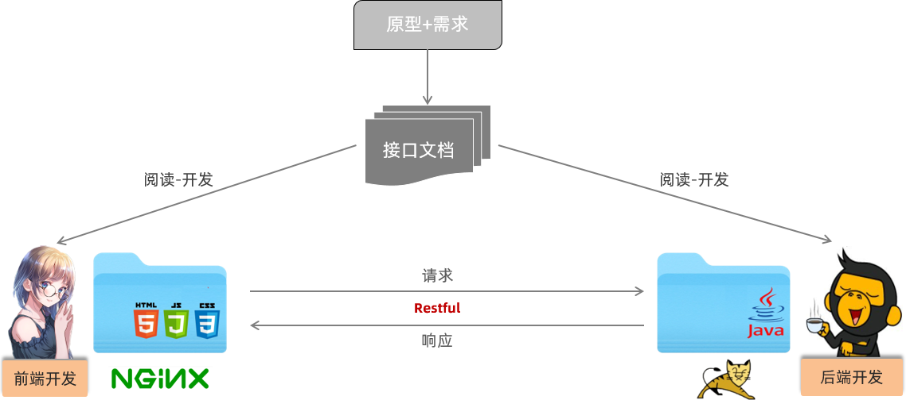
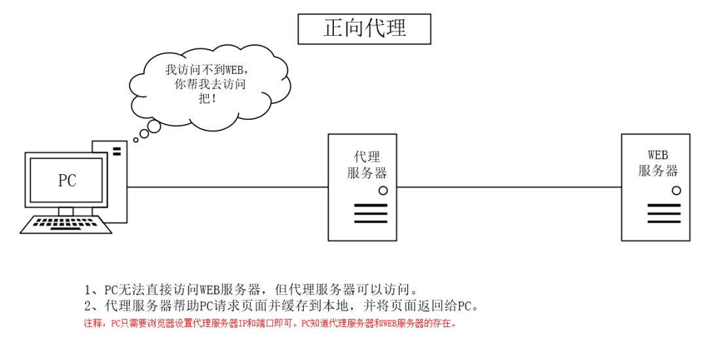
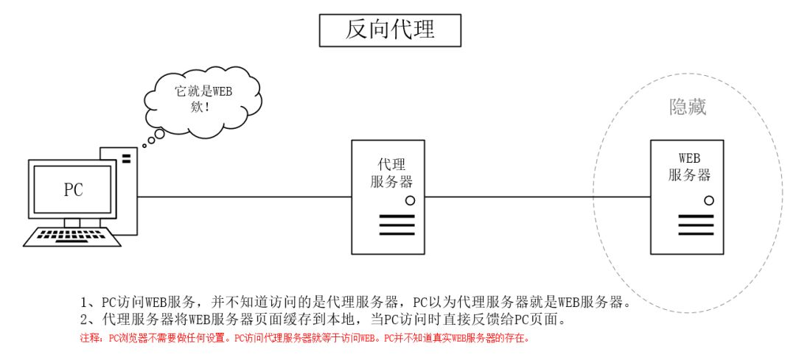

# 基本概念

## 版本

- Java SE

	Java Platform, Standard Edition ，标准版，主要用于桌面应用程序的开发。

- Java EE

	Java Platform, Enterprise Edition，企业版，主要用于开发企业级分布式的网络程序。

- Java ME

	Java Platform, Micro Edition ，微型版，主要用于嵌入式开发。

## 环境

- JDK

	Java SE System Development Kit，Java 语言的软件开发工具包。 

- JRE

	Java Runtime Environment，Java 运行环境。

- JVM

	Java Virtual Machine，Java 虚拟机。

## 基本文件

- `.java`

	Java 源文件，编译后产生字节码文件。

- `.class`

	字节码文件，提供给 JVM 运行。

## 项目管理工具

主要有：（至少选一个使用）

- Maven
- Gradle

主要功能：

- 创建项目。
- 管理包关系（包依赖，包安装等）。
- 编译项目。
- 测试项目。
- 生成文档。
- 发布项目。

打包文件：

- jar 包（Java ARchive）

  JAR 包主要用于封装 Java 类文件、资源文件（如图片、配置文件）以及可能的元数据（如 `MANIFEST.MF`），以便可以分发和复用。通常用于将 Java 库、工具或应用程序打包成一个可执行文件或分发单位。

  - 通常用于打包 Java 程序、类库和工具等一般的 Java 应用。
  - 因为 Spring Boot 内置了 tomcat，所以可以直接以 jar 包启动 web 应用程序。

- war 包（Web Application ARchive）

	WAR 包专用于打包 Java Web 应用程序。它包括了一个完整的 Web 应用的所有内容，如 `JSP` 文件、`Servlet` 类、静态资源（HTML、CSS、JS 等），以及描述应用程序结构和配置的文件（如 `web.xml`）。
	
	- 用于打包 Java Web 应用，包含 Web 资源和配置文件，适合部署到 Servlet 容器（如 tomcat）。

## Tomcat 和 Servlet 和 Spring MVC

- Tomcat 是一个 **Servlet 容器**，也是一个 **Web 服务器**，它负责处理 Web 请求并将其传递给相应的 Servlet 。

- Servlet 是 Java EE（现在的 Jakarta EE）中的一种技术，是一种 **Java 类**，它通过实现 `javax.servlet.Servlet` 接口来定义请求处理逻辑，用于处理 HTTP 请求和响应。
- Spring MVC 主要用于简化 Servlet 的使用，通过它可以更方便地处理 HTTP 请求、路由请求到控制器（Controller）、调用服务层处理业务逻辑、最后将数据渲染到视图层。

## Web 服务器与 Web 容器

### Web 服务器

主要作用是**接收客户端（浏览器）的 HTTP 请求，并返回静态资源**（如 HTML、CSS、JS、图片等）。它处理的是 Web 协议（HTTP），关注网络通信、连接管理、请求转发。

例如：

- Apache HTTP Server
- IIS（微软的服务器）
- Nginx
	- 常用作静态资源服务器（也可用动态脚本语言生成动态资源，但用 Java 不好实现）
	- 代理服务器
	- 负载均衡服务器
- Tomcat（也可做 Web 服务器）
	- 静态和动态资源均可。
	- 一个 Web 应用容器（也叫 Servlet 容器），运行在 JVM 之上，运行 java 程序。


补充：

- nginx 和 tomcat 可以配合使用
	- nginx 发布静态资源和进行负载均衡。
	- tomcat 发布动态资源。

### Web 容器

专门用来 **运行 Java Web 应用** 的组件，主要负责：

- 加载和管理 Servlet 生命周期。
- 处理 JSP 。
- 分发请求、生成响应。
- 它实现了 Servlet 规范 和 JSP 规范，是 Java EE（Jakarta EE）的一部分。
- Servlet 容器一般内置在 Java Web 服务器中（比如 Tomcat）。

### 特殊情况

**Tomcat** 是一种特殊情况，它既是一个 **Web 容器**（运行 Servlet/JSP），也是一个轻量级的 **Web 服务器**（可以处理 HTTP 请求），所以常被叫做 "Servlet 容器" 或 "Java Web 服务器"。

**Nginx** 和 **Apache HTTP Server** 是纯粹的 Web 服务器，不能运行 Java Servlet，需要将请求转发到后端的 Web 容器，比如 Tomcat 。

## 开发规范

### REST 风格

对于前后端分离模式：



前后端开发人员都需要根据提前定义好的接口文档，来进行前后端功能的开发：

- 后端：严格遵守接口文档进行功能接口开发
- 前端：严格遵守接口文档访问功能接口

在前后端进行交互的时候，需要基于当前主流的 REST 风格的 API 接口进行交互。

- REST（Representational State Transfer）

	表述性状态转换，它是一种软件架构风格。

- RESTful 

	与 REST 是一个意思，区别就是 REST 是名词，RESTful  是形容词。

传统 URL 风格：

```url
http://localhost:8080/user/getById?id=1     GET：查询id为1的用户
http://localhost:8080/user/saveUser         POST：新增用户
http://localhost:8080/user/updateUser       POST：修改用户
http://localhost:8080/user/deleteUser?id=1  GET：删除id为1的用户
```

传统 URL 定义较复杂，而且将资源的访问行为对外暴露出来了。

基于 REST 风格 URL ：

```
http://localhost:8080/users/1  GET：查询id为1的用户
http://localhost:8080/users    POST：新增用户
http://localhost:8080/users    PUT：修改用户
http://localhost:8080/users/1  DELETE：删除id为1的用户
```

REST 风格通过 URL 定位要操作的资源，通过 HTTP 动词（请求方式）来描述具体的操作。

使用四种请求方式，来操作数据的增删改查： 

- GET ： 查询
- POST ：新增
- PUT ：修改
- DELETE ：删除

基于 REST 风格定义 URL，URL 将会更加简洁、更加规范、更加优雅。

注意：

- REST是风格，是约定方式，约定不是规定，可以打破
- 描述模块的功能通常使用复数，也就是加s的格式来描述，表示此类资源，而非单个资源。如：users、emps、books…

注意：

- 前端页面跳转的路径和访问后端接口的路径可以是不一样的。
- 用户一般在浏览器中看见的是前端页面跳转的路径。
- 后端接口的路径一般由前端服务器进行访问（而非用户）。

### 统一响应结果

前后端工程在进行交互时，使用统一响应结果 Result，至少要返回：

- 状态码
- 响应数据
- 描述信息

```java
package com.itheima.pojo;

import lombok.AllArgsConstructor;
import lombok.Data;
import lombok.NoArgsConstructor;

@Data
@NoArgsConstructor
@AllArgsConstructor
public class Result {
    private Integer code;//响应码，1 代表成功; 0 代表失败
    private String msg;  //响应信息 描述字符串
    private Object data; //返回的数据

    //增删改 成功响应
    public static Result success(){
        return new Result(1,"success",null);
    }
    //查询 成功响应
    public static Result success(Object data){
        return new Result(1,"success",data);
    }
    //失败响应
    public static Result error(String msg){
        return new Result(0,msg,null);
    }
}
```

### 开发流程


1. 查看页面原型明确需求

	根据页面原型和需求，进行表结构设计、编写接口文档。

2. 阅读接口文档

3. 思路分析

4. 功能接口开发

	开发后台的业务功能，一个业务功能，我们称为一个接口（给用户的接口）。

5. 功能接口测试

	功能开发完毕后，先进行功能接口测试，测试通过后，再和前端进行联调测试。

6. 前后端联调测试

	和前端开发人员开发好的前端工程一起测试。

## Base64 编码

一种基于 64 个可打印的字符来表示二进制数据的编码以及解码方式。

每 6 位二进制数据对应一个 Base64 字符，而每 3 个字节（24 位）会被编码为 4 个 Base64 字符（4 × 6 位 = 24 位）。

所使用的 64 个字符分别是：

- A 到 Z、a 到 z、 0 - 9

- 一个加号，一个斜杠

- 等号

	等号是第 65 个字符，作为补位符号。
	
	- 原始数据的长度不一定总是 3 字节的倍数， 需要填充 (`=`) 来确保最终的编码字符串长度是 4 的倍数。
	- 一个编码单元是 3 字节，所以必须要是 3 字节的倍数。

Base64 是编码方式，而不是加密方式。

## 代理服务器代理方式

### 正向代理（forward proxy）

代理客户端访问网络。

访问外网技术就是正向代理：



常见用处：

- 突破访问限制

	通过代理服务器，可以突破自身IP访问限制，访问国外网站，教育网等。

- 提高访问速度

	通常代理服务器都设置一个较大的硬盘缓冲区，会将部分请求的响应保存到缓冲区中，当其他用户再访问相同的信息时， 则直接由缓冲区中取出信息，传给用户，以提高访问速度。

- 隐藏客户端真实 IP

	上网者也可以通过这种方法隐藏自己的 IP，免受攻击。

### 反向代理（reverse proxy）

代理服务端接受请求。



常见用处：

- 负载均衡

	将客户端请求分发到不同的真实服务器上。

- 提高访问速度

	可以对静态内容及短时间内有大量访问请求的动态内容提供缓存服务，提高访问速度。

- 提供安全保障

	- 可以对客户端隐藏服务器的真实 IP 。
	- 反向代理服务器可以作为应用层防火墙，为网站提供对基于 Web 的攻击行为（例如 DoS/DDoS）的防护。
	- 还可以为后端服务器统一提供加密和 SSL 加速（如 SSL 终端代理），提供 HTTP 访问认证等。

### 正向代理和反向代理的区别

虽然正向代理服务器和反向代理服务器所处的位置都是客户端和真实服务器之间，所做的事情也都是把客户端的请求转发给服务器，再把服务器的响应转发给客户端，但是二者之间还是具有一定差异：

- 代理的对象不同
	- **正向代理是客户端的代理**，帮助客户端访问其无法访问的服务器资源。
	- **反向代理是服务器的代理**，帮助服务器做负载均衡，安全防护等。
- 架设实施者不同
	- **正向代理一般是客户端架设的**，比如在自己的机器上安装一个代理软件。
	- **反向代理一般是服务器架设的**，比如在自己的机器集群中部署一个反向代理服务器。
- 身份隐藏的对象不同
	- **正向代理中，服务器不知道真正的客户端是谁**，以为访问自己的就是真实的客户端。
	- **反向代理中，客户端不知道真正的服务器是谁**，以为自己访问的就是真实的服务器。
