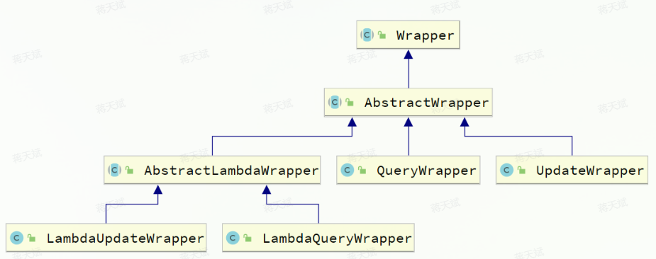

# Mybatis-Plus

## 基本使用

MybatisPlus 的坐标包含了 Mybatis 的坐标，只使用 MybatisPlus 的坐标即可。

为了简化单表 CRUD，MybatisPlus 提供了一个`BaseMapper`接口，其实现了基本的单表 CRUD 方法。

在使用时，指定泛型并继承即可：

```java
public interface UserMapper extends BaseMapper<User> {   // 泛型指定为实体类 User
}
```

### 常见注解

MybatisPlus 通过 PO（Persistent Object） 实体（即泛型指定的实体类）的信息推断（通过反射实现）出表的信息，从而推断出需要的 SQL 。

默认情况下：

- PO 的名为 id 的字段作为主键
- PO 的类名驼峰转下划线作为表名
- PO 变量名驼峰转下划线作为表的字段名，并根据变量类型推断字段类型

其它情况可以使用注解指定。

#### @TableName

指定表名：

```Java
@TableName("user")
public class User {
    private Long id;
    private String name;
}
```

一些属性：

| **属性**         | **类型** | **必须指定** | **默认值** | **描述**                                                     |
| ---------------- | -------- | ------------ | ---------- | ------------------------------------------------------------ |
| value            | String   | 否           | ""         | 表名                                                         |
| schema           | String   | 否           | ""         | schema                                                       |
| keepGlobalPrefix | boolean  | 否           | false      | 是否保持使用全局的 tablePrefix 的值（当全局 tablePrefix 生效时） |
| resultMap        | String   | 否           | ""         | xml 中 resultMap 的 id（用于满足特定类型的实体类对象绑定）   |
| autoResultMap    | boolean  | 否           | false      | 是否自动构建 resultMap 并使用（如果设置 resultMap 则不会进行 resultMap 的自动构建与注入） |
| excludeProperty  | String[] | 否           | {}         | 需要排除的属性名 @since 3.3.1                                |

#### @TableId

指定主键（默认以名为 id 的字段为主键）

```java
public class User {
    @TableId(value = "id", type = IdType.AUTO)
    private Long id;
    private String name;
}
```

属性：

| **属性** | **类型** | **必须指定** | **默认值**  | **描述**     |
| :------- | :------- | :----------- | :---------- | :----------- |
| value    | String   | 否           | ""          | 指定字段名   |
| type     | Enum     | 否           | IdType.NONE | 指定主键类型 |

`IdType`支持的类型有：

| **值**      | **描述**                                                     |
| :---------- | :----------------------------------------------------------- |
| AUTO        | 数据库自增 ID                                                |
| NONE        | 无状态，该类型为未设置主键类型（注解里等于跟随全局，全局里约等于 INPUT） |
| INPUT       | insert 前自行 set 主键值                                     |
| ASSIGN_ID   | 默认 ID 方法，使用雪花算法分配 ID ，使用接口 IdentifierGenerator 的 nextId 方法。 |
| ASSIGN_UUID | 分配 UUID，使用接口 IdentifierGenerator 的 nextUUID 方法。   |

#### @TableField

一般不需要指定（默认为驼峰映射），用于指定属性名和字段名的映射。

```java
public class User {
    private Long id;
    private String name;
    private Integer age;
    @TableField("isMarried")
    private Boolean isMarried;
    @TableField("concat")
    private String concat;
}
```

特殊的需要使用 @TableField 的情况：

- 当属性名以`isXXX`命名，按照`JavaBean`的规范，`MybatisPlus`识别字段时会自动把`is`去除。

> 布尔类型的属性名不要以 is 开头
>
> ​				—— 《阿里巴巴 Java 开发手册》

- 属性名（字段名）与数据库的关键字冲突

	使用`@TableField` 注解给字段名添加 SQL 的转义字符：` `` ` 。

部分属性：

| **属性** | **类型** | **必填** | **默认值** | **描述**           |
| -------- | -------- | -------- | ---------- | ------------------ |
| value    | String   | 否       | ""         | 数据库字段名       |
| exist    | boolean  | 否       | true       | 是否为数据库表字段 |

## 核心功能

### 条件构造器

对于以`id`作为 `where` 条件的更复杂的 where 条件需要 Wrapper 类支持。



其中：

- AbstractWrapper

	提供了构造 where 条件的方法。

- QueryWrapper

	在 AbstractWrapper 的基础上拓展了 select 方法，用于指定查询字段。

- UpdateWrapper

	在 AbstractWrapper 的基础上拓展了 set 方法，用于指定 SQL 中的 SET 部分。

- AbstractLambdaWrapper

	通过 Lambda 表达式指定字段，避免在查询构建过程中使用字符串字面量，进而提高代码的安全性和可读性。

#### QueryWrapper

修改、删除、查询，都可以使用 QueryWrapper 构建查询条件：

```java
// 查询出名字中带 o 的，存款大于等于1000元的人。
@Test
void testQueryWrapper() {
    // 1.构建查询条件 where name like "%o%" AND balance >= 1000
    QueryWrapper<User> wrapper = new QueryWrapper<User>()
            .select("id", "username", "info", "balance")
            .like("username", "o")
            .ge("balance", 1000);
    // 2.查询数据
    List<User> users = userMapper.selectList(wrapper);
    users.forEach(System.out::println);
}


// 更新用户名为jack的用户的余额为2000 
@Test
void testUpdateByQueryWrapper() {
    // 1.构建查询条件 where name = "Jack"
    QueryWrapper<User> wrapper = new QueryWrapper<User>().eq("username", "Jack");
    // 2.更新数据，user中非null字段都会作为set语句
    User user = new User();
    user.setBalance(2000);
    userMapper.update(user, wrapper);
}
```

其中:

- 函数 like(col_name, val) 表示 `LIKE '%val%'`，默认通配符首尾添加 `% %` 
- 函数 likeLeft 为 '%val'
- 函数 likeRight 为 'val%' 

#### UpdateWrapper

BaseMapper 中的 update 方法更新时只能直接赋值，无法实现一些复杂的需求。

```sql
-- 更新id为1,2,4的用户的余额，扣200

UPDATE user SET balance = balance - 200 WHERE id in (1, 2, 4)
```

利用 UpdateWrapper 的 setSql 函数直接指定 set 部分的语句：

```java
@Test
void testUpdateWrapper() {
    List<Long> ids = List.of(1L, 2L, 4L);
    UpdateWrapper<User> wrapper = new UpdateWrapper<User>()
            .setSql("balance = balance - 200") // SET balance = balance - 200
            .in("id", ids); // WHERE id in (1, 2, 4)
        // 2.更新，注意第一个参数可以给null，也就是不填更新字段和数据，而是基于UpdateWrapper中的setSQL来更新
    userMapper.update(null, wrapper);
}
```

#### AbstractLambdaWrapper

通过 lambda 指定属性名有以下主要的好处：

- 在编码时，可以提供 setter 方法的提示，避免拼写错误。
- 在编译时，可以检查属性名，对指定名和属性名不一致的情况报错。

MybatisPlus 提供了：

- LambdaQueryWrapper
- LambdaUpdateWrapper

使用方法：

```java
@Test
void testLambdaQueryWrapper() {
    // 1.构建条件 WHERE username LIKE "%o%" AND balance >= 1000
    QueryWrapper<User> wrapper = new QueryWrapper<>();
    wrapper.lambda()
            .select(User::getId, User::getUsername, User::getInfo, User::getBalance)
            .like(User::getUsername, "o")
            .ge(User::getBalance, 1000);
    // 2.查询
    List<User> users = userMapper.selectList(wrapper);
    users.forEach(System.out::println);
}
```

其中：将 getter 方法传递给 MybatisPlus 后，其可以通过反射得到属性名。

### 自定义 SQL

#### 基本用法

对于以下写法：

```java
@Test
void testUpdateWrapper() {
    List<Long> ids = List.of(1L, 2L, 4L);
    UpdateWrapper<User> wrapper = new UpdateWrapper<User>()
            .setSql("balance = balance - 200") // SET balance = balance - 200
            .in("id", ids);
    userMapper.update(null, wrapper);
}
```

其中，`balance = balance - 200` 这部分 SQL 语句写在了 Service 层，这种写法在某些企业是不允许的，因为 SQL 语句最好都维护在持久层，而不是业务层。

MybatisPlus 提供了自定义 SQL 功能，可以在利用 Wrapper 方便地构造查询条件基础上，再结合 Mapper.xml（持久层）编写 SQL 。

该 SQL 可以写为：

```java
@Test
void testCustomWrapper() {
    // 1.准备自定义查询条件
    List<Long> ids = List.of(1L, 2L, 4L);
    QueryWrapper<User> wrapper = new QueryWrapper<User>().in("id", ids);

    // 2.调用 mapper 的自定义方法，直接传递 Wrapper
    userMapper.deductBalanceByIds(200, wrapper);   // deductBalanceByIds 为用户自定义方法
}
```

然后在 UserMapper 中自定义 SQL （也可写在 xml 文件里）：

```java
public interface UserMapper extends BaseMapper<User> {
    
    @Select("UPDATE user SET balance = balance - #{money} ${ew.customSqlSegment}")
    void deductBalanceByIds(@Param("money") int money, @Param("ew") QueryWrapper<User> wrapper);
}
```

其中：

- Param 必须进行指定，才能在 SQL 中引用。

- Wrapper 的 Param 必须定义为 `ew` 或 `Constant.Wrapper`（实际上也是 `ew`）。

	因为 MybatisPlus 还需要进一步解析 ew  的内容。

#### 多表关联

理论上 MyBatisPlus 是不支持多表查询的，不过可以利用Wrapper中自定义条件结合自定义SQL来实现多表查询的效果。

如果基于 Mybatis 实现，则：

```xml
<select id="queryUserByIdAndAddr" resultType="com.itheima.mp.domain.po.User">
      SELECT *
      FROM user u
      INNER JOIN address a ON u.id = a.user_id
      WHERE u.id
      <foreach collection="ids" separator="," item="id" open="IN (" close=")">
          #{id}
      </foreach>
      AND a.city = #{city}
  </select>
```

基于 MyBatisPlus 的 Wrapper：

1. 构建查询条件（Wrapper）

```java
@Test
void testCustomJoinWrapper() {
    // 1.准备自定义查询条件
    QueryWrapper<User> wrapper = new QueryWrapper<User>()
            .in("u.id", List.of(1L, 2L, 4L))
            .eq("a.city", "北京");

    // 2.调用mapper的自定义方法
    List<User> users = userMapper.queryUserByWrapper(wrapper);

    users.forEach(System.out::println);
}
```

2. 在 Mapper 中自定义方法

```java
@Select("SELECT u.* FROM user u INNER JOIN address a ON u.id = a.user_id ${ew.customSqlSegment}")
List<User> queryUserByWrapper(@Param("ew")QueryWrapper<User> wrapper);
```

也可以在 xml 文件里写 SQL ：

```xml
<select id="queryUserByIdAndAddr" resultType="com.itheima.mp.domain.po.User">
    SELECT * FROM user u INNER JOIN address a ON u.id = a.user_id ${ew.customSqlSegment}
</select>
```

### IService

MybatisPlus 不仅提供了 BaseMapper，还提供了 Service 接口及默认实现。

通用接口为 `IService`，默认实现为 `ServiceImpl` 。

使用时，需要：

1. service 接口继承 IService 接口。（继承接口中的方法声明）
2. serviceImpl 继承 ServiceImpl 。（继承实现类中的方法实现）

```java
public interface UserIService extends IService<User> {
	// 其它方法
}


@Service
public class UserServiceImpl extends ServiceImpl<UserMapper, User>
								implements UserService {
    // 其它方法
}
```

其中， 需要给 ServiceImpl 指定它内部使用的 Mapper（UserMapper）。

#### Lambda

IService 提供了更简便的用法，无需自行 new 一个 Wrapper 对象：

- lambdaQuery()
- lambdaUpdate()

query 示例：

```java
List<User> users = userService.lambdaQuery()   // 使用 lambdaQuery，无需再自行 new Wrapper
        .like(username != null, User::getUsername, username)   // 动态条件函数，condition 为 true 时该条件函数才生效。
        .eq(status != null, User::getStatus, status)
        .ge(minBalance != null, User::getBalance, minBalance)
        .le(maxBalance != null, User::getBalance, maxBalance)
        .list();   // 返回多个结果
```

其中，末尾的聚合函数有：

- `.one()`：最多1个结果
- `.list()`：返回集合结果
- `.count()`：返回计数结果
- `.page()`：返回分页查询结果

update 示例：

```java
int remainBalance = user.getBalance() - money;
lambdaUpdate()
        .set(User::getBalance, remainBalance) // 更新余额
        .set(remainBalance == 0, User::getStatus, 2) // 动态判断，是否更新status
        .eq(User::getId, id)
        .eq(User::getBalance, user.getBalance()) // 乐观锁
        .update();
```

### 静态工具

MybatisPlus 提供了静态工具类：`Db`，其静态方法与`IService`中方法基本一致。

```java
@Test
void testDbList() {
    // 利用Db实现复杂条件查询
    List<User> list = Db.lambdaQuery(User.class)   // 指定类信息
            .like(User::getUsername, "o")
            .ge(User::getBalance, 1000)
            .list();
    list.forEach(System.out::println);
}
```

Db 是静态的方法，所以需要指定实体类信息，以明确表信息。

### 其它功能

#### 逻辑删除

可在配置文件中指定逻辑删除的标记字段名，MybatisPlus 生成的SQL语句会自动处理，但自定义 SQL 需要自己手动处理逻辑删除。

```yaml
mybatis-plus:
  global-config:
    db-config:
      logic-delete-field: deleted # 全局逻辑删除的实体字段名
      logic-delete-value: 1 # 逻辑已删除值(默认为 1)
      logic-not-delete-value: 0 # 逻辑未删除值(默认为 0)
```

逻辑删除也有自身的问题，比如：

- 会导致数据库表垃圾数据越来越多，从而影响查询效率
- SQL中全都需要对逻辑删除字段做判断，影响查询效率

因此，不太推荐采用逻辑删除，如果数据需要保留，可以采用把数据迁移到其它表的办法。

#### 枚举处理器

比如用户状态字段，这个字段通常使用枚举类型：

```java
@Getter
public enum UserStatus {
    NORMAL(1, "正常"),
    FREEZE(2, "冻结")
    ;
    
    @EnumValue
    private final int value;
    private final String desc;

    UserStatus(int value, String desc) {
        this.value = value;
        this.desc = desc;
    }
}
```

但数据库里只是存储数字，这样会类型不匹配。

MybatisPlus 提供了 @EnumValue 注解来标记枚举属性。

#### 类型处理器

如果数据库表中某个字段存储了 json 字符串，如 `{"age": 20, "intro": "佛系青年", "gender": "male"}`，可以定义一个 Map 或者实体类接收，但需要手动转换。

MybatisPlus 提供了很多特殊类型字段的类型处理器，解决特殊字段类型与数据库类型转换的问题。例如处理 JSON 就可以使用`JacksonTypeHandler `处理器。

定义该字段的接收实体：

```java
@Data
public class UserInfo {
    private Integer age;
    private String intro;
    private String gender;
}
```

在 PO 中使用 @TableField 注解指定类型处理器，并将 autoResultMap 指定为 true ：

```java
// User.java

@TableName(value="user", autoResultMap = true)
public class User {
......
    @TableField(typeHandler = JacksonTypeHandler.class)
    private UserInfo info;
......
}
```

## 插件功能

MybatisPlus提供了很多的插件功能，进一步拓展其功能。目前已有的插件有：

- `PaginationInnerInterceptor`：自动分页
- `TenantLineInnerInterceptor`：多租户
- `DynamicTableNameInnerInterceptor`：动态表名
- `OptimisticLockerInnerInterceptor`：乐观锁
- `IllegalSQLInnerInterceptor`：sql 性能规范
- `BlockAttackInnerInterceptor`：防止全表更新与删除

>使用多个分页插件的时候需要注意插件定义顺序，建议使用顺序如下：
>
>- 多租户,动态表名
>- 分页,乐观锁
>- sql 性能规范,防止全表更新与删除

### 分页插件

在未引入分页插件的情况下，`MybatisPlus`的 `IService`和`BaseMapper`中的分页方法都无法正常生效。

#### 配置类

```java
@Configuration
public class MybatisConfig {

    @Bean
    public MybatisPlusInterceptor mybatisPlusInterceptor() {
        // 初始化核心插件
        MybatisPlusInterceptor interceptor = new MybatisPlusInterceptor();
        // 添加分页插件，指定数据库类型
        interceptor.addInnerInterceptor(new PaginationInnerInterceptor(DbType.MYSQL));
        return interceptor;
    }
}
```

#### 用法

```java
@Test
void testPageQuery() {
    
    // 分页参数
    int pageNo = 1, pageSize = 5;
    Page<User> page = Page.of(pageNo, pageSize);
    
    // 排序参数, 通过 OrderItem 指定
    page.addOrder(new OrderItem("balance", false));
    // 多个排序参数, 则添加多个 OrderItem，先按 balance 字段排序，再按 id 字段排序
    page.addOrder(new OrderItem("id", false));

    userService.page(page);
}
```

其中：

- 查询前，Page 对象包含分页所需的参数。
- 查询后，查询结果也由 Page 对象接收。

