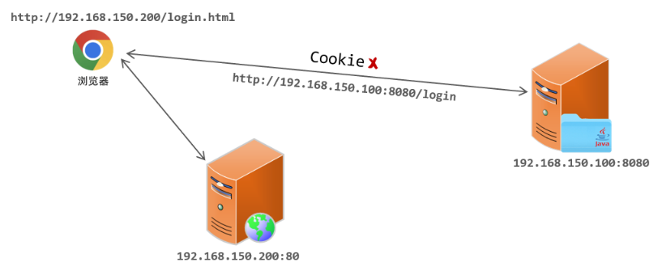
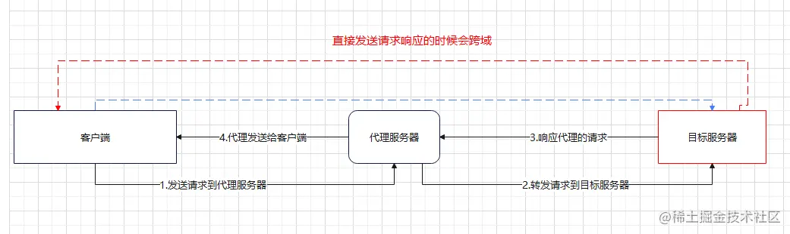

# 跨域

## 同源策略

同源策略（Same Orgin Policy）

跨域产生于浏览器的同源策略，是一种浏览器的安全规范，是浏览器对 JavaScript  施加的安全限制。

跨域限制：

- 无法读取非同源网页的 cookie、local storage 等。
- 无法读取非同源网页的 DOM 和 js 对象。
- 无法向非同源地址发送 Ajax 请求。

**注意，同源策略导致的跨域是浏览器单方面拒绝了返回的响应数据，服务器端是处理完毕并做出了响应的。**



现在的项目，大部分都是前后端分离的，前后端最终也会分开部署，假设：

- 前端部署在服务器 192.168.150.200 上，端口 80 。
- 后端部署在 192.168.150.100上，端口 8080 。

考虑：

```
1. 假设打开浏览器直接访问前端工程，访问 url：http://192.168.150.200/login.html

2. 然后在该页面发起请求到服务端，服务端所的 IP 地址为 192.168.150.100，假设访问接口地址为：http://192.168.150.100:8080/login

3. 那此时就存在跨域操作了，因为我们是在 http://192.168.150.200/login.html 这个页面上访问了 http://192.168.150.100:8080/login 接口
```

区分跨域的维度：

- 协议（protocol）
- 域名（“主机“，host）
- 端口（port）

只要上述的三个维度有任何一个维度不同，那就是跨域操作。

例子：

```
http://192.168.150.200/login.html ----------> https://192.168.150.200/login   		[协议不同，跨域]

http://192.168.150.200/login.html ----------> http://192.168.150.100/login     		[IP不同，跨域]

http://192.168.150.200/login.html ----------> http://192.168.150.200:8080/login   [http 默认 80，端口不同，跨域]

http://192.168.150.200/login.html ----------> http://192.168.150.200/login    		 [不跨域]   
```

## 解决方式

一般有以下几种解决方式：

- 服务器端设置响应头，用以允许浏览器的用户访问该资源。（设置 CROS header）

- 使用代理服务器接收该资源。（正向代理）
	- 代理配置的方式有很多种，有些使用虚拟服务器。
	- 使用代理是最通用的方式。
	

[更多解决方式可见](https://apifox.com/apiskills/axios-cross-origin/#1-cors)

### 使用代理

使用代理前：

1. 客户端的请求直接发送到服务器
2. 服务器处理完毕响应给客户端
3. 客户端检测是否同源
4. 发现不同源则报跨域错误

使用代理后：



其中：

3. 代理服务器不是浏览器，没有跨域限制，只要代理服务器允许接受跨域请求的响应，那么就能收下数据。
4. 只要代理服务器和客户端同源，那么代理服务器就可以将收下的数据返回给客户端。

## 打包处理

如果前端打包后存放在后端静态资源目录，那么将与后端同源，此时可以关闭跨域配置。
