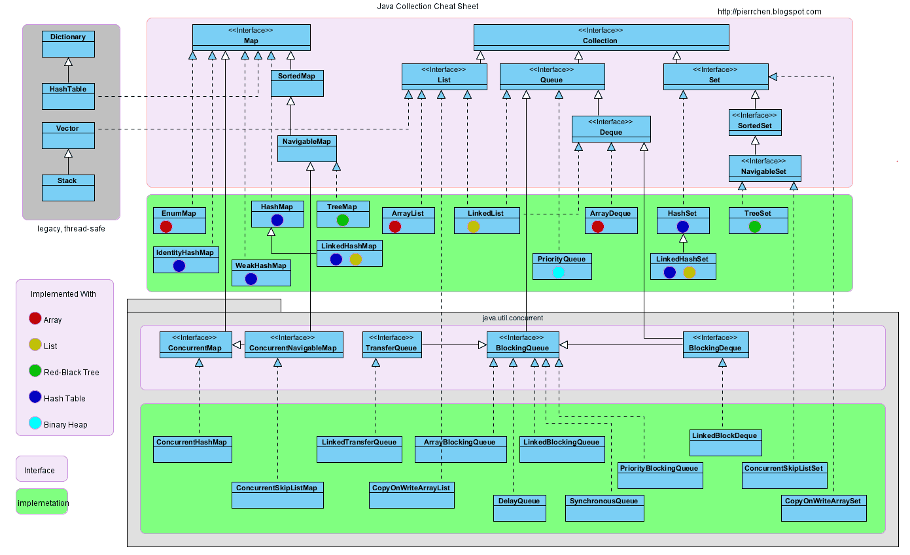

# Java SE 常用库

详细语法可见：[Java 教程 | 菜鸟教程](https://www.runoob.com/java/java-tutorial.html)。

java 的大部分语言特性都在 java.lang 和 java.util 包内。

## 基本类

- Number 数字包装类
- Character 字符包装类


包装类的比较运算需要使用函数。

- Math 基本数学计算类
- String 字符串类

创建格式化字符串：

```java
// 输出到 stdout
System.out.printf("浮点型变量的值为 " +
                  "%f, 整型变量的值为 " +
                  " %d, 字符串变量的值为 " +
                  "is %s", floatVar, intVar, stringVar);

// 输出到字符串变量
String fs;
fs = String.format("浮点型变量的值为 " +
                   "%f, 整型变量的值为 " +
                   " %d, 字符串变量的值为 " +
                   " %s", floatVar, intVar, stringVar);
```

- StringBuffer 和 StringBuilder 类

	操作可修改字符串。

	- StringBuilder 的方法不是线程安全的（不能同步访问）。（重要区别）
	- StringBuilder 一般快于 StringBuffer 。


- 原生数组

```java
int[] arr = {1, 2, 3};
Integer[] arr = new Integer[];
Integer[] arr = new Integer[n];
```

- Arrays 类

- Date 类

	封装当前的日期与时间，基于从 1970 年 1 月 1 日 00:00:00 GMT 起的毫秒数。

	- SimpleDateFormat 类

		格式化日期。`parse()` 方法可以解析字符串到时间。

- Calendar 类

	一个抽象类，定义了比 Date 更多的功能，包括提取，计算等。

	- `getInstance()` 方法返回 GregorianCalendar 类的实例。

```java
Calendar c = Calendar.getInstance();   // 默认是当前日期
```

- Java 8 中的日期时间：

	- LocalDate 类
	- LocalTime 类
	- LocalDateTime 类
	- ZonedDateTime 类
	
- Scanner 类

  读取用户输入数据。

```java
next() 方法
nextLine() 方法
nextxxx() 方法，其中，xxx 表示某个数据类型
```

- java.util.regex 包，包含 Pattern 和 Matcher 类，用于处理正则表达式
- 高精度
	- BigInteger
	- BigDecimal

## 基本文件 IO

- File 类

	可以进行文件和目录操作。

- FileInputStream 类

- FileOutputStream 类

```java
// 直接创建输入流
InputStream f = new FileInputStream("C:/java/hello");

// 通过文件对象创建输入流
File f = new File("C:/java/hello");
InputStream in = new FileInputStream(f);

// 输出流同理。
```

## 异常处理

- 检查性异常

  最具代表的检查性异常是用户错误或问题引起的异常，这是程序员无法预见的。例如要打开一个不存在文件时，一个异常就发生了，这些异常在编译时不能被简单地忽略。

- 运行时异常

	运行时异常是可能被程序员避免的异常。与检查性异常相反，运行时异常可以在编译时被忽略。

- 错误

  错误不是异常，而是脱离程序员控制的问题。错误在代码中通常被忽略。例如，当栈溢出时，一个错误就发生了，它们在编译也检查不到的。

所有异常类是从 java.lang.Exception 类继承的子类。

Exception 类和 Error 类是 Throwable 类的子类。

异常类有两个主要的子类：IOException 类和 RuntimeException 类。


## 容器框架

也称 Java 集合框架（Java Collections Framework，JCF）（包括 Map 相关的类）

其中的一些接口和抽象类可以用于自定义容器。

Java 的容器框架基于 Java 泛型，也就是说，容器存储的所有的对象的引用都是 Object ，取出引用时需要进行类型转换。



### Collection（接口）

Collection 接口定义一组不唯一，无序的对象。

- Set（接口）

	Set 接口定义一组唯一，无序的对象。

	- TreeSet

		有序集合，基于红黑树，不允许重复元素。

	- HashSet

		无序集合，基于 HashMap 。

	- LinkedHashSet

	- SortedSet

		有序的 Set 。

- List（接口）

	列表，注意不是链表。

	- ArrayList

		动态数组，可变大小。

	- LinkedList

		双向链表。

- Queue（接口）

	- LinkedList

		LinkedList 实现了 Queue 接口，可将其作为 Queue 使用（其它接口类似），使用时：`Queue<String> queue = new LinkedList<>();`

	- PriorityQueue

		优先队列，亦是 Heap（堆） 。

### Map（接口）

- TreeMap

	有序，基于红黑树。

- HashMap

	无序，基于 HashTable 。

- HashTable

	哈希表。

- LinkedHashMap

	基于 LinkedList 实现的有序 HashMap 。

- SortedMap

	有序 Map（key 有序）。

- WeakHashMap

	使用弱密钥的 HashMap 。

- IdentityHashMap

	一种特殊的哈希表实现，使用"引用相等"（而不是"对象相等"）判断键的唯一性，当且仅当两个键引用同一个对象时，它们被认为是相等的。

### 传统遗留

- Enumeration（接口）（已被迭代器取代）

	枚举，定义了一种从数据结构中取回连续元素的方式，主要方法为 `nextElement `，用来取得下一个元素。

- BitSet

	位集合，数组大小会自动增大。

- Vector

	向量，类似于原生数组，数组大小会动态变化。是同步访问的。

- Stack

	栈，基于 Vector 。

- Dictionary（已弃用）

	字典，是一个抽象类，定义了键映射到值的数据结构。

- HashTable

	哈希表，原始 Dictionary 的具体实现，Java 2 对其进行了重构，实现了 Map 接口。支持同步访问。

- Properties 

	属性，表示了一个持久的属性集，属性列表中每个键及其对应值都是一个字符串，常用于存储程序的配置信息。继承自 HashTable 。

### 辅助

- 集合算法

	Collections 接口。

- 迭代器

	Literator 接口，ListIterator 接口。

	- Java 迭代器是一种单向遍历机制，只能从前往后遍历集合中的元素，不能往回遍历。
	- 在使用迭代器遍历集合时，不能直接修改集合中的元素，而是需要使用迭代器的 remove() 方法来删除当前元素。

- 比较器

	Comparator 接口。

## 泛型

java 中泛型标记符：

- E 

	Element (在集合中使用，因为集合中存放的是元素)

- T

	 Type（Java 类）

- K

	Key（键）

- V 

	Value（值）

- N

	Number（数值类型）

- ?

	表示不确定的 java 类型

## 流

流式风格将要处理的元素集合看作一种流， 流在管道中传输，在管道的节点上进行中间操作（intermediate operation） 比如筛选， 排序，聚合等，然后由最终操作（terminal operation）得到最终结果。

- 元素是特定类型的对象，形成一个队列。 Java中的Stream并不会存储元素，而是按需计算。

- 数据源

	流的来源。 可以是集合，数组，I/O channel， 产生器generator 等。

- 聚合操作

	类似SQL语句一样的操作， 比如 filter, map, reduce, find, match, sorted 等。

### 生成流

```
stream()
为集合创建串行流。

parallelStream()
为集合创建并行流。
将对流的处理改为可以在多 CPU 核心上进行的并行处理。
```

### 处理

```
forEach

map

filter

limit

sorted
```

### 规约 聚合

- Collectors 类

	规定最终结果的格式，表现类型，属性。

```
.collect(Collectors.toList());
转换为 List 。
 
.collect(Collectors.joining(", "));
以 "，" 分隔，拼接字符串。
```

Java 16 开始，转换为 List 为例，可以直接写 `.toList()` 而不是 `.collect(Collectors.toList())` 。

### 统计

一些统计结果的收集器可以用来对 int、double、long 等基本类型产生统计结果。

```java
List<Integer> numbers = Arrays.asList(3, 2, 2, 3, 7, 3, 5);
 
IntSummaryStatistics stats = numbers.stream().mapToInt((x) -> x).summaryStatistics();
 
System.out.println("列表中最大的数 : " + stats.getMax());
System.out.println("列表中最小的数 : " + stats.getMin());
System.out.println("所有数之和 : " + stats.getSum());
System.out.println("平均数 : " + stats.getAverage());
```

