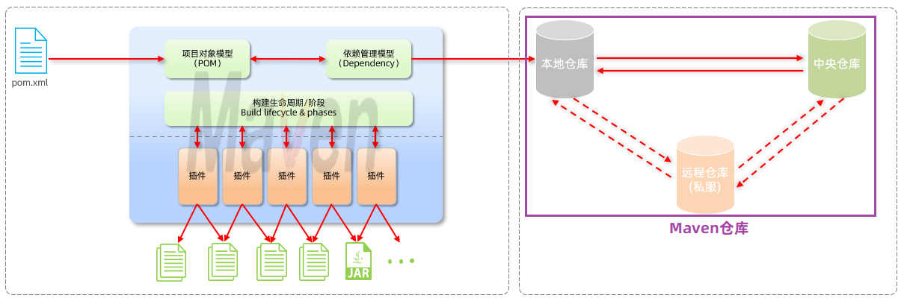
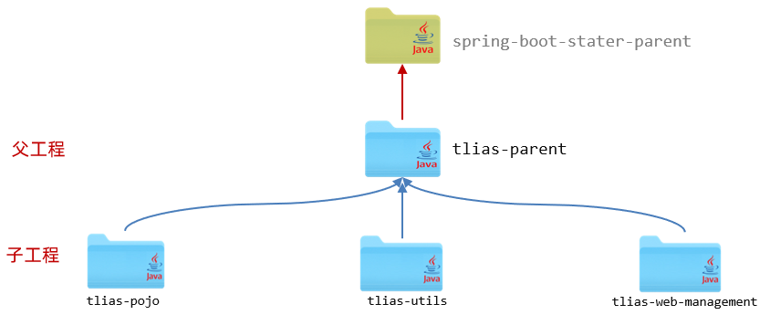
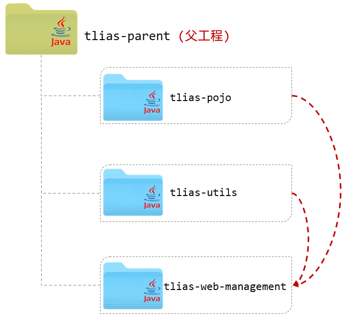

# Maven

一个 Java 项目管理工具，提供：

1. 依赖管理

	管理依赖 jar 包，避免冲突。

2. 统一项目结构

	提供标准、统一的项目结构。


3. 项目构建

	提供了标准的、跨平台（Linux、Windows、MacOS）的自动化项目构建方式。


## maven 模型

基于通过配置项来管理项目的构建、报告和文档。

主要概念：

* 构建生命周期/阶段（Build lifecycle & phases）
	- maven 对项目构建流程的每个阶段都提供一个控制插件。（编译插件，打包插件等）
* 项目对象模型（Project Object Model，POM）
	* maven 将项目抽象为一个对象模型，项目本身和每个依赖（本质也是项目）都由一个“坐标”描述。
	* 坐标是 jar 包的统一标识，可以通过坐标定位到 jar 包的位置。

* 依赖管理模型（Dependency）
	- 使用 `pom.xml` 配置文件。
	- 使用坐标来描述当前项目依赖哪些第三方 jar 包。



## maven 仓库

maven 仓库用于存储资源，管理各种 jar 包。

分类：

- 本地仓库：自己计算机上的一个目录(用来存储jar包)
- 中央仓库：由Maven团队维护的全球唯一的。仓库地址：https://repo1.maven.org/maven2/
- 远程仓库：一般由公司团队搭建的私有仓库

当项目中使用坐标引入对应依赖 jar 包后，查找顺序：

1. 本地仓库
2. 中央仓库
3. 远程仓库(私服)

## 依赖管理

maven 可直接在 IDEA 中使用。

### pom.xml

```xml
<?xml version="1.0" encoding="UTF-8"?>
<project xmlns="http://maven.apache.org/POM/4.0.0"
         xmlns:xsi="http://www.w3.org/2001/XMLSchema-instance"
         xsi:schemaLocation="http://maven.apache.org/POM/4.0.0 http://maven.apache.org/xsd/maven-4.0.0.xsd">
    <!-- POM模型版本 -->
    <modelVersion>4.0.0</modelVersion>

    <!-- 当前项目坐标 -->
    <groupId>com.itheima</groupId>
    <artifactId>maven_project1</artifactId>
    <version>1.0-SNAPSHOT</version>
    
    <!-- 打包方式 -->
    <packaging>jar</packaging>
 
</project>
```

### 坐标

* Maven中的坐标是资源的唯一标识 , 通过该坐标可以唯一定位资源位置（资源可以以插件、依赖、当前项目）。
* 使用坐标来定义项目或引入项目中需要的依赖、

Maven坐标主要组成：

* groupId：定义当前Maven项目隶属组织名称（通常是域名反写，例如：com.itheima）
* artifactId：定义当前Maven项目名称（通常是模块名称，例如 order-service、goods-service）
* version：定义当前项目版本号

### 排除依赖

```xml
<!-- 排除该依赖 -->
<exclusions>
    <exclusion>
        <groupId>junit</groupId>
        <artifactId>junit</artifactId>
    </exclusion>
</exclusions>
```

### 依赖范围

一般的依赖有全部的作用范围：

1. 主程序范围有效（main文件夹范围内）

2. 测试程序范围有效（test文件夹范围内）

3. 是否参与打包运行（package指令范围内）

可以用 `scope` 标签指定依赖的作用范围：

```xml
<dependency>
    <groupId>junit</groupId>
    <artifactId>junit</artifactId>
    <version>4.12</version>
    <scope>test</scope>   <!-- 只在 test 文件夹范围内有效 -->
</dependency>
```

| **scope**值     | **主程序** | **测试程序** | **打包（运行）** | **范例**    |
| --------------- | ---------- | ------------ | ---------------- | ----------- |
| compile（默认） | Y          | Y            | Y                | log4j       |
| test            | -          | Y            | -                | junit       |
| provided        | Y          | Y            | -                | servlet-api |
| runtime         | -          | Y            | Y                | jdbc驱动    |

### 生命周期

Maven 的生命周期对所有的构建过程进行抽象和统一，描述了一次项目构建会经历哪些阶段。

在 Maven 出现之前，项目构建的生命周期就已经存在，软件开发人员每天都在对项目进行清理，编译，测试及部署。虽然大家都在不停地做构建工作，但公司和公司间、项目和项目间，往往使用不同的方式做类似的工作。

Maven从大量项目和构建工具中学习和反思，然后总结了一套高度完美的，易扩展的项目构建生命周期。这个生命周期包含了项目的清理，初始化，编译，测试，打包，集成测试，验证，部署和站点生成等几乎所有构建步骤。

Maven 对项目构建的生命周期划分为 3 套（相互独立）：

- clean：清理工作。

- default：核心工作。如：编译、测试、打包、安装、部署等。

- site：生成报告、发布站点等。


三套生命周期中又包含一些阶段：


常用阶段：

• clean：移除上一次构建生成的文件

• compile：编译项目源代码

• test：使用合适的单元测试框架运行测试(junit)

• package：将编译后的文件打包，如：jar、war等

• install：安装项目到本地仓库

注意：

- 每个阶段由一个插件负责。

- 同一套生命周期中，执行一个阶段时，前面的阶段都会自动执行。（不同套的生命周期中的阶段可以不满足这个关系）

	当运行package生命周期时，clean不会运行，compile会运行。  因为compile与package属于同一套生命周期，而clean与package不属于同一套生命周期。

## 分模块设计与开发

如果项目不分模块，也就意味着所有的业务代码是不是都写在这一个 Java 项目当中。随着这个项目的业务扩张，项目当中的业务功能可能会越来越多，不方便项目的维护和管理、项目中的通用组件难以复用。

分模块设计就是将项目按照功能/结构拆分成若干个子模块，方便项目的管理维护、拓展，也方便模块间的相互调用、资源共享。

注意：分模块设计需要先针对模块功能进行设计，再进行编码，不会先将工程开发完毕，然后进行拆分

考虑学习的案例工程。

如果在当前公司的其他项目组当中，也想使用我们所封装的这些公共的组件：

- 方案一：直接依赖我们当前项目 tlias-web-management ，但是存在两大缺点：

	- 这个项目当中包含所有的业务功能代码，而想共享的资源仅仅是pojo下的实体类以及 utils 下的工具类。如果全部都依赖进来，项目在启动时将会把所有的类都加载进来，会**影响性能**。
	- 如果直接把这个项目都依赖进来了，那也就意味着我们所有的业务代码都对外公开了，这个是非常**不安全**的。

- 方案二：分模块设计

	- 将pojo包下的实体类，抽取到一个maven模块中 tlias-pojo
	- 将utils包下的工具类，抽取到一个maven模块中 tlias-utils
	- 其他的业务代码，放在tlias-web-management这个模块中，在该模块中需要用到实体类pojo、工具类utils，直接引入对应的依赖即可。

	 

### 包名问题

假设有以下需求：

- 将 tlias-web-management 中的所有 pojo 类移入一个独立的 module 中 tlias-pojo 中。

其放入 tlias-pojo 项目的位置应与 tlias-web-management 中位置相同：

- tlias-web-management 中为 `tlias-web-management/src/main/java/com/itheima/pojo`
-  tlias-pojo 中应为 `tlias-pojo/src/main/java/com/itheima/pojo`

保证包名对应相同，都在 `com.itheima.pojo` 中。

不同模块间的包名关系，需要保持对应。

## 继承与聚合

### 继承

#### 继承关系

可以建立一个父工程，将各个模块中都共有的依赖，都提取到父工程中进行配置。


- 子工程可以继承父工程中的配置信息，这样就无需在各个子工程中进行配置了。

- 作用：简化依赖配置、统一管理依赖

- 实现：

	```xml
	<parent>
	    <groupId>...</groupId>
	    <artifactId>...</artifactId>
	    <version>...</version>
	    <relativePath>....</relativePath>
	</parent>
	```

对于一个 springboot 项目，所有的 springboot 项目都有默认的统一的父工程，就是 spring-boot-starter-parent ：

```xml
    <parent>
        <groupId>org.springframework.boot</groupId>
        <artifactId>spring-boot-starter-parent</artifactId>
        <version>2.7.5</version>
        <relativePath/> <!-- lookup parent from repository -->
    </parent>
```

与 java 语言类似，Maven 不支持多继承，一个maven项目只能继承一个父工程，如果继承了spring-boot-starter-parent，就没法继承我们自己定义的父工程 tlias-parent 了。

Java 虽然不支持多继承，但是可以支持多重继承，比如：A 继承 B， B 继承 C 。 

在 Maven 中也是支持多重继承的，所以可以让我们自己创建的三个模块，都继承 tlias-parent，而 tlias-parent 再继承 spring-boot-starter-parent ：



##### 实现

创建 maven 模块 tlias-parent ，该工程为父工程，设置打包方式为 pom（默认jar）。

> Maven打包方式：
>
> - jar：普通模块打包，springboot 项目基本都是 jar 包（内嵌 tomcat 运行）
> - war：普通 web 程序打包，需要部署在外部的 tomcat 服务器中运行
> - pom：父工程或聚合工程，该模块不写代码，仅进行依赖管理

假设工程结构如下：

 

父工程 tlias-parent 的 pom.xml 文件配置如下：

```xml
<parent>
    <!-- 将 tlias-parent 的父工程设置为 spring-boot-starter-parent -->
    <groupId>org.springframework.boot</groupId>
    <artifactId>spring-boot-starter-parent</artifactId>
    <version>2.7.5</version>
    <relativePath/> <!-- lookup parent from repository -->
</parent>

<groupId>com.itheima</groupId>
<artifactId>tlias-parent</artifactId>
<version>1.0-SNAPSHOT</version>
<packaging>pom</packaging>
```

在子工程的 pom.xml 文件中，配置继承关系：（以 tlias-utils 为例）

```xml
<parent>
    <groupId>com.itheima</groupId>
    <artifactId>tlias-parent</artifactId>
    <version>1.0-SNAPSHOT</version>
    <relativePath>../tlias-parent/pom.xml</relativePath>
</parent>

<artifactId>tlias-utils</artifactId>
<version>1.0-SNAPSHOT</version>
```

注意：

- 在子工程中，配置了继承关系之后，坐标中的 groupId 是可以省略的，因为会自动继承父工程的 。
- relativePath 指定父工程的 pom文件的相对位置（如果不指定，将从本地仓库/远程仓库查找该工程）。

 接下来在父工程中配置各个子工程共有的依赖即可。（子工程会自动继承父工程的依赖）

> **工程结构说明：**
>
> - 我们当前的项目结构为：
>
> 	 
>
> 	因为我们是项目开发完毕之后，给大家基于现有项目拆分的各个模块，tlias-web-management已经存在了，然后再创建各个模块与父工程，所以父工程与模块之间是平级的。
>
> 
>
> - 而实际项目中，可能还会见到下面的工程结构：
>
> 	 
>
> 	而在真实的企业开发中，都是先设计好模块之后，再开始创建模块，开发项目。 那此时呢，一般都会先创建父工程 tlias-parent，然后将创建的各个子模块，都放在父工程parent下面。 这样层级结构会更加清晰一些。 
>
> 	​	
>
> 	**PS：上面两种工程结构，都是可以正常使用的，没有一点问题。 只不过，第二种结构，看起来，父子工程结构更加清晰、更加直观。**

#### 版本锁定

在项目开发中，有一部分依赖并不是各个模块都共有的，可能只是其中的一小部分模块中使用到了这个依赖。

比如：

- 在 tlias-web-management、tlias-web-system、tlias-web-report 这三个子工程中，都使用到了 jwt 依赖。 
- 但是 tlias-pojo、tlias-utils 中并不需要这个依赖，那此时，这个依赖，我们不会直接配置在父工程 tlias-paren t中，而是哪个模块需要，就在哪个模块中配置。
- 而由于是一个项目中的多个模块，那多个模块中，我们要使用的同一个依赖的版本要一致，这样便于项目依赖的统一管理。比如：这个jwt依赖，我们都使用的是 0.9.1 这个版本。

在 maven 中，可以在父工程的 pom 文件中统一管理依赖版本。

##### 实现

父工程：

```xml
<!--统一管理依赖版本-->
<dependencyManagement>
    <dependencies>
        <!--JWT令牌-->
        <dependency>
            <groupId>io.jsonwebtoken</groupId>
            <artifactId>jjwt</artifactId>
            <version>0.9.1</version>
        </dependency>
    </dependencies>
</dependencyManagement>
```

子工程：

```xml
<dependencies>
    <!--JWT令牌-->
    <dependency>
        <groupId>io.jsonwebtoken</groupId>
        <artifactId>jjwt</artifactId>
    </dependency>
</dependencies>
```

> 注意：
>
> - 在父工程中所配置的 `<dependencyManagement>` 只能统一管理依赖版本，并不会将这个依赖直接引入进来。 这点和 `<dependencies>` 是不同的。
>
> - 子工程要使用这个依赖，还是需要引入的，只是此时就无需指定 `<version>` 版本号了，父工程统一管理。变更依赖版本，只需在父工程中统一变更。

##### 属性配置

还可以通过自定义属性及属性引用的形式，在父工程中将依赖的版本号进行集中管理维护（放在文件中相近的位置）。

1. 自定义属性

```xml
<properties>
	<lombok.version>1.18.24</lombok.version>
</properties>
```

2. 引用属性

```xml
<dependency>
    <groupId>org.projectlombok</groupId>
    <artifactId>lombok</artifactId>
    <version>${lombok.version}</version>
</dependency>
```

示例父工程 maven 配置文件：

```xml
<properties>
	<!-- 集中管理 -->    
    <maven.compiler.source>11</maven.compiler.source>
    <maven.compiler.target>11</maven.compiler.target>

    <lombok.version>1.18.24</lombok.version>
    <jjwt.version>0.9.1</jjwt.version>
    <aliyun.oss.version>3.15.1</aliyun.oss.version>
    <jaxb.version>2.3.1</jaxb.version>
    <activation.version>1.1.1</activation.version>
    <jaxb.runtime.version>2.3.3</jaxb.runtime.version>
</properties>


<dependencies>
    <dependency>
        <groupId>org.projectlombok</groupId>
        <artifactId>lombok</artifactId>
        <version>${lombok.version}</version>
    </dependency>
</dependencies>

<!--统一管理依赖版本-->
<dependencyManagement>
    <dependencies>
        <!--JWT令牌-->
        <dependency>
            <groupId>io.jsonwebtoken</groupId>
            <artifactId>jjwt</artifactId>
            <version>${jjwt.version}</version>
        </dependency>

        <!--阿里云OSS-->
        <dependency>
            <groupId>com.aliyun.oss</groupId>
            <artifactId>aliyun-sdk-oss</artifactId>
            <version>${aliyun.oss.version}</version>
        </dependency>
        <dependency>
            <groupId>javax.xml.bind</groupId>
            <artifactId>jaxb-api</artifactId>
            <version>${jaxb.version}</version>
        </dependency>
        <dependency>
            <groupId>javax.activation</groupId>
            <artifactId>activation</artifactId>
            <version>${activation.version}</version>
        </dependency>
        <!-- no more than 2.3.3-->
        <dependency>
            <groupId>org.glassfish.jaxb</groupId>
            <artifactId>jaxb-runtime</artifactId>
            <version>${jaxb.runtime.version}</version>
        </dependency>
    </dependencies>
</dependencyManagement>
```

### 聚合

分模块设计与开发之，项目被拆分为多个模块，而模块之间的关系可能错综复杂。 

比如我们当前的案例项目，结构如下（相对还是比较简单的）：



此时：

- tlias-pojo、tlias-utils 模块的父工程是 tlias-parent 。
- tlias-web-management 模块的父工程是 tlias-parent 。
- tlias-web-management 又依赖了 tlias-pojo、tlias-utils 模块。 

那此时，我们要想将 tlias-web-management 模块打包，是比较繁琐的。

项目打包时，maven 会先从本地仓库中查找父工程，依赖的子模块。

在进行项目打包时，在打包 tlias-web-management 模块前，需要先将 tlias-parent、tlias-pojo、tlias-utils 分别执行 install 生命周期安装到 maven 的本地仓库，然后再针对 tlias-web-management 模块执行 package 进行打包操作。

maven 的聚合可以轻松实现模块之间的依赖关系错综复杂的项目的一键构建（清理、编译、测试、打包、安装等）。

##### 聚合工程

 

- 聚合

	将多个模块组织成一个整体，同时进行项目的构建。

- 聚合工程

	一个不具有业务功能的“空”工程（有且仅有一个 pom 文件） 。

	- 一般来说，继承关系中的父工程与聚合关系中的聚合工程是同一个。

- 作用

	快速构建项目（无需根据依赖关系手动构建，直接在聚合工程上构建即可）

##### 实现

在聚合工程中通过 `<moudules>` 设置当前聚合工程所包含的子模块的名称。

比如可以在 tlias-parent 中，添加如下配置，来指定当前聚合工程，需要聚合的模块：

```java
<!--聚合其他模块-->
<modules>
    <module>../tlias-pojo</module>
    <module>../tlias-utils</module>
    <module>../tlias-web-management</module>
</modules>
```

那此时，我们要进行编译、打包、安装操作，就无需在每一个模块上操作了，只需要在聚合工程上，统一进行操作就可以了。

### 继承与聚合对比

- 作用
	- 聚合用于快速构建项目

	- 继承用于简化依赖配置、统一管理依赖

- 相同点：
	- 聚合与继承的 pom.xml 文件打包方式均为 pom，通常将两种关系制作到同一个 pom 文件中

	- 聚合与继承均属于设计型模块，并无实际的模块内容

- 不同点：
	- 聚合是在聚合工程中配置关系，聚合可以感知到参与聚合的模块有哪些

	- 继承是在子模块中配置关系，父模块无法感知哪些子模块继承了自己

## 私服

### 场景

在进行多模块开发的时候，所拆分的模块是可以在同一个公司各个项目组之间进行资源共享的。

这个模块的资源共享，就需要通过 Maven 的私服来实现。

共享模块时，无法通过中央仓库进行组织内共享，因为中央仓库全球只有一个，不是什么人都可以往中央仓库中来上传jar包的，我们是没有权限操作的：


有了私服后，把 jar 包上传到私服上，各团队的开发人员连接同一台私服就可以方便地共享 jar 包了：


如果在项目中需要其他第三方提供的依赖，如果本地仓库没有，会自动连接私服下载，如果私服没有，私服此时会自动连接中央仓库，去中央仓库中下载依赖，然后将下载的依赖存储在私服仓库及本地仓库中。

- 依赖查找顺序
	1. 本地仓库
	2. 私服仓库
	3. 中央仓库
	
- 注意

	私服在企业项目开发中，一个项目/公司，只需要一台即可（一般无需我们自己搭建，会使用即可）。

### 资源上传与下载

#### 步骤

资源上传与下载，我们需要做三步配置，执行一条指令：

三步配置：

- 在 maven 的配置文件中配置访问私服的用户名、密码。
- 在 maven 的配置文件中配置连接私服的地址(url地址)。
- 在项目的 pom.xml 文件中配置上传资源的位置(url地址)。

一条指令：

- 执行 maven 生命周期：deploy 。

> 私服仓库说明：
>
> - RELEASE：存储自己开发的 RELEASE 发布版本的资源。
> - SNAPSHOT：存储自己开发的 SNAPSHOT 发布版本的资源。
> - Central：存储的是从中央仓库下载下来的依赖。

> 项目版本说明：
>
> - RELEASE(发布版本)：功能趋于稳定、当前更新停止，可以用于发行的版本，存储在私服中的 RELEASE 仓库中。
> - SNAPSHOT(快照版本)：功能不稳定、尚处于开发中的版本，即快照版本，存储在私服的 SNAPSHOT 仓库中。

#### 实现

假设私服为 http://192.168.150.101:8081 。

1. 设置私服的访问用户名/密码（在自己 maven 安装目录下的 conf/settings.xml 中的 servers 中配置）

```xml
<server>
    <id>maven-releases</id>
    <username>admin</username>
    <password>admin</password>
</server>
    
<server>
    <id>maven-snapshots</id>
    <username>admin</username>
    <password>admin</password>
</server>
```

2. 设置私服依赖下载的仓库组地址（在自己 maven 安装目录下的 conf/settings.xml 中的 mirrors、profiles 中配置）

```xml
<mirror>
    <id>maven-public</id>
    <mirrorOf>*</mirrorOf>
    <url>http://192.168.150.101:8081/repository/maven-public/</url>
</mirror>
```

```xml
<profile>
    <id>allow-snapshots</id>
        <activation>
        	<activeByDefault>true</activeByDefault>
        </activation>
    <repositories>
        <repository>
            <id>maven-public</id>
            <url>http://192.168.150.101:8081/repository/maven-public/</url>
            <releases>
            	<enabled>true</enabled>
            </releases>
            <snapshots>
            	<enabled>true</enabled>
            </snapshots>
        </repository>
    </repositories>
</profile>
```

3. IDEA的  maven 工程的 pom 文件中配置上传（发布）地址(直接在父工程中配置发布地址)

```xml
<distributionManagement>
    <!-- release版本的发布地址 -->
    <repository>
        <id>maven-releases</id>
        <url>http://192.168.150.101:8081/repository/maven-releases/</url>
    </repository>

    <!-- snapshot版本的发布地址 -->
    <snapshotRepository>
        <id>maven-snapshots</id>
        <url>http://192.168.150.101:8081/repository/maven-snapshots/</url>
    </snapshotRepository>
</distributionManagement>
```

配置完成之后，我们就可以在 tlias-parent 中执行 deploy 生命周期，将项目发布到私服仓库中。 
