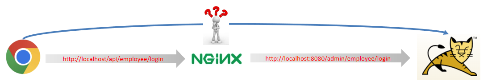

# Nginx

假设有：

前端请求地址：http://localhost/api/employee/login

后端接口地址：http://localhost:8080/admin/employee/login

前端发送的请求，会通过代理服务器转发到后端服务：



## 反向代理

- 正向代理

	代理用户访问网络。

- 反向代理

	代理服务器接受请求。

反向代理的好处：

- 提高访问速度

	- nginx 本身可以进行缓存，如果访问的同一接口，并且做了数据缓存，nginx 就直接可把数据返回，不需要真正地访问服务端，从而提高访问速度。
	- 可以将静态资源放在 nginx 上，直接返回静态资源，减轻后端服务器压力。

- 进行负载均衡

	把大量的请求按照指定的方式均衡地分配给集群中服务器。

- 保证后端服务安全

	一般后台服务地址不会暴露，所以使用浏览器不能直接访问，可以把 nginx 作为请求访问的入口，请求到达 nginx后转发到具体的服务中，从而保证后端服务的安全。

### 配置方式

修改 nginx 的配置文件。

- proxy_pass 指令

	指令设置代理服务器的地址，可以是主机名称，IP地址加端口号等形式。

```nginx
server{
    listen 80;
    server_name localhost;
    
    location /api/{
        proxy_pass http://localhost:8080/admin/; #反向代理
    }
}
```

如上代码的含义是：

监听 80 端口号， 然后当我们访问 http://localhost:80/api/../..这样的接口的时候，它会通过 location /api/ {} 这样的反向代理到 http://localhost:8080/admin/ 上来。

## 负载均衡

### 配置方式

- upstream 指令

	指定代理的后端服务器组。

	- upstream 后面的名称可自定义，但要上下保持一致。

```nginx
upstream webservers{
    server 192.168.100.128:8080;
    server 192.168.100.129:8080;
}
server{
    listen 80;
    server_name localhost;
    
    location /api/{
        proxy_pass http://webservers/admin;#负载均衡
    }
}
```

如上代码的含义是：

监听 80 端口号， 然后当我们访问 http://localhost:80/api/../..这样的接口的时候，它会通过 location /api/ {} 这样的反向代理到 http://webservers/admin，根据webservers名称找到一组服务器，根据设置的负载均衡策略(默认是轮询)转发到具体的服务器。

### 负载均衡策略

| **名称**   | **说明**                                               |
| ---------- | ------------------------------------------------------ |
| 轮询       | 默认方式                                               |
| weight     | 权重方式，默认为1，权重越高，被分配的客户端请求就越多  |
| ip_hash    | 依据ip分配方式，这样每个访客可以固定访问一个后端服务   |
| least_conn | 依据最少连接方式，把请求优先分配给连接数少的后端服务   |
| url_hash   | 依据url分配方式，这样相同的url会被分配到同一个后端服务 |
| fair       | 依据响应时间方式，响应时间短的服务将会被优先分配       |

具体配置方式：

**轮询：**

```nginx
upstream webservers{
    server 192.168.100.128:8080;
    server 192.168.100.129:8080;
}
```

**weight:**

```nginx
upstream webservers{
    server 192.168.100.128:8080 weight=90;
    server 192.168.100.129:8080 weight=10;
}
```

**ip_hash:**

```nginx
upstream webservers{
    ip_hash;
    server 192.168.100.128:8080;
    server 192.168.100.129:8080;
}
```

**least_conn:**

```nginx
upstream webservers{
    least_conn;
    server 192.168.100.128:8080;
    server 192.168.100.129:8080;
}
```

**url_hash:**

```nginx
upstream webservers{
    hash &request_uri;
    server 192.168.100.128:8080;
    server 192.168.100.129:8080;
}
```

**fair:**

```nginx
upstream webservers{
    server 192.168.100.128:8080;
    server 192.168.100.129:8080;
    fair;
}
```

