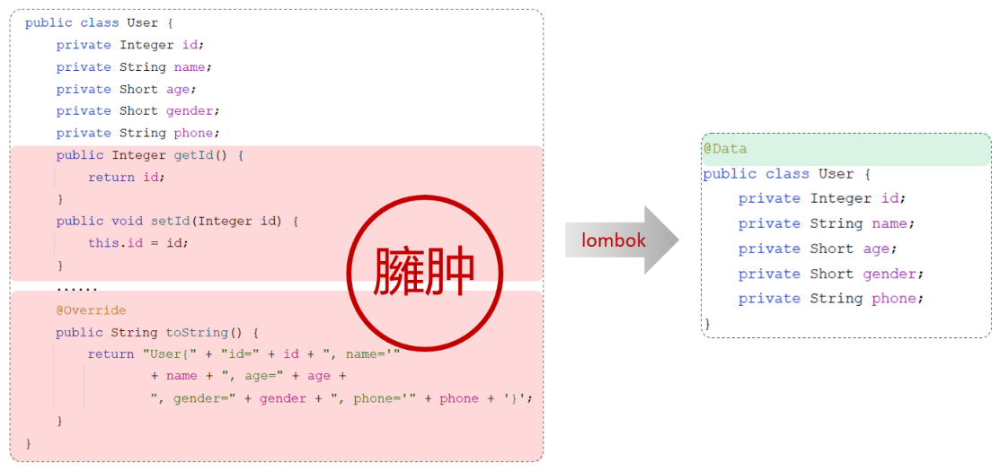

# Lombok

Lombok 是一个实用的 Java 类库，可以通过简单的注解来简化和消除一些必须有但显得很臃肿的 Java 代码：



lombok 通过注解的形式在编译时自动生成构造器、getter/setter、equals、hashcode、toString 等方法，并可以自动化生成日志变量，简化 java 开发、提高效率。

| **注解**            | **作用**                                                     |
| ------------------- | ------------------------------------------------------------ |
| @Getter/@Setter     | 为所有的属性提供get/set方法                                  |
| @ToString           | 会给类自动生成易阅读的  toString 方法                        |
| @EqualsAndHashCode  | 根据类所拥有的非静态字段自动重写 equals 方法和  hashCode 方法 |
| @Data               | 提供了更综合的生成代码功能（@Getter  + @Setter + @ToString + @EqualsAndHashCode） |
| @NoArgsConstructor  | 为实体类生成无参的构造器方法                                 |
| @AllArgsConstructor | 为实体类生成除了static修饰的字段之外带有各参数的构造器方法。 |


### 基本使用

第 1 步：在 pom.xml 文件中引入依赖

```xml
<dependency>
    <groupId>org.projectlombok</groupId>
    <artifactId>lombok</artifactId>
</dependency>
```

第 2 步：在实体类上添加注解

@Data 注解中不包含全参构造方法，通常在实体类上，还会添加上：全参构造、无参构造

```java
import lombok.Data;
import lombok.NoArgsConstructor;
import lombok.AllArgsConstructor;


@Data // getter方法、setter方法、toString方法、hashCode方法、equals方法
@NoArgsConstructor // 无参构造
@AllArgsConstructor// 全参构造
public class User {
    private Integer id;
    private String name;
    private Short age;
    private Short gender;
    private String phone;
}
```


### @Builder

使用 @Builder 可以简化对象的建立代码：

```java
// 未使用 @Builder：
User user = new User();
user.setId(id);
user.setName(name);


// 使用 @Builder
User user = User.builder()
    .id(id)
    .name(name)
    .build();
```

