# Mybatis

MyBatis 是一款优秀的持久层框架，用于简化 JDBC 的开发。

持久层，也就是就是数据访问层（dao）。

- SQL 语句会从数据库中返回查询结果

	查询结果是表格数据。

- Mybatis 会把查询结果使用实体类封装起来

	一行表格记录对应一个实体类对象。

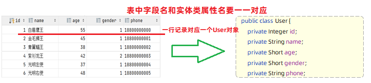

## 编写流程简述

### 项目依赖

建立 springboot 项目，导入依赖：

- Mybatis Framework

	mybatis 的起步依赖。

- MySQL Driver

	mysql 的驱动包。

### 实体类

假设有用户表：

```sql
-- 用户表
create table user(
    id int unsigned primary key auto_increment comment 'ID',
    name varchar(100) comment '姓名',
    age tinyint unsigned comment '年龄',
    gender tinyint unsigned comment '性别, 1:男, 2:女',
    phone varchar(11) comment '手机号'
) comment '用户表';
```

对应实体类如下：

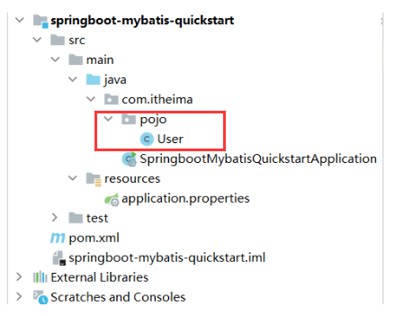

- 实体类的属性名与表中的字段名一一对应。

```java
package com.itheima.pojo;

public class User {
    
    private Integer id;
    private String name;
    private Short age;
    private Short gender;
    private String phone;

    public User() {
    }

    public User(Integer id, String name, Short age, Short gender, String phone) {
        this.id = id;
        this.name = name;
        this.age = age;
        this.gender = gender;
        this.phone = phone;
    }

    public Integer getId() {
        return id;
    }

    public void setId(Integer id) {
        this.id = id;
    }

    public String getName() {
        return name;
    }

    public void setName(String name) {
        this.name = name;
    }

    public Short getAge() {
        return age;
    }

    public void setAge(Short age) {
        this.age = age;
    }

    public Short getGender() {
        return gender;
    }

    public void setGender(Short gender) {
        this.gender = gender;
    }

    public String getPhone() {
        return phone;
    }

    public void setPhone(String phone) {
        this.phone = phone;
    }

    @Override
    public String toString() {
        return "User{" +
                "id=" + id +
                ", name='" + name + '\'' +
                ", age=" + age +
                ", gender=" + gender +
                ", phone='" + phone + '\'' +
                '}';
    }
}
```

### 配置 Mybatis

连接目标数据库，并使用该数据库连接的 url （字符串）：

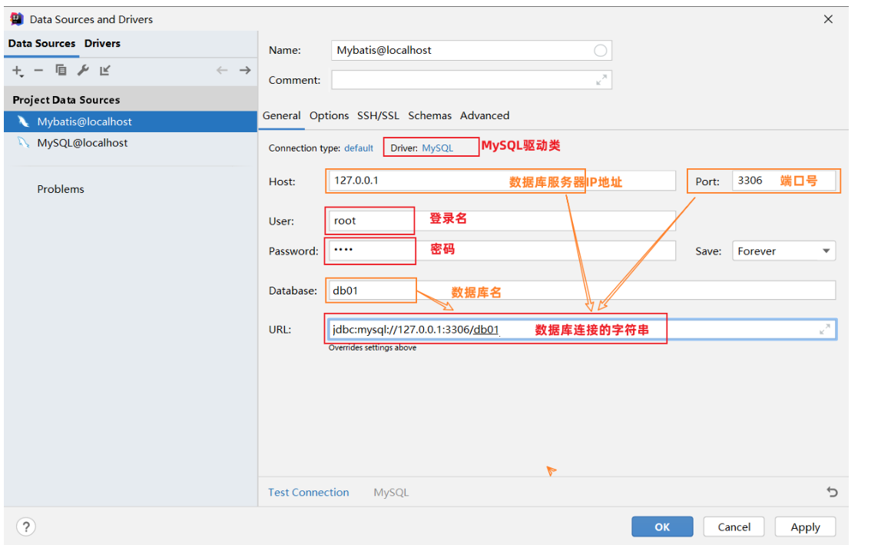

在 springboot 项目中编写 `application.properties` 文件（这个文件需要 IDEA Ultimate），配置数据库连接信息：

```properties
# 驱动类名称
spring.datasource.driver-class-name=com.mysql.cj.jdbc.Driver

# 数据库连接的 url
# 以下表示数据库名为 db01
spring.datasource.url=jdbc:mysql://localhost:3306/db01

# 连接数据库的用户名
spring.datasource.username=root

# 连接数据库的密码
spring.datasource.password=1234


#指定 mybatis 输出日志的位置, 输出控制台（可选）
mybatis.configuration.log-impl=org.apache.ibatis.logging.stdout.StdOutImpl
```

### 编写 SQL 语句

1. 创建一个包 mapper
2. 在 mapper 包下创建一个接口 UserMapper ，这是一个持久层接口（Mybatis的持久层接口规范一般都叫 XxxMapper）。

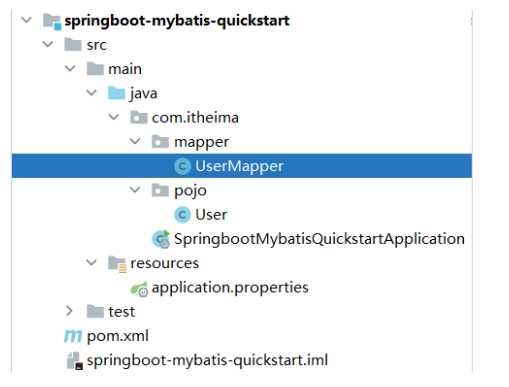

UserMapper：

```java
import com.itheima.pojo.User;
import org.apache.ibatis.annotations.Mapper;
import org.apache.ibatis.annotations.Select;
import java.util.List;

@Mapper
public interface UserMapper {
    
    // 从 user 表查询所有用户数据
    @Select("select id, name, age, gender, phone from user")
    public List<User> list();
    
}
```

其中：

- @Mapper注解

	表示 mybatis 中的 Mapper 接口。

	- 程序运行时，框架会自动生成接口的实现类对象(代理对象)，并给交 Spring 的 IOC 容器管理。

- @Select注解

	表示 select 查询，用于书写查询语句。

### 单元测试

在 SpringBoot 工程的 src 的 test 目录下，建立测试类。

```java
@SpringBootTest
public class MybatisQuickstartApplicationTests {
	
    @Autowired
    private UserMapper userMapper;
	
    @Test
    public void testList(){
        List<User> userList = userMapper.list();
        for (User user : userList) {
            System.out.println(user);
        }
    }
    
}
```

其中：

- @SpringBootTest

	表示测试类，测试类在运行时会自动通过引导类加载 Spring 的环境（IOC容器）。

- @Autowired

	可以直接通过 @Autowired 注解从 IOC 容器中注入想要测试的 bean 对象，然后就可以测试了。 

## JDBC

了解即可。

- Java DataBase Connectivity（JDBC）

	使用 Java 语言操作关系型数据库的一套 API 。

实际上，java 语言只能通过一种方式操作数据库：使用 sun 公司提供的 JDBC 规范。

- sun公司官方定义的一套操作所有关系型数据库的规范，即接口。

- 各个数据库厂商去实现这套接口，提供数据库驱动jar包。

- 我们可以使用这套接口(JDBC)编程，真正执行的代码是驱动jar包中的实现类。

而 Mybatis 就是对原始的 JDBC 程序的封装。 

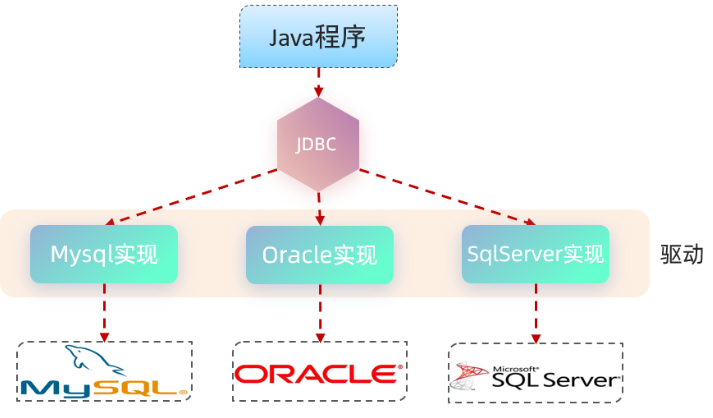

### 原始 JDBC 连接数据库

操作步骤如下：

1. 注册驱动
2. 获取连接对象
3. 执行SQL语句，返回执行结果
4. 处理执行结果
5. 释放资源

```java
import com.itheima.pojo.User;
import org.junit.jupiter.api.Test;
import java.sql.Connection;
import java.sql.DriverManager;
import java.sql.ResultSet;
import java.sql.Statement;
import java.util.ArrayList;
import java.util.List;

public class JdbcTest {
    @Test
    public void testJdbc() throws Exception {
        //1. 注册驱动
        Class.forName("com.mysql.cj.jdbc.Driver");

        //2. 获取数据库连接
        String url="jdbc:mysql://127.0.0.1:3306/db01";
        String username = "root";
        String password = "1234";
        Connection connection = DriverManager.getConnection(url, username, password);

        //3. 执行SQL
        Statement statement = connection.createStatement(); //操作SQL的对象
        String sql="select id,name,age,gender,phone from user";
        ResultSet rs = statement.executeQuery(sql);//SQL查询结果会封装在ResultSet对象中

        List<User> userList = new ArrayList<>();//集合对象（用于存储User对象）
        //4. 处理SQL执行结果
        while (rs.next()){
            //取出一行记录中id、name、age、gender、phone下的数据
            int id = rs.getInt("id");
            String name = rs.getString("name");
            short age = rs.getShort("age");
            short gender = rs.getShort("gender");
            String phone = rs.getString("phone");
            //把一行记录中的数据，封装到User对象中
            User user = new User(id,name,age,gender,phone);
            userList.add(user);//User对象添加到集合
        }
        //5. 释放资源
        statement.close();
        connection.close();
        rs.close();

        //遍历集合
        for (User user : userList) {
            System.out.println(user);
        }
    }
}
```

### 原始 JDBC 的问题

1. 数据库链接的四要素(驱动、链接、用户名、密码)全部硬编码在 java 代码中。
2. 查询结果的解析及封装非常繁琐。
3. 每一次查询数据库都需要获取连接,操作完毕后释放连接, 资源浪费, 性能降低。

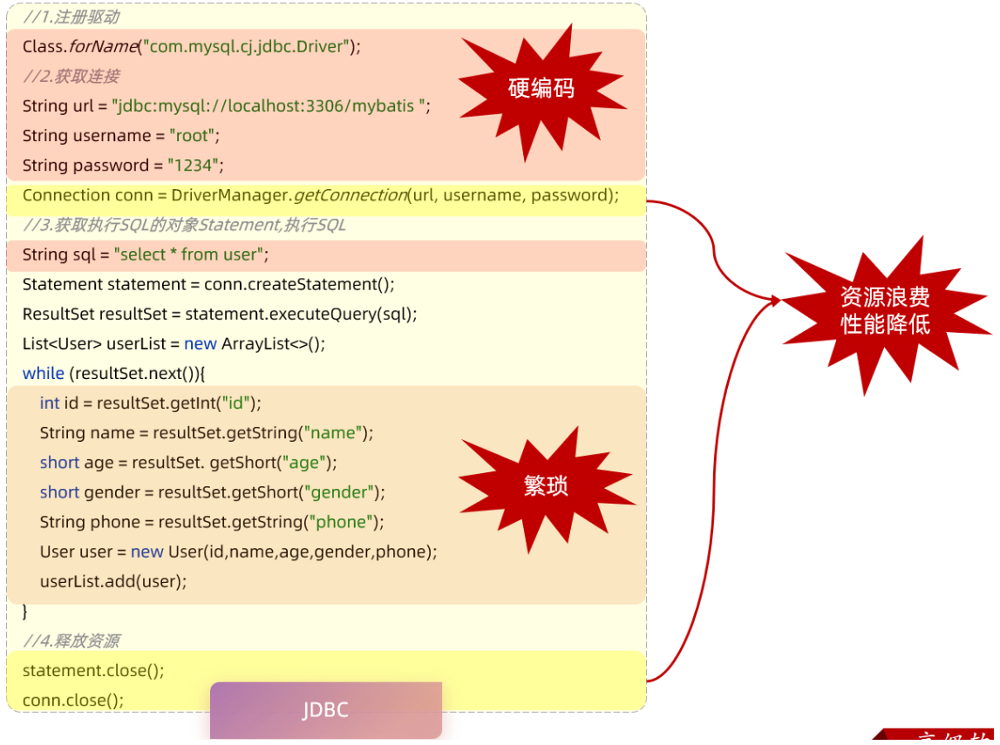

### 技术对比

在mybatis中，是如何解决这些问题的：

1. 数据库连接四要素(驱动、链接、用户名、密码)，都配置在 springboot 默认的配置文件 application.properties 中。

2. 查询结果的解析及封装，由 mybatis 自动完成映射封装，我们无需关注。

3. 在 mybatis 中使用了数据库连接池技术，从而避免了频繁的创建连接、销毁连接而带来的资源浪费。

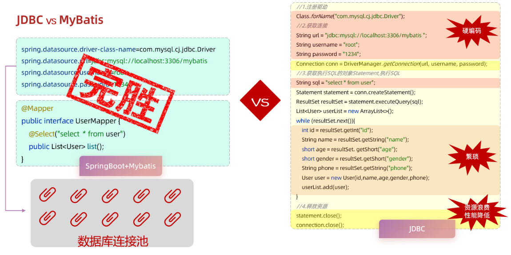

在 Mybatis 中，重点在于 application.properties 的配置和 Mapper 接口的编写。

## 数据库连接池

mybatis 使用了数据库连接池技术，避免频繁的创建连接、销毁连接而带来的资源浪费。

没有使用数据库连接池：

- 客户端执行SQL语句：要先创建一个新的连接对象，然后执行SQL语句，SQL语句执行后又需要关闭连接对象从而释放资源，每次执行SQL时都需要创建连接、销毁链接，这种频繁的重复创建销毁的过程是比较耗费计算机的性能。

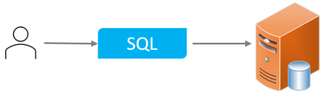

使用数据库连接池：

数据库连接池是个容器，负责分配、管理数据库连接（Connection）。

- 程序在启动时，会在数据库连接池(容器)中，创建一定数量的 Connection 对象

允许应用程序重复使用一个现有的数据库连接，而不是再重新建立一个

- 客户端在执行SQL时，先从连接池中获取一个Connection对象，然后在执行SQL语句，SQL语句执行完之后，释放Connection时就会把Connection对象归还给连接池（Connection对象可以复用）

释放空闲时间超过最大空闲时间的连接，来避免因为没有释放连接而引起的数据库连接遗漏

- 客户端获取到Connection对象了，但是Connection对象并没有去访问数据库(处于空闲)，数据库连接池发现Connection对象的空闲时间 > 连接池中预设的最大空闲时间，此时数据库连接池就会自动释放掉这个连接对象

数据库连接池的好处：

1. 资源重用
2. 提升系统响应速度
3. 避免数据库连接遗漏

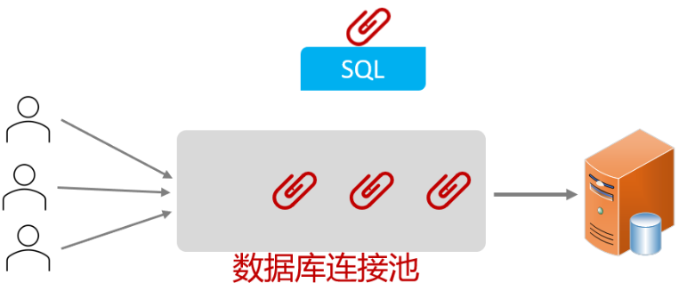

### 产品

官方(sun)提供了数据库连接池标准（javax.sql.DataSource接口）。

第三方组织必须按照 DataSource 接口实现数据库连接池。

常见的数据库连接池：

* C3P0

* DBCP

* Druid（德鲁伊）

	* Druid连接池是阿里巴巴开源的数据库连接池项目 
	* 功能强大，性能优秀，是Java语言最好的数据库连接池之一

* Hikari （追光者）

	springboot 默认的连接池。

现在使用更多的是：Hikari、Druid  （性能更优越）

若要切换为 Druid 数据库连接池：

1. 在pom.xml文件中引入依赖

```xml
<dependency>
    <!-- Druid连接池依赖 -->
    <groupId>com.alibaba</groupId>
    <artifactId>druid-spring-boot-starter</artifactId>
    <version>1.2.8</version>
</dependency>
```

2. 在 application.properties 中引入数据库连接配置

```properties
spring.datasource.driver-class-name=com.mysql.cj.jdbc.Driver
spring.datasource.url=jdbc:mysql://localhost:3306/db01
spring.datasource.username=root
spring.datasource.password=1234

# 或

spring.datasource.druid.driver-class-name=com.mysql.cj.jdbc.Driver
spring.datasource.druid.url=jdbc:mysql://localhost:3306/mybatis
spring.datasource.druid.username=root
spring.datasource.druid.password=1234
```


## 基本概念

### 参数占位符

在 Mybatis 中提供了两种参数占位符：

- `#{...}`

  参数传递时使用。

  - 执行 SQL 时，会将 `#{…}` 替换为 `?` ，生成预编译 SQL，会自动设置参数值
  - 该占位符获取值的来源：
  	- 接口的方法的形参。
  	- 对于 pojo 实体类，使用`#{属性名}`，Mybatis 会自动调用 `get...()` 方法获取值。
  	- 对于 Map 类型形参，使用 `#{key}` 。

- `${...}`

  对表名、列名进行动态设置时使用。

  - 不是获取该变量的值到 SQL，而是获取该变量的值对应的字段的值到 SQL 。


如果拼接 SQL ，直接将参数值拼接在 SQL 语句中，存在 SQL 注入问题，在项目开发中，建议使用 `#{...}`，生成预编译 SQL，防止 SQL 注入。

### 预编译 SQL

预编译 SQL 有两个优势：

- 性能更高

	预编译 SQL 在编译一次后会将编译后的 SQL 语句缓存起来，后面再次执行这条语句时，不会再次编译。（只是输入的参数不同）

- 更安全

	防止 SQL 注入（将敏感字进行转义），保障 SQL 的安全性。

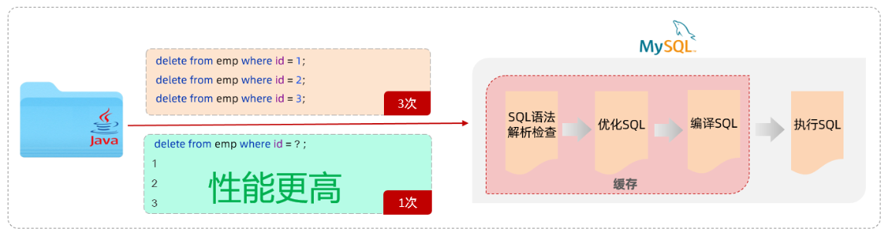

### SQL 注入

由于没有对用户输入进行充分检查，而 SQL 又是拼接而成，在用户输入参数时，在参数中添加一些 SQL 关键字，达到改变 SQL 运行结果的目的，也可以完成恶意攻击。

例子：

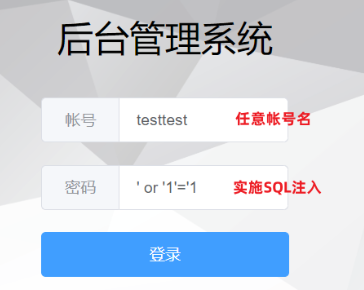

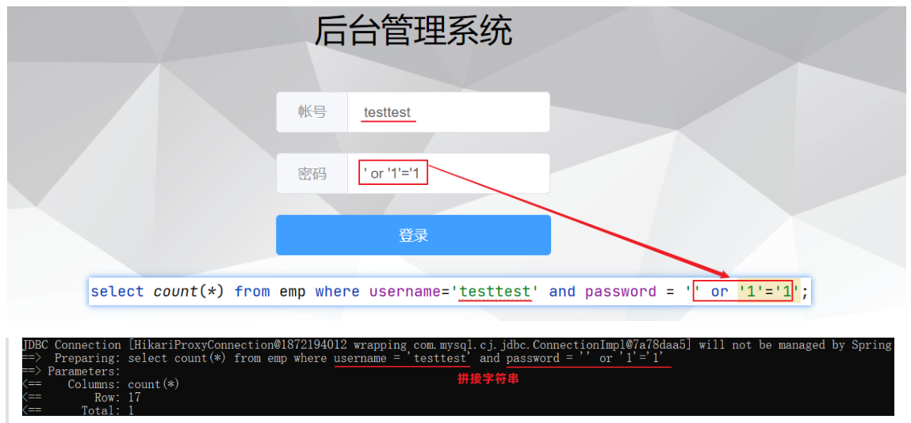

其中，用户在页面提交数据的时候人为的添加一些特殊字符，使得 sql 语句的结构发生了变化，最终可以在没有用户名或者密码的情况下进行登录。

## 基本操作 CRUD

（Create, read, update and delete，CRUD，增删查改）

SQL 注解：

- @Insert
- @Select
- @Update
- @Delete

### 删除

```java
@Mapper
public interface EmpMapper {
    
    //@Delete("delete from emp where id = 17")
    //public void delete();
    //以上delete操作的SQL语句中的id值写成固定的17，就表示只能删除id=17的用户数据
    //SQL语句中的id值不能写成固定数值，需要变为动态的数值
    //解决方案：在delete方法中添加一个参数(用户id)，将方法中的参数，传给SQL语句
    
    /**
     * 根据id删除数据
     * @param id    用户id
     */
    @Delete("delete from emp where id = #{id}")// 使用#{key}方式获取方法中的参数值
    public void delete(Integer id);
    
}
```

测试类：

```java
@SpringBootTest
class SpringbootMybatisCrudApplicationTests {
    
    @Autowired //从Spring的IOC容器中，获取类型是EmpMapper的对象并注入
    private EmpMapper empMapper;

    @Test
    public void testDel(){
        //调用删除方法，传入参数
        empMapper.delete(16);
    }

}
```

### 新增

#### 基本新增

SQL语句：

```sql
insert into emp(username, name, gender, image, job, entrydate, dept_id, create_time, update_time) values ('songyuanqiao','宋远桥',1,'1.jpg',2,'2012-10-09',2,'2022-10-01 10:00:00','2022-10-01 10:00:00');
```

接口方法：

```java
@Mapper
public interface EmpMapper {

    @Insert("insert into emp(username, name, gender, image, job, entrydate, dept_id, create_time, update_time) values (#{username}, #{name}, #{gender}, #{image}, #{job}, #{entrydate}, #{deptId}, #{createTime}, #{updateTime})")
    public void insert(Emp emp);

}
```

> 说明：#{...} 里面写的名称是对象的属性名

测试类：（也可编写测试方法）

```java
import com.itheima.mapper.EmpMapper;
import com.itheima.pojo.Emp;
import org.junit.jupiter.api.Test;
import org.springframework.beans.factory.annotation.Autowired;
import org.springframework.boot.test.context.SpringBootTest;
import java.time.LocalDate;
import java.time.LocalDateTime;

@SpringBootTest
class SpringbootMybatisCrudApplicationTests {
    @Autowired
    private EmpMapper empMapper;

    @Test
    public void testInsert(){
        //创建员工对象
        Emp emp = new Emp();
        emp.setUsername("tom");
        emp.setName("汤姆");
        emp.setImage("1.jpg");
        emp.setGender((short)1);
        emp.setJob((short)1);
        emp.setEntrydate(LocalDate.of(2000,1,1));
        emp.setCreateTime(LocalDateTime.now());
        emp.setUpdateTime(LocalDateTime.now());
        emp.setDeptId(1);
        //调用添加方法
        empMapper.insert(emp);
    }
}

```

#### 主键返回

在数据添加成功后，返回所插入行的自动生成的自增的主键值。（从而进一步维护其涉及到的表关系）

默认情况下，执行插入操作不会返回主键值（或其它自动生成的属性）。

可以在 Mapper 接口中的方法上添加 @Options 注解，并在注解中指定属性 `useGeneratedKeys=true` 和 `keyProperty="实体类属性名"` 。

注意，@Options 注解只能和注解 SQL 语句搭配使用，使用 mybatis 配置文件时，需要在配置文件中指定主键返回。

主键返回代码实现：

~~~java
@Mapper
public interface EmpMapper {
    
    // 将生成的主键值，赋值给 emp 对象的 id 属性
    @Options(useGeneratedKeys = true, keyProperty = "id")
    @Insert("insert into emp(username, name, gender, image, job, entrydate, dept_id, create_time, update_time) values (#{username}, #{name}, #{gender}, #{image}, #{job}, #{entrydate}, #{deptId}, #{createTime}, #{updateTime})")
    public void insert(Emp emp);

}
~~~

测试：

~~~java
@SpringBootTest
class SpringbootMybatisCrudApplicationTests {
    @Autowired
    private EmpMapper empMapper;

    @Test
    public void testInsert(){
        //创建员工对象
        Emp emp = new Emp();
        emp.setUsername("jack");
        emp.setName("杰克");
        emp.setImage("1.jpg");
        emp.setGender((short)1);
        emp.setJob((short)1);
        emp.setEntrydate(LocalDate.of(2000,1,1));
        emp.setCreateTime(LocalDateTime.now());
        emp.setUpdateTime(LocalDateTime.now());
        emp.setDeptId(1);
        //调用添加方法
        empMapper.insert(emp);

        System.out.println("id = " + emp.getId());
    }
}
~~~

### 更新

SQL语句：

```sql
update emp set username = 'linghushaoxia', name = '令狐少侠', gender = 1 , image = '1.jpg' , job = 2, entrydate = '2012-01-01', dept_id = 2, update_time = '2022-10-01 12:12:12' where id = 18;
```

接口方法：

```java
@Mapper
public interface EmpMapper {
    /**
     * 根据id修改员工信息
     * @param emp
     */
    @Update("update emp set username=#{username}, name=#{name}, gender=#{gender}, image=#{image}, job=#{job}, entrydate=#{entrydate}, dept_id=#{deptId}, update_time=#{updateTime} where id=#{id}")
    public void update(Emp emp);
    
}
```

测试类：

```java
@SpringBootTest
class SpringbootMybatisCrudApplicationTests {
    @Autowired
    private EmpMapper empMapper;

    @Test
    public void testUpdate(){
        //要修改的员工信息
        Emp emp = new Emp();
        emp.setId(23);
        emp.setUsername("songdaxia");
        emp.setPassword(null);
        emp.setName("老宋");
        emp.setImage("2.jpg");
        emp.setGender((short)1);
        emp.setJob((short)2);
        emp.setEntrydate(LocalDate.of(2012,1,1));
        emp.setCreateTime(null);
        emp.setUpdateTime(LocalDateTime.now());
        emp.setDeptId(2);
        //调用方法，修改员工数据
        empMapper.update(emp);
    }
}
```

### 查询

#### 根据 id 查询

SQL语句：

~~~mysql
select id, username, password, name, gender, image, job, entrydate, dept_id, create_time, update_time from emp;
~~~

接口方法：

~~~java
@Mapper
public interface EmpMapper {
    @Select("select id, username, password, name, gender, image, job, entrydate, dept_id, create_time, update_time from emp where id=#{id}")
    public Emp getById(Integer id);
}
~~~

测试类：

~~~java
@SpringBootTest
class SpringbootMybatisCrudApplicationTests {
    @Autowired
    private EmpMapper empMapper;

    @Test
    public void testGetById(){
        Emp emp = empMapper.getById(1);
        System.out.println(emp);
    }
}
~~~

结果：

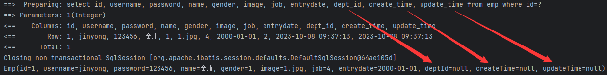

在结果中，大部分字段是有值的，但是 deptId，createTime，updateTime 这几个字段是没有值的，而数据库中是有对应的字段值的。

- 数据库的字段一般用下划线命名法。
- Java 程序的变量一般用驼峰命名法。

#### 数据封装

这是因为：实体类属性名和数据库表查询返回的字段名不一致，Mybatis 不能自动封装：

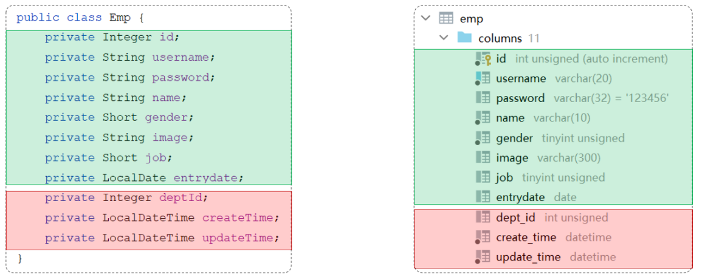

解决方法：

1. 起别名

	在 SQL 语句中，对列名起别名，使别名和实体类属性名一样

```java
@Select("select id, username, password, name, gender, image, job, entrydate, " +
        "dept_id AS deptId, create_time AS createTime, update_time AS updateTime " +
        "from emp where id=#{id}")
public Emp getById(Integer id);
```

2. 指定结果映射

	通过 @Results 及 @Result 进行手动结果映射。

```java
@Results({@Result(column = "dept_id", property = "deptId"),
          @Result(column = "create_time", property = "createTime"),
          @Result(column = "update_time", property = "updateTime")})
@Select("select id, username, password, name, gender, image, job, entrydate, dept_id, create_time, update_time from emp where id=#{id}")
public Emp getById(Integer id);
```

3. 开启下换线到驼峰的映射（推荐）

	开启后，mybatis 会自动通过驼峰命名规则进行映射。

```properties
# 表中字段名：abc_xyz
# 类中属性名：abcXyz
# 下划线命名转换到驼峰命名：   abc_xyz    =>   abcXyz

# 在 application.properties 中添加：
mybatis.configuration.map-underscore-to-camel-case=true
```

#### 条件查询

如果要查询：

- 姓名：要求支持模糊匹配
- 性别：要求精确匹配
- 入职时间：要求进行范围查询
- 根据最后修改时间进行降序排序

SQL 语句：

```sql
select id, username, password, name, gender, image, job, entrydate, dept_id, create_time, update_time 
from emp 
where name like '%张%' 
      and gender = 1 
      and entrydate between '2010-01-01' and '2020-01-01 ' 
order by update_time desc;
```

接口方法：

- 方式一

```java
@Mapper
public interface EmpMapper {
    @Select("select * from emp " +
            "where name like '%${name}%' " +
            "and gender = #{gender} " +
            "and entrydate between #{begin} and #{end} " +
            "order by update_time desc")
    public List<Emp> list(String name, Short gender, LocalDate begin, LocalDate end);
}
```

其中：

- 方法中的形参名和 SQL 语句中的参数占位符名保持一致
- 模糊查询使用 `${...}` 进行字符串拼接，并不是预编译的形式，所以效率不高、且存在 sql 注入风险。

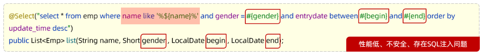

- 方式二（解决 SQL 注入风险）

	使用MySQL提供的字符串拼接函数：`concat('%' , '关键字' , '%')`

```java
@Mapper
public interface EmpMapper {

    @Select("select * from emp " +
            "where name like concat('%',#{name},'%') " +
            "and gender = #{gender} " +
            "and entrydate between #{begin} and #{end} " +
            "order by update_time desc")
    public List<Emp> list(String name, Short gender, LocalDate begin, LocalDate end);

}
```

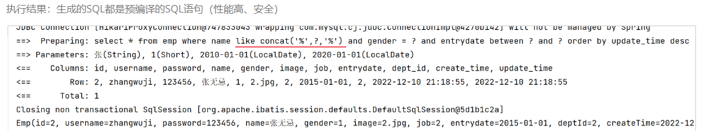

## Mybatis 的 XML 配置文件

### 配置规范

Mybatis 的开发有两种方式：

- 注解

	完成一些简单的增删改查功能。

- XML

	实现复杂的 SQL 功能，使用 XML 配置映射语句。

Mybatis 的 XML 映射文件规范：

1. XML 映射文件的名称与 Mapper 接口名称一致，并且将 XML映射文件和 Mapper 接口放置在相同包下（同包同名）。

2. XML 映射文件的 namespace 属性为 Mapper 接口的全限定名。

3. XML 映射文件中 sql 语句的 id 与 Mapper 接口中的方法名一致，并保持返回类型一致。

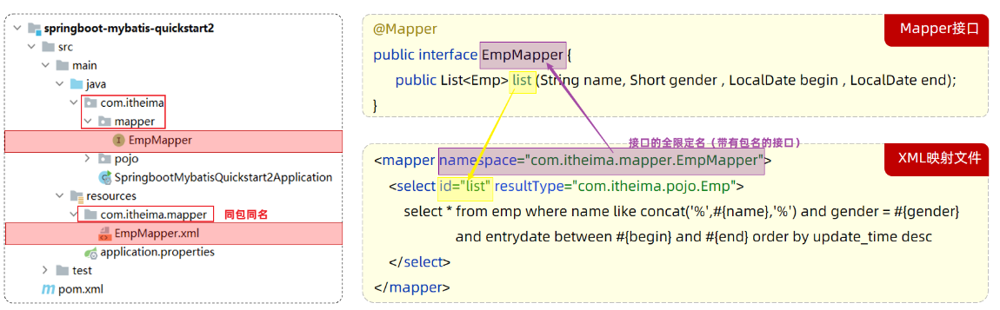

其中：

- `<select>`标签

	用于编写 select 查询语句的。

- resultType 属性

	指定查询返回的单条记录所封装的类型。

### 配置实现

初始 xml 配置文件 ：

```xml
<?xml version="1.0" encoding="UTF-8" ?>
<!DOCTYPE mapper
  PUBLIC "-//mybatis.org//DTD Mapper 3.0//EN"
  "https://mybatis.org/dtd/mybatis-3-mapper.dtd">
<mapper namespace="">
 
</mapper>
```

其中的 dtd 约束可以直接从 mybatis 官网复制。

mapper 的接口方法：（不再使用 @Select）

```java
@Mapper
public interface EmpMapper {
    
    /* @Select("select * from emp " +
            "where name like '%${name}%' " +
            "and gender = #{gender} " +
            "and entrydate between #{begin} and #{end} " +
            "order by update_time desc") */
    
    public List<Emp> list(String name, Short gender, LocalDate begin, LocalDate end);
}
```

对照 mapper 接口方法，编写查询语句：

```xml
<?xml version="1.0" encoding="UTF-8" ?>
<!DOCTYPE mapper
        PUBLIC "-//mybatis.org//DTD Mapper 3.0//EN"
        "https://mybatis.org/dtd/mybatis-3-mapper.dtd">
<mapper namespace="com.itheima.mapper.EmpMapper">

    <!--查询操作-->
    <select id="list" resultType="com.itheima.pojo.Emp">
        select * from emp
        where name like concat('%',#{name},'%')
              and gender = #{gender}
              and entrydate between #{begin} and #{end}
        order by update_time desc
    </select>
    
</mapper>
```

测试方法：

```java
    @Test
    public void list() {
        List<Emp> emps = empMapper.list("张", (short)1, LocalDate.of(2010, 1, 1), LocalDate.of(2020, 1, 1) );
        for (Emp emp: emps) {
            System.out.println(emp);
        }
    }
```

### MybatisX

MybatisX 是一款基于 IDEA 的快速开发 Mybatis 的插件。


可以通过 MybatisX 快速定位跳转：

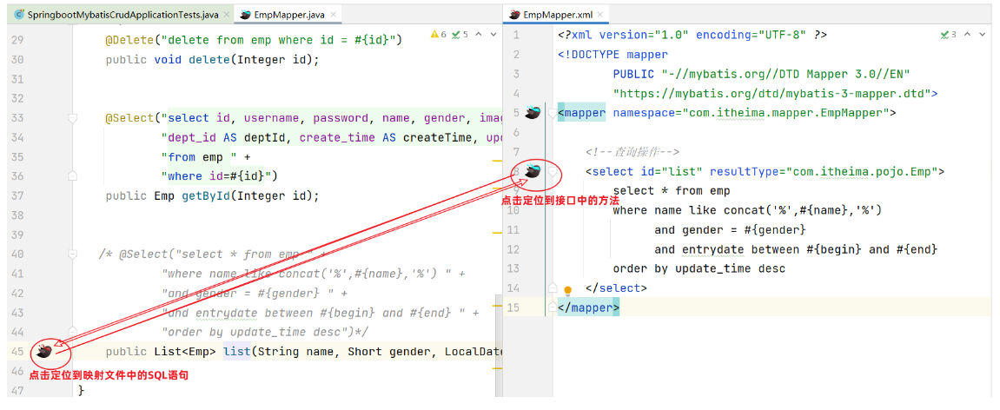

## 动态 SQL

前述的 SQL 语句中，我们将三个条件直接写死了，如果页面只传递了参数姓名name 字段，其他两个字段 性别 和 入职时间没有传递，那么这两个参数的值就是null：

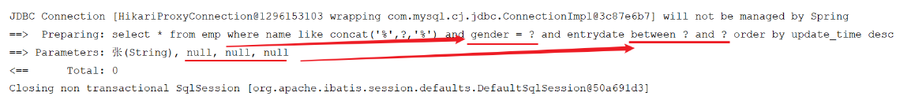

正确的做法应该是：传递了参数，再组装这个查询条件；如果没有传递参数，就不应该组装这个查询条件。

- 动态 SQL

	SQL 语句会随着用户的输入或外部条件的变化而变化。

### if

`<if>`：用于判断条件是否成立。

使用 test 属性指定条件，如果条件为 true，则拼接SQL。

~~~xml
<if test="条件表达式">
   要拼接的sql语句
</if>
~~~

原有的 SQL 语句：

~~~xml
<select id="list" resultType="com.itheima.pojo.Emp">
        select * from emp
        where name like concat('%',#{name},'%')
              and gender = #{gender}
              and entrydate between #{begin} and #{end}
        order by update_time desc
</select>
~~~

动态 SQL 语句：

~~~xml
<select id="list" resultType="com.itheima.pojo.Emp">
        select * from emp
        where
    
             <if test="name != null">
                 name like concat('%',#{name},'%')
             </if>
             <if test="gender != null">
                 and gender = #{gender}
             </if>
             <if test="begin != null and end != null">
                 and entrydate between #{begin} and #{end}
             </if>
    
        order by update_time desc
</select>
~~~

测试方法：

~~~java
@Test
public void testList(){
    // 性别数据为 null、开始时间和结束时间也为 null
    List<Emp> emps = empMapper.list("张", null, null, null);
    for(Emp emp : emps){
        System.out.println(emp);
    }
}
~~~

注意，在 MyBatis 配置文件中，Integer 类型的 0 值和空字符串会被认为是相等的，即` 0 == ''` 为 True 。

上述写法并不完善，考虑以下测试方法参数：

参数设置一：

```java
empMapper.list(null, (short)1, null, null);
```

发生错误：

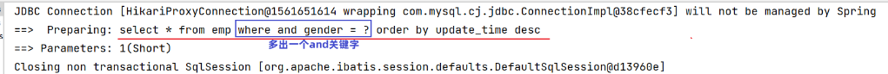

参数设置二：

```java
empMapper.list(null, null, null, null);
```

发生错误：

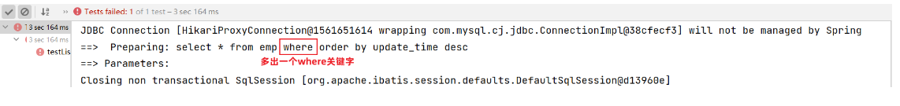

可以使用 `<where>` 标签解决上述问题。

### where

使用 `<where>` 标签代替 SQL 语句中的 where 关键字。

`<where>` 只会在子元素有内容的情况下才插入 where 子句，而且会自动去除子句的开头的 AND 或 OR 。

修改后的 xml 配置：

```xml
<select id="list" resultType="com.itheima.pojo.Emp">
        select * from emp
        <where>
             <!-- if 作为 where 标签的子元素 -->
             <if test="name != null">
                 and name like concat('%',#{name},'%')
             </if>
             <if test="gender != null">
                 and gender = #{gender}
             </if>
             <if test="begin != null and end != null">
                 and entrydate between #{begin} and #{end}
             </if>
        </where>
        order by update_time desc
</select>
```

### set

如果要更新员工信息，动态更新员工信息，如果更新时传递有值，则更新；如果更新时没有传递值，则不更新。

Mapper 接口：

```java
@Mapper
public interface EmpMapper {
	// 不再使用 @Update
    public void update(Emp emp);
}
```

Mapper 映射文件：

```xml
<?xml version="1.0" encoding="UTF-8" ?>
<!DOCTYPE mapper
        PUBLIC "-//mybatis.org//DTD Mapper 3.0//EN"
        "https://mybatis.org/dtd/mybatis-3-mapper.dtd">
<mapper namespace="com.itheima.mapper.EmpMapper">

    <!--更新操作-->
    <update id="update">
        update emp
        set
            <if test="username != null">
                username=#{username},
            </if>
            <if test="name != null">
                name=#{name},
            </if>
            <if test="gender != null">
                gender=#{gender},
            </if>
            <if test="image != null">
                image=#{image},
            </if>
            <if test="job != null">
                job=#{job},
            </if>
            <if test="entrydate != null">
                entrydate=#{entrydate},
            </if>
            <if test="deptId != null">
                dept_id=#{deptId},
            </if>
            <if test="updateTime != null">
                update_time=#{updateTime}
            </if>
        where id=#{id}
    </update>

</mapper>
```

测试方法：

```java
@Test
public void testUpdate2(){
        //要修改的员工信息
        Emp emp = new Emp();
        emp.setId(20);
        emp.setUsername("Tom111");
        emp.setName("汤姆111");

        emp.setUpdateTime(LocalDateTime.now());

        //调用方法，修改员工数据
        empMapper.update(emp);
}
```

上述映射文件不完善，考虑以下测试方法：

```java
@Test
public void testUpdate2(){
        //要修改的员工信息
        Emp emp = new Emp();
        emp.setId(20);
        emp.setUsername("Tom222");
      
        //调用方法，修改员工数据
        empMapper.update(emp);
}
```

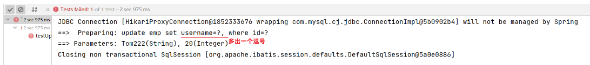

解决方案：使用 `<set>` 标签代替 SQL 语句中的 set 关键字。

`<set>` 动态地在 SQL 语句中插入 set 关键字，并会删掉额外的逗号。（用于update语句中）

修改后的配置：

```xml
<?xml version="1.0" encoding="UTF-8" ?>
<!DOCTYPE mapper
        PUBLIC "-//mybatis.org//DTD Mapper 3.0//EN"
        "https://mybatis.org/dtd/mybatis-3-mapper.dtd">
<mapper namespace="com.itheima.mapper.EmpMapper">

    <!--更新操作-->
    <update id="update">
        update emp
        <!-- 使用set标签，代替update语句中的set关键字 -->
        <set>
            <if test="username != null">
                username=#{username},
            </if>
            <if test="name != null">
                name=#{name},
            </if>
            <if test="gender != null">
                gender=#{gender},
            </if>
            <if test="image != null">
                image=#{image},
            </if>
            <if test="job != null">
                job=#{job},
            </if>
            <if test="entrydate != null">
                entrydate=#{entrydate},
            </if>
            <if test="deptId != null">
                dept_id=#{deptId},
            </if>
            <if test="updateTime != null">
                update_time=#{updateTime}
            </if>
        </set>
        where id=#{id}
    </update>
</mapper>
```

### 总结

- `<if>`

	- 用于判断条件是否成立，如果条件为true，则拼接SQL

	- 形式：

		~~~xml
		<if test="name != null"> … </if>
		~~~

- `<where>`

	- where元素只会在子元素有内容的情况下才插入where子句，而且会自动去除子句的开头的AND或OR

- `<set>`

	- 动态地在行首插入 SET 关键字，并会删掉额外的逗号。（用在update语句中）

输出别名：

```xml
<select id="list" resultType="com.itheima.pojo.Emp">
        select name Name
    	from 
    		emp
</select>
```

其中，为 name 字段设置输出别名为 Name ，该别名会被传递到查询结果中，作为类属性名。

### foreach

如果要删除员工信息，需要支持删除单条记录，又支持批量删除。

SQL语句：

```sql
delete from emp where id in (1,2,3);
```

Mapper 接口：

```java
@Mapper
public interface EmpMapper {
    // 依据传入的 id 集合，进行批量删除
    public void deleteByIds(List<Integer> ids);
}
```

使用 `<foreach>`遍 历 deleteByIds 方法中传递的参数 ids 集合，语法格式如下：

```xml
<foreach collection="集合名称" item="集合内的元素/项" separator="每一次遍历使用的分隔符" 
         open="遍历开始前拼接的片段" close="遍历结束后拼接的片段">
</foreach>
```

XML 映射文件：

```xml
<?xml version="1.0" encoding="UTF-8" ?>
<!DOCTYPE mapper
        PUBLIC "-//mybatis.org//DTD Mapper 3.0//EN"
        "https://mybatis.org/dtd/mybatis-3-mapper.dtd">
<mapper namespace="com.itheima.mapper.EmpMapper">
    
    <!--删除操作-->
    <delete id="deleteByIds">
        delete from emp where id in
        <foreach collection="ids" item="id" separator="," open="(" close=")">
            #{id}
        </foreach>
    </delete>
    
</mapper> 
```

测试方法：

```java
    @Test
    public void testDeleteById() {
        Emp emp = new Emp();
        List<Integer> ids = List.of(21, 22, 23);
        empMapper.deleteByIds(ids);
    }
```

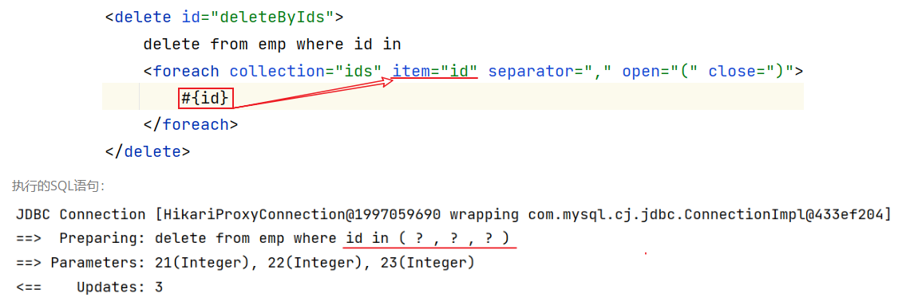

### sql & include

在 xml 映射文件中配置的 SQL可能会存在很多重复的片段。

可以对重复的代码片段进行抽取，将其通过`<sql>`标签封装到一个 SQL 片段，然后再通过`<include>`标签进行引用。

描述重复的代码：

```xml
<sql id="commonSelect">
 	select id, username, password, name, gender, image, job, entrydate, dept_id, create_time, update_time from emp
</sql>
```

在目标位置引用：

```xml
<select id="list" resultType="com.itheima.pojo.Emp">
    <include refid="commonSelect"/>
    <where>
        <if test="name != null">
            name like concat('%',#{name},'%')
        </if>
        <if test="gender != null">
            and gender = #{gender}
        </if>
        <if test="begin != null and end != null">
            and entrydate between #{begin} and #{end}
        </if>
    </where>
    order by update_time desc
</select>
```

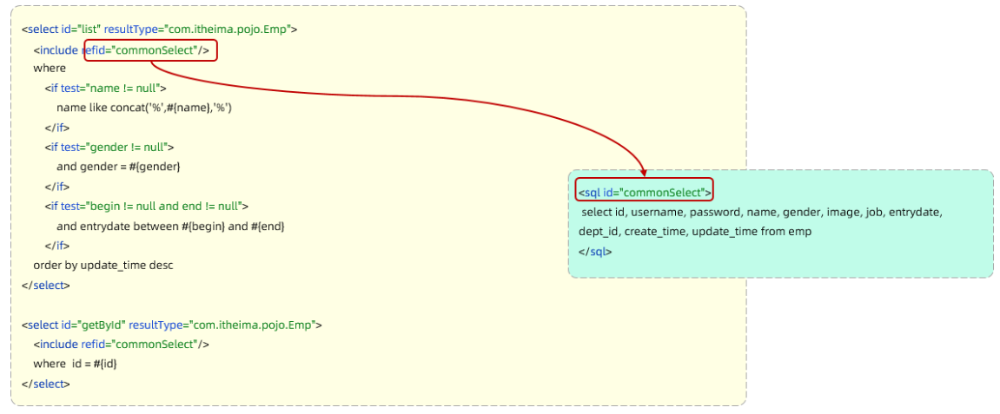

### 配置文件主键返回

使用 `useGeneratedKeys="true" keyProperty="id"` 属性：

```xml
<insert id="insertOneTest" useGeneratedKeys="true" keyProperty="id" >
        insert into test(name,descr,url,create_time,update_time) 
        values(#{name},#{descr},#{url},now(),now())
    </insert>
```

## PageHelper

一个基于 Mybatis 的第三方分页查询插件。

统一抽象了分页查询操作，可以简化分页查询代码开发。

以分页查询员工列表为例。

1、在pom.xml引入依赖

```xml
<dependency>
    <groupId>com.github.pagehelper</groupId>
    <artifactId>pagehelper-spring-boot-starter</artifactId>
    <version>1.4.2</version>
</dependency>
```

2、EmpMapper

```java
@Mapper
public interface EmpMapper {
    //获取当前页的结果列表
    @Select("select * from emp")
    public Page<Emp> page();
}
```

3、EmpServiceImpl

```java
@Override
public PageBean page(Integer page, Integer pageSize) {
    // 设置分页参数
    PageHelper.startPage(page, pageSize); 
    
    // 执行分页查询，获取分页结果
    Page<Emp> p = empMapper.page();
    
    // 封装 PageBean 类（一个 pojo 类，用来装数据）返回
    PageBean pageBean = new PageBean(p.getTotal(), p.getResult()); 
    return pageBean;
}
```

其中，在执行 `empMapper.page()` 方法时，只需要执行：`select  *  from  emp`语句。

分页插件会自动完成一下操作：

1. 先获取到要执行的SQL语句：select  *  from  emp      
2. 把SQL语句中的字段列表，变为：count(*)
3. 执行SQL语句：select  count(*)  from  emp          //获取到总记录数
4. 再对要执行的SQL语句：select  *  from  emp 进行改造，在末尾添加 `limit ? , ?`
5. 执行改造后的SQL语句：`select  *  from  emp  limit  ? , ? `

以上操作完成了两个功能：

- 获取总的数量条目数（`count(*)`）
- 查询指定分页（`limit`）。

若要指定某些字段，而不是全部字段（`* `），修改 @Select 中的语句即可：

```java
@Mapper
public interface EmpMapper {
    //获取当前页的结果列表
    @Select("select name, gender from emp")
    public Page<Emp> page();
}
```

