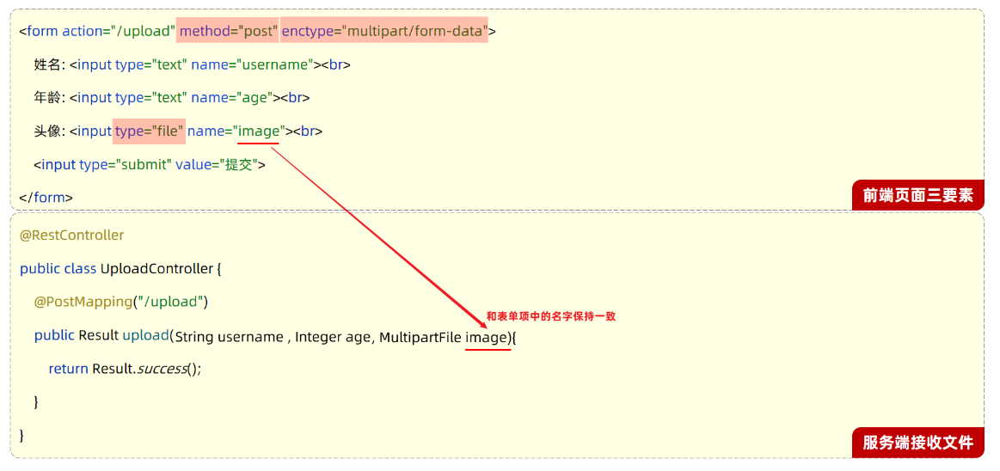
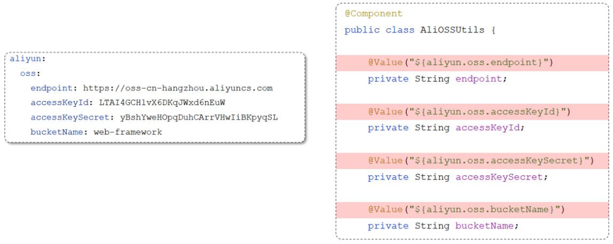
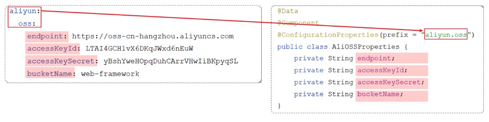
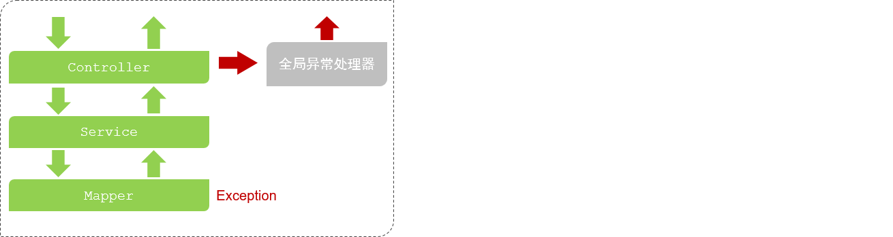

# 常见功能

## 文件上传

图片、视频、音频等文件需要上传到服务器。

文件上传功能涉及到两个部分：

1. 前端程序
2. 服务端程序

### 前端

假设前端有以下表单：

```html
<form action="/upload" method="post" enctype="multipart/form-data">
	姓名: <input type="text" name="username"><br>
    年龄: <input type="text" name="age"><br>
    头像: <input type="file" name="image"><br>
    <input type="submit" value="提交">
</form>
```

其中，表单必须具有上传文件三要素：

- 表单必须有file域，用于选择要上传的文件

	> ~~~html
	> <input type="file" name="image"/>
	> ~~~

- 表单提交方式必须为POST

	> 通常上传的文件会比较大，所以需要使用 POST 提交方式

- 表单的编码类型enctype必须要设置为：multipart/form-data

	> 普通默认的编码格式是不适合传输大型的二进制数据的，所以在文件上传时，表单的编码格式必须设置为multipart/form-data

### 后端

#### 接收文件

- 首先在服务端定义一个 controller，用来进行文件上传，然后在controller当中定义一个方法来处理`/upload` 请求

- 在定义的方法中接收提交过来的数据 （方法中的形参名和请求参数的名字保持一致）

	- 用户名：String  name
	- 年龄： Integer  age
	- 文件： MultipartFile  image

	> Spring中提供了一个API：MultipartFile，使用这个API就可以来接收到上传的文件



UploadController 代码：（接收文件）

```java
@Slf4j
@RestController
public class UploadController {

    @PostMapping("/upload")
    public Result upload(String username, Integer age, MultipartFile image)  {
        log.info("文件上传：{},{},{}",username,age,image);
        return Result.success();
    }

}
```

如果表单项的名字和方法中形参名不一致，可以：

```java
public Result upload(String username,
                     Integer age, 
                     @RequestParam("image") MultipartFile file)
```

该方法只接收到了文件（image 参数），这个文件临时存储在一个临时文件夹内，函数结束后会自动删除。

#### 保存文件

需要将这个临时文件转存到指定的文件夹：

UploadController 代码：（保存文件）

```java
@Slf4j
@RestController
public class UploadController {

    @PostMapping("/upload")
    public Result upload(String username, Integer age, MultipartFile image) throws IOException {
        log.info("文件上传：{},{},{}",username,age,image);

        //获取原始文件名
        String originalFilename = image.getOriginalFilename();

        //将文件存储在服务器的磁盘目录
        image.transferTo(new File("E:/images/"+originalFilename));

        return Result.success();
    }

}
```

其中，使用了 MultipartFile 类提供的方法，把临时文件转存到本地磁盘目录下：

> MultipartFile 常见方法： 
>
> - String  getOriginalFilename();  //获取原始文件名
> - void  transferTo(File dest);     //将接收的文件转存到磁盘文件中
> - long  getSize();     //获取文件的大小，单位：字节
> - byte[]  getBytes();    //获取文件内容的字节数组
> - InputStream  getInputStream();    //获取接收到的文件内容的输入流

以上方法还不完善，因为使用原始文件名作为所上传文件的存储名字，当再次上传一个同名文件时，会将已经存储好的文件覆盖掉。

#### 随机文件名

需要保证每次上传文件时文件名都唯一的，可以使用 UUID 指定随机文件名。

UploadController 代码：

```java
@Slf4j
@RestController
public class UploadController {

    @PostMapping("/upload")
    public Result upload(String username, Integer age, MultipartFile image) throws IOException {
        log.info("文件上传：{},{},{}",username,age,image);

        //获取原始文件名
        String originalFilename = image.getOriginalFilename();

        //构建新的文件名
        String extname = originalFilename.substring(originalFilename.lastIndexOf("."));//文件扩展名
        String newFileName = UUID.randomUUID().toString()+extname;//随机名+文件扩展名

        //将文件存储在服务器的磁盘目录
        image.transferTo(new File("E:/images/"+newFileName));

        return Result.success();
    }

}
```

#### 文件大小限制

在 SpringBoot 中，文件上传时默认单个文件最大大小为 1M 。

那么如果需要上传大文件，可以在application.properties进行如下配置：

```properties
#配置单个文件最大上传大小
spring.servlet.multipart.max-file-size=10MB

#配置单个请求最大上传大小(一次请求可以上传多个文件)
spring.servlet.multipart.max-request-size=100MB
```

#### 扩展存储

如果直接存储在服务器的磁盘目录中，存在以下缺点：

- 不安全：磁盘如果损坏，所有的文件就会丢失
- 容量有限：如果存储大量的图片，磁盘空间有限(磁盘不可能无限制扩容)
- 无法直接访问

为了解决上述问题呢，通常有两种解决方案：

- 自己搭建存储服务器，如：fastDFS 、MinIO
- 使用现成的云服务，如：阿里云，腾讯云，华为云

## 配置文件

### 参数配置化

一些到处可以用到的系统参数可以写在配置文件中。

比如将文件上传到阿里云 OSS 对象存储服务时，需要调用 AliOSSUtils 工具类，其需要一些参数：

- endpoint       //阿里云OSS域名
- accessKeyID    //用户身份ID
- accessKeySecret   //用户密钥
- bucketName      //存储空间的名字

可以将这些参数写在 properties 配置文件中：

```properties
#自定义的阿里云OSS配置信息
aliyun.oss.endpoint=https://oss-cn-hangzhou.aliyuncs.com
aliyun.oss.accessKeyId=LTAI4GCH1vX6DKqJWxd6nEuW
aliyun.oss.accessKeySecret=yBshYweHOpqDuhCArrVHwIiBKpyqSL
aliyun.oss.bucketName=web-tlias
```

AliOSSUtils 工具类为：

```java
@Component
public class AliOSSUtils {
    /*以下4个参数没有指定值（默认值：null）*/
    private String endpoint;
    private String accessKeyId;
    private String accessKeySecret;
    private String bucketName;

    //省略其他代码...
}
```

application.properties 是 springboot 项目默认的配置文件。

springboot 程序在启动时会默认读取 application.properties 配置文件。

使用 @Value 注解可以获取配置文件中的数据。

```java
@Component
public class AliOSSUtils {

    @Value("${aliyun.oss.endpoint}")
    private String endpoint;
    
    @Value("${aliyun.oss.accessKeyId}")
    private String accessKeyId;
    
    @Value("${aliyun.oss.accessKeySecret}")
    private String accessKeySecret;
    
    @Value("${aliyun.oss.bucketName}")
    private String bucketName;
 	
 	//省略其他代码...
 }   
```

### yml 配置文件

springboot 项目支持多种配置方式，除了支持 properties 配置文件以外，还支持 yml 类型的配置文件

yml 格式的配置文件，后缀名有两种：

- yml （推荐）
- yaml

常见配置文件格式对比：


其中，同样的配置数据，yml 格式有以下特点：

- 容易阅读
- 容易与脚本语言交互
- 以数据为核心，重数据轻格式

yml 配置文件的基本语法：

- 大小写敏感
- 数值前边必须有空格，作为分隔符
- 使用缩进表示层级关系，缩进时，不允许使用Tab键，只能用空格（idea中会自动将Tab转换为空格）
- 缩进的空格数目不重要，只要相同层级的元素左侧对齐即可
- `#`表示注释，从这个字符一直到行尾，都会被解析器忽略

yml 文件中常见的数据格式：

1. 定义对象或Map集合
2. 定义数组、list或set集合

```yml
# 对象/Map集合
user:
  name: zhangsan
  age: 18
  password: 123456
  
# 数组/List/Set集合
hobby: 
  - java
  - game
  - sport
```

其中，以 `age: 18`  为例，冒号后必须要有空格。

### @ConfigurationProperties

分析下代码当中可能存在的问题：



直接通过@Value注解来注入配置数据，这种方式本身没有什么问题，但当需要注入的属性较多(例：需要20多个参数数据)，写起来就会比较繁琐。

在 Spring 中给我们提供了一种简化方式，可以直接将配置文件中配置项的值自动的注入到对象的属性中。

Spring 提供的简化方式：

1. 需要创建一个实现类，且实体类中的属性名和配置文件当中key的名字必须要一致

	> 比如：配置文件当中叫endpoints，实体类当中的属性也得叫endpoints，另外实体类当中的属性还需要提供 getter / setter方法

2. 需要将实体类交给Spring的IOC容器管理，成为IOC容器当中的bean对象

3. 在实体类上添加`@ConfigurationProperties`注解，并通过perfect属性来指定配置参数项的前缀



需要引入依赖：

```xml
<dependency>
    <groupId>org.springframework.boot</groupId>
    <artifactId>spring-boot-configuration-processor</artifactId>
</dependency>
```

对比 ：

- @Value 注解只能一个一个的进行外部属性的注入。

- @ConfigurationProperties 可以批量的将外部的属性配置注入到bean对象的属性中。

如果要注入的属性非常的多，并且还想做到复用，就可以定义这么一个bean对象。通过 configuration properties 批量的将外部的属性配置直接注入到 bin 对象的属性当中。在其他的类当中，我要想获取到注入进来的属性，我直接注入 bin 对象，然后调用 get 方法，就可以获取到对应的属性值了。

### 配置参数优先级

在 SpringBoot 项目中，常见的属性配置方式有 5 种：

- 3 种配置文件

	建议一个项目只使用一种格式的配置文件。

	- application.properties
	- application.yml
	- application.yaml（等价于 application.yml）

- 2 种外部属性的配置
  - Java 系统属性
  - 命令行参数

它们的优先级从高到低为：

1. 命令行参数（格式：--key=value）
2. java 系统属性（格式： -Dkey=value）
3. application.properties
4. application.yml
5. application.yaml


## 全局异常处理

当没有做任何的异常处理时，三层架构处理异常的方案：

- Mapper 接口在操作数据库的时候出错了，此时异常会往上抛(谁调用Mapper就抛给谁)，会抛给 service。 
- service 中也存在异常了，会抛给 controller 。
- 而在 controller 当中，我们也没有做任何的异常处理，所以最终异常会再往上抛。最终抛给框架之后，框架就会返回一个 JSON 格式的数据，里面封装的就是错误的信息，但是框架返回的 JSON 格式的数据并不符合我们的开发规范。


那么在三层构架项目中，出现了异常，该如何处理?

- 方案一

	在所有 Controller 的所有方法中进行 try…catch 处理

	- 缺点：代码臃肿（不推荐）

- 方案二

	全局异常处理器

	- 好处：简单、优雅（推荐）



定义全局异常处理器：

```java
@RestControllerAdvice
public class GlobalExceptionHandler {

    //处理异常
    @ExceptionHandler(Exception.class) //指定能够处理的异常类型
    public Result ex(Exception e){
        e.printStackTrace();//打印堆栈中的异常信息

        //捕获到异常之后，响应一个标准的Result
        return Result.error("对不起,操作失败,请联系管理员");
    }
}
```

其中：

- 定义一个类作为全局异常处理类

- 加上 @RestControllerAdvice 注解

	表示定义了一个全局异常处理器，使系统异常可被抛如到此。

- 在全局异常处理器中，定义方法捕获异常。

- 方法需要加上 @ExceptionHandler 注解。

	通过 @ExceptionHandler 注解的 value 属性指定需要捕获的异常类型。

- @RestControllerAdvice = @ControllerAdvice + @ResponseBody

	处理异常的方法的返回值会转换为 json 后再响应给前端

## 微信登录

以在小程序上使用微信登录为例。

微信登录流程：

[官方文档](https://developers.weixin.qq.com/miniprogram/dev/framework/open-ability/login.html)


其中：

- 小程序部分是小程序发起的请求。（小程序基本属于前端，用 JS 写逻辑）
- code 是授权码，是一个前端本地生成的临时登录凭证，表示用户授权使用微信账号登录。
- openId 是微信用户的唯一标识
- 开发者服务端中的自定义登录态，通过生成令牌（token）和 openid 等数据再返回给小程序端的方式，以便于后绪识别用户身份。

## 路径拼接

一个完整的请求路径，应该是类上 @RequestMapping 的 value 属性 + 方法上的 @RequestMapping 的 value 属性：

（具体的，可以是方法上任意的 @GetMapping 等表示mapping 的注解的 value）


## ThreadLocal

ThreadLocal 并不是一个Thread，而是 Thread 的局部变量。

ThreadLocal 为每个线程提供单独一份存储空间，具有线程隔离的效果，只有在线程内才能获取到对应的值，线程外则不能访问。

在一个线程中，横跨若干方法调用，需要传递的对象，我们通常称之为上下文（Context），它是一种状态，可以是用户身份、任务信息等。

可用于在一个线程内的不同函数间传递 Context 。

常用方法：

- public void set(T value) 

	设置当前线程的线程局部变量的值

- public T get()

	返回当前线程所对应的线程局部变量的值

- public void remove() 

	移除当前线程的线程局部变量

考虑，当新增员工时，想要记录是谁新增了员工信息，即记录当前操作者的 id ，方式如下：

- 拦截器可以获取请求的 jwt ，同时从 jwt 中获取当前登录的员工的 id 信息。
- 将用户 id 存储到 ThreadLocal ，然后在 service 中获取后保存的数据库。


1. 写一个封装 ThreadLocal 操作的工具类：

类中存储了需要传递的数据，已经存储获取的方法。

```java
package com.sky.context;

public class BaseContext {

    public static ThreadLocal<Long> threadLocal = new ThreadLocal<>();   // 通常以静态字段初始化

    public static void setCurrentId(Long id) {
        threadLocal.set(id);
    }

    public static Long getCurrentId() {
        return threadLocal.get();
    }

    public static void removeCurrentId() {
        threadLocal.remove();
    }

}
```

2. 在拦截器中解析出当前登录员工id，并放入线程局部变量中。

```java
package com.sky.interceptor;

/**
 * jwt令牌校验的拦截器
 */
@Component
@Slf4j
public class JwtTokenAdminInterceptor implements HandlerInterceptor {

    @Autowired
    private JwtProperties jwtProperties;

    /**
     * 校验jwt
     *
     * @param request
     * @param response
     * @param handler
     * @return
     * @throws Exception
     */
    public boolean preHandle(HttpServletRequest request, HttpServletResponse response, Object handler) throws Exception {
        
		//.............................
       
        //2、校验令牌
        try {
            //.................
            Claims claims = JwtUtil.parseJWT(jwtProperties.getAdminSecretKey(), token);
            Long empId = Long.valueOf(claims.get(JwtClaimsConstant.EMP_ID).toString());
            log.info("当前员工id：", empId);
            /////将用户id存储到ThreadLocal////////
            BaseContext.setCurrentId(empId);
            ////////////////////////////////////
            //3、通过，放行
            return true;
        } catch (Exception ex) {
            //......................
        }
    }
}
```

3. 在 Service 中获取线程局部变量中的值

```java
	/**
     * 新增员工
     *
     * @param employeeDTO
     */
    public void save(EmployeeDTO employeeDTO) {
        //.............................

        //设置当前记录创建人id和修改人id
        employee.setCreateUser(BaseContext.getCurrentId());//目前写个假数据，后期修改
        employee.setUpdateUser(BaseContext.getCurrentId());

        employeeMapper.insert(employee);
    }
```

## 消息转换器

可以定义一个配置类，在 WebMvcConfiguration（自定义）中扩展 SpringMVC 的消息转换器，统一对日期类型进行格式处理。

该全局配置类中，同时也可以对拦截器，文档生成器等全局工具进行配置。

自定义消息转化器，统一对传递的消息中的日期类型进行格式处理：（在对象映射类中统一设置默认日期格式）

```java
package com.sky.json;

/**
 * 对象映射器:基于jackson将Java对象转为json，或者将json转为Java对象
 * 将JSON解析为Java对象的过程称为 [从JSON反序列化Java对象]
 * 从Java对象生成JSON的过程称为 [序列化Java对象到JSON]
 */
public class JacksonObjectMapper extends ObjectMapper {

    public static final String DEFAULT_DATE_FORMAT = "yyyy-MM-dd";
//    public static final String DEFAULT_DATE_TIME_FORMAT = "yyyy-MM-dd HH:mm:ss";
    public static final String DEFAULT_DATE_TIME_FORMAT = "yyyy-MM-dd HH:mm";
    public static final String DEFAULT_TIME_FORMAT = "HH:mm:ss";

    public JacksonObjectMapper() {
        super();
        //收到未知属性时不报异常
        this.configure(FAIL_ON_UNKNOWN_PROPERTIES, false);

        //反序列化时，属性不存在的兼容处理
        this.getDeserializationConfig().withoutFeatures(DeserializationFeature.FAIL_ON_UNKNOWN_PROPERTIES);

        SimpleModule simpleModule = new SimpleModule()
                .addDeserializer(LocalDateTime.class, new LocalDateTimeDeserializer(DateTimeFormatter.ofPattern(DEFAULT_DATE_TIME_FORMAT)))
                .addDeserializer(LocalDate.class, new LocalDateDeserializer(DateTimeFormatter.ofPattern(DEFAULT_DATE_FORMAT)))
                .addDeserializer(LocalTime.class, new LocalTimeDeserializer(DateTimeFormatter.ofPattern(DEFAULT_TIME_FORMAT)))
                .addSerializer(LocalDateTime.class, new LocalDateTimeSerializer(DateTimeFormatter.ofPattern(DEFAULT_DATE_TIME_FORMAT)))
                .addSerializer(LocalDate.class, new LocalDateSerializer(DateTimeFormatter.ofPattern(DEFAULT_DATE_FORMAT)))
                .addSerializer(LocalTime.class, new LocalTimeSerializer(DateTimeFormatter.ofPattern(DEFAULT_TIME_FORMAT)));

        //注册功能模块 例如，可以添加自定义序列化器和反序列化器
        this.registerModule(simpleModule);
    }
}
```

将自己的消息转化器加入容器中：

```java
/**
 * 配置类，注册web层相关组件
 */
@Configuration
@Slf4j
public class WebMvcConfiguration extends WebMvcConfigurationSupport {

    /**
     * 扩展Spring MVC框架的消息转化器
     * @param converters
     */
    protected void extendMessageConverters(List<HttpMessageConverter<?>> converters) {
        log.info("扩展消息转换器...");
        //创建一个消息转换器对象
        MappingJackson2HttpMessageConverter converter = new MappingJackson2HttpMessageConverter();
        //需要为消息转换器设置一个对象转换器，对象转换器可以将Java对象序列化为json数据
        converter.setObjectMapper(new JacksonObjectMapper());
        //将自己的消息转化器加入容器中
        converters.add(0,converter);
    }
}
```

## 公共字段自动填充

对于：

- 员工管理功能
- 菜品分类功能

在**新增员工**或者**新增菜品分类**时需要设置创建时间、创建人、修改时间、修改人等字段。

在**编辑员工**或者**编辑菜品分类**时需要设置修改时间、修改人等字段。

这些字段属于公共字段，系统中很多表中都会有这些字段，如下：

| **序号** | **字段名**  | **含义** | **数据类型** |
| -------- | ----------- | -------- | ------------ |
| 1        | create_time | 创建时间 | datetime     |
| 2        | create_user | 创建人id | bigint       |
| 3        | update_time | 修改时间 | datetime     |
| 4        | update_user | 修改人id | bigint       |

- 在新增数据时, 将createTime、updateTime 设置为当前时间, createUser、updateUser设置为当前登录用户ID。
- 在更新数据时, 将updateTime 设置为当前时间, updateUser设置为当前登录用户ID。

而针对于这些字段，如果在项目中处理这些字段都是在每一个业务方法中进行赋值，那么会有非常多的重复代码。

可以使用 AOP 切面编程，实现功能增强，来完成公共字段自动填充功能。

实现步骤：

1. 自定义注解 AutoFill，用于标识需要进行公共字段自动填充的方法
2. 自定义切面类 AutoFillAspect，统一拦截加入了 AutoFill 注解的方法，通过反射为公共字段赋值
3. 在 Mapper 的方法上加入 AutoFill 注解

自定义注解：

```java
/**
 * 自定义注解，用于标识某个方法需要进行功能字段自动填充处理
 */
@Target(ElementType.METHOD)
@Retention(RetentionPolicy.RUNTIME)
public @interface AutoFill {
    //数据库操作类型：UPDATE INSERT
    OperationType value();
}
```

OperationType：

```java
package com.sky.enumeration;

/**
 * 数据库操作类型
 */
public enum OperationType {

    /**
     * 更新操作
     */
    UPDATE,

    /**
     * 插入操作
     */
    INSERT
}
```

切面：

```java
package com.sky.aspect;

/**
 * 自定义切面，实现公共字段自动填充处理逻辑
 */
@Aspect
@Component
@Slf4j
public class AutoFillAspect {

    /**
     * 切入点
     */
    @Pointcut("execution(* com.sky.mapper.*.*(..)) && @annotation(com.sky.annotation.AutoFill)")
    public void autoFillPointCut(){}

    /**
     * 前置通知，在通知中进行公共字段的赋值
     */
    @Before("autoFillPointCut()")
    public void autoFill(JoinPoint joinPoint){
        log.info("开始进行公共字段自动填充...");

        //获取到当前被拦截的方法上的数据库操作类型
        MethodSignature signature = (MethodSignature) joinPoint.getSignature();//方法签名对象
        AutoFill autoFill = signature.getMethod().getAnnotation(AutoFill.class);//获得方法上的注解对象
        OperationType operationType = autoFill.value();//获得数据库操作类型

        //获取到当前被拦截的方法的参数--实体对象
        Object[] args = joinPoint.getArgs();
        if(args == null || args.length == 0){
            return;
        }

        // 可能是任何对象类型，用 Object 引用
        Object entity = args[0];

        //准备赋值的数据
        LocalDateTime now = LocalDateTime.now();
        Long currentId = BaseContext.getCurrentId();

        //根据当前不同的操作类型，为对应的属性通过反射来赋值
        if(operationType == OperationType.INSERT){
            //为4个公共字段赋值
            try {
                Method setCreateTime = entity.getClass().getDeclaredMethod(AutoFillConstant.SET_CREATE_TIME, LocalDateTime.class);
                Method setCreateUser = entity.getClass().getDeclaredMethod(AutoFillConstant.SET_CREATE_USER, Long.class);
                Method setUpdateTime = entity.getClass().getDeclaredMethod(AutoFillConstant.SET_UPDATE_TIME, LocalDateTime.class);
                Method setUpdateUser = entity.getClass().getDeclaredMethod(AutoFillConstant.SET_UPDATE_USER, Long.class);

                //通过反射为对象属性赋值
                setCreateTime.invoke(entity,now);
                setCreateUser.invoke(entity,currentId);
                setUpdateTime.invoke(entity,now);
                setUpdateUser.invoke(entity,currentId);
            } catch (Exception e) {
                e.printStackTrace();
            }
        }else if(operationType == OperationType.UPDATE){
            //为2个公共字段赋值
            try {
                Method setUpdateTime = entity.getClass().getDeclaredMethod(AutoFillConstant.SET_UPDATE_TIME, LocalDateTime.class);
                Method setUpdateUser = entity.getClass().getDeclaredMethod(AutoFillConstant.SET_UPDATE_USER, Long.class);

                //通过反射为对象属性赋值
                setUpdateTime.invoke(entity,now);
                setUpdateUser.invoke(entity,currentId);
            } catch (Exception e) {
                e.printStackTrace();
            }
        }
    }
}
```

在 mapper 的新增和修改方法添加 @AutoFill() 注解：

```java
package com.sky.mapper;

@Mapper
public interface CategoryMapper {
    /**
     * 插入数据
     * @param category
     */
    @Insert("insert into category(type, name, sort, status, create_time, update_time, create_user, update_user)" +
            " VALUES" +
            " (#{type}, #{name}, #{sort}, #{status}, #{createTime}, #{updateTime}, #{createUser}, #{updateUser})")
    @AutoFill(value = OperationType.INSERT)
    void insert(Category category);
    /**
     * 根据id修改分类
     * @param category
     */
    @AutoFill(value = OperationType.UPDATE)
    void update(Category category);

}
```

