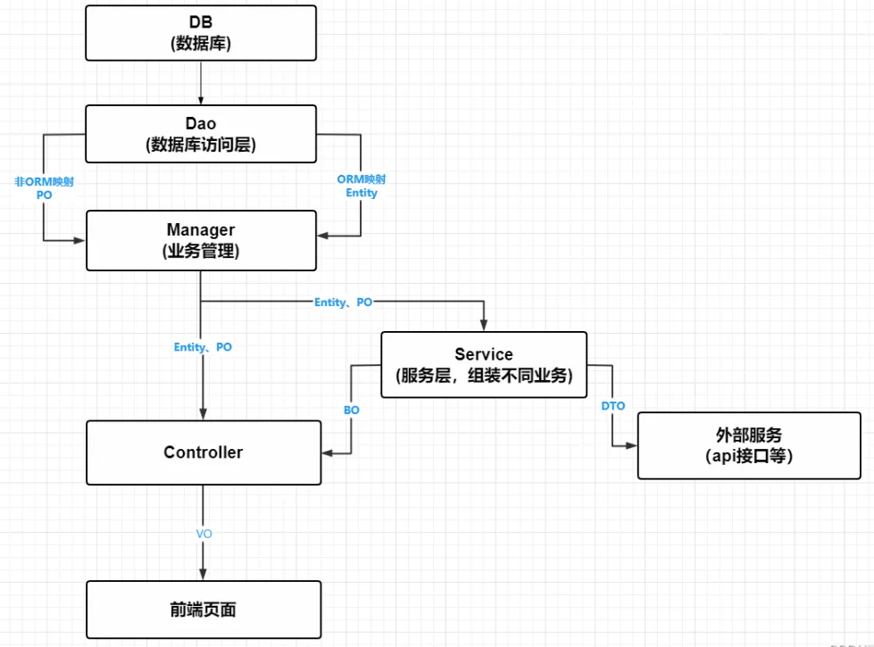
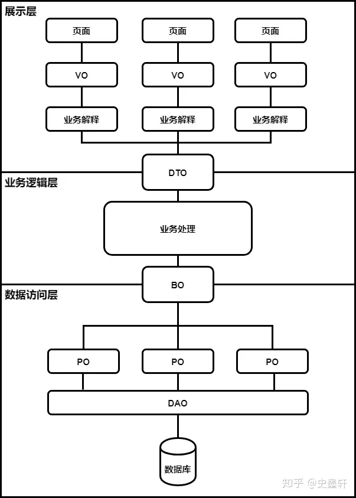

# 数据对象

注意，以下名词可能有不同定义，在同一团队内保持统一定义即可。

- Entry

	词条

	- 一张表的一格数据称为一个 Entry 。（行中的某个字段）

- Entity

	实体

	- 一张表的一行记录称为一个 Entity  。

- DO（Data Object）

	数据对象

	- 一个 DO 对应一张表的一行记录。
	- DO 就是表示 Entity 的对象（完全对应，DO 对象中的属性对应 Entity 中的字段）。

- PO（Persistent Object）

  持久化对象

  - 一个 PO 可以对应一个表或多个表联合查询的结果的一行。
  - DO 是特殊的 PO 。

- VO（View Object，Value Object）

  视图对象、值对象

  - 表示前端直接需要的数据的对象，可用于页面显示，也可作为前端的隐含数据。
  - 可能涉及多张表的信息。

- BO（Business Object）

	业务对象

	- 某 BO 代表一个业务，可能涉及多个 PO 。

- DTO（Data Transfer Object）

	数据传输对象

	- 与接口参数对应的数据对象。
	- 可以由 PO、Entity 转换得到

- POJO（Plain Ordinary Java Object）

	简单 Java 对象

注意：

- POJO 是 DO、PO、BO、VO、DTO 的统称。
- 命名

	- 相应类别的对象在命名时，常加尾缀，比如 `UserDTO`  。

	- POJO 是统称，所以不能用于类的命名。

	- DO（Entity）的类在定义时可以不加后缀。
- DO 与 DTO

	- 请求和 Service 之间用 DTO 交流。
	- Service 和数据库用 PO 交流。
	- PO 含有的字段是和数据表对应的。
- VO 与 DTO
	- DTO 表示接口参数的对象，重在处理接口功能。
	- VO 表示前端需要的数据的对象。

- VO 意义辨析
	- VO 在阿里的 Java 开发手册中称为 View Object ，表示页面的视图。
	- 国外一般称 Value Object ，表示起视图功能的对象，可以是页面的视图，也可以是数据的视图。

