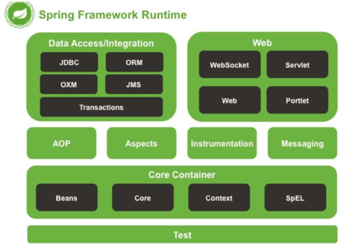
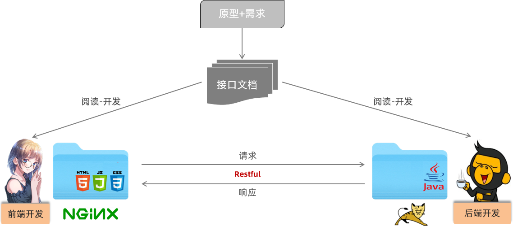
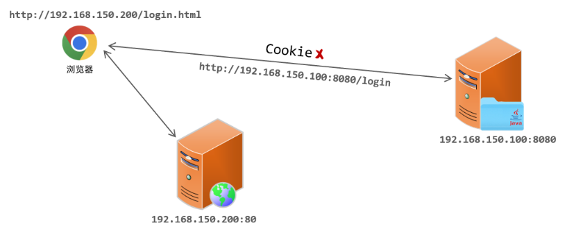
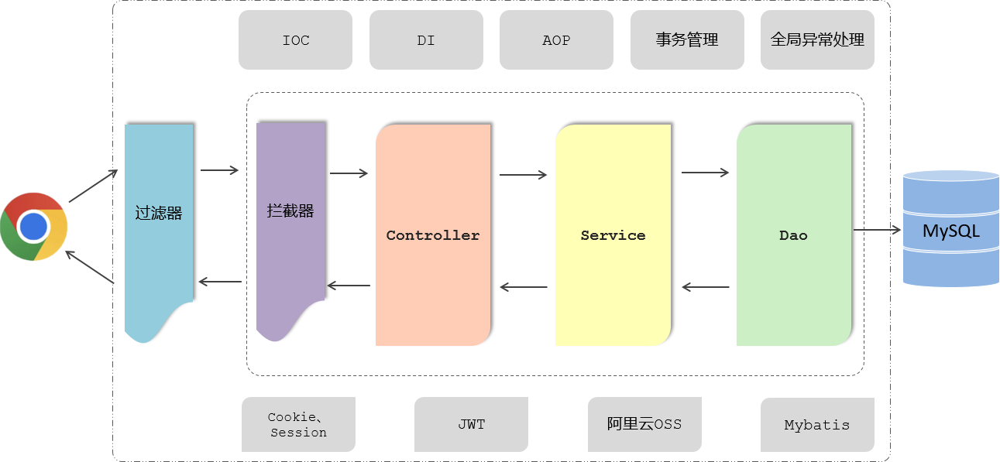
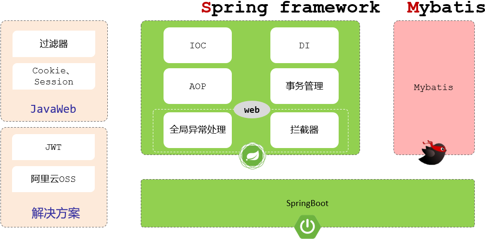

# 基本概念

## 版本

- Java SE

	Java Platform, Standard Edition ，标准版，主要用于桌面应用程序的开发。

- Java EE

	Java Platform, Enterprise Edition，企业版，主要用于开发企业级分布式的网络程序。

- Java ME

	Java Platform, Micro Edition ，微型版，主要用于嵌入式开发。

## 环境

- JDK

	Java SE System Development Kit，Java 语言的软件开发工具包。 

- JRE

	Java Runtime Environment，Java 运行环境。

- JVM

	Java Virtual Machine，Java 虚拟机。

## 基本文件

- `.java`

	Java 源文件，编译后产生字节码文件。

- `.class`

	字节码文件，提供给 JVM 运行。

## 项目管理工具

主要有：（至少选一个使用）

- Maven
- Gradle

主要功能：

- 创建项目。
- 管理包关系（包依赖，包安装等）。
- 编译项目。
- 测试项目。
- 生成文档。
- 发布项目

打包文件：

- jar 包

	jar 包是类的归档文件，可用于压缩和发布，部署和封装库、组件和插件程序。

- war 包

	war 包是 JavaWeb 程序打的包，war 包里面包括写的代码编译成的 class 文件，依赖的包，配置文件，所有的网站页面，包括 html，jsp 等等。一个 war 包可以理解为是一个 web 项目，里面是项目的所有东西。

## Spring 全家桶

Spring，一个 Java 开源轻量级框架，用以整合各类框架，可管理项目，管理类的实例化与生命周期等。

核心：

- 控制反转（Inversion of Control，IOC）

	Spring 在运行时，依据 xml 格式的配置文件和注解等，动态地调用、创建对象与使用方法，将对象交由 IOC 容器统一管理。

	- IOC 包含依赖注入（Dependency Injection，DI）和依赖查找（Dependency Lookup，DL）两种方式。
	- Spring 采用 DI 。

- 面向切面编程（Aspect-oriented Programming，AOP）

	将代码逻辑进一步模块化，使其更便于管理与使用。

Spring 的每个模块（或组件，也可以是框架）都可以单独存在，或者与其它一个或多个模块联合实现。



- Core Container

	- Beans

		提供了 BeanFactory，是工厂模式的一个经典实现，Spring 将被管理对象称为 Bean 。

	- Core

		提供 IOC 功能。

	- Context

		提供一个框架式的对象访问方式，是访问定义和配置的任何对象的媒介。

	- SpEL（Spring Extension Language）

		一种表达式语言，支持查询、操作运行时对象图，以及解析逻辑、算术表达式。

Spring Boot，基于 Spring，主要是自动化 Spring 配置，简化 Spring 操作，也就是对 Spring 的加强。

- Spring Boot 使用嵌入式的 Servlet 容器（例如 Tomcat、Jetty 或 Undertow 等），应用无需打成 WAR 包 。
- Spring Boot 提供了一系列的“starter”项目对象模型（POMS）来简化 Maven 配置。

Spring Cloud，提供微服务化支持与管理。

Spring Data Flow，数据操作。

## Web 服务器

Web 服务器程序对 HTTP 协议的操作进行封装，从而不必用一般编程语言手写 HTTP 操作。

Web 服务器接收请求，并将请求交给程序处理。

- Nginx
	- 常用作静态资源服务器（也可用动态脚本语言生成动态资源，但用 Java 不好实现）
	- 代理服务器
	- 负载均衡服务器
- Tomcat
	- 静态和动态资源均可。
	- 一个 Web 应用容器（也叫 Servlet 容器），运行在 JVM 之上，运行 java 程序。

补充：

- nginx 和 tomcat 可以配合使用
	- nginx 发布静态资源和进行负载均衡。
	- tomcat 发布动态资源。

## 开发规范

### REST 风格

对于前后端分离模式：



前后端开发人员都需要根据提前定义好的接口文档，来进行前后端功能的开发：

- 后端：严格遵守接口文档进行功能接口开发
- 前端：严格遵守接口文档访问功能接口

在前后端进行交互的时候，需要基于当前主流的 REST 风格的 API 接口进行交互。

- REST（Representational State Transfer）

	表述性状态转换，它是一种软件架构风格。

- RESTful 

	与 REST 是一个意思，区别就是 REST 是名词，RESTful  是形容词。

传统 URL 风格：

```url
http://localhost:8080/user/getById?id=1     GET：查询id为1的用户
http://localhost:8080/user/saveUser         POST：新增用户
http://localhost:8080/user/updateUser       POST：修改用户
http://localhost:8080/user/deleteUser?id=1  GET：删除id为1的用户
```

传统 URL 定义较复杂，而且将资源的访问行为对外暴露出来了。

基于 REST 风格 URL ：

```
http://localhost:8080/users/1  GET：查询id为1的用户
http://localhost:8080/users    POST：新增用户
http://localhost:8080/users    PUT：修改用户
http://localhost:8080/users/1  DELETE：删除id为1的用户
```

REST 风格通过 URL 定位要操作的资源，通过 HTTP 动词(请求方式)来描述具体的操作。

四种请求方式，来操作数据的增删改查： 

- GET ： 查询
- POST ：新增
- PUT ：修改
- DELETE ：删除

基于 REST 风格定义 URL，URL 将会更加简洁、更加规范、更加优雅。

注意：

- REST是风格，是约定方式，约定不是规定，可以打破
- 描述模块的功能通常使用复数，也就是加s的格式来描述，表示此类资源，而非单个资源。如：users、emps、books…

注意：

- 前端页面跳转的路径和访问后端接口的路径可以是不一样的。
- 用户一般在浏览器中看见的是前端页面跳转的路径。
- 后端接口的路径一般由前端服务器进行访问（而非用户）。

### 统一响应结果

前后端工程在进行交互时，使用统一响应结果 Result：

```java
package com.itheima.pojo;

import lombok.AllArgsConstructor;
import lombok.Data;
import lombok.NoArgsConstructor;

@Data
@NoArgsConstructor
@AllArgsConstructor
public class Result {
    private Integer code;//响应码，1 代表成功; 0 代表失败
    private String msg;  //响应信息 描述字符串
    private Object data; //返回的数据

    //增删改 成功响应
    public static Result success(){
        return new Result(1,"success",null);
    }
    //查询 成功响应
    public static Result success(Object data){
        return new Result(1,"success",data);
    }
    //失败响应
    public static Result error(String msg){
        return new Result(0,msg,null);
    }
}
```

### 开发流程


1. 查看页面原型明确需求

	根据页面原型和需求，进行表结构设计、编写接口文档(已提供)

2. 阅读接口文档

3. 思路分析

4. 功能接口开发

	开发后台的业务功能，一个业务功能，我们称为一个接口

5. 功能接口测试

	功能开发完毕后，先通过 Postman 进行功能接口测试，测试通过后，再和前端进行联调测试

6. 前后端联调测试

	和前端开发人员开发好的前端工程一起测试

## 跨域



现在的项目，大部分都是前后端分离的，前后端最终也会分开部署，假设：

- 前端部署在服务器 192.168.150.200 上，端口 80 。
- 后端部署在 192.168.150.100上，端口 8080 。

考虑：

```
1. 假设打开浏览器直接访问前端工程，访问 url：http://192.168.150.200/login.html

2. 然后在该页面发起请求到服务端，服务端所的 IP 地址为 192.168.150.100，假设访问接口地址为：http://192.168.150.100:8080/login

3. 那此时就存在跨域操作了，因为我们是在 http://192.168.150.200/login.html 这个页面上访问了 http://192.168.150.100:8080/login 接口
```

区分跨域的维度：

- 协议
- IP/协议
- 端口

只要上述的三个维度有任何一个维度不同，那就是跨域操作。

例子：

```
http://192.168.150.200/login.html ----------> https://192.168.150.200/login   		[协议不同，跨域]

http://192.168.150.200/login.html ----------> http://192.168.150.100/login     		[IP不同，跨域]

http://192.168.150.200/login.html ----------> http://192.168.150.200:8080/login   [端口不同，跨域]

http://192.168.150.200/login.html ----------> http://192.168.150.200/login    		 [不跨域]   
```

## Base64 编码

一种基于 64 个可打印的字符来表示二进制数据的编码以及解码方式。

所使用的 64 个字符分别是：

- A 到 Z、a 到 z、 0 - 9

- 一个加号，一个斜杠

- 等号

	等号是第 65 个字符，作为补位符号（编码位数不足时填充空位）。

任何数据经过 base64 编码之后，最终就会通过这 64 个字符来表示。

需要注意的是 Base64 是编码方式，而不是加密方式。

## Spring Boot Web & SSM



我们在学习这些web后端开发技术的时候，我们都是基于主流的SpringBoot进行整合使用的。

而SpringBoot又是用来简化开发，提高开发效率的。

像过滤器、拦截器、IOC、DI、AOP、事务管理等这些技术到底是哪个框架提供的核心功能？



其中：

- 传统的 JavaWeb 提供了
	- Filter 过滤器
	- Cookie
	- Session
- Spring Framework 提供的核心功能
	- IOC 控制反转
	- DI 依赖注入
	- AOP 面向切面编程
	- 事务管理
	- 全局异常处理
	- 拦截器
- Mybatis就是一个持久层的框架，是用来操作数据库的。
- JWT令牌、阿里云OSS对象存储服务，是现在企业项目中常见的一些解决方案。

Spring 框架的 web 开发模块，我们称为：SpringMVC ：

- SpringMVC 不是一个单独的框架，它是 Spring 框架的一部分
- 是 Spring 框架中的 web 开发模块，是用来简化原始的 Servlet 程序开发的（属于传统 Java Web）。


- 俗称的 SSM = SpringMVC、Spring Framework、Mybatis

基于传统的 SSM 框架进行整合开发项目会比较繁琐，而且效率也比较低，所以在现在的企业项目开发当中，基本上都是直接基于 SpringBoot 整合  SSM 进行项目开发的。


