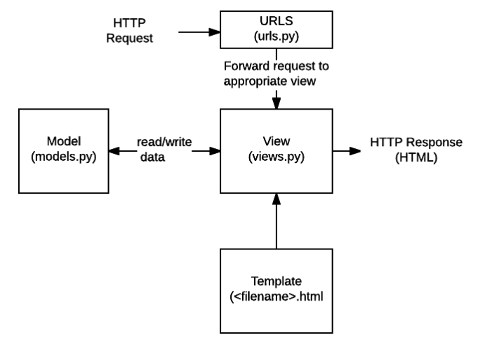
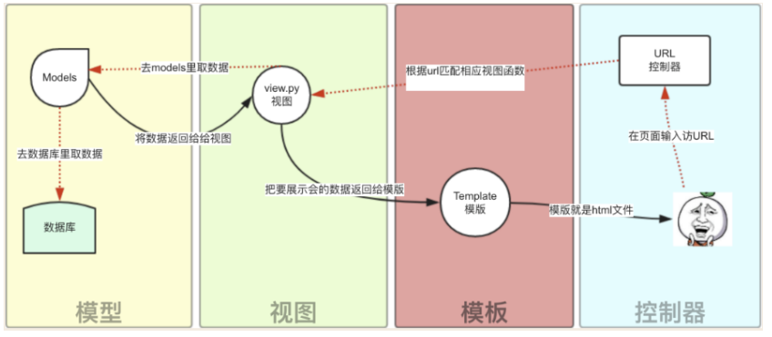
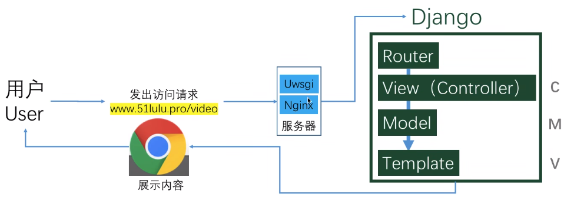

# Django

参考官网教程。

## MTV 模型

MVC 以一种插件式的、松耦合的方式连接在一起：

- 模型（M）

	编写程序应有的功能，负责业务对象与数据库的映射(ORM)。

- 视图（V）

	图形界面，负责与用户的交互(页面)。

- 控制器（C）

	负责转发请求，对请求进行处理。

Django 采用 MTV 模式，其本质上与 MVC 是一样的，只是定义有所差异：

- M 表示模型（Model）

	编写程序应有的功能，负责业务对象与数据库的映射(ORM)。

- T 表示模板 (Template)

	负责把页面（HTML）展示给用户。（可以使用 Template  来定义任何类型的文件的结构，不一定是 HTML）

- V 表示视图（View）

	负责业务逻辑，并在适当时候调用 Model 和 Template，相当于表示 Model 和 Template 的抽象视图。（起 Controller 的功能）

- URLs

	一个 URL 分发器，它的作用是将一个个 URL 的页面请求分发给不同的 View 处理，View 再调用相应的 Model 和 Template



用户操作流程：





## 基本命令

```shell
# 以下命令均在项目目录执行

# 创建项目
django-admin startproject mysite

# 运行项目，默认在 http://127.0.0.1:8000/ 
python manage.py runserver
# 修改文件会自动重启
# 增删文件的操作需要重启服务

# 创建应用
python manage.py startapp [app_name]

# 执行一次迁移，修改数据库结构，使该迁移的修改生效
# 第一次执行时会默认创建一些表
python manage.py migrate
 
# 将对 model 文件的修改存储为一次迁移（migration），migration 描述数据库结构的变化。
python manage.py makemigrations [app_name]
```

## 基本用法

### URLs

#### Path 函数

```python
Path()

route:
匹配 url 的准则。django 会从 urlpatterns 第一项开始顺序搜索 url 。
这些准则不会匹配 GET 和 POST 参数或域名。
处理请求 https://www.example.com/myapp/ 时，会匹配 myapp/
处理请求 https://www.example.com/myapp/?page=3 时，也只会匹配 myapp/

view：
指定特定的视图函数。
一个 HttpRequest 对象会作该视图函数的第一个参数（request）
url 中可设置其它传给视图函数的参数

name：
取名后可在 Django 的任意地方唯一地引用该 url 。
```

#### url 命名空间

有多个应用时，可以使用 `app_name` 指定 url 命名空间，这样 path 中定义的 name 就可以被包括在该命名空间中使用。

```python
app_name = "polls"
urlpatterns = [
    # ex: /polls/
    path("", views.index, name="index"),
    # ex: /polls/5/
    path("<int:question_id>/", views.detail, name="detail"),
    # ex: /polls/5/results/
    path("<int:question_id>/results/", views.results, name="results"),
    # ex: /polls/5/vote/
    path("<int:question_id>/vote/", views.vote, name="vote"),
]
```


### Model

```python
# polls/models.py

from django.db import models

class Question(models.Model):
    # 创建字段（Field），字段默认名称为变量名
    question_text = models.CharField(max_length=200)
    
    # 指定 date published 为字段名，让人类更可读
    pub_date = models.DateTimeField("date published")


class Choice(models.Model):
    # 外键关联
    question = models.ForeignKey(Question, on_delete=models.CASCADE)
    
    choice_text = models.CharField(max_length=200)
    votes = models.IntegerField(default=0)
```

改变模型以下三步要一起执行，否则容易代码和数据库内容对不上：

- 编辑 `models.py` 文件，改变模型。
- 运行 `python manage.py makemigrations [app_name]` 为模型的改变生成迁移文件。
- 运行 `python manage.py migrate` 来应用数据库迁移。

数据库迁移被分解成生成和应用两个命令，使得：

- 能够在代码控制系统上提交迁移数据。
- 能在多个应用里使用。

### View

```python
def index(request):
    return HttpResponse("Hello, world. You're at the polls index.")

# question_id 参数是在 urls 中用 <int:question_id> 设置的变量
def detail(request, question_id):
    return HttpResponse("You're looking at question %s." % question_id)


def index(request):
    
    # 提取时间前 5 的数据
    latest_question_list = Question.objects.order_by("-pub_date")[:5]
    
    # 载入一个模板
    template = loader.get_template("polls/index.html")
    
    # 设置内容中的数据（变量字典）
    context = {
        "latest_question_list": latest_question_list,
    }
    
    # 返回渲染结果
    # 渲染结果必须包含在 HttpResponse 中
    return HttpResponse(template.render(context, request))


# render()
# 上述流程可以使用 render 函数化简
# 可重写为：
def index(request):
    latest_question_list = Question.objects.order_by("-pub_date")[:5]
    context = {"latest_question_list": latest_question_list}
    
    # 载入模版，设置数据，返回 HttpResponse
    return render(request, "polls/index.html", context)


# reverse()
# 该函数可以返回一个直接重定向的网页。（HttpResponseRedirect）
```

#### 通用视图

利用通用视图提供的类可以简化视图操作。

### Template

#### 模板命名空间

```python
# 需要自行创建 templates 目录
# 假设应用名为 polls
# 该 template 的文件应该是 polls/templates/polls/index.html

# 模板命名空间
虽然可以将模板文件直接放在 polls/templates 文件夹中（而不是再建立一个 polls 子文件夹），但是这样做不太好。
Django 将会选择第一个匹配的模板文件，如果有一个模板文件正好和另一个应用中的某个模板文件重名，Django 没有办法区分它们。
我们需要帮助 Django 选择正确的模板，最好的方法就是把他们放入各自的 命名空间 中，也就是把这些模板放入一个和 自身 应用重名的子文件夹里。
```

#### 命令与变量

```html
{{ variable }}

```

#### 表单

- 当创建一个改变服务器端数据的表单时，使用 post 方法，而不是 get 。
- 应当使用 `` 模版标签，以使用 django 的跨站请求伪造保护。

```html
<form action="" method="post">

<fieldset>
    <legend><h1>{{ question.question_text }}</h1></legend>
    <p><strong>{{ error_message }}</strong></p>
    
        <input type="radio" name="choice" id="choice{{ forloop.counter }}" value="{{ choice.id }}">
        <label for="choice{{ forloop.counter }}">{{ choice.choice_text }}</label><br>
    
</fieldset>
<input type="submit" value="Vote">
</form>
```

## 杂项

### SQLite

一个简易的零配置数据库，不需要 USER、PASSWORD、HOST 等设置。

SQLite 的所有信息存储在一个磁盘文件中。

### app（应用）

django 的应用是可插拔的，一个应用可以在多个项目中复用。

### 静态文件

需要手动在 app 目录下建立 `static/` 目录。

```shell
# 静态文件的路径和 Template 的规则类似，重复名的子目录是为了指定静态文件的命名空间
polls/static/polls/style.css
```

### 与 Vue 交互

- vue 使用 methods 对某个表示方法的 url 发起请求。
- django 解析 url 并返回包含 json 格式数据的 HttpResponse 。
