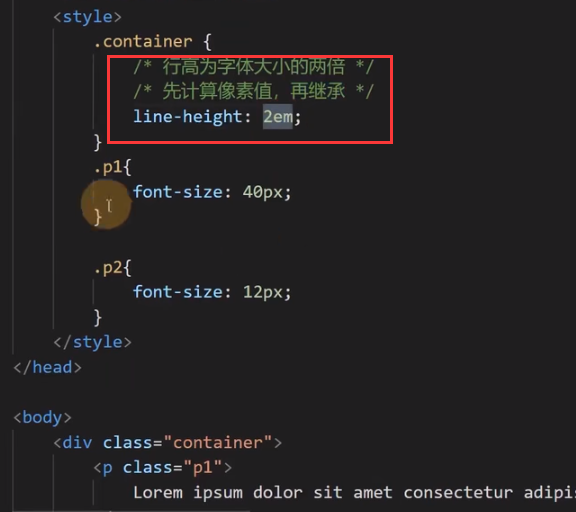
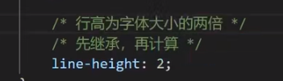
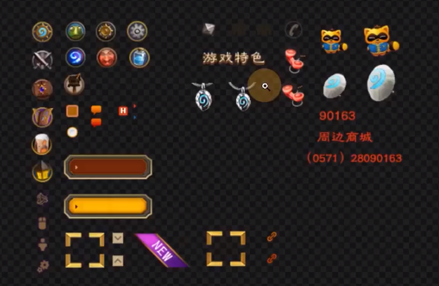

# 常用样式声明

## color

元素内部的文字颜色。

预设值：定义好的代表颜色的单词

三原色，色值：光学三原色（红，绿，蓝）0 ~ 255

- rgb 表示法

```
rgb(12, 0, 3)
```

red，green，blue（RGB）

- hex 表示法
	十六进制，每两位表示一个成分颜色（红绿蓝）

```
#005c7c
#ff2233 等可简写为：#f23
```

## background-color

元素背景颜色。

## font-size

元素内部文字的尺寸大小。

- px
	像素绝对单位。
- em
	相对单位，相对于父元素的字体大小（2em，3em，4em……）。
- px 和 em 也可在其它属性中使用。

每个元素必定有字体大小，未设定大小的元素将与其父元素保持一致，没有父元素则使用基准字号。

## font-weight

字体粗细程度。

数字，或预设值。

某些取值可能字体类型无法适配，一般取 normal（一般） 或 bold（加粗）即可。

## font-family

文字类型，文字字体。

用户计算机中存在的字体才会有效。

使用多个字体，以匹配不同环境：```font-family:arial,宋体,sans-serif;```（匹配顺序从前到后）

sans-serif：非衬线字体，即不加修饰的系统自选字体。

## font-style

字体样式。

一般设置斜体（italic）。

## text-decoration

文本修饰，加线。

- 加下划线（underline）
- 不加为：none
- 加删除线：line-trough

## text-indent

首行文本缩进。

## line-height

行高，其值越大，文本行间的距离也越大。

行高可以设置为无单位数字，表示相对于当前字体的大小，如 1.5 倍，2 倍。

扩展知识：
- 行高可设置为：像素值，无单位数字，em，百分比。

- 若设置为 em 或 百分比：先计算再继承。

	
	
- 若设置为无单位数字：先继承再计算。

	

## width

宽度。

## height

高度。

## letter-space

文字间隙。

## text-align

元素内部文字的水平排列方式。

## 透明度

1. opacity 属性，设置整个元素区域的透明度（包括其子元素），取值范围 0~1
2. 在颜色位置设置 alpha 通道（透明通道），rgba，取值范围 0~1。

## 鼠标

cursor 属性，还可通过鼠标样式文件（.cur 或 .ico 等）设置鼠标样式。

## 盒子隐藏

1. display：none 不生成盒子
2. visibility：hidden 生成盒子，只是从视觉上隐藏盒子，仍然占据空间。

## 背景图

与 img 的区别：

- img 元素属于 HTML 概念
- 背景图属于 CSS概念
- 区别使用
	1. 当图片属于网页内容时，必须使用 img 元素。
	2. 当图片仅用于美化页面时，必须使用背景图。

涉及的 CSS 属性：

1. background-image
2. background-repeat
	默认情况下，背景图会在横坐标和纵坐标中重复显示。
3. background-size
	- 预设值：container、cover 等
	- 数值或百分比
4. background-position
	设置背景图的位置。
	- 预设值：left、bottom、right、top、center，可分别设置横向和纵向的位置.
	- 数值或百分比：前后两个数字，分别表示离盒子左侧和离盒子上方的距离。
5. background-attachment
	控制背景图是否固定。类似于固定定位。
6. 背景图和背景颜色混用
	使用背景颜色填充背景图的边缘。
7. 速写形式（简写）

雪碧图（也叫精灵图，spirit）：

将许多小图片或图表合并为一张大图片，便于管理，浏览器缓存等。
可使用 background-position 属性从中取出某一块区域。



## 表单元素的样式

不同浏览器的表单元素的样式可能不同，常需要手动重置表单元素样式。

textarea 可通过 resize 属性设置“可通过鼠标调整输入框大小”。

原生单选框和多选框样式难以调整，且不美观，常需要通过图形的组合模拟其效果。