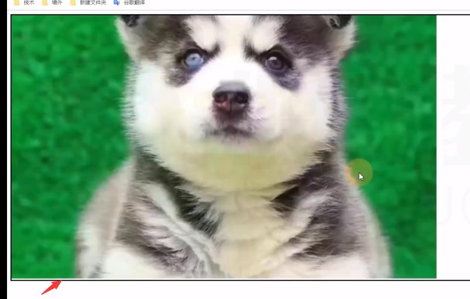

# 盒模型

盒子（box）：每个元素在页面中都会生成的一个矩形区域。

## 盒子类型

行盒在页面中不换行，块盒独占一行。

- 行盒
display 属性等于 inline 的元素。display 默认值为 inline

- 块盒
display 属性等于 block 的元素。

注意：行盒块盒，行级元素块级元素 是不同的概念。

浏览器默认样式表中：

- 设置的块盒：容器元素，h1~h6， p 等
- 设置的行盒：span、a、img、video、audio

## 盒子的组成

1. 内容 content
	- width、height 设置的是盒子内容的宽高。
	- 内容部分通常叫做整个盒子的 “内容盒 content-box”
2. 填充（内边距） padding
	盒子边框到盒子内容的距离。（默认值为 0）
	- 四个属性：
		padding-top、padding-right、padding-bottom、padding-left
	- 属性简写：
		padding：（上，右，下，左）（顺时针）
	- 若有相同值：
		- 写三个值：上，左右，下
		- 写两个值：上下，左右
		- 写一个值：上下左右
	- 填充区 + 内容区 = 填充盒 padding-box
3. 边框 border
	边框 = 边框样式 + 边框宽度（厚度）+ 边框颜色（border-style，border-width，border-color）
	- 样式默认为 none 表示没有样式，此时边框无法显示。
	- 宽度默认为 0 。
	- 颜色默认为内容字体颜色。
	- 样式、宽度、颜色都分四个方向，同 padding 格式。
	- 边框 + 填充区 + 内容区 = 边框盒 border-box
4. 外边距 margin
	边框到其它盒子或页面边缘的距离。
	- 属性书写格式同 padding 格式。

## 盒模型应用

（以下内容块盒适用，行盒部分适用）

### 改变宽高范围

默认情况下，width 和 height 设置的是内容盒的宽高；实际时往往需要使用边框盒的宽高。

解决办法：
1. 精确计算，改变数值
2. CSS3：box-sizing 属性：改变宽高属性作用对象（某个盒子）

### 改变背景覆盖范围

默认情况下，背景覆盖边框盒。

修改方法：background-clip 属性。

### 溢出处理

在未设置宽高的默认情况下，边框盒宽高会自适应内容。

当设置了宽高，内容有可能会溢出盒子（溢出部分默认仍可见）。

overflow 属性：控制内容溢出边框盒后的处理方式。

### 断词规则（不重要）

即文字换行的位置。

word-break 属性：会影响文字在什么位置被截断或换行。

- normal 属性值
	CJK 字符在文字位置截断，非 CJK 字符在单词位置截断。	（CJK：China，japan，korea）
- break-all 属性值
	所有字符都在文字处截断。
- keep-all 属性
	所有文字都在单词间截断。（以空格为准，中文若空格则不会换行）。

### 空白处理

以下方式只能控制单行文本，多行文本需要用 JS 。

- white-space ：nowrap （使文字不换行）
- overflow：hidden（使溢出的文字隐藏）
- text-overflow ：ellipsis （文字溢出的部分使用三个圆点组成的省略号代替）

## 行盒盒模型

1. 盒子沿着内容延伸。
2. 行盒不能设置宽高。
	如果要调整行盒的宽高，需要通过调整内容的字体大小、行高、字体类型间接调整。
3. 内边距（填充区）
	水平方向有效，垂直方向不会使内容占据实际空间。
4. 边框
	水平方向有效，垂直方向不会使内容占据实际空间。
5. 外边距
	水平方向有效，垂直方向不会使内容占据实际空间。
	
## 行块盒

属性值：display ：inline-block 的盒子。

1. 不独占一行。
2. 盒模型中所有尺寸都有效。

空白折叠发生在行盒（包含行块盒）内部或行盒（包含行块盒）之间。

## 可替换元素和非可替换元素

- 大部分元素，页面上的显示结果，取决于元素内容，成为非可替换元素。
- 少部分元素，页面上的显示结果，取决于元素属性，称为可替换元素。

可替换元素：img，video，audio 等。

绝大部分可替换元素均为行盒，但可替换元素类似于行块盒，盒模型中所有尺寸都有效。

## 行盒的垂直对齐

多个行盒垂直方向上的对齐。

给没有对齐的元素设置 vertical-align
- 预设值
- 数值

图片的底部白边：

图片的父元素是一个块盒，块盒高度是自动的，图片底部和父元素底边之间往往会出现空白。

- 本质是由图片的基线（下外边距）与父元素生成的参考线的基线对齐所致。
- 图片是行盒，行盒有参考线，所以父元素生成了参考线。

解决：
1. 设置父元素的字体大小为 0（使父元素不生成参考线）
	有文字时不建议使用，因为文字是行盒，没有参考线即没有 line-box，文字无法显示。
2. 将图片设置为块盒（display：block）
	使其成为块盒，从而不含参考线。