# 视觉格式化模型

## 基本概念

- 视觉格式化模型（布局规则）：页面中多个盒子的排列规则。
- 盒模型：规定单个盒子的规则。

视觉格式化模型（布局规则）大体上将页面中的盒子分为三种排列方式：
1. 常规流
2. 浮动 float
3. 定位 position

## 常规流

一些别称：常规流布局、文档流、普通文档流、常规文档流。

属于视觉格式化模型（也叫布局规则）。

所有元素默认都属于常规流布局。

总体规则：块盒独占一行，行盒水平依次排列。

### 包含块

（containing block）

每个盒子都有它的包含块，包含块决定了盒子的排列区域。
绝大部分情况下，盒子的包含块为其父元素的内容盒。

## 块盒

1. 每个块盒的总宽度，必须刚好等于包含块的宽度。
	- 宽度的默认值为 auto（此处表示“将空余的空间吸收掉”）
	- margin 的取值也可以是 auto，但默认值为 0（width 吸收能力强于 margin）
	- 若宽度、边框、内边距、外边距计算总和后仍然有剩余空间，该剩余空间自动被margin-right 全部吸收。
	- 在常规流中，要使块盒在其包含块中居中，可以固定宽度，然后左右 margin 设置为 auto 。
	
2. 每个块盒垂直方向上的 auto 值
	- height：auto，适应内容的高度。
	- margin：auto，表示 0.
	
3. 百分比取值
	- padding、宽、margin 可以取值为百分比。
		这些属性的所有百分比都相对于包含块的宽度。
	- 父元素设置了高度，子元素才能设置百分比。
	- 高度的百分比：
		- 包含块的高度取决于子元素的高度，此时设置百分比无效。
		- 包含块的高度不取决于子元素的高度，此时百分比相对于父元素高度。
	
4. 上下外边距的合并
	- 两个常规流块盒，若上下外边距相邻，则会合并为一个外边距的距离。
	- 两个外边距取最大值。
	- 不止兄弟元素（相邻关系）的外边距会合并，父子元素（包含关系）的外边距也会合并。
	
	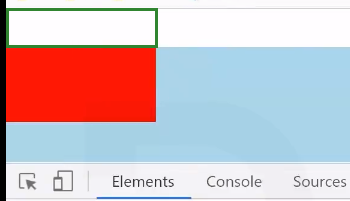
	
	上图：父子元素的外边距合并了（绿色框区域）。
	
## 浮动

### 应用场景

1. 文字环绕
2. 横向排列

### 盒子尺寸

1.  宽度为 auto 时，适应内容宽度，此时若内容宽度为 0，则无显示。
2. 高度为 auto 时，与常规流一致，适应内容的高度。 
3. margin 为 auto 时，为 0 。
4. 边框、内边距、百分比、设置与常规流一致。

### 注意事项

1. 当一个元素浮动后，一定是块盒。
	会强制改变元素盒类型，即强制将 display 属性改为 block
2. 浮动元素的包含块和常规流一样，为父元素的内容盒。

### 盒子排列

属性设置：
修改 float 属性值为：

- left：左浮动，元素靠上靠左（先上后左）
- right：右浮动，元素靠上靠右（先上后右）
- 默认值为 none，即常规流。

盒子间的作用：
- 浮动盒子在包含块中排列时，会避开常规流盒子。
- 常规流块盒在排列时无视浮动盒子。
- 行盒在排列时会避开浮动盒子。

注意：如果文字没有在行盒中，浏览器会自动生成一个行盒来包裹文字，该行盒叫做匿名行盒。

### 高度坍塌

现象：常规盒子的高度没能随着浮动元素的增加而自适应。
根源：常规流盒子的自动高度值在计算时，不会考虑浮动盒子。

- 清除浮动
	涉及 CSS 的 clear 属性（并不是真的"清除"浮动）
	- 默认值：none
	- left：清除左浮动，该元素必须出现在前面所有左浮动元素的下方。
	- right：清除右浮动，该元素必须出现在前面所有右浮动元素的下方。
	- both：清除左右浮动，必须出现在前面所有浮动元素的下方。

1. 对一个块盒空元素应用 clear 属性，使其撑开上文中“常规盒子”的高度。

2. 也可使用伪元素选择器：（与 1. 是类似的）

	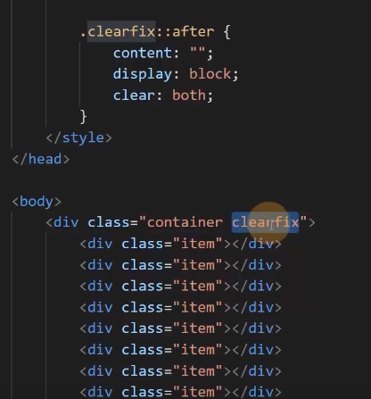
	

## 浮动扩展

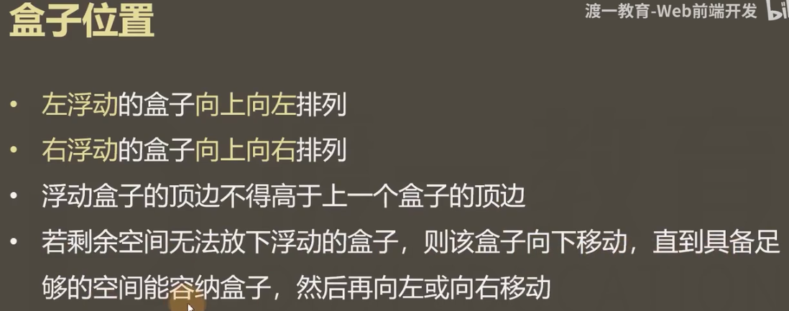

重要示例：
- 圆形编号为盒子的放置次序。
- 箭头代表浮动方向。

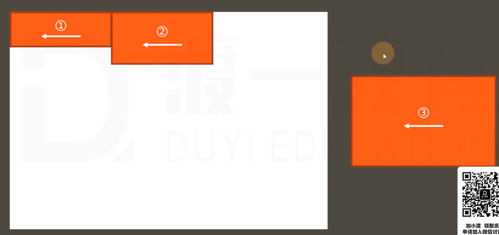

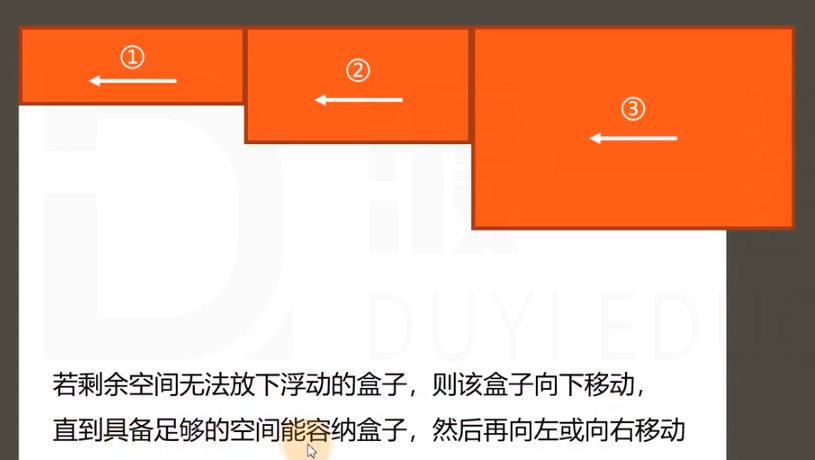

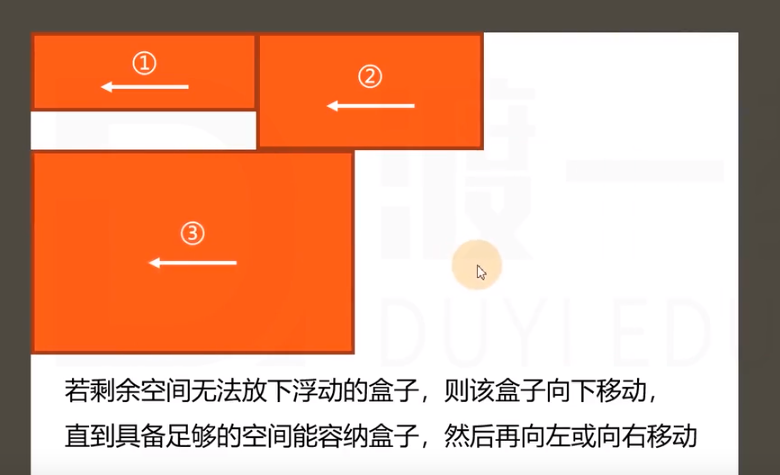

**注意第 4 个盒子的放置位置：**

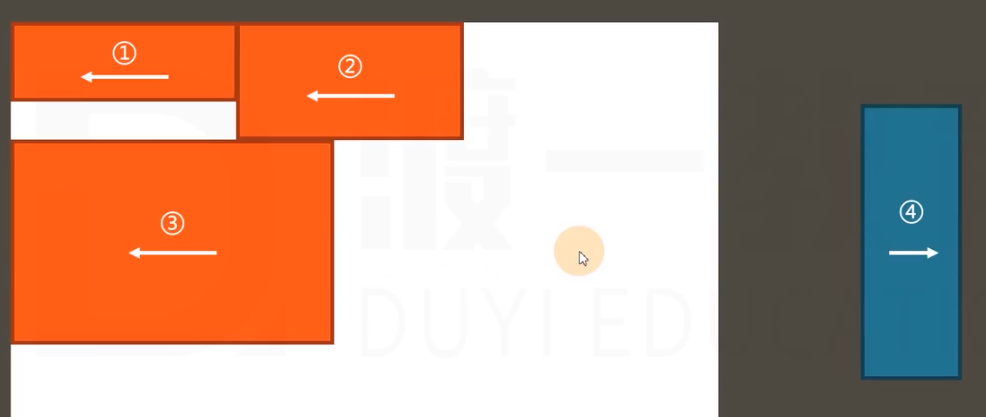

错误位置：

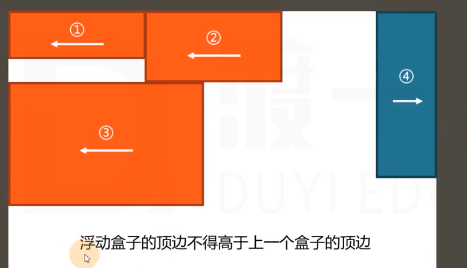

正确位置：

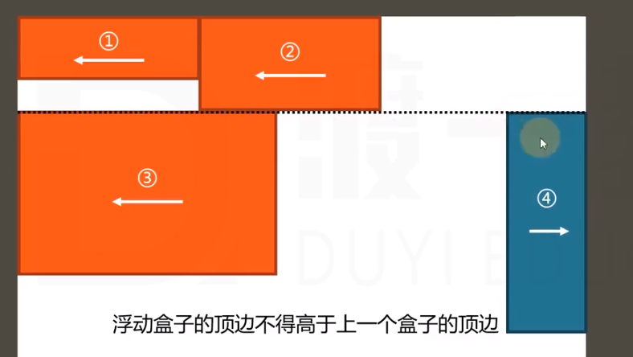

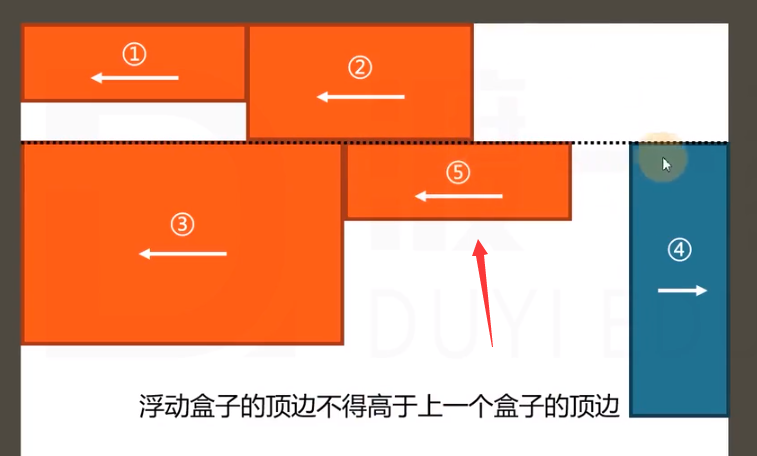

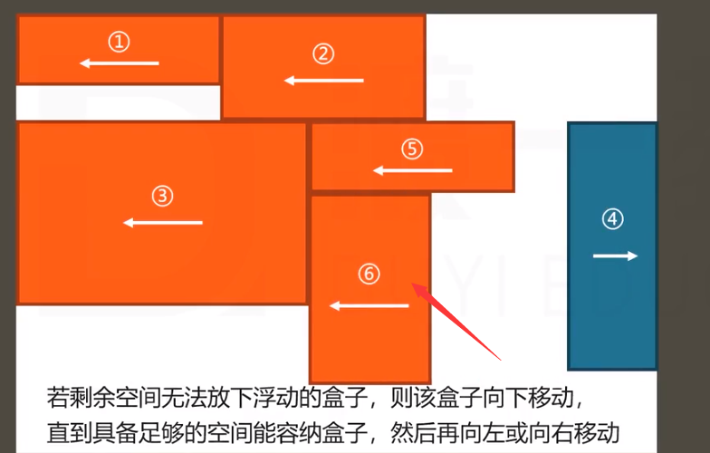

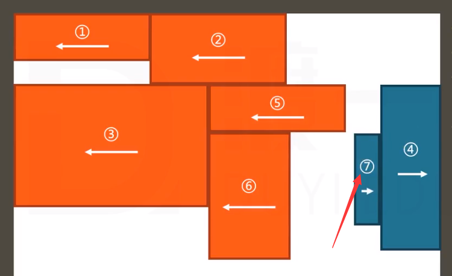

## 定位

手动控制元素在包含块中的准确位置。

### position 属性

- 默认值：static，静态定位（不定位）
- relative：相对定位
- absolute：绝对定位
- fixed：固定定位

一个元素，只要其 position 不为 static，则认为该元素是一个定位元素。

定位元素会脱离文档流（相对定位除外）。

一个脱离了文档流的元素：
1. 文档流中的元素在摆放时会忽略脱离了文档流的元素。
2. 文档流中元素计算自动的高度时会忽略脱离了文档流的元素。

### 可通过四个 CSS 属性设置位置

- left
- right（左右冲突时以左为准）
- top
- bottom（上下冲突时以上为准）

### 相对定位

不会导致元素脱离文档流，只是让元素在原来位置上进行偏移。

相对定位下，盒子的偏移不会对其它盒子造成影响。

### 绝对定位

宽高默认为 auto，适应内容。

包含块变化：
- （从自身起）祖先中第一个定位元素，将该元素的填充盒作为其包含块。
- 包含块限定了元素定位的坐标系。
- 若找不到，则以整个网页作为其包含块（初始化包含块）。

### 固定定位

基本和绝对定位一样。

但包含块不同：固定为视口（浏览器的可视窗口）（不随页面而滚动）

### 补充

- 绝对定位、固定定位元素一定是块盒。
- 绝对定位、固定定位元素一定不是浮动。
- 没有外边距合并。

### 定位下的居中

1. 定宽（高）
2. 将左右（上下）距离设置为 0
3. 将左右（上下）margin 设置为 auto

绝对定位和固定定位中，margin 为 auto 时会自动吸收剩余空间。

### 堆叠上下文

多个定位元素重叠时：设置 z-index，通常情况下，该值越大，越靠近用户。（只有定位元素设置 z-index 有效）

z-index 可以为负数，如果为负数，则遇到常规流、浮动元素，会被覆盖。