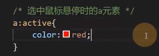
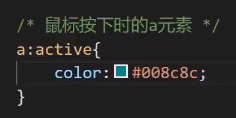
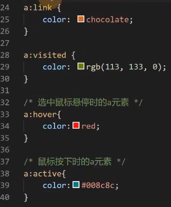
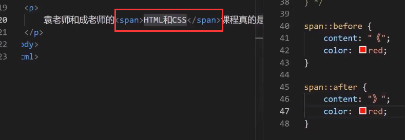
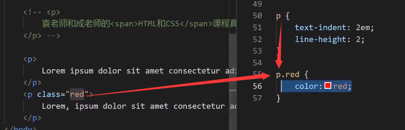

# 选择器

以下只给出部分用法，详见：https://developer.mozilla.org/zh-CN/docs/Web/CSS/Reference

## 简单选择器

1. id 选择器
	选中对应 id 元素。
	
2. 元素选择器
	同名元素都会被选中。
	
3. 类选择器
	将 CSS 代码封装为类，再以类赋值給元素 class 属性。
	
4. 通配符选择器
	```*``` 选择所有元素。
	
5. 属性选择器
	根据属性名和属性值选中元素。
	
	- 选中所有具有该属性的元素：```[属性名]{  } ```
	- 选中所有具有该属性值的元素：```[属性名="属性值"]{  } ```
	
6. 伪类选择器
	选中具有某些状态的元素（可动态选择）。
	
	- link：超链接未访问时的状态
	- visited：超链接访问后的状态
	- hover：鼠标悬停状态
	- active：激活状态（鼠标按下状态）
	
	
	
	**如果要使用这些伪类选择器，必须按照如下顺序，否则可能会出错**：
	link，visited，hover，active（li vi ho ac）
	这是为了保持这几个选择器的语义顺序正确，参见层叠过程的源次序
	
	
	
7. 伪元素选择器
	- before
	- after

	例子：
	
	
	
	效果：
	
	
	
	- 单冒号 (:) 用于 CSS3 伪类
	- 双冒号 (::) 用于 CSS3 伪元素

## 选择器的组合

1. 并且（小数点分隔，写到一起）
2. 后代元素（空格分隔）
3. 子元素（ > 连接）
4. 下一个兄弟元素（ + 连接）
5. 以后的所有兄弟元素（ ~ 连接）

“并且”的解释：下图为 p 元素，并且其具有 red 属性类（class）



## 选择器的并列

多个选择器逗号分隔。

## 更多的选择器

### 伪类选择器

- first-child：选择第一个子元素
- first-of-type：选择指定类型的第一个子元素
- last-child
- last-of-type
- nth-child：选择指定的第几个子元素。
- nth-of-type：选择指定类型的第几个子元素。
- focus：元素聚焦时的样式
- checked：单选或多选框被选中的样式
	常使用 + 号选中单选框或多选框的下一个元素

### 伪元素选择器

- first-letter：选择元素中第一个字母（或文字）
- first-line：选择元素中第一行的文字
- selection：选择被用户框选的文字
