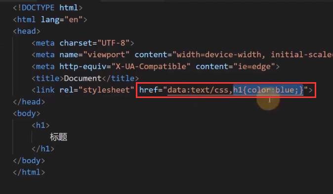
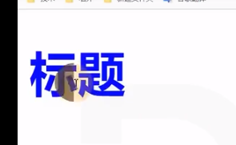

# 数据链接

（data url）注意它的英文。

将目标文件的数据内容直接书写到路径位置。

https://developer.mozilla.org/zh-CN/docs/Web/HTTP/data_URIs

## 语法

data：MIME, 数据

（MIME：指定数据类型的 MIME 类型）

一个示例：

本例相当于将一个 CSS 文件的数据直接书写到路径上。

效果：

可 base64，从而书写图片。

## 意义

- 优点
	1. 减少了浏览器的请求。（“请求”对应“响应”）
		减少了请求中浪费的时间。
	2. 有利于动态生成数据。

- 缺点
1. 增加了资源的体积。
	增加了单个资源的传输时间。
2. 不利于浏览器缓存。
3. 会使源资源的体积扩张到原来的 4/3（base64 的编码转换）

## 应用场景

1. 当请求单个图片体积小，并且该图片因为各种原因，不适合制作雪碧图，可以使用数据链接。
2. 图片由其它代码动态生成，并且图片较小，可以使用数据链接。

## base 64

通常用于将二进制数据用一些字符串表示。