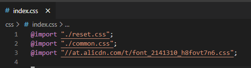
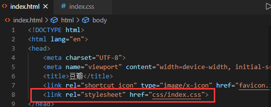

# 基本概念

- CSS 规则

一条 CSS 规则 = 选择器 + 声明块

```
<style>
h1{
	color:orange;
	text-align:center;
}
</style>
```

style 元素表明是 CSS 代码。

- 选择器基本写法

	1. id 选择器，选中对应 id 元素
	2. 元素选择器，同名元素都会被选中
	3. 类选择器，将 CSS 代码封装为类，再以类赋值給元素 class 属性

- 声明块
	包含了若干声明（CSS 属性），每一个声明（CSS 属性）对应某些样式。
	属性名:属性值;
	

## 书写位置

- 内部样式表
	使用 style 元素。
- 内联样式表（元素样式表）
	使用某个元素的 style 属性。
- 外部样式表
	将 CSS 代码书写到独立的文件中，使用 link 元素链接 .CSS 文件。
	- 有利于解决多页面样式重复的问题。
	- 有利于浏览器缓存 CSS 文件，从而提高下一次页面的访问速度。
	- 有利于代码分离。

部分样式表推荐先使用 @import 包含到一个 css 文件中，再链接到 html 。





## 书写顺序

- html 代码书写

	对于某一小区域，先构造 html 代码，并将整体结构的类选择器写出，再仔细书写 CSS。

- CCS 代码结构

```
导入样式
    字体图标
    多页面通用样式
    etc.
       
本页统一样式

本页通用样式

本页各部分样式
```

## 书写思维

在正式书写前，要先总览各部分结构，争取在结构上构造相似样式。

在书写页面某一部分样式前，要看一下全局是否存在相对于其的相似样式。（既要往前看有没有已经存在的通用样式，也要往后看有没有相似样式）

通用样式以及统一样式不要一开始就全部找出来，要在书写过程中，第一次遇到它时再书写，否则可能思维混乱。

## 分栏布局

可使用以下类样式简化分类结构。

```
.aside-left {
    float: left;
    width: 100px;
}

.aside-right {
    float: right;
    width: 200px;
}

.main {
    /* 创建 BFC */
    overflow: hidden;
}
```

书写 html 代码时，aside-right 所选择的代码要写在 main 前面，否则 aside-right 区域会在 main 的下方，而不是右方。（main 为常规流块盒，浮动元素会避开常规流）
