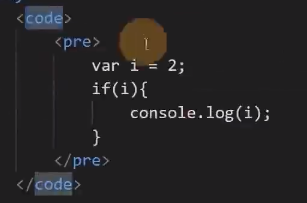
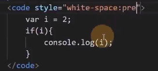
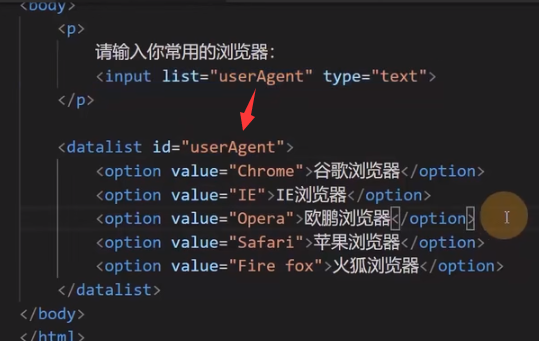
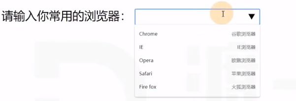
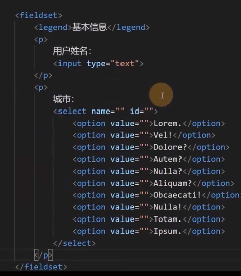
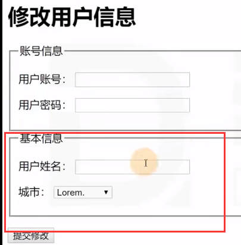
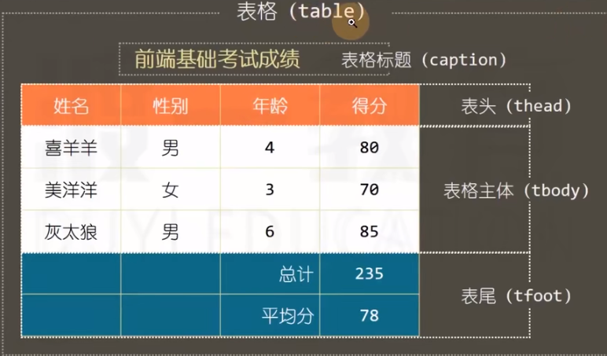
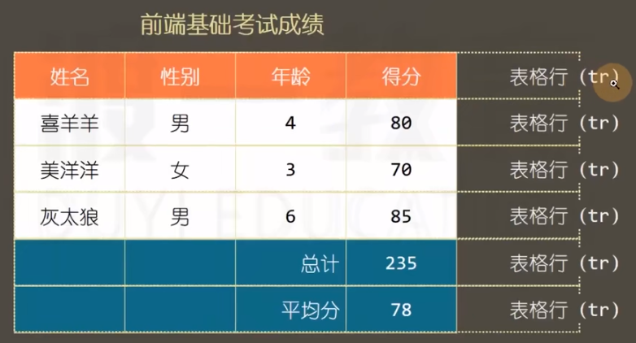
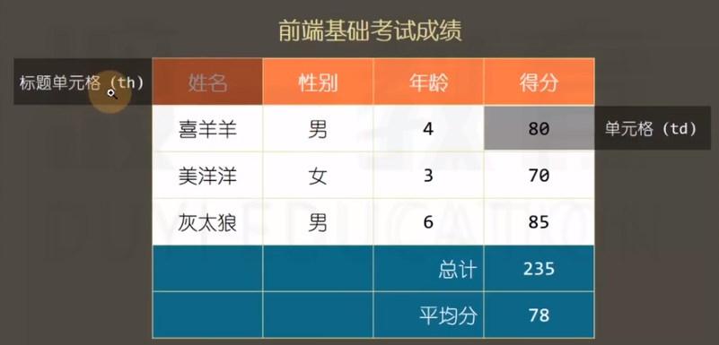

# 基本元素

### 常用元素

### div 元素

无语义，用于给无语义的内容设置样式。


### span 元素

无语义，用于给无语义的内容设置样式。

（某些内容时没有语义的，但又要 CSS 设置样式，而要设置样式必须要有一个标签，则可用这个标签）


### pre 元素

预格式化文本元素。
pre 元素的内容不会出现空白折叠，将以源代码格式显示，本质是其有一个默认 CSS 元素 "white-space:pre"
显示代码时，通常外套 code 元素。

也可：

### a 元素

href 属性（hyper reference）

1. 普通链接，页面跳转
2. 锚点链接，锚点跳转（相同页面不刷新，不同页面要刷新）
3. 功能链接，触发 js 功能代码

可使用 # 对空链接占位。

target 属性

- _self：在当前页面打开（默认）
- _blank：在新窗口中打开

### img 元素

- source 属性：图片 URL
- alt 属性：图片加载错误时的默认显示内容

img 元素可包含在 a 元素中，用于点击图片打开链接。

```
<a target="_blank" href="URL">  </a>
```

常与 map 元素合用。

### map 元素

将图片坐标化，使得点击图片指定区域打开指定的链接。

图片坐标（像素数量）的量取可使用 QQ 截图（使用 QQ 截图量取时要保证是 100% 显示，否则不准确，需要精确量取的场合可使用专业工具，如 PS）

### figure 元素

表示图表内容。

子元素：figcaption 。

### 列表元素

一般列表：

- ol (ordered list) 有序列表
- ul (unordered list) 无序列表
- li (list item) 列表项

定义列表（此处“定义”为名词）：

- dl (definition list)
- dt (definition title)
- dd (definition description)

### 容器元素

表示一块区域，内部放置各种元素，可嵌套。

原来只有：
- div 元素：无语义，无显示效果，只表示一个容器。

html5 中新增的语义化容器元素（仍然没有显示效果）：
- header：表示页头，也可表示文章头部
- footer：表示页脚，也可表示文章尾部
- article：用于表示整篇文章
- section：表示文章章节
- aside：用于表示侧边栏（附加信息）

## 表单元素

一系列元素，主要用于收集用户数据。

### input 元素

输入框。

type 属性：指定输入框类型

属性值：

- type：text 普通文本输入框
- type：password 密码
- type：date 日期选择框，有兼容性问题
- type：search 搜索框，有兼容性问题
- type：number 数字输入框
- type：checkbox 多选框
- type：file 选择文件

input 元素也可以制作按钮，当 type 值为 reset、button、submit 时，input 表示按钮。

value 属性：输入框的值。

placeholder 属性：显示提示文本，在文本框没有内容时显示。

### select 元素

下拉列表选择框，通常和 option 元素配合使用。


### textarea 元素

文本域，多行文本框。


### button 元素

type属性：
- reset
- submit
- button
- 默认是 submit

内可加各种元素，也可将各种元素做成按钮。

### 表单状态

- readonly 属性，布尔属性，是否只读，不改变显示样式。
- disabled 属性，布尔属性，是否禁用，会改变显示样式。

## 配合表单元素的其它元素

### label 元素

通常配合单选和多选框。

- 显式关联
	可通过 for 属性，让 label 元素关联某一个表单元素，for 属性写元素 id 值。
- 隐式关联
	将表单元素套入 label 元素即可。

### datalist 元素

该元素本身不会显示到页面上，通常与普通文本框配合。

通过 id 关联。

### option 元素



效果：



### form 元素

通常会将整个表单元素放置在 form 元素内部。

作用：当提交表单时，会将 form 元素内部的表单内容以合适的方式提交到服务器。

form 对开发静态页面没有什么意义。

### fieldset 元素

表单分组。



效果：



## 表格元素

在 css 技术出现之前，网页通常使用表格布局。（表格的渲染速度过慢，故不再用于布局）

如今，后台管理系统中可能会使用表格。（后台与后端不一样）

- 前台
	面向用户。
- 后台
	面向管理员，对界面要求不高，对功能性要求高。

### table 元素等







表格有自己独特的 display 方式。

合并单元格：

- 跨越列：colspan 属性
- 跨越行：rowspan 属性
