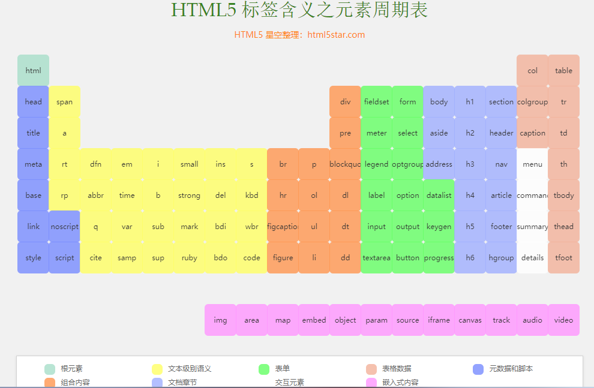
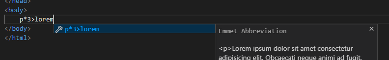
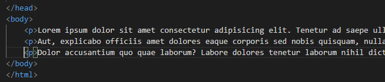
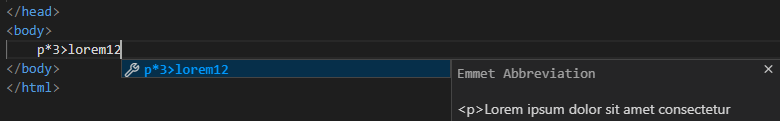
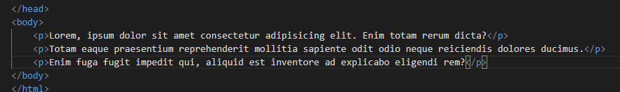
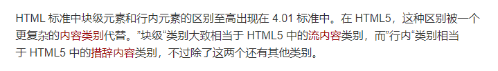

# 基本概念

- Emmet 插件
  代码补全，使用命令生成片段等。VS code 内嵌了此插件，不必去安装。详见：http://code.z01.com/emmet/

- 输入 ！会有基本结构的代码提示，也可直接 ！+ tab 可以快速生成基本结构。

	```html
	<!DOCTYPE html>   <!--文档声明，声明 html 的标准类型-->
	<html lang="en">  <!--根元素，一个文档只能出现一个，html5 标准中可不写-->
	<head>   <!--文档头，其内容不会显示在页面上-->
	    <meta charset="UTF-8">   <!--元数据，相当于附加信息-->
	    <meta name="viewport" content="width=device-width, initial-scale=1.0">   <!--适配手机端-->
	    <title>Document</title>
	</head>
	<body>
	
	</body>
	</html>
	```

## 元素

元素示例：```<a href="http://www.baidu.com">百度</a>```

- 元素
	element （元素）也可称为标签
	起始标记（begin tag）+ 结束标记（end tag）+ 元素内容 + 元素属性
	- 元素可包含嵌套，但不能交叉嵌套
	- 父元素，子元素，祖先元素，后代元素，兄弟（同一个父元素）元素
- 属性
	属性名，属性值（上例中分别为 href 和一个地址字符串）
	- 局部属性：某些元素特有的属性。
	- 全局属性：所有元素通用的属性。
- 空元素
	有一小部分元素，元素内容为空（没有结束标记），称为空元素，且其书写方式有所不同（例：```<hr />```）
	
## 语义化

- 每个元素都有具体的含义
- 元素与显示效果无关（即显示效果不能改变元素含义），显示效果由 CSS 负责。浏览器带有默认的 CSS 样式，所以每个元素有默认的样式。
- 选择什么元素，取决于元素的含义，而不是显示效果。

为什么需要语义化？

- 搜索引擎优化（SEO），让搜索引擎理解网页。
- 浏览器，让浏览器理解网页，进而达成阅读模式，语义，等功能。

## html5 元素周期表

http://www.html5star.com/manual/html5label-meaning/

网页中点击可查看用法。



## 乱数假文（lorem）

- 属于 Emmet 插件。具体语法见 Emmet http://code.z01.com/emmet/
- 随机生成没有实际含义的文本，可用于测试。

示例：（生成 3 个随机内容的 p 元素）



部分结果：



示例：（每个 p 元素 12 个“单词”）



结果：



## 块级、行级（或行内）元素

- 已弃用说法：
	- 块级元素
		显示时独占一行的元素。
	- 行级元素
		显示时不独占一行的元素。

以上说法没有遵循 html5 的语义化标准（元素语义与显示效果无关）故弃用。
- 目前的说法（来自 MDN）

	
	
## 空白折叠

源代码中连续的空白字符在显示时将被折叠为一个空格。

## html 实体
也叫实体字符 html entity，用于显示冲突的特殊符号。

书写方法：

```
1、
$单词; （末尾有分号）

2、
$#数字; （末尾有分号）
```

详见：https://developer.mozilla.org/en-US/docs/Glossary/Entity

## 绝对路径，相对路径

- 站外资源：绝对路径

- 站内资源：均可

- 绝对路径：即 URL 地址

- 相对路径：
	```
	./ 开头（当前目录）
	../ 上一级目录
	```

## 布尔属性

要么不写，要么只能赋值为自身属性名的属性，即是布尔属性。
- 不写时代表为 false，
- 写且赋值为属性名时代表 true，也可不赋值，只写上属性名，也代表 true

## 元素包含关系

- 以前
	块级元素可以包含行级元素，但行级元素不可以包含块级元素，a 元素除外。

- 现在
	元素的包含关系由元素的内容类别决定。

大致规律：
1. 容器元素可以包含任何元素。
2. a 元素可以包含大部分元素。
3. 某些元素只能包含特定的子元素（如 ul>li, ol>li, dl>dt+dd）。
4. 标题元素和段落元素不能相互嵌套，并且不能包含容器元素。

详见 MDN：https://developer.mozilla.org/zh-CN/docs/Web/Guide/HTML/Content_categories