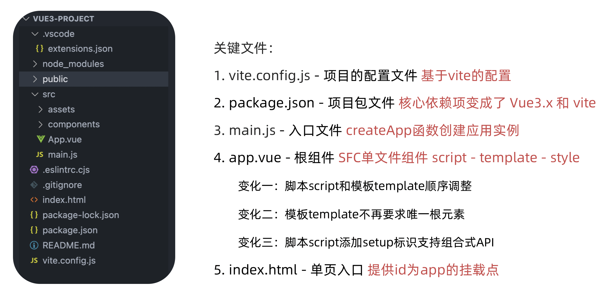
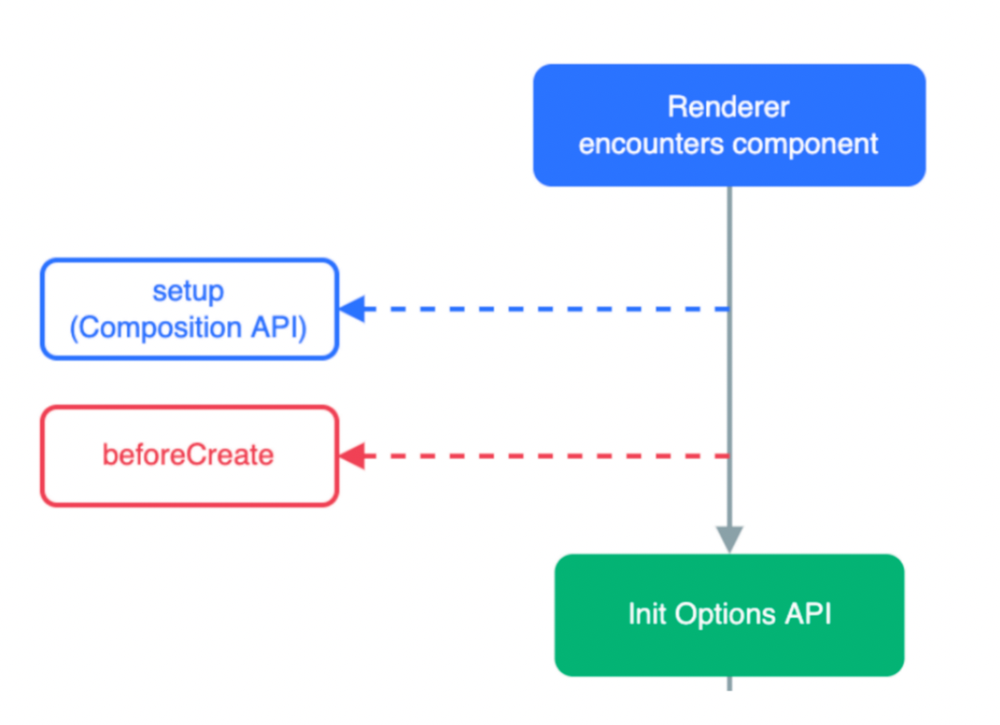

# Vue3

## 组合式 API

- Vue2：选项式 API

```vue
<script>
export default {
  data(){
    return {
      count:0
    }
  },
  methods:{
    addCount(){
      this.count++
    }
  }
}
</script>
```

- Vue3：组合式 API

```vue
<script setup>
import { ref } from 'vue'
const count = ref(0)
const addCount = ()=> count.value++
</script>
```

特点：

1. 代码量变少
2. 分散式维护变成集中式维护

## create-vue

create-vue 是 Vue 官方新的脚手架工具，底层切换到了 vite （下一代前端工具链）。


## 项目结构



## setup 选项

### 语法

```vue
<script>
  export default {
    setup(){
      
    },
    beforeCreate(){
      
    }
  }
</script>
```

在setup函数中写的数据和方法需要在末尾以对象的方式return，才能给模版使用：

```vue
<script>
  export default {
    setup(){
      const message = 'this is message'
      const logMessage = ()=>{
        console.log(message)
      }
      // 必须return才可以
      return {
        message,
        logMessage
      }
    }
  }
</script>
```

语法糖：在script标签添加 setup标记，不需要再写导出语句，默认会添加导出语句

```vue
<script setup>
  const message = 'this is message'
  const logMessage = ()=>{
    console.log(message)
  }
</script>
```

### 执行时机

会在 beforeCreate 钩子之前执行：



## reactive 和 ref 函数

reactive：

接受对象类型数据的参数传入并返回一个响应式的对象


```vue
<script setup>
 // 导入
 import { reactive } from 'vue'
 // 执行函数 传入参数 变量接收
 const state = reactive({
   msg:'this is msg'
 })
 const setSate = ()=>{
   // 修改数据更新视图
   state.msg = 'this is new msg'
 }
</script>

<template>
  {{ state.msg }}
  <button @click="setState">change msg</button>
</template>
```

ref：

接收简单类型或者对象类型的数据传入并返回一个响应式的对象

```vue
<script setup>
 // 导入
 import { ref } from 'vue'
 // 执行函数 传入参数 变量接收
 const count = ref(0)
 const setCount = ()=>{
   // 修改数据更新视图必须加上.value
   count.value++
 }
</script>

<template>
  <button @click="setCount">{{count}}</button>
</template>
```

reactive 对比 ref：

1. 都是用来生成响应式数据
2. 不同点
	1. reactive不能处理简单类型的数据
	2. ref参数类型支持更好，但是必须通过.value做访问修改
	3. ref函数内部的实现依赖于reactive函数
3. 在实际工作中的推荐
	1. 推荐使用ref函数，减少记忆负担

## computed

计算属性基本思想和Vue2保持一致，组合式API下的计算属性只是修改了API写法

```vue
<script setup>
// 导入
import {ref, computed } from 'vue'
// 原始数据
const count = ref(0)
// 计算属性
const doubleCount = computed(()=>count.value * 2)

// 原始数据
const list = ref([1,2,3,4,5,6,7,8])
// 计算属性list
const filterList = computed(item=>item > 2)
</script>
```

## watch

侦听一个或者多个数据的变化，数据变化时执行回调函数，俩个额外参数 immediate控制立刻执行，deep开启深度侦听

### 侦听单个数据

```vue
<script setup>
  // 1. 导入watch
  import { ref, watch } from 'vue'
  const count = ref(0)
  // 2. 调用watch 侦听变化
  watch(count, (newValue, oldValue)=>{
    console.log(`count发生了变化，老值为${oldValue},新值为${newValue}`)
  })
</script>
```

### 侦听多个数据

侦听多个数据，第一个参数可以改写成数组的写法

```vue
<script setup>
  // 1. 导入watch
  import { ref, watch } from 'vue'
  const count = ref(0)
  const name = ref('cp')
  // 2. 调用watch 侦听变化
  watch([count, name], ([newCount, newName],[oldCount,oldName])=>{
    console.log(`count或者name变化了，[newCount, newName],[oldCount,oldName])
  })
</script>
```

### immediate

在侦听器创建时立即出发回调，响应式数据变化之后继续执行回调


```vue
<script setup>
  // 1. 导入watch
  import { ref, watch } from 'vue'
  const count = ref(0)
  // 2. 调用watch 侦听变化
  watch(count, (newValue, oldValue)=>{
    console.log(`count发生了变化，老值为${oldValue},新值为${newValue}`)
  },{
    immediate: true
  })
</script>
```

### deep

通过watch监听的ref对象默认是浅层侦听的，直接修改嵌套的对象属性不会触发回调执行，需要开启deep

```vue
<script setup>
  // 1. 导入watch
  import { ref, watch } from 'vue'
  const state = ref({ count: 0 })
  // 2. 监听对象state
  watch(state, ()=>{
    console.log('数据变化了')
  })
  const changeStateByCount = ()=>{
    // 直接修改不会引发回调执行
    state.value.count++
  }
</script>

<script setup>
  // 1. 导入watch
  import { ref, watch } from 'vue'
  const state = ref({ count: 0 })
  // 2. 监听对象state 并开启deep
  watch(state, ()=>{
    console.log('数据变化了')
  },{deep:true})
  const changeStateByCount = ()=>{
    // 此时修改可以触发回调
    state.value.count++
  }
</script>

```

## 生命周期函数

### 选项式对比组合式


### 基本使用

1. 导入生命周期函数
2. 执行生命周期函数，传入回调

```vue
<scirpt setup>
import { onMounted } from 'vue'
onMounted(()=>{
  // 自定义逻辑
})
</script>
```

### 执行多次

生命周期函数执行多次的时候，会按照顺序依次执行

```vue
<scirpt setup>
import { onMounted } from 'vue'
onMounted(()=>{
  // 自定义逻辑
})

onMounted(()=>{
  // 自定义逻辑
})
</script>
```

## 父子通信

### 父传子

基本思想

1. 父组件中给子组件绑定属性
2. 子组件内部通过props选项接收数据


### 子传父

基本思想

1. 父组件中给子组件标签通过@绑定事件
2. 子组件内部通过 emit 方法触发事件


## 模版引用

概念：通过 ref 标识 获取真实的 dom 对象或者组件实例对象

### 基本使用

实现步骤：

1. 调用ref函数生成一个ref对象
2. 通过ref标识绑定ref对象到标签


### defineExpose

默认情况下在 `<script setup>` 语法糖下组件内部的属性和方法是不开放给父组件访问的，可以通过 defineExpose 编译宏指定哪些属性和方法容许访问。

示例：（指定testMessage属性可以被访问到）


## provide 和 inject

### 作用和场景

顶层组件向任意的底层组件传递数据和方法，实现跨层组件通信


### 跨层传递普通数据

> 实现步骤
>
> 1. 顶层组件通过 `provide` 函数提供数据
> 2. 底层组件通过 `inject` 函数提供数据


### 跨层传递响应式数据

> 在调用provide函数时，第二个参数设置为ref对象


### 跨层传递方法

顶层组件可以向底层组件传递方法，底层组件调用方法修改顶层组件的数据


