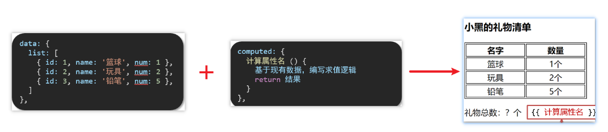
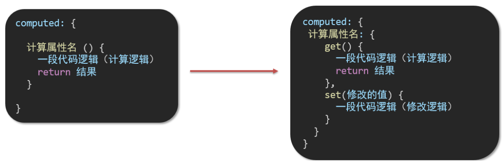
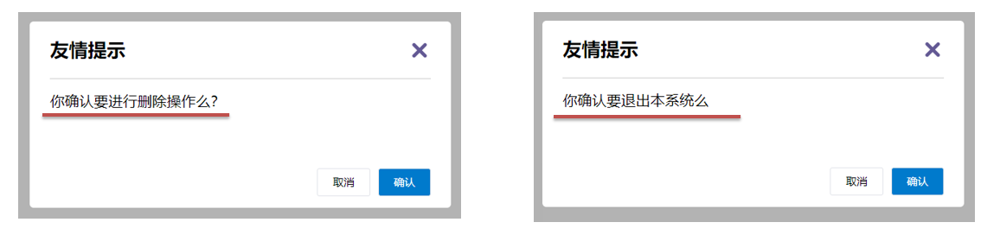
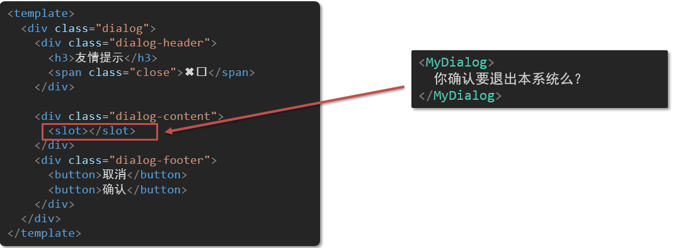
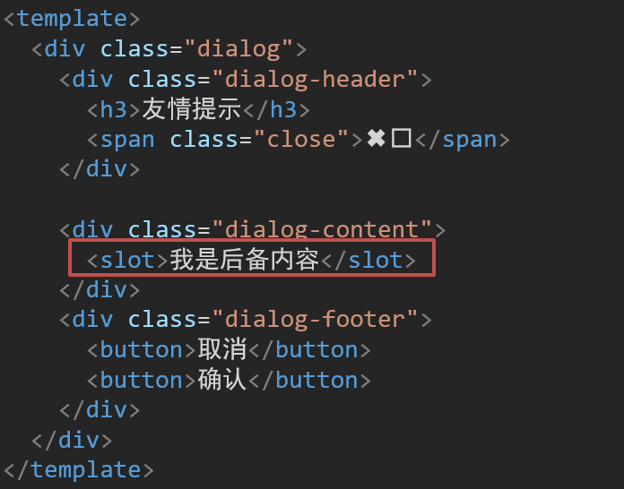
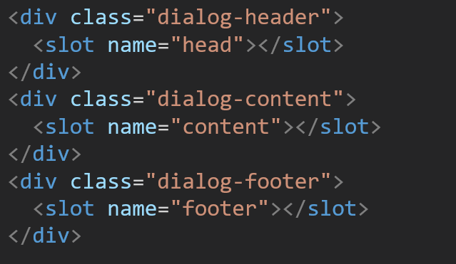
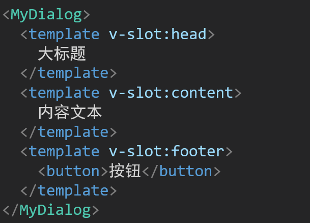

# 基本用法

## Vue 对象

```html
<!DOCTYPE html>
<html lang="en">
<head>
    <meta charset="UTF-8">
    <meta http-equiv="X-UA-Compatible" content="IE=edge">
    <meta name="viewport" content="width=device-width, initial-scale=1.0">
    <title>Vue-快速入门</title>
    
    // vue.js -> vue 的独立文件用法，使用简单的项目
    <script src="js/vue.js"></script>
</head>
<body>

    <div id="app">
        <input type="text" v-model="message">
        {{message}}
    </div>

</body>
<script>
    // 定义Vue对象
    new Vue({
        el: "#app", // vue 接管区域
        data:{
            message: "Hello Vue"
        }
    })
</script>
</html>
```

实例自身的数据和方法可以通过 this 这个指针引用。

## Vue 指令

### 基本指令

vue 中的指令按照不同的用途可以分为如下 6 大类：

- 内容渲染指令（v-text、v-html）

	-  v-text
		-  使用语法：`<p v-text="uname">hello</p>`，意思是将 uame 值渲染到 p 标签中
		-  类似 innerText，使用该语法，会覆盖 p 标签原有内容
	-  v-html
		-  使用语法：`<p v-html="intro">hello</p>`，意思是将 intro 值渲染到 p 标签中
		-  类似 innerHTML，使用该语法，会覆盖 p 标签原有内容
		-  类似 innerHTML，使用该语法，能够将 HTML 标签的样式呈现出来。

- 条件渲染指令（v-show、v-if、v-else、v-else-if）

	-  v-show

		- 条件为真时展示某元素，区别在于切换的是 display 属性的值。（false 导致有元素，只是 `display: none`）
		- 适合频繁切换显示隐藏的场景。
	-  v-if、v-else、v-else-if

		- 条件性的渲染某元素，判定为 true 时渲染，否则不渲染。（false 导致无元素）
		- 适合要么显示，要么隐藏，不频繁切换的场景。

- 事件绑定指令（v-on）

	为 HTML 标签绑定事件。

	- 可以指定一个表达式。（表达式可修改数据，如`count++`）
	- 也可以指定一个函数。（函数都写在 methods 中，methods 中的函数内部的 this 都指向 Vue 实例）

- 属性绑定指令 （v-bind）

	为 HTML 标签绑定属性值，如设置  href , css 样式等。

	- 数据发生变化，标签的属性值也会发生变化。

- 双向绑定指令（v-model）

  在表单元素上创建双向数据绑定。

  - 视图随数据变化，数据也可被视图产生变化，所以双向绑定一定是使用在表单项标签上的（获取视图提交的数据）。

```
v-model 会根据控件类型自动选取正确的方法来关联对应的值：

输入框  input:text   ——> value
文本域  textarea	 ——> value
复选框  input:checkbox  ——> checked
单选框  input:radio   ——> checked
下拉菜单 select    ——> value
...
```

- 列表渲染指令（v-for）

  列表渲染。

  - 可遍历容器的元素。
  - 可遍历对象的属性。
  - key 用法。

演示：

```html
Vue 指令（指令字符串）只能表示以下内容：
- JS 表达式
- 变量（本质上也是表达式）
- 函数（本质上也是表达式）


<a v-bind:href="url">链接1</a>
v-bind 可简写为 【:】
<a :href="url">链接2</a>


js 绑定函数：
<input onclick="handle()">

vue 绑定函数：（事件名没有 on）
<input v-on:click="handle()">
 methods: {
        handle: function(){
           alert("你点我了一下...");
        }
}

v-on 可简写为 @
<input type="button" value="点我一下" @click="handle()">


v-for
<标签 v-for="变量名 in 集合模型数据">
    {{变量名}}
</标签>

v-for 使用索引
<标签 v-for="(变量名,索引变量) in 集合模型数据">
   {{索引变量}} {{变量名}}
</标签>

遍历对象：
<div v-for="(value, key, index) in object">{{value}}</div>
value:对象中的值
key:对象中的键
index:遍历索引从0开始

遍历数字：
<p v-for="item in 10">{{item}}</p>
item从1 开始
```

事件参数：

```js
只传递默认参数:
<input @click="handle">
使用默认参数：
function handle(e) {
    console.log(e)
}


传递自定义参数:
<input @click="handle(a, b, c)">
使用自定义参数：
function handle(a, b, c) {
    console.log(a, b, c)
}


传递默认参数和自定义参数:（只能是 $event ）
<input @click="handle($event, a, b)">
使用默认参数和自定义参数：
function handle(e, a, b) {
    console.log(e, a, b)
}
```

v-for 的 key：

- 给列表项添加**唯一标识**，便于 Vue 对其排序复用。

实例代码：

```js
<ul>
  <li v-for="(item, index) in booksList" :key="item.id">
    <span>{{ item.name }}</span>
    <span>{{ item.author }}</span>
    <button @click="del(item.id)">删除</button>
  </li>
</ul>
```

注意：

1.  key 的值只能是字符串 或 数字类型
2.  key 的值必须具有唯一性
3.  一般应使用数据的 id 作为 key（唯一），不推荐使用 index 作为 key（会变化，不对应）

### 指令修饰符

v-model 修饰符：

```
v-model.trim  —> 去除首位空格
v-model.number —> 转数字
等
```

事件修饰符：

- @事件名.动作时机 —> 在指定动作时机调用函数
- @事件名.stop —> 阻止冒泡
- @事件名.prevent  —>阻止默认行为，并指定行为
- @事件名.stop.prevent —>可以连用 即阻止事件冒泡也阻止默认行为

### v-bind 对样式控制的增强

#### 操作 class

##### 绑定对象

键指定类名（class 样式类），值指定布尔值，如果值是 true，就有这个类，否则没有这个类。

```html
<div :class="{ 类名1: 布尔值, 类名2: 布尔值 }"></div>
```

适用场景：一个类名，来回切换。

##### 绑定数组

数组中所有的类，都会添加到盒子上，本质就是一个 class 列表。

```html
<div :class="[ 类名1, 类名2, 类名3 ]"></div>
```

使用场景：批量添加或删除类。

##### 示例

```html
<!DOCTYPE html>
<html lang="en">
<head>
  <meta charset="UTF-8">
  <meta http-equiv="X-UA-Compatible" content="IE=edge">
  <meta name="viewport" content="width=device-width, initial-scale=1.0">
  <title>Document</title>
  <style>
    * {
      margin: 0;
      padding: 0;
    }
    ul {
      display: flex;
      border-bottom: 2px solid #e01222;
      padding: 0 10px;
    }
    li {
      width: 100px;
      height: 50px;
      line-height: 50px;
      list-style: none;
      text-align: center;
    }
    li a {
      display: block;
      text-decoration: none;
      font-weight: bold;
      color: #333333;
    }
    li a.active {
      background-color: #e01222;
      color: #fff;
    }

  </style>
</head>
<body>

  <div id="app">
    <ul>
      <li v-for="(item, index) in list" :key="item.id" @click="activeIndex = index">
        <a :class="{ active: index === activeIndex }" href="#">{{ item.name }}</a>
      </li>
    </ul>
  </div>
  <script src="https://cdn.jsdelivr.net/npm/vue@3/dist/vue.js"></script>
  <script>
    const app = new Vue({
      el: '#app',
      data: {
        activeIndex: 2, // 记录高亮
        list: [
          { id: 1, name: '京东秒杀' },
          { id: 2, name: '每日特价' },
          { id: 3, name: '品类秒杀' }
        ]
      }
    })
  </script>
</body>
</html>
```

#### 操作 style

可以对样式进行更精细的控制。

语法：

```html
<div :style="{ CSS属性名1: CSS属性值, CSS属性名2: CSS属性值 }"></div>
```

##### 示例

```html
<!DOCTYPE html>
<html lang="en">
<head>
  <meta charset="UTF-8">
  <meta http-equiv="X-UA-Compatible" content="IE=edge">
  <meta name="viewport" content="width=device-width, initial-scale=1.0">
  <title>Document</title>
  <style>
    .progress {
      height: 25px;
      width: 400px;
      border-radius: 15px;
      background-color: #272425;
      border: 3px solid #272425;
      box-sizing: border-box;
      margin-bottom: 30px;
    }
    .inner {
      width: 50%;
      height: 20px;
      border-radius: 10px;
      text-align: right;
      position: relative;
      background-color: #409eff;
      background-size: 20px 20px;
      box-sizing: border-box;
      transition: all 1s;
    }
    .inner span {
      position: absolute;
      right: -20px;
      bottom: -25px;
    }
  </style>
</head>
<body>
  <div id="app">
    <!-- 外层盒子底色 （黑色） -->
    <div class="progress">
      <!-- 内层盒子 - 进度（蓝色） -->
      <div class="inner" :style="{ width: percent + '%' }">
        <span>{{ percent }}%</span>
      </div>
    </div>
    <button @click="percent = 25">设置25%</button>
    <button @click="percent = 50">设置50%</button>
    <button @click="percent = 75">设置75%</button>
    <button @click="percent = 100">设置100%</button>
  </div>
  <script src="https://cdn.jsdelivr.net/npm/vue@2/dist/vue.js"></script>
  <script>
    const app = new Vue({
      el: '#app',
      data: {
        percent: 30
      }
    })
  </script>
</body>
</html>
```

## computed 计算属性

- 在 computed 配置项中声明。
- 使用起来和普通属性一样使用  {{ 计算属性名}}  
- computed 中计算属性内部的 this 依然指向的是 Vue 实例。



### 对比

- computed 计算属性

	封装了一段对于**数据**的处理，求得一个**结果**。

	- 作为属性，直接使用

		- js中使用计算属性： this.计算属性

		- 模板中使用计算属性：{{计算属性}}

	- 计算属性会对计算出来的结果缓存，再次使用直接读取缓存。

	- 依赖项变化了，会自动重新计算，并再次缓存。

- methods

	给 Vue 实例提供一个**方法**，调用以**处理业务逻辑**。

	- 作为方法调用

		- js中调用：this.方法名()

		- 模板中调用 {{方法名()}}  或者 @事件名=“方法名”

	- 没有缓存特性

### 完整写法

1. 计算属性默认的简写，只能读取访问，不能 "修改"
2. 如果要 "修改"，需要写计算属性的完整写法



示例：

```html
<!DOCTYPE html>
<html lang="en">
<head>
  <meta charset="UTF-8">
  <meta http-equiv="X-UA-Compatible" content="IE=edge">
  <meta name="viewport" content="width=device-width, initial-scale=1.0">
  <title>Document</title>
  <style>
    input {
      width: 30px;
    }
  </style>
</head>
<body>

  <div id="app">
    姓：<input type="text" v-model="firstName"> +
    名：<input type="text" v-model="lastName"> =
    <span>{{ fullName }}</span><br><br>
    
    <button @click="changeName">改名卡</button>
  </div>
  <script src="https://cdn.jsdelivr.net/npm/vue@2/dist/vue.js"></script>
  <script>
    const app = new Vue({
      el: '#app',
      data: {
        firstName: '刘',
        lastName: '备',
      },
      methods: {
        changeName () {
          this.fullName = '黄忠'
        }
      },
      computed: {
        // 简写 → 获取，没有配置设置的逻辑
        // fullName () {
        //   return this.firstName + this.lastName
        // }

        // 完整写法 → 获取 + 设置
        fullName: {
          // (1) 当fullName计算属性，被获取求值时，执行get（有缓存，优先读缓存）
          //     会将返回值作为，求值的结果
          get () {
            return this.firstName + this.lastName
          },
          // (2) 当fullName计算属性，被修改赋值时，执行set
          //     修改的值，传递给set方法的形参
          set (value) {
            // console.log(value.slice(0, 1))          
            // console.log(value.slice(1))         
            this.firstName = value.slice(0, 1)
            this.lastName = value.slice(1)
          }
        }
      }
    })
  </script>
</body>
</html>
```

## watch 侦听器（监视器）

监视数据变化，在数据变换时，执行一些业务逻辑或异步操作。

语法：

- 简单写法： 简单类型数据直接监视
- 完整写法：添加额外配置项
	- deep: true 对对象的属性进行深度监听
	- immdiate: true 初始化 立刻执行一次

1.简单写法

```js
watch: {
  数据属性名 (newValue, oldValue) {
    一些业务逻辑 或 异步操作。 
  },
  '对象.属性名' (newValue, oldValue) {
    一些业务逻辑 或 异步操作。 
  }
}
```

2.完整写法

```js
watch: {// watch 完整写法
  数据属性名: {
    deep: true, // 深度监视(针对复杂类型)
    immediate: true, // 是否立刻执行一次handler
    handler (newValue) {
      console.log(newValue)
    }
  }
}
```

如果如果监测对象中每个属性的变化，性能开销会比较大。

可以使用字符串指定监听的属性：

```js
data:{
    obj:{
      a:1
    }
},
watch:{
    'obj.a':{
      handler(newName,oldName){
          //执行代码
      },
      deep:true //为true，表示深度监听，这时候就能监测到a值变化
    }
}
```

示例：

```html
<!DOCTYPE html>
<html lang="en">
  <head>
    <meta charset="UTF-8" />
    <meta http-equiv="X-UA-Compatible" content="IE=edge" />
    <meta name="viewport" content="width=device-width, initial-scale=1.0" />
    <title>Document</title>
    <style>
      * {
        margin: 0;
        padding: 0;
        box-sizing: border-box;
        font-size: 18px;
      }
      #app {
        padding: 10px 20px;
      }
      .query {
        margin: 10px 0;
      }
      .box {
        display: flex;
      }
      textarea {
        width: 300px;
        height: 160px;
        font-size: 18px;
        border: 1px solid #dedede;
        outline: none;
        resize: none;
        padding: 10px;
      }
      textarea:hover {
        border: 1px solid #1589f5;
      }
      .transbox {
        width: 300px;
        height: 160px;
        background-color: #f0f0f0;
        padding: 10px;
        border: none;
      }
      .tip-box {
        width: 300px;
        height: 25px;
        line-height: 25px;
        display: flex;
      }
      .tip-box span {
        flex: 1;
        text-align: center;
      }
      .query span {
        font-size: 18px;
      }

      .input-wrap {
        position: relative;
      }
      .input-wrap span {
        position: absolute;
        right: 15px;
        bottom: 15px;
        font-size: 12px;
      }
      .input-wrap i {
        font-size: 20px;
        font-style: normal;
      }
    </style>
  </head>
  <body>
    <div id="app">
      <!-- 条件选择框 -->
      <div class="query">
        <span>翻译成的语言：</span>
        <select>
          <option value="italy">意大利</option>
          <option value="english">英语</option>
          <option value="german">德语</option>
        </select>
      </div>

      <!-- 翻译框 -->
      <div class="box">
        <div class="input-wrap">
          <textarea v-model="obj.words"></textarea>
          <span><i>⌨️</i>文档翻译</span>
        </div>
        <div class="output-wrap">
          <div class="transbox">{{ result }}</div>
        </div>
      </div>
    </div>
    <script src="https://cdn.jsdelivr.net/npm/vue@2/dist/vue.js"></script>
    <script src="https://cdn.jsdelivr.net/npm/axios/dist/axios.min.js"></script>
    <script>
      // 接口地址：https://applet-base-api-t.itheima.net/api/translate
      // 请求方式：get
      // 请求参数：
      // （1）words：需要被翻译的文本（必传）
      // （2）lang： 需要被翻译成的语言（可选）默认值-意大利
      // -----------------------------------------------
      
      const app = new Vue({
        el: '#app',
        data: {
          // words: ''
          obj: {
            words: ''
          },
          result: '', // 翻译结果
          // timer: null // 延时器id
        },
        // 具体讲解：(1) watch语法 (2) 具体业务实现
        watch: {
          // 该方法会在数据变化时调用执行
          // newValue新值, oldValue老值（一般不用）
          // words (newValue) {
          //   console.log('变化了', newValue)
          // }

          'obj.words' (newValue) {
            // console.log('变化了', newValue)
            // 防抖: 延迟执行 → 干啥事先等一等，延迟一会，一段时间内没有再次触发，才执行
            clearTimeout(this.timer)
            this.timer = setTimeout(async () => {
              const res = await axios({
                url: 'https://applet-base-api-t.itheima.net/api/translate',
                params: {
                  words: newValue
                }
              })
              this.result = res.data.data
              console.log(res.data.data)
            }, 300)
          }
        }
      })
    </script>
  </body>
</html>
```

## 自定义指令

自定义指令可以封装一些 DOM 操作，扩展额外的功能。

### 基本使用

- 全局注册

	```js
	//在main.js中
	Vue.directive('指令名', {
	  "inserted" (el) {
	    // 可以对 el 标签，扩展额外功能
	    el.focus()
	  }
	})
	```

- 局部注册

	```vue
	//在Vue组件的配置项中
	directives: {
	  指令名: {
	    inserted () {
	      // 可以对 el 标签，扩展额外功能
	      el.focus()
	    }
	  }
	}
	```

其中：

- inserted 是被指令绑定的元素插入父节点时调用的钩子函数。
- el 指代被自定义指令 inserted 的 DOM 元素。

注意：

- 一定要先注册，再使用。
- 注册指令时不用加 v- 前缀，但使用时一定要加 v- 前缀

### 传值

1. 可以用等号为指令绑定参数值。

```html
<div v-color="color">我是内容</div>
```

2. 通过 binding.value 可以拿到指令值

```js
directives: {
  color: {
     // inserted：指令所在元素被插入 DOM 树时触发。
    inserted (el, binding) {
      el.style.color = binding.value
    },
        
     // update：指令值（的数据）被修改时触发
    update (el, binding) {
	  console.log('指令的值修改了');
      el.style.color = binding.value
    }
  }
}
```

## 插槽

插槽让组件内部的一些结构支持自定义。

### 默认插槽

1. 组件内需要定制的结构部分，改用 `<slot></slot>`占位。（默认插槽只在一处使用 `<slot> </slot>`）
2. 使用组件时, 在标签内部传入结构，即可替换组件内部的 slot 。
3. 给插槽传入内容时，可以传入：纯文本、html标签、组件。

示例：



替换其中的显示内容：



### 默认值

封装组件时，可以为 `<slot>` 插槽提供默认内容（也叫后备内容）。

在 slot 标签内，放置内容，即可作为默认显示内容：（在外部传入内容时，默认内容会被替换）



### 具名插槽

需要多个 slot 位置时，可以为 slot 命名。

1. 使用 name 属性区分



2. template 配合 `v-slot:插槽名`来分发对应标签



### 简写

v-slot 命令可简写为 `#` 。

### 作用域插槽

作用域插槽就是带参数的插槽。

以一个表格列表为例：

MyTable.vue

```vue
<template>
  <table class="my-table">
    <thead>
      <tr>
        <th>序号</th>
        <th>姓名</th>
        <th>年纪</th>
        <th>操作</th>
      </tr>
    </thead>
    <tbody>
      <tr v-for="(item, index) in data" :key="item.id">
        <td>{{ index + 1 }}</td>
        <td>{{ item.name }}</td>
        <td>{{ item.age }}</td>
        <td>
          <!-- 给 slot 标签，添加属性 -->
          <slot :row="item" msg="测试文本"></slot>

          <!-- 所有的属性，都在一个对象中 -->
          <!-- 
             {
               row: { id: 2, name: '孙大明', age: 19 },
               msg: '测试文本'
             }
           -->
        </td>
      </tr>
    </tbody>
  </table>
</template>

<script>
export default {
  props: {
    data: Array
  }
}
</script>

<style scoped>
.my-table {
  width: 450px;
  text-align: center;
  border: 1px solid #ccc;
  font-size: 24px;
  margin: 30px auto;
}
.my-table thead {
  background-color: #1f74ff;
  color: #fff;
}
.my-table thead th {
  font-weight: normal;
}
.my-table thead tr {
  line-height: 40px;
}
.my-table th,
.my-table td {
  border-bottom: 1px solid #ccc;
  border-right: 1px solid #ccc;
}
.my-table td:last-child {
  border-right: none;
}
.my-table tr:last-child td {
  border-bottom: none;
}
.my-table button {
  width: 65px;
  height: 35px;
  font-size: 18px;
  border: 1px solid #ccc;
  outline: none;
  border-radius: 3px;
  cursor: pointer;
  background-color: #ffffff;
  margin-left: 5px;
}
</style>
```

App.vue

```vue
<template>
  <div>
    <MyTable :data="list">
      <!-- 通过 template #插槽名="变量名" 传递数据 -->
      <template #default="obj">
        <button @click="del(obj.row.id)">
          删除
        </button>
      </template>
    </MyTable>
    
    <MyTable :data="list2">
      <template #default="{ row }">
        <button @click="show(row)">查看</button>
      </template>
    </MyTable>
  </div>
</template>

<script>
import MyTable from './components/MyTable.vue'
export default {
  data () {
    return {
      list: [
        { id: 1, name: '张小花', age: 18 },
        { id: 2, name: '孙大明', age: 19 },
        { id: 3, name: '刘德忠', age: 17 },
      ],
      list2: [
        { id: 1, name: '赵小云', age: 18 },
        { id: 2, name: '刘蓓蓓', age: 19 },
        { id: 3, name: '姜肖泰', age: 17 },
      ]
    }
  },
  methods: {
    del (id) {
      this.list = this.list.filter(item => item.id !== id)
    },
    show (row) {
      // console.log(row);
      alert(`姓名：${row.name}; 年纪：${row.age}`)
    }
  },
  components: {
    MyTable
  }
}
</script>

```

其中：

- 子组件中，给 slot 标签添加属性

```vue
<slot :row="item" msg="测试文本"></slot>
```

- 所有添加的属性的值，是一个整体的对象

```vue
{
	row: { id: 2, name: '孙大明', age: 19 },
	msg: '测试文本'
}
```

- 父组件中，在 template 中可以使用子组件获取到的数据，通过 ` #插槽名="obj"` 获取（默认插槽名为 default）

```vue
<MyTable :data="list">
	
    <!-- 传入插槽的内容，开始 -->
  <template #default="obj">
    <button @click="del(obj.id)">删除</button>
  </template>
    <!-- 传入插槽的内容，结束 -->
    
</MyTable>
```

解释：

- 在父组件中，为子组件的 data 属性，绑定了父组件的 list 数据，该数据的作用域被传递到子组件中，在子组件的 `<template>` 中可以直接使用 `data` 。（比如在 for 语句中使用）
- "obj" 也可以使用其它名称，它指代子组件中该 slot 对应数据对象（slot 绑定的属性）。
- 如果只想获取数据对象中的部分字段，比如 `name` 属性，需要使用中括号表示一个对象： `#default="{ name }"` 

