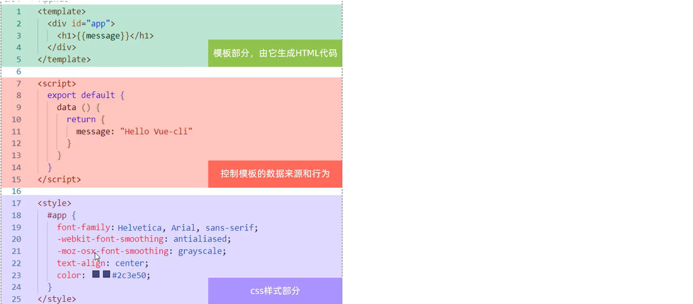

# 工程化与组件化

## 前端开发模式

- 传统开发模式

	基于html / css / js 文件，直接引入核心包，开发 Vue 项目。

- 工程化开发模式

	基于构建工具（例如：webpack）的环境中开发 Vue 项目。

	- 提高编码效率，比如使用JS新语法、Less/Sass、Typescript等通过webpack都可以编译成浏览器识别的ES3/ES5/CSS等


工程化开发的问题：

- webpack 配置繁琐
- 缺乏统一的标准

## 脚手架 Vue CLI

脚手架 Vue CLI 是 Vue 官方提供的一个全局命令工具。

可以帮助我们快速创建一个开发 Vue 项目的标准化项目结构。【集成了webpack配置】

```
创建项目结构：
vue create project-name (项目名不能使用中文)

启动项目：
yarn serve
或者
npm run serve(命令不固定，可在 package.json 中指定)

打包项目
npm run build
会在工程目录下生成一个 dist 目录，用于存放需要发布的前端资源。
```

## 组件


组件由三部分构成

- template：结构 （有且只能一个根元素）
- script:   js逻辑 
- style： 样式 (可支持less，需要装包)

组件可当成 html 标签使用 `<组件名></组件名>`

组件名规范：大驼峰命名法， 如 HmHeader 。

### 局部注册

- 只能在注册的组件内使用。
- 在组件文件中注册。

示例：

```js
// 导入需要注册的组件
import 组件对象 from '.vue文件路径'
import HmHeader from './components/HmHeader'

export default {  // 局部注册
  components: {
   '组件名': 组件对象,
    HmHeader:HmHeaer,
    HmHeader
  }
}
```

### 全局注册

- 全局注册的组件，在项目的**任何组件**中都能使用。
- **main.js** 中进行全局注册。

示例：

Vue.component('组件名', 组件对象)

```js
// 导入需要全局注册的组件
import HmButton from './components/HmButton'
Vue.component('HmButton', HmButton)
```

### data 为什么必须是一个函数

一个组件的 **data** 选项必须**是一个函数**。

作用：保证每个组件实例，维护**独立**的一份**数据**对象。

每次创建新的组件实例，都会**执行一次data 函数**，得到一个新对象。

### 样式冲突

写在组件中的样式默认是全局样式，全局生效。

- 全局样式

	默认组件中的样式会作用到全局，任何一个组件中都会受到此样式的影响。

- 局部样式

	给组件的 style 加上 **scoped** 属性后，可以**让样式只作用于当前组件** 。

scoped 原理：

1. 当前组件内标签都被添加**data-v-hash值** 的属性 
2. css选择器都被添加 [**data-v-hash值**] 的属性选择器

最终效果: **必须是当前组件的元素**, 才会有这个自定义属性, 才会被这个样式作用到 


## 组件案例演示

这是删改后的 Vue2 的 HelloWorld 案例。

案例目录结构：

```
public
|	favicon.ico
|    index.html


src
│  App.vue
│  main.js
│
├─assets
│      logo.png
│
├─components
│      HelloWorld.vue
│
├─router
│      index.js
│
└─views
        AboutView.vue
        HomeView.vue
```

效果：


---


其中，点击 Home 和 About 后，会切换下方的视图。

### Vue 组件

### index.html

```html
<!DOCTYPE html>
<html lang="">
  <head>
    <meta charset="utf-8">
    <meta http-equiv="X-UA-Compatible" content="IE=edge">
    <meta name="viewport" content="width=device-width,initial-scale=1.0">
    <link rel="icon" href="<%= BASE_URL %>favicon.ico">
    <title><%= htmlWebpackPlugin.options.title %></title>
  </head>
  <body>
    <noscript>
      <strong>We're sorry but <%= htmlWebpackPlugin.options.title %> doesn't work properly without JavaScript enabled. Please enable it to continue.</strong>
    </noscript>
    <div id="app">
        
    </div>
    <!-- built files will be auto injected -->
  </body>
</html>
```

### 根组件

```html
<!-- App.vue -->

<template>
  <div id="app">
    <nav>
        <!-- 指定路由路径 -->
      <router-link to="/">Home</router-link> |
      <router-link to="/about">About</router-link>
    </nav>
      
    <router-view/>
      
  </div>
</template>

<style>
    
	<!-- css 代码 -->
    
</style>
```

其中，`<router-view/>` 是一个组件的替换容器，用于单页面应用的局部刷新。

本案例中，`<router-view/>` 会被替换为与路由匹配的组件：

- 当点击 Home 时，被替换为 HomeView 。
- 当点击 Home 时，被替换为 AboutView。

### main.js

挂载根组件：

```js
// main.js

import Vue from 'vue'

// 导入根组件
import App from './App.vue'

import router from './router'

Vue.config.productionTip = false

new Vue({
  router,
  render: h => h(App)
}).$mount('#app')   // 挂载根组件到 id=app 的 html 标签中（在 index.html 内）
```

### 组件基本结构

`.vue` 扩展名就是 vue 组件，如 `App.vue` 。



组件内的 template 和 style 负责该组件的视图表现，script 负责数据控制。

```html
<!-- HelloWorld.vue -->

<template>
  <div class="hello">
    <h1>{{ msg }}</h1>
  </div>
</template>


<script>
export default {
  name: 'HelloWorld',
    
  <!-- props 表示将这些数据作为标签属性 -->
  props: {
    msg: String
  }
  <!-- 也可使用 data () { return { 数据字典项 } } -->
}
</script>


<!-- Add "scoped" attribute to limit CSS to this component only -->
<style scoped>

	<!-- css 代码 -->
    
</style>
```

其中，`<style scoped> </style>` ，加上 `scoped` 用以隔离选择器，最终会自动生成不重名的元素属性。

### Vue 视图

可以在视图中使用组件，组件可以当做 HTML 标签使用：

```html

<!-- HomeView.vue -->

<template>
  <div class="home">
    
      
      <!-- 指定为 props 的数据可以按标签属性 msg 方式使用-->
    <HelloWorld msg="Welcome to Your Vue.js App"/>
      
  </div>
</template>

<script>
    
// 导入组件
// @ is an alias to /src
import HelloWorld from '@/components/HelloWorld.vue'

export default {
  name: 'HomeView',
    
    <!-- 将 HelloWorld 作为子组件 -->
  components: {
    HelloWorld
  }
}
</script>


<!-- AboutView.vue -->

<template>
  <div class="about">
    <h1>This is an about page</h1>
  </div>
</template>
```

组件当作标签使用时，名称的两种用法等价：

```html
<HelloWorld msg="Welcome to Your Vue.js App"/>
     
<hello-world msg="Welcome to Your Vue.js App"/>
```

### Vue 路由

控制视图切换。

```js

// index.js

import Vue from 'vue'
import VueRouter from 'vue-router'
import HomeView from '../views/HomeView.vue'   // 直接导入组件

Vue.use(VueRouter)

const routes = [
  {
    path: '/',
    name: 'home',
    component: HomeView
  },
  {
    path: '/about',
    name: 'about',
    // route level code-splitting
    // this generates a separate chunk (about.[hash].js) for this route
    // which is lazy-loaded when the route is visited.
    component: () => import(/* webpackChunkName: "about" */ '../views/AboutView.vue')   // 延迟导入组件
  }
]

const router = new VueRouter({
  routes
})

export default router
```

Vue 路由主要利用：

- VueRouter：路由器类，根据路由请求在路由视图中动态渲染选中的组件
- `<router-link>`：请求链接组件，浏览器会解析成 `<a>` 。
- `<router-view>`：动态视图组件，用来渲染展示与路由路径对应的组件 。

## 组件库

### Element-UI 基本用法

1. 建立组件文件：

```vue
<template>

</template>

<script>
export default {
    
}
</script>

<style>

</style>
```

2. 复制代码
	- 将组件 html 代码粘贴到 template 标签内。
	- 将组件 script 代码粘贴到 script 标签内。
	- 将组件 style 代码粘贴到 style 标签内。

3. 在根组件中导入并注册：

```vue
<template>
  <div id="app">
    {{message}}
      
      <!-- 使用 -->
    <ElementView></ElementView>
      
  </div>
</template>

<script>
    
// 导入组件
import ElementView from './views/Element/ElementView.vue'

export default {
    
    // 注册组件
  components:{ ElementView },
    
  data(){
    return {
      "message":"hello world"
    }
  }
}
</script>

<style>

</style>
```

绑定事件等更多操作可见官方文档。

## 部署

可以使用 Nginx 进行部署.

将 dist 目录替换 Nginx 的 html 目录，然后运行 Nginx ，访问默认 80 端口即可。

注意，使用 `start nginx` 启动服务，不要双击 `nginx.exe` 启动服务，否则 `nginx` 会退出不完全，在退出后仍可以访问（因为 nginx 有多个进程）。

```shell
# 启动 nginx
start nginx

# 终止 nginx
nginx.exe -s stop
```

