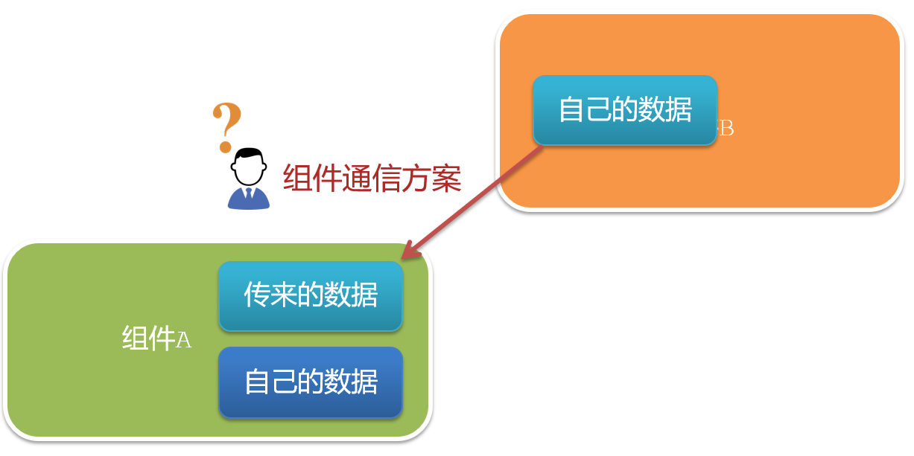
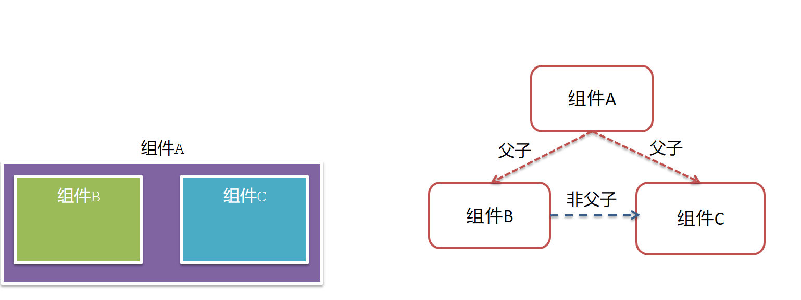
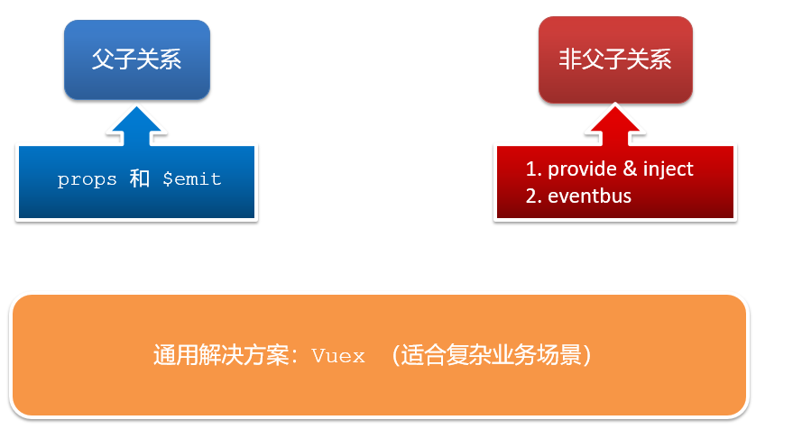
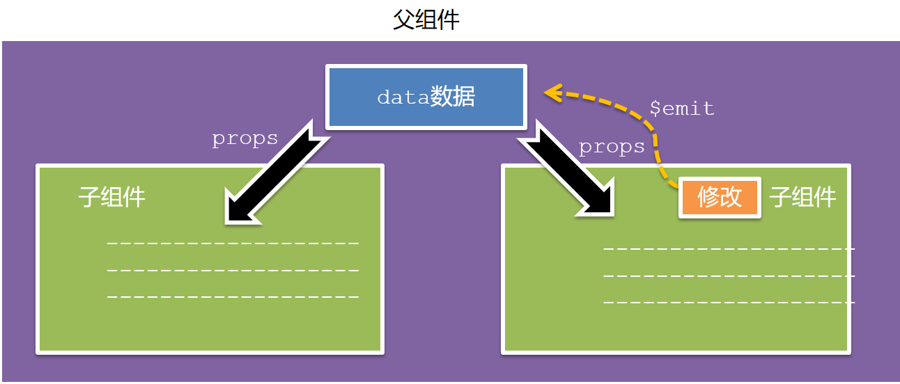
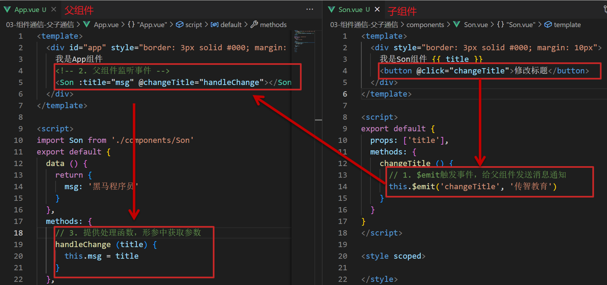
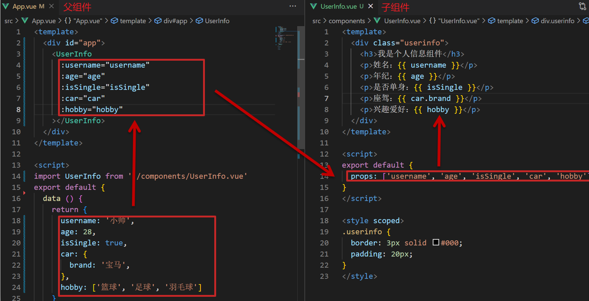
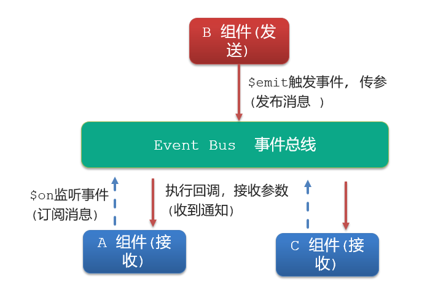
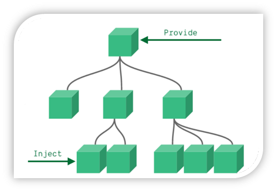
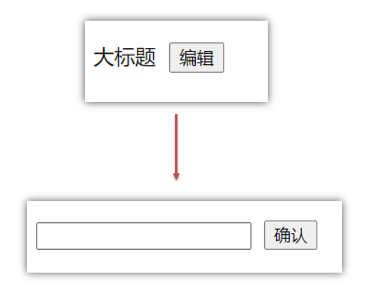

# 组件通信

组件通信，就是指**组件与组件**之间的**数据传递**

- 组件的数据是独立的，无法直接访问其他组件的数据。
- 想使用其他组件的数据，就需要组件通信



### 组件关系

- 父子关系
- 非父子关系



### 通信方案



注意：

- 父组件向子组件传递信息的最基本的通信方式就是通过 template 的元素传递信息。
- 一些情况下，同级兄弟组件可以通过父组件传递信息，比 eventBus 或 vuex 更方便。

### 父子通信

- 父组件通过 **props** 将数据传递给子组件
- 子组件利用 **$emit** 通知父组件修改更新



#### 父向子通信


父向子传值步骤

1. 给子组件以添加属性的方式传值
2. 子组件内部通过props接收
3. 模板中直接使用 props接收的值

#### 子向父通信



子向父传值步骤

1. $emit 触发事件，给父组件发送消息通知。（这个事件是子组件定义的方法，在父组件中可以事件的形式进行 @ 绑定）
2. 父组件监听 $emit 触发的事件
3. 提供处理函数，在函数的形参中获取传过来的参数

#### props 详解

props 就是组件上注册的自定义属性。

用于向子组件传递数据。

可以传递任意数量、任意类型的 prop 。



##### props 校验

可为组件的 prop 指定**验证要求**，不符合要求，控制台就会有**错误提示**  → 帮助开发者，快速发现错误。

语法如下：

```vue
props: {
  校验的属性名: {
    type: 类型,  // Number String Boolean ...
    required: true, // 是否必填
    default: 默认值, // 默认值
    validator (value) {
      // 自定义校验逻辑
      return 是否通过校验
    }
  }
},
```

注意：

- default 和 required 一般不同时写（因为当时必填项时，肯定有值）
- default 后面如果是简单类型的值，可以直接写默认。如果是复杂类型的值，则需要以函数的形式 return 一个默认值。

##### 对比

- data 的数据是**自己**的  →   随便改  
- prop 的数据是**外部**的  →   不能直接改，要遵循 **单向数据流**
	- 数据来源哪里，就是哪里负责更改数据。
	- 父级 props 的数据更新，会向下流动，影响子组件。这个数据流动是单向的

### 非父子通信

#### event bus 事件总线

非父子组件之间，进行简易消息传递。(复杂场景需要 Vuex)

注意，Vue3 不再提供`$on`与`$emit`函数，Vue 实例不再实现事件接口，官方推荐引入外部工具实现 event bus，或者自己写一个。

使用步骤：

1. 创建一个都能访问的事件总线 （空 Vue 实例）。

	```js
	// EventBus.js
	
	import Vue from 'vue'
	const Bus = new Vue()
	export default Bus
	```

2. A 组件（接收方），监听 Bus 的 sendMsg 事件。

	```vue
	created () {
	  Bus.$on('sendMsg', (msg) => {
	    this.msg = msg
	  })
	}
	```

3. B 组件（发送方），用 $emit 触发 Bus 的 sendMsg 事件并传递数据。

	```vue
	Bus.$emit('sendMsg', '这是一个消息')
	```

	

#### provide & inject

用于父组件向子孙组件传递数据。



1. 父组件 provide 提供数据

```js
export default {
  provide () {
    return {
       // 普通类型【非响应式】
       color: this.color, 
       // 复杂类型【响应式】
       userInfo: this.userInfo, 
    }
  }
}
```

2.子/孙组件 inject 获取数据

```js
export default {
  inject: ['color','userInfo'],
  created () {
    console.log(this.color, this.userInfo)
  }
}
```

注意：

- provide 提供的简单类型的数据不是响应式的，复杂类型数据是响应式。（推荐提供复杂类型数据）
- 子/孙组件通过 inject 获取的数据，不能在自身组件内修改。

## v-model 原理

v-model 本质上是一个语法糖。

例如应用在输入框上，就是 value 属性 和 input 事件 的合写：

```vue
<template>
  <div id="app" >
    <input v-model="msg" type="text">

    <input :value="msg" @input="msg = $event.target.value" type="text">
  </div>
</template>

```

其中，**$event** 用于在模板中，获取事件的形参。

## .sync 修饰符

可以实现 **子组件** 与 **父组件数据** 的 **双向绑定**，简化代码。（子组件可以修改父组件传过来的 props 值）

常用在封装弹框类的基础组件的 visible 属性， true 显示 false 隐藏。

.sync 修饰符是一个语法糖，就是 **:属性名** 和 **@update:属性名** 合写。

父组件

```vue
//.sync写法
<BaseDialog :visible.sync="isShow" />

--------------------------------------

//完整写法
<BaseDialog 
  :visible="isShow" 
  @update:visible="isShow = $event" 
/>
```

子组件

```vue
props: {
  visible: Boolean
},

this.$emit('update:visible', false)
```

## ref 和 $refs

- ref 
	- 可以创建一个 dom 元素或组件实例的引用。
	- 用在子组件上后，引用信息会被自动添加到父组件的 $refs 中。
- $refs
	- 是父组件中的一个对象。
	- 可以在父组件中用 $refs 获取 dom 元素 或 组件实例。
	- 在组件挂载（元素存在）后才能访问引用，因为初次渲染前该元素还不存在。

1.给要获取的元素（或子组件）添加ref属性

```html
<div ref="chartRef">我是渲染图表的容器</div>
```

2.获取时通过 $refs 获取  this.\$refs.chartRef 获取

```html
mounted () {
  console.log(this.$refs.chartRef)
}
```

## $nextTick

假设有如下需求：

编辑标题,  编辑框自动聚焦：

1. 点击编辑，显示编辑框
2. 让编辑框，立刻获取焦点



```vue
<template>
  <div class="app">
    <div v-if="isShowEdit">
      <input type="text" v-model="editValue" ref="inp" />
      <button>确认</button>
    </div>
    <div v-else>
      <span>{{ title }}</span>
      <button @click="editFn">编辑</button>
    </div>
  </div>
</template>

<script>
export default {
  data() {
    return {
      title: '大标题',
      isShowEdit: false,
      editValue: '',
    }
  },
  methods: {
    editFn() {
        // 显示输入框
        this.isShowEdit = true  
        // 获取焦点
        this.$refs.inp.focus() 
    }  },
}
</script> 
```

以上代码在"显示之后"，立刻获取焦点是不能成功的。

原因：Vue 是异步更新DOM  (提升性能)

- 可以使用 $nextTick

	数据变化后，在 DOM 更新完成后自动触发此方法里的函数体。

```js
this.$nextTick(() => {
  this.$refs.inp.focus()
})
```

注意：$nextTick 内的函数体 一定是箭头函数，这样才能让函数内部的 this 指向 Vue 实例。

