# Ensemble

（Ensemble Learning，集成学习）（Ensemble Method，集成方法）

## Bagging

bagging 的目的是综合多个 model 的结果，提高 model 的泛化性，降低 model 的方差。

一般当 model overfit 训练数据时，可以考虑使用 bagging 。

### 框架

对数据进行放回的采样，得到多个数据子集，特征子集。

使用这些子集训练多个 model ，然后聚合。

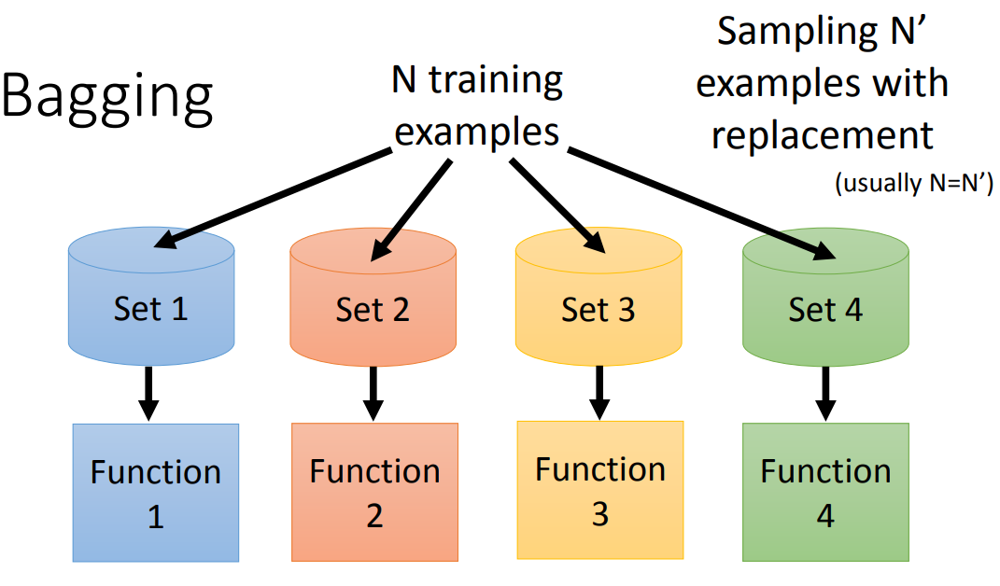

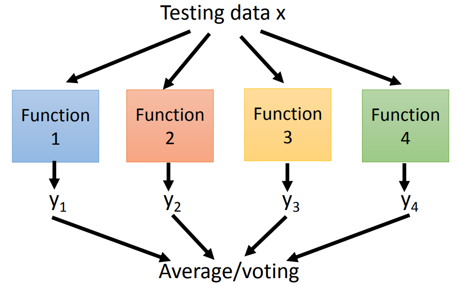

### 随机森林

以随机森林为例。

（Random Forest，RF）

DT 对数据非常敏感，容易 overfitting，导致泛化性不好。（NN 不容易 overfitting，往往问题会是做不到 overfitting）

RF 使用多棵 DT ，同时引入随机性以加强泛化性。

RF 就是多棵 DT 的 Bagging（Bagging = Bootstrap + Aggregating）。

RF 的训练：

- 采样多个数据子集，特征子集。（随机性所在）

	一般采用 Bootstrap 。

- 对每个子集训练一颗决策树。

- 对于分类问题，可采用投票决定最终类别。

	这个过程也称聚合（Aggregating）。

RF 只能让 DT 的决策边界更平滑，而不能提升 DT overfitting 的程度，当一定深度的 DT 不能 overfitting 某些数据时，小于等于该深度的 RF 也不能 overfitting 该数据。

## Boosting

boosting 级联多个较弱的 model 。

### 框架

以分类为例。

1. 找到分类器 $f_1$ 。

2. 找到另一个分类器 $f_2$ 。

	$f_2$ 不能和 $f_1$ 做一样的事，要有一定差异，才能互补劣势。

3. 继续找到新的分类器。

	每个新的分类器都基于前一个找到的分类器而找到。

如何得到不同的分类器？不同分类器可以由不同的数据集得到。

得到不同的数据集：

- Re-sampling（比如 Bagging 的 Boostrap 方法）

- Re-weighting

	为 sample 赋予权值。

	- Re-sampling 相当于权值只能为整数的 Re-weighting 。

Re-weighting 相当于在 Loss 函数的 $l$ 前乘上了系数 $u$ （每个 sample 一个 $u$）：

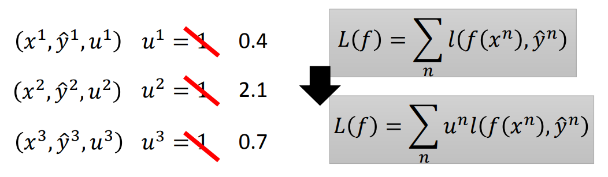

### Adaboost

Adaboost 是最经典的 boosting 方法：

#### idea

1. 先训练一个分类器 $f_1$ 。

2. 找到一组 $f_1$ 不能表现好的新的 training data 。

	- 设 $f_1$ 在 training data 上的错误率为 $\varepsilon_1$ ，二分类时，它应当 $\lt 0.5$ 。

		使用 $Z_1$ 对所有 $u$ 做 normalization，因为 $u$ 的总和不一定为 $1$ 。

	- 从 $u_1$ 改变到 $u_2$ ，使得 $f_1$ 在 $u_2$ 下错误率为 $0.5$（二分类时，$f_1$ 的表现在此时就相当于随机的结果）

	- $u_2$ 就是新的 training data 的权重。

1. 在新的 training data 上训练 $f_2$ 。

#### find new training data

想法：

- $f_1$ 预测错误的，就使它的 $u$ 变大。
- $f_1$ 预测正确的，就使它的 $u$ 变小。

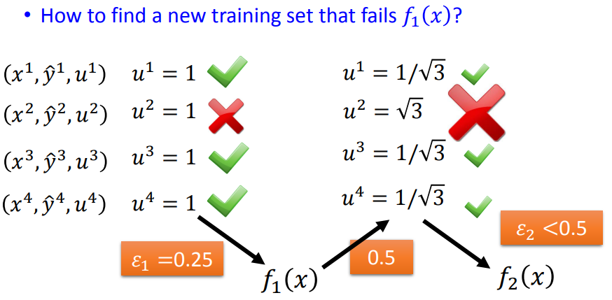

做法：

- 当 $f_1$ 预测错误的，就使它的 $u$ 乘上 $d_1$ 提高。
- 当 $f_1$ 预测正确的，就使它的 $u$ 除以 $d_1$ 降低。

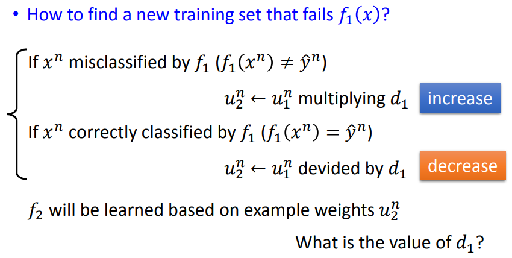

$d_1$ 计算方法：

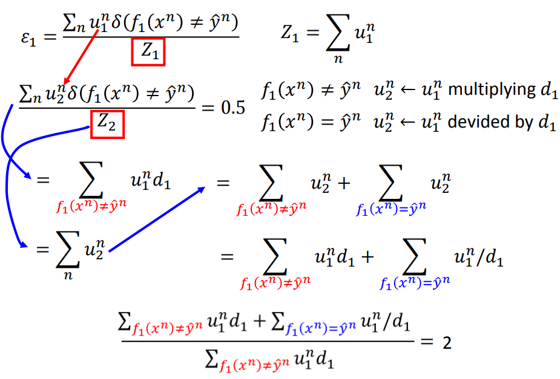

其中，$2$ 就是分子分母倒过来的 $0.5$ 。

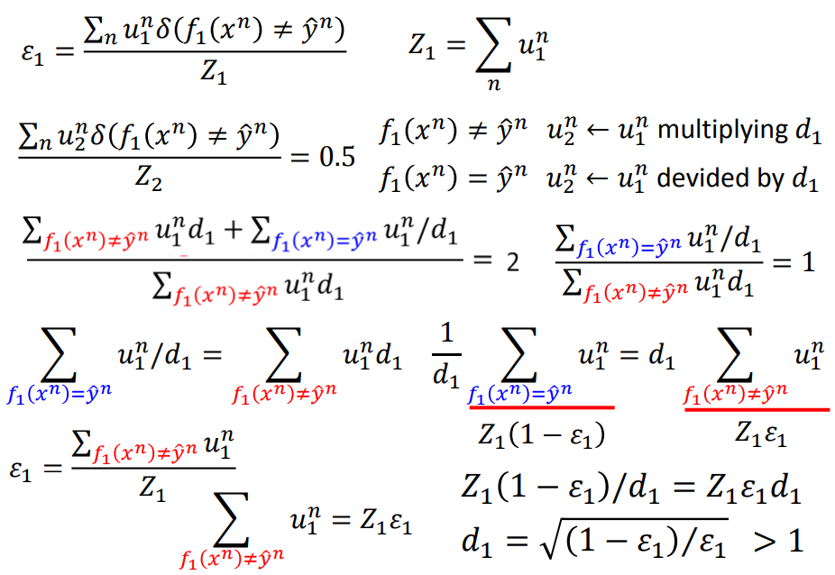

可以计算得到：
$$
d_1 = \sqrt {\frac {(1 - \varepsilon_1)} {{\varepsilon_1}}}
$$
因为必有 $\varepsilon_1 \lt 0.5$ ，所以必有 $d_1 \gt 1$ 。

找到新权值的完整流程：

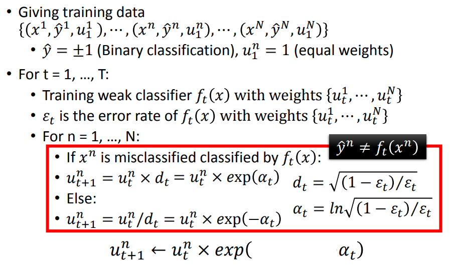

其中，用 $\alpha_t$ 表示 $d_t$ ，可以将转换权值的运算变为对 $\exp$ 的乘法，然后统一表示：

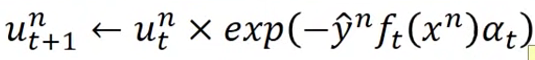

#### aggregate

训练得到 $f_1(x) \dots f_t(x) \dots f_T(x)$ 后，对它们的结果进行 aggregate ：

- uniform weight

	直接综合每个 $f$ 的结果。

- non-uniform weight

	在每个 $f$ 前加上一个权重 $\alpha$ 。

	- $\alpha$ 的可以使用计算 $d$ 的计算方式。

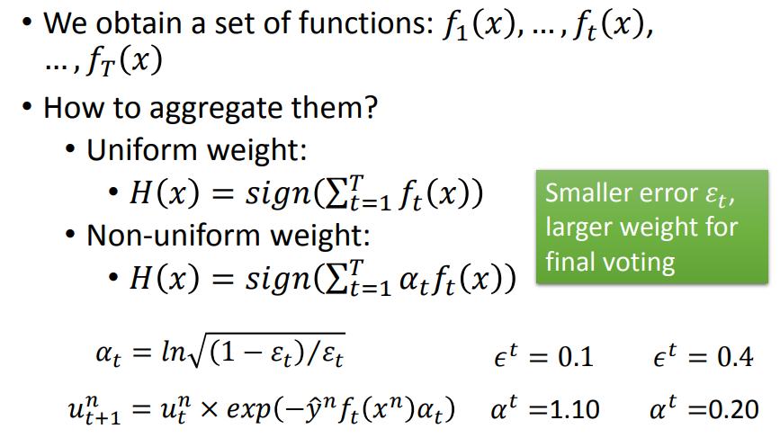

## Stacking

对于 Voting ，需要人为定义各模型的权重：

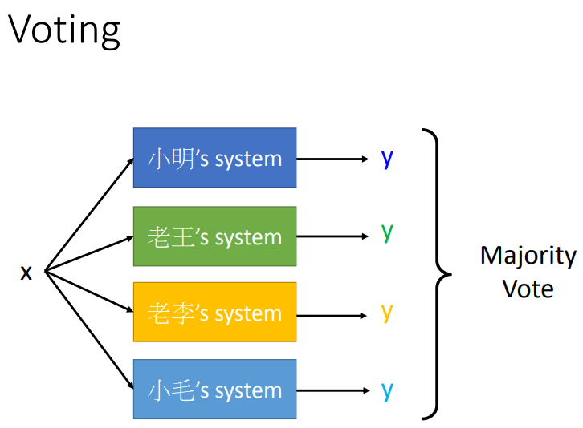

Stacking 训练一个 Final classifier 综合各模型的结果：

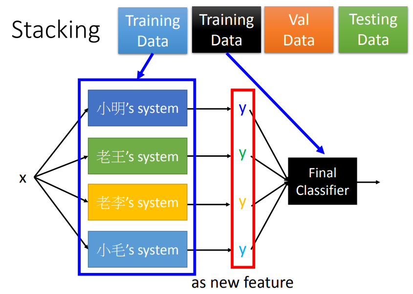

其中：

- final classifier 相当于将各模型的结果当作 feature 。
- final classifier 本身不必太复杂。
- 训练数据需要分成两部分
	- 一部分训练各 stacking 模型。
	- 一部分训练 final classifier 。
