# PCA

（principle component analysis）

## dimension reduction

高维空间中的某些特征可以用低维空间来表示：

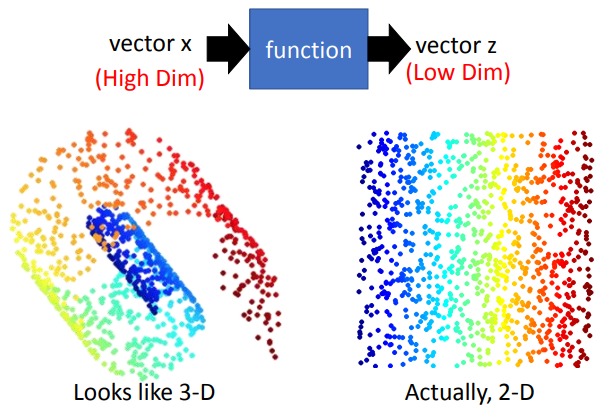

一张图片的所有表示空间中，大部分的特征位置都不是数字：

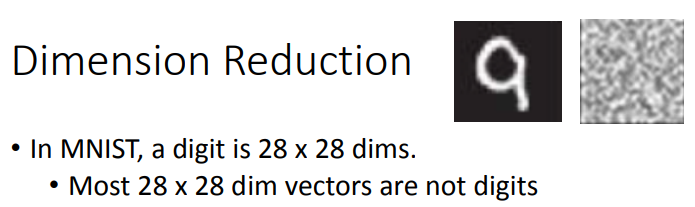

所以实际表现它，不需要用整张图片那么大的表示空间表示它。

简单的方法是进行 feature selection ，将无用的表示维度去掉，但维度间的作用往往是具有一定关系的，无用的维度情况比较少。

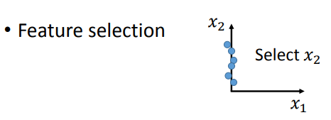

也可以使用 PCA 进行降维。

## PCA 一维情况

对 $x$ ，寻找一个 $W$ ，使其满足：
$$
z = W x
$$
其中，$z$ 的维数比 $x$ 的维数更少。

考虑将 $x$ 投影到 1D 的情形， 即 $z$ 只有一维，其由 $W$ 的第一行，和 $x$ 的内积得来 $z_1 = w^1 x$ 。

假定 $||w^1||_2 = 1$ ，有 $w$ 和 $x$ 是高维空间中的一个点，$w^1$ 是高维空间中的一个 vector ，而 $z_1$ 就是 $x$ 在 $w^1$ 上的投影。

将每个 $x$ 都投影到 $w^1$ 上，可以得到对应的投影后的结果 $z_1$ 。

$w^1$ 的选择可以多种多样，我们希望投影到它上的 $z_1$ 的分布越扩散越好，即希望其方差大，不要过于集中，以保留数据之间的差异信息。

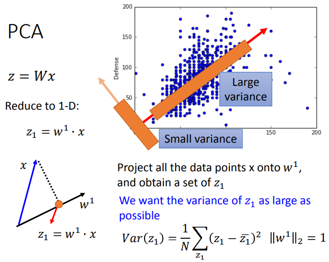

上图，横轴为 attack（攻击力），纵轴为 defense（防御力）。

有两个 $w^1$ ，数据在其上的投影具有大的或小的方差，对角线处的 $w^1$ 的投影结果可以作为用一个新的指标表示：强度。

以上行为可以表述为寻找一个 $w^1$ ，最大化投影后 $z_1$ 的方差。

## 多维情况

要进行更多维的投影，组合多个式子即可：

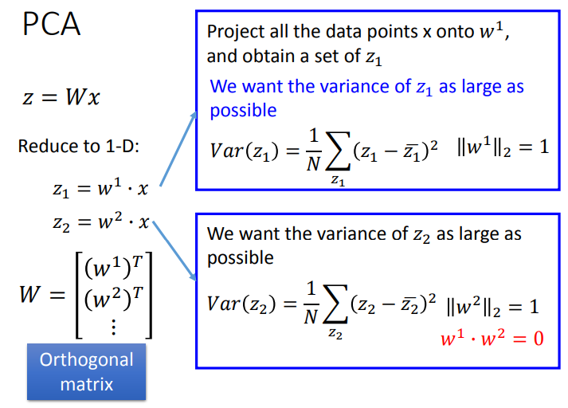

其中，最小化 $z_2$ 时，需要增加条件 $w^1 \cdot w^2 = 0$ ，否则 $z_2$ 将会和 $z_1$ 相等，因为 $z_1,z_2$ 是同样方式求出的。

第一次求出的 $w$ ，是数据的协方差矩阵的第一大的特征值对应的特征向量，第二次求出的 $w$ 是第二大特征值对应的特征向量，以此类推。

最后求得的矩阵 $W$ 会是一个 orthogonal matrix（正交矩阵），它的行向量都是正交的。

可以使用 lagrange multiplier（拉格朗日乘数）求解 PCA ，此处略。

PCA 转换后的特征表示中，越大的特征值对应的维度的数据就越重要，方差越大，区分能力越强。

## decorrelation

$z$ 的方差会是一个 diagonal matrix ，即 $z$ 的各维度间是独立的，没有关联（decorrelated）：

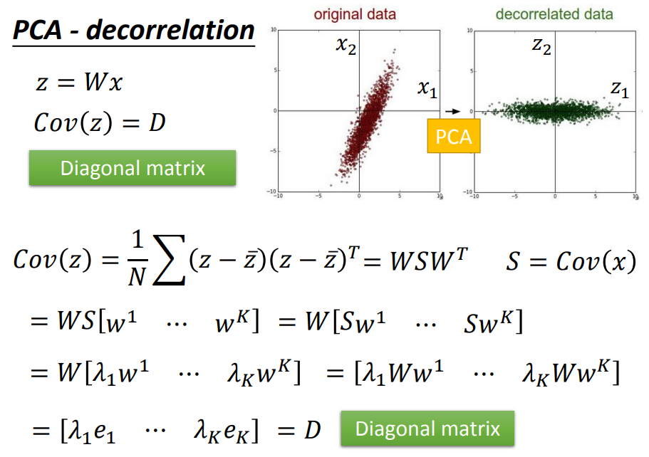

其中，$S$ 是特征向量，$\lambda$ 是对应的特征值。

diagonal matrix 说明 $z$ 的表示是高效的，说明 PCA 得到的新的特征表示去除了无用的关系，简化了特征表达。

## PCA 与 SVD

假设一个数字是由各种组件构成的：

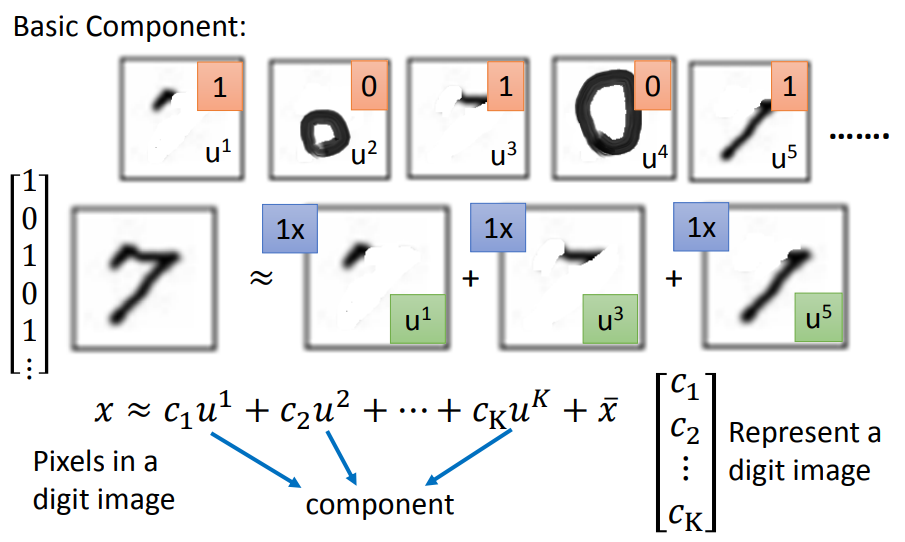

其中，$u$ 表示组件，$\bar x$ 表示所有 image 的平均。

可以用组件的线性组合的系数表示一个数字图像（$c_1,c_2, \dots , c_K$），当组件的数量远少于像素数时，这个表示就是非常有用的。

要寻找 $K$ 个表示组件的 vector（$u$），使得 $x - \bar x$ 与 $\hat x$ 越接近越好：

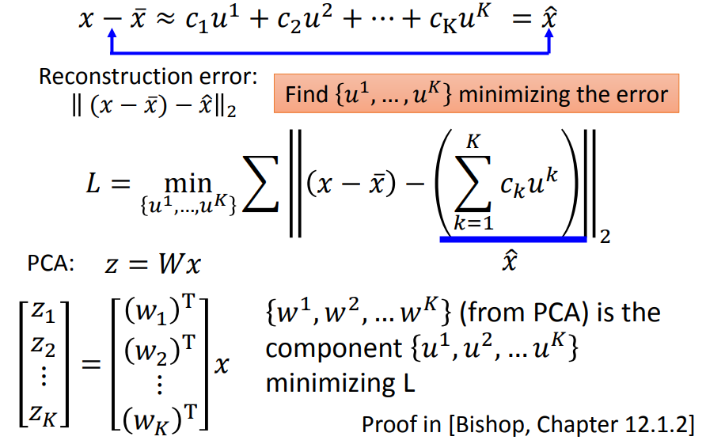

其中，PCA 计算出的 $w$ ，就相当于组件 $u$ ，它们能够使得 reconstruction error 最小。

将所有数据 $x^1,x^2 \dots$ 用组件表示：

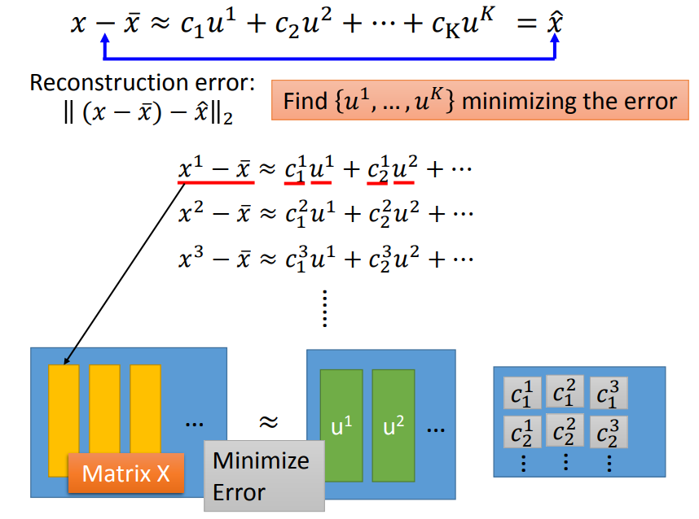

我们希望矩阵 $X$ ， $u$ 和 $c$ 的矩阵的乘积，两者之间差距越小越好。

可以用 SVD 解这个最小化问题：

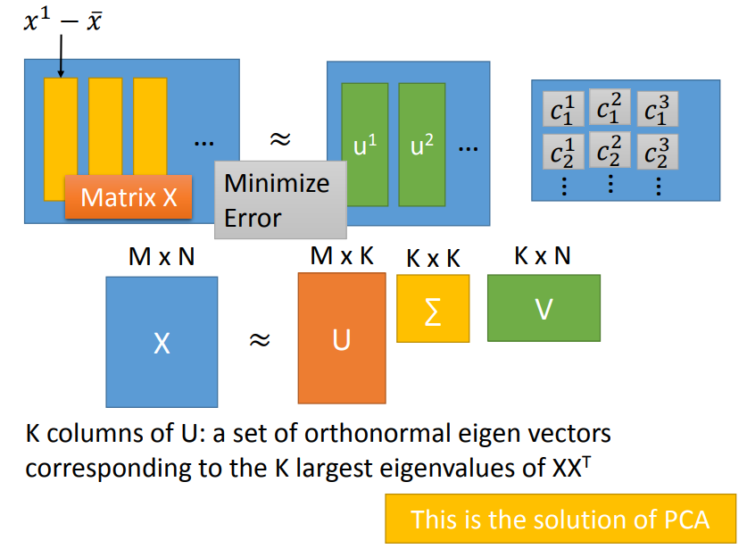

其中 $K$ 就是组件的数目。

用 SVD 解出的 $U$ 的每个 column 就是 covariance matrix 的特征向量，这个 $U$ 就是 PCA 的解。

也就是说，PCA 里得到的 $W$ 就是组件（图中 $u$ 的部分），得到的数据降维后的向量就是组件的系数（图中 $c$ 的部分）。

## PCA 与神经网络

$w^1 \dots w^K$ 是正交的，所以有：
$$
c_k = \hat x \cdot w^k = (x - \bar x) \cdot w^k
$$
又 $\hat x = \sum c_kw^k$ ：

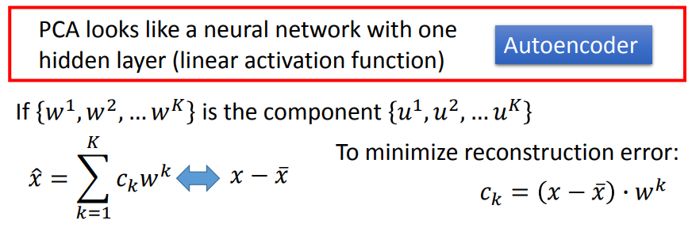

可以用一个 hidden layer 的神经网络表示这两个线性组合关系：（假设 $K = 2$，即有两个组件）

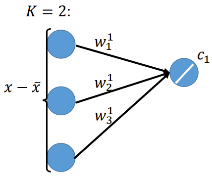

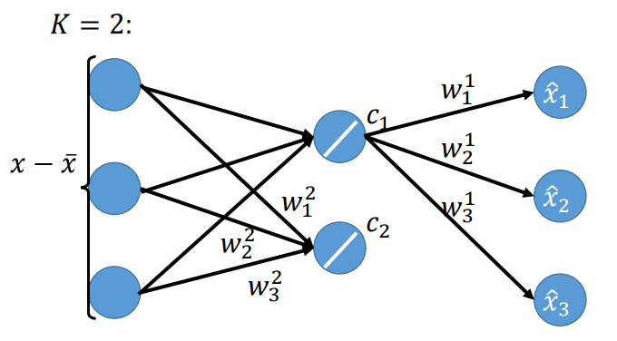

注意，这两个 hidden layer 的神经元的激活函数只能是线性的，它们的输出是 $c_1,c_2$ 。

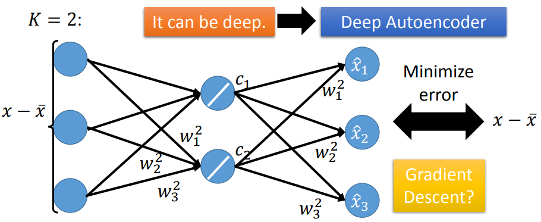

表示成神经网络（NN）后，希望 $\hat x$ 与 $x - \bar x$ 越接近越好，也即网络的输出和输入越接近越好，构成了一个 autoencoder。

可以用 gradient descent 解这个 NN ，得到 $w$ 。

NN 求得的结果和 PCA 的结果是不一样的。

PCA 的结果是正交的，NN 的结果无法保证是正交的，所以 PCA 得到的解是最优的那组解，能让 reconstruction error 最小。

所以线性情况下，PCA 求解这个降维问题是最好的，但是 NN 的好处在于，NN 可以是非线性的，可以做到 deep autoencoder 。

## PCA 的 weakness

### PCA 只能 Unsupervised

对于一组数据，PCA 将其投影到方差最大的方向上：

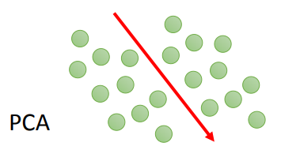

但 PCA 可能将数据投影到错误的方向上，如果这组数据是由这样的两类组成：

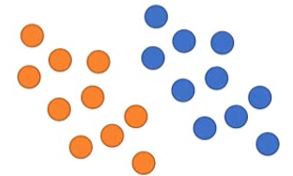

PCA 就会将这两类混合在一起，无法再分辨。

这时候就需要考虑 label ，可以使用 LDA（Linear Discriminant Analysis，线性判别分析）来求解这个问题。（LDA 是有监督的，PCA 是无监督的）

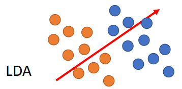

### PCA 只能 Linear

将一个 S 形的流形拉伸为二维平面，这个操作是非线性的。

直接用 PCA 只能将这个流形压成一个平面，首尾各处的点混合在一起，无法再分辨：

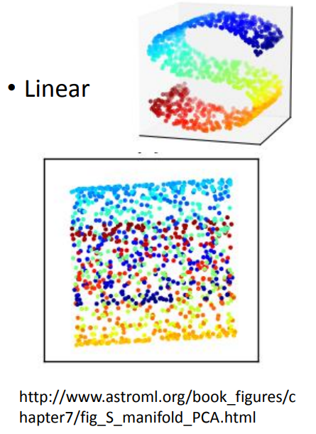

## NMF

（Non-negative matrix factorization，非负矩阵分解，NMF）

PCA 分解出的组件如下：

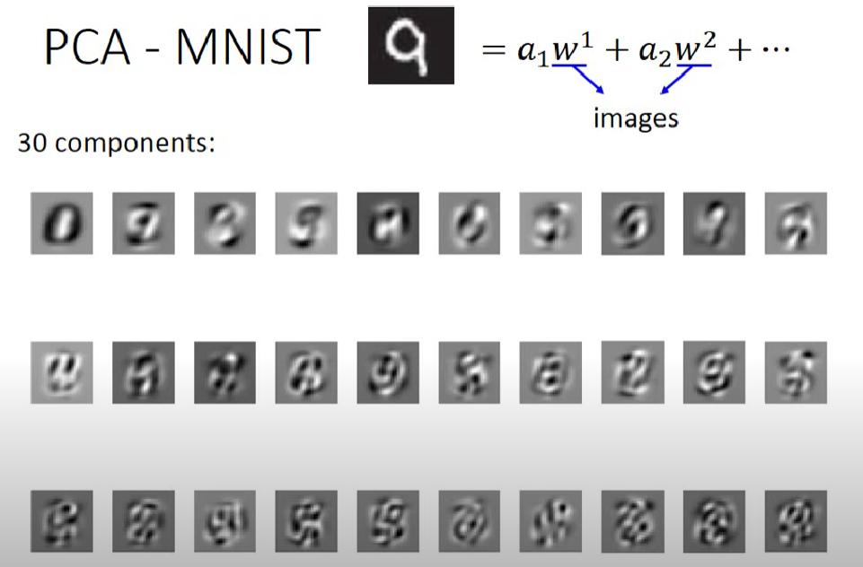

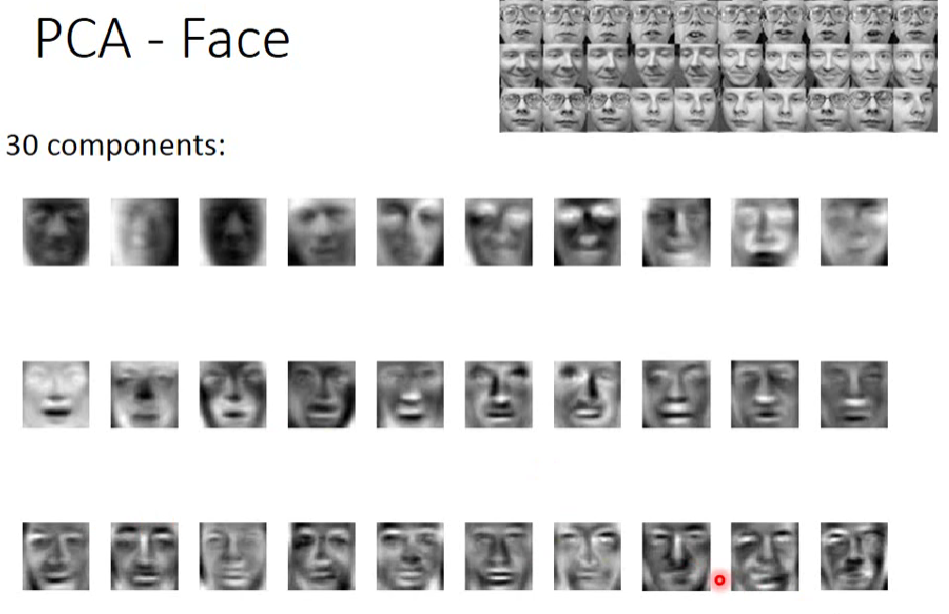

PCA 的产生的系数可为正，可为负，所以画出组件后，各组件的表示不太容易直观理解。

如上图，PCA 分解出的组件人脸几乎都是一张完整的人脸。

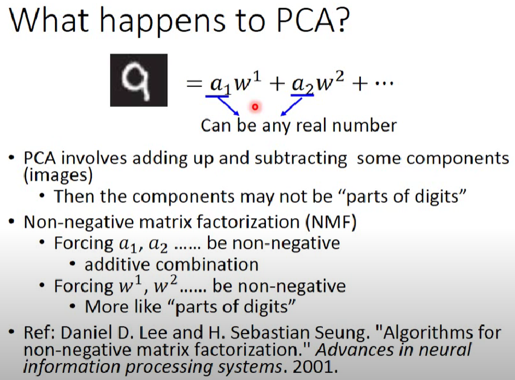

NMF 强制 $a$ 非负，强制 $w$ 非负。

将 NMF 分解出的组件画出如下：

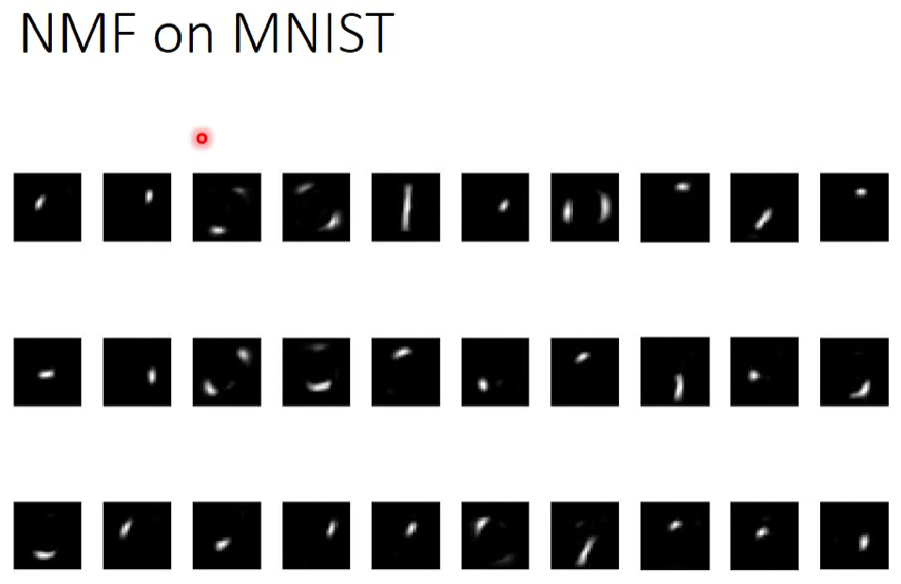

NMF 的结果更像笔画，更像直观上的组件。

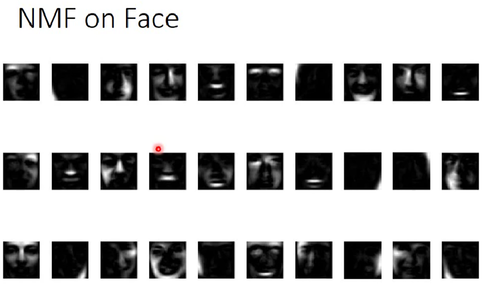、

NMF 的结果也更像人脸的某部分。
