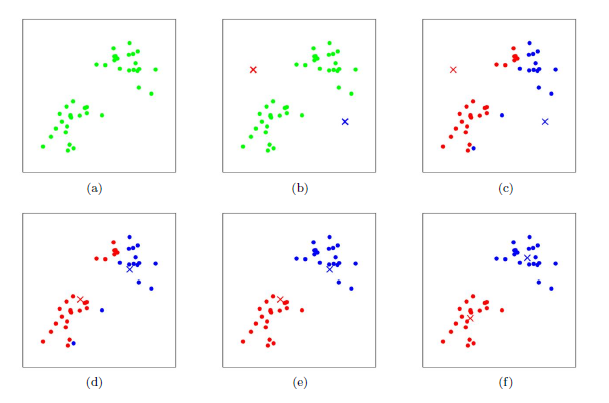
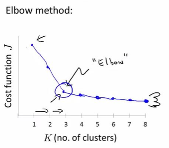
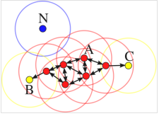
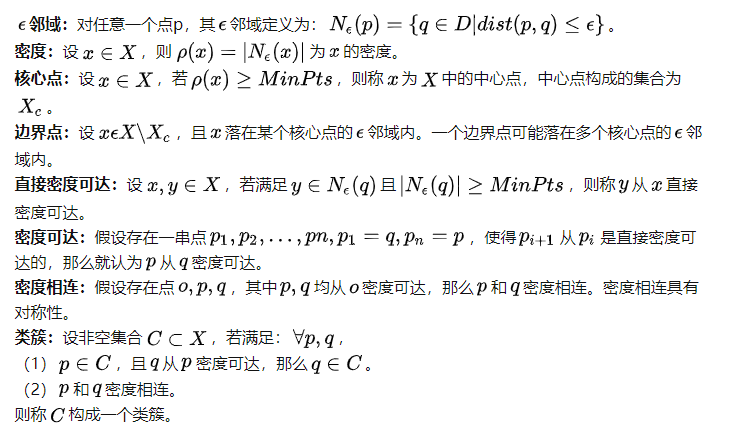
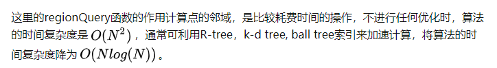
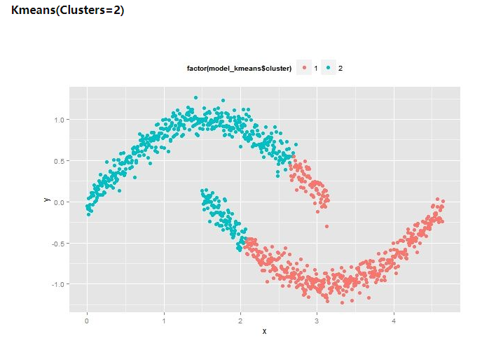
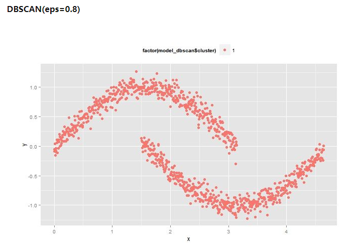
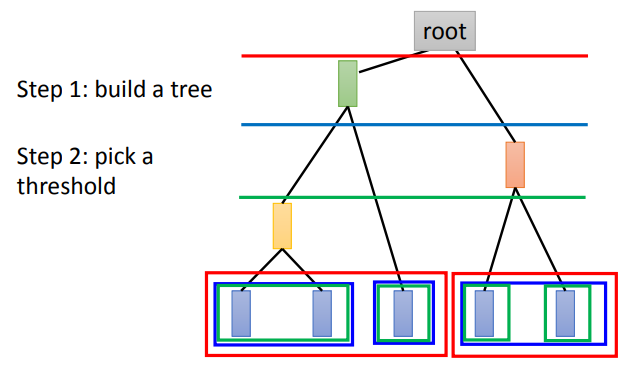

# 聚类

## K-means

（K 均值聚类算法，K-means Clustering Algorithm, K-means）

K-means 是一种启发式迭代求解的聚类分析算法。

给定一个数据点集合和需要的聚类数目 k，k 由用户指定，k 均值算法根据某个距离函数反复把数据分入 k 个聚类中。

### 算法流程

1. 随机选取 $K$ 个聚类中心（以下简称“中心”）。
2. 计算每个对象到各中心的距离，分配到与其距离最小的中心，即代表“聚为一类”。
3. 在每个中心代表的类中再选取新的中心。
4. 重复对各中心分配对象，直到满足终止条件。

终止条件：

- 没有（或最小数目）对象被重新分配给不同的聚类。
- 没有（或最小数目）聚类中心再发生变化。
- 误差平方和局部最小。

示意图：



### 优劣

优点：

- 原理较简单，实现较容易，收敛速度快。 
- 算法的可解释度比较强。 
- 需要调整的参数只有簇数 $k$。

缺点：

- $k$ 值的选取不好把握。
- 对于不是凸的数据集比较难收敛。
- 如果各隐含类别的数据不平衡，比如各隐含类别的数据量严重失衡，或者各隐含类别的方差不同，则聚类效果不佳。 
- 最终结果和初始点的选择有关，容易陷入局部最优。
- 对噪音和异常点比较敏感。

### 初始化优化 K-means++

 $k$ 个初始化的中心的选择对聚类结果和运行时间都有很大影响，因此需要选择合适的 $k$ 个中心。如果仅仅是完全随机的选择，有可能导致算法收敛很慢。

优化策略：

1. 随机选择第一个中心。
2. 对于数据集中每一个点，计算其与已选择的各中心中，与其最近的中心的距离 $D(x)$。
3. 选取 $D(x)$ 最大者作为新的中心。
4. 重复计算，直到选择出 $k$ 个中心。
5. 执行标准 K-means 算法。

### 距离计算优化 elkan K-means

在传统的 K-Means 算法中，在每轮迭代时要计算所有样本点到所有质心的距离，计算量巨大。

elkan K-Means 利用了**两边之和大于等于第三边**，以及**两边之差小于第三边**的三角形性质，来减少距离的计算。

优化策略：

对于 $1$ 个样本点 $x$ 和 $2$ 个中心 $\mu_1$，$\mu_2$，首先计算出两个中心间的距离 $D(\mu_1, \mu_2)$。

- 前者

	后续计算中，如果发现 $2D(x, \mu_1) \le D(\mu_1, \mu_2)$，则必有 $D(x, \mu_1) \le D(x, \mu_2)$，这样就不必再计算 $D(x, \mu_2)$。

- 后者

	一定有 $D(x, \mu_2) \ge max\{0,\ D(x, \mu_1) - D(\mu_1, \mu_2)\}$。

利用以上两个规律，elkan K-Means 比起传统的 K-Means 迭代速度有很大的提高。但是如果样本的特征是稀疏的或有缺失值，此时某些距离无法计算，则不能使用该算法。

前者简单有效，后者对简化运算量意义不大。

### 大样本优化 Mini Batch K-Means

Mini Batch，即使用样本集中的一部分的样本来做 K-Means，以减少运算量，但精度会略有降低。

需要选择一个合适的批样本大小 batch size，用其来做 K-Means 聚类，一般使用无放回的随机采样进行选取。

流程：

1. 从数据集中随机抽取一些数据形成小批量，分配给最近的中心。

2. 更新中心。

3. 直到中心稳定或者达到指定的迭代次数，停止计算。

### Elbow method

“肘”方法，一个用于确定 $k$ 值的方法。

计算 $k \in [1,n]$ ，每次聚类完成后，计算每个点到所属类中心的距离的总和，显然这个总和是会逐渐缩小的，其变化强烈的肘点即是最合适的 $k$ 值。



## DBSCAN

（Density-Based Spatial Clustering of Applications with Noise）

DBSCAN 是一个基于密度的聚类算法。

它将簇定义为密度相连的点的集合，能够把具有足够高密度的区域划分为簇，并可在数据空间中发现任意形状的聚类。

DBSCAN 将数据点分为三类：
　　1.核心点：在半径 Eps 内含有超过 MinPts 数目的点。
　　2.边界点：在半径 Eps 内点的数量小于 MinPts ，但是落在核心点的邻域内的点。
　　3.噪声点：既不是核心点也不是边界点的点。

示例：



上图中红色为核心点，黄色为边界点，蓝色为噪声点。



### 流程

DBScan 需要两个参数：

- 扫描半径（eps）
- 最小包含点数（minPts）

任选一个未被访问的（unvisited）点开始，找出与其距离在 eps 之内（包括 eps ）的所有附近点。

如果附近点的数量 ≥ minPts，则当前点与其附近点形成一个簇，并且出发点被标记为已访问（visited），然后递归，以相同的方法处理该簇内所有未被标记为已访问（visited）的点，从而对簇进行扩展。

如果 附近点的数量 < minPts，则该点暂时被标记作为噪声点。

如果簇充分地被扩展，即簇内的所有点被标记为已访问，然后用同样的算法去处理未被访问的点。

### 伪代码

DBSCAN的核心思想是从某个核心点出发，不断向密度可达的区域扩张，从而得到一个包含核心点和边界点的最大化区域，区域中任意两点密度相连。

```python
DBSCAN(D, eps, MinPts)
   C = 0                                          
   for each unvisited point P in dataset D        
      mark P as visited                           
      NeighborPts = regionQuery(P, eps)      //计算这个点的邻域    
      if sizeof(NeighborPts) < MinPts             
         mark P as NOISE                          
      else                                        
         C = next cluster                   //作为核心点，根据该点创建一个新类簇
         expandCluster(P, NeighborPts, C, eps, MinPts)   //根据该核心点扩展类别
          
expandCluster(P, NeighborPts, C, eps, MinPts)
   add P to cluster C                            //扩展类别，核心点先加入
   for each point P' in NeighborPts                    
      if P' is not visited
         mark P' as visited                              
         NeighborPts' = regionQuery(P', eps)    //如果该点为核心点，则扩充该类别
         if sizeof(NeighborPts') >= MinPts
            NeighborPts = NeighborPts joined with NeighborPts'
      if P' is not yet member of any cluster   //如果邻域内点不是核心点，并且无类别，比如噪音数据，则加入此类别
         add P' to cluster C
          
regionQuery(P, eps)                                       //计算点P的邻域
   return all points within P's eps-neighborhood
```



### 优缺点

优点：

- 与 K-means 方法相比，DBSCAN 不需要事先知道要形成的簇类的数量。

- 与 K-means 方法相比，DBSCAN 可以发现任意形状的簇类。

- DBSCAN 能够识别一定的噪声点。

- DBSCAN 对于数据库中样本的顺序不敏感，即 Pattern 的输入顺序对结果的影响不大。但是，对于处于簇类之间边界样本，可能会根据哪个簇类优先被探测到而其归属有所摆动。

缺点：

- DBSCAN 不能很好反映高维数据。

- 如果样本集的密度不均匀、聚类间距差相差很大时，聚类质量较差。

### 对比






## HAC

（Hierarchical Agglomerative Clustering）

1. 按照构建哈夫曼树的方式，不断计算各层级样本集合的相似度
	- 初始化时以单个样本为一个集合。
	- 相似度最高的两个样本集合合并成新的集合。
	- 新的集合与其余样本集合继续计算，直到只剩两个样本集合，得到 root 。
2. 设定一个阈值作为聚类结果的分割点。

