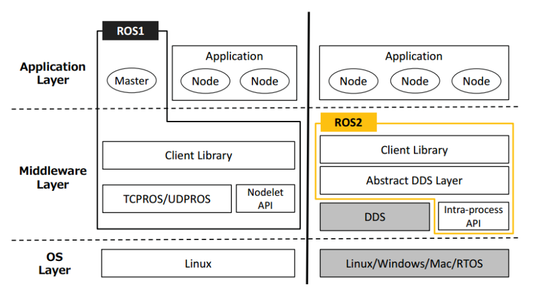
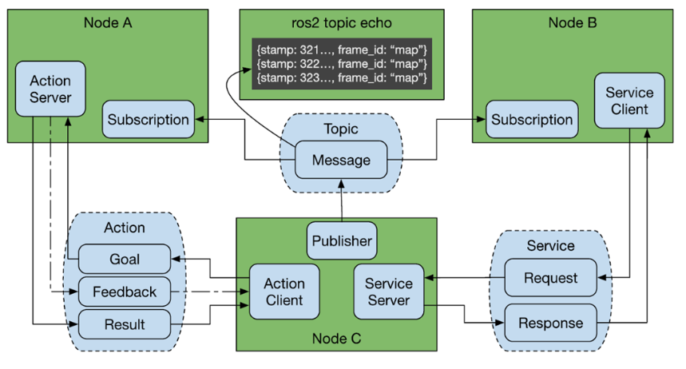

# ROS 2

参考：[ROS 2 课程文档](https://book.guyuehome.com/)

## 主要差异

- ROS 2 是完全分布式架构，无 Master 节点。
- ROS 2 使用 DDS 机制通信。
- 重新设计了更完善的 API 。
- ROS 1 使用 `rosbulid, catkin` 等管理项目，ROS 2 使用 `ament, colcon` 。

系统架构：



## 基本命令

ROS 2 启动节点时不再需要先启动核心。

ROS 2 将操作命令集成到了 `ros2 <子命令>` 中，子命令如下：

```shell
  action     Various action related sub-commands
  bag        Various rosbag related sub-commands
  component  Various component related sub-commands
  daemon     Various daemon related sub-commands
  doctor     Check ROS setup and other potential issues
  interface  Show information about ROS interfaces
  launch     Run a launch file
  lifecycle  Various lifecycle related sub-commands
  multicast  Various multicast related sub-commands
  node       Various node related sub-commands
  param      Various param related sub-commands
  pkg        Various package related sub-commands
  run        Run a package specific executable
  security   Various security related sub-commands
  service    Various service related sub-commands
  topic      Various topic related sub-commands
  wtf        Use `wtf` as alias to `doctor`
```

常用命令：

```shell
ros2 node list   # 查看节点
ros2 node info /turtlesim   # 节点详细信息
ros2 run <包名> <节点>   # 启动节点
ros2 topic list   # 查看话题
ros2 topic echo /turtle1/pose    # 查看话题消息数据

# 发布话题消息
ros2 topic pub <topic_name> <msg_type> <msg_data>
# 发布速率；话题；消息类型；消息参数。（圆周运动）
ros2 topic pub --rate 1 /turtle1/cmd_vel geometry_msgs/msg/Twist "{linear: {x: 2.0, y: 0.0, z: 0.0}, angular: {x: 0.0, y: 0.0, z: 1.8}}"

# 发送服务请求
# 话题；消息类型；消息参数。（新增一个小乌龟）
ros2 service call /spawn turtlesim/srv/Spawn "{x: 2, y: 2, theta: 0.2, name: ''}"

# 发送一个转向动作目标
ros2 action send_goal /turtle1/rotate_absolute turtlesim/action/RotateAbsolute "theta: 3"

# 录制数据
ros2 bag record /turtle1/cmd_vel

# 播放数据
ros2 bag play rosbag2_2022_04_11-17_35_40/rosbag2_2022_04_11-17_35_40_0.db3
```

## 基本概念

### 分布式通信

（Distributed Communication）

每个设备或机器都可以作为分布式通信中的一员。

多个计算机都安装好 ROS2，只要处于同一网络，它们就可以察觉话题、服务、动作等通信，并进行交互。

### DDS

- 数据分发服务（Data Distribution Service，DDS）

	一种以数据为中心的通信模式。

### 工作空间

（Workspace）

- src

	代码空间。

- build

	编译空间，保存编译过程中产生的中间文件。

- install

	安装空间，放置编译得到的可执行文件和脚本。

- log

	日志空间。

```shell
# 编译工作空间
colcon build

# 刷新环境变量
source install/local_setup.sh # 仅在当前终端生效

# 可设置环境变量。
echo " source ~/dev_ws/install/local_setup.sh" >> ~/.bashrc
```

### 功能包

（Package）

#### 基本命令

- `ros2 pkg create --build-type <build-type> <package_name>`

	常见功能包。

	- `build-type`
		- c++ 使用 `ament_cmake` 。
		- python 使用 `ament_python` 。

#### 配置文件

- c++ 配置 `CMakeLists.txt` 。
- python 配置 `setup.py` 中的程序入口 `entry_points` 。

## 基本工具

### launch 文件

ROS 2 中的 launch 文件基于 python 描述。

- `ros2 launch <功能包> xxx.launch.py`

	通过 launch 文件启动节点。

一般格式：

```python
import os
from ament_index_python.packages import get_package_share_directory # 查询功能包路径的方法
from launch import LaunchDescription    # launch 文件的描述类
from launch_ros.actions import Node     # 节点启动的描述类


def generate_launch_description():      # 自动生成 launch 文件的函数
   rviz_config = os.path.join(          # 找到配置文件的完整路径
      get_package_share_directory('learning_launch'),
      'rviz',
      'turtle_rviz.rviz'
      )

   return LaunchDescription([           # 返回 launch 文件的描述信息
      Node(                             # 配置一个节点的启动
         package='rviz2',               # 节点所在的功能包
         executable='rviz2',            # 节点的可执行文件名
         name='rviz2',                  # 对节点重新命名
         arguments=['-d', rviz_config]  # 设置命令行参数
      )
   ])
```

## 通信机制



- 话题（Topic）
- 服务（Service）
- 动作（Action）
- 参数服务器（Parameter Service）

ROS 2 与 ROS 1 的通信机制概念基本一致。
