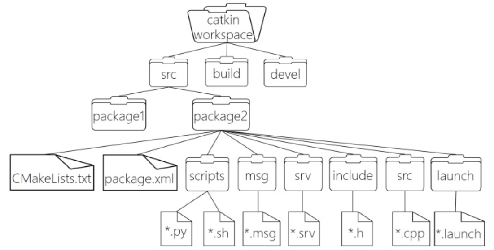
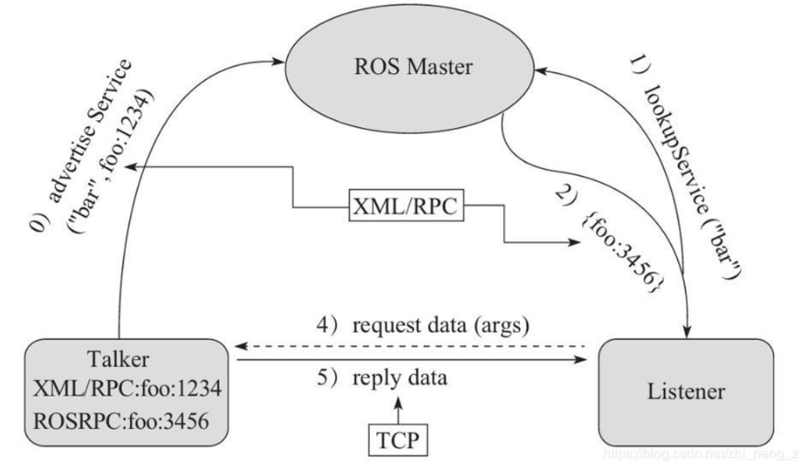
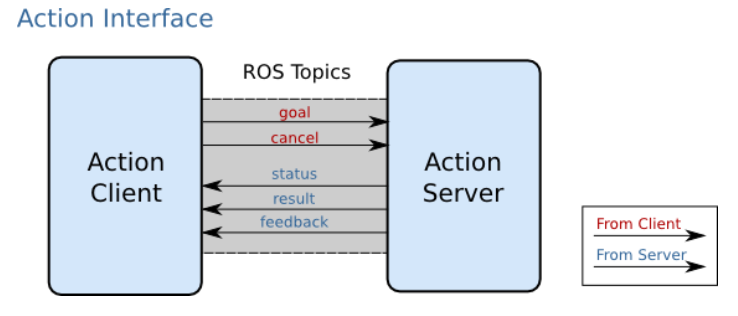
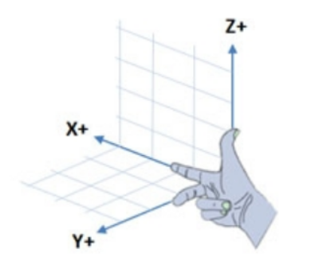
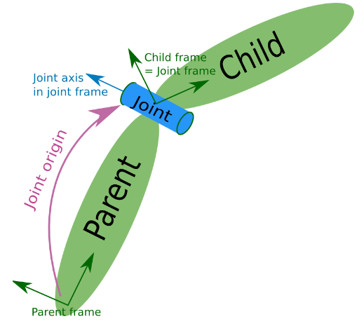
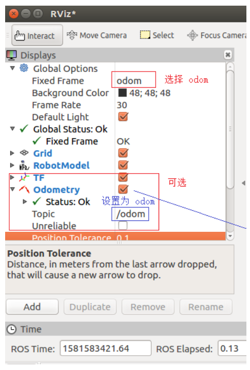

# ROS

- 机器人操作系统（Robot Operating System，ROS）

	对机器人的软硬件进行抽象模块化的一套软件框架。

[视频课程文档-赵虚左](http://www.autolabor.com.cn/book/ROSTutorials/)

[ROS Tutorials](http://wiki.ros.org/ROS/Tutorials)

ROS 是进程（也称为 Node，节点）的分布式框架，每个节点由一个进程表示。

ROS 一般在 Ubuntu 上使用，新版本 ROS2 也可在 Windows 10 上使用，可能工作时是使用历史上的版本，所以建议使用 Ubuntu 。

ROS 程序一般使用 C++ 或 Python 。

## 使用注意

- 安装的版本一定要和 Ubuntu 的版本对应上，否则会找不到包。

- 安装可参考：[Ubuntu20.04.4安装ROS Noetic详细教程 - 知乎](https://zhuanlan.zhihu.com/p/515361781)

- 允许从 ssh 远程启动图形界面程序

	设置环境变量 `export DISPLAY=:0` 。（不要使用 `什么什么=offscreen` ，这会导致界面打不开）

## ROS 程序构建基本步骤

1. 创建工作空间（workspace）

    `mkdir -p demo_ws/src`

  2. 在工作空间内使用 catkin_make 命令建立环境，会生成 build devel 两个文件夹。

2. 创建功能包并添加依赖

	 一般在 src 子目录下建立，使用 `catkin_create_pkg <自定义包名> roscpp rospy std_msgs` 命令。

	  - 包名没有特定扩展名。

	  - 该功能的依赖项
		- roscpp 为 C++ 实现的库。
		- rospy 为 Python 实现的库。
		- std_msgs 为标准消息库。

3. 编辑源文件

4. 编辑配置文件（基于 CMake）

5. 编译及运行

### C++

- 在包内编辑源代码文件：

```c++
#include "ros/ros.h"   // 头文件

int main(int argc, char *argv[])
{
    // 执行 ros 节点初始化
    ros::init(argc,argv,"hello");   // 节点名称
    
    // 创建 ros 节点句柄(本例非必须)
    ros::NodeHandle nh;
    
    // 控制台输出 hello world
    ROS_INFO("hello world!");   // 输出日志

    return 0;
}
```

- 编辑包内的 Cmakelist.txt 文件：

```shell
add_executable(
	可执行文件名
    src/源文件名.cpp
)
    
target_link_libraries(
    可执行文件名
	${catkin_LIBRARIES}
)
```

- 设置基本运行环境变量 `source ~/工作空间/devel/setup.bash` 。（不必每次反复执行，也可添加进环境变量配置文件）
- 在工作空间目录执行 `catkin_make` 进行编译。
- 启动核心 `roscore` 。
- 启动节点：`rosrun 包名 C++节点（即可执行文件名）` 。

### Python

- 在包内建立 `scripts` 文件夹。
- 编辑 Python 文件：

```python
#! /usr/bin/env python   # 指定解释器

import rospy   # 导入包

if __name__ == "__main__":   # 主入口
    rospy.init_node("hello")   # 节点名称
    rospy.loginfo("Hello World!!!!")
```

- 添加可执行权限：`chmod +x 文件名.py ` 。
- 编辑包内的 Cmakelist.txt 文件：

```shell
catkin_install_python(PROGRAMS
	scripts/文件名.py
    DESTINATION ${CATKIN_PACKAGE_BIN_DESTINATION}
)
```

- 设置基本运行环境变量 `source ~/工作空间/devel/setup.bash` 。
- 在工作空间目录执行 `catkin_make` 进行编译。
- 启动核心 `roscore` 。
- 启动节点：`rosrun 包名 文件名.py` 。

### launch 文件

launch 文件可以一次并发（不是从上到下）启动多个节点，自动完成启动 roscore 等动作（仍要先使用 `source` 和进行编译）。

- 在包内建立 launch 文件夹，然后建立 `文件名.launch` 文件（XML 格式），设置启动的节点：

```xml
<launch>
    <!-- 输出 hello world 的节点 -->
    <node pkg="helloworld" type="demo_hello" name="hello" output="screen" />
    
    <!-- 海龟示例 -->
    <node pkg="turtlesim" type="turtlesim_node" name="t1"/>
    <node pkg="turtlesim" type="turtle_teleop_key" name="key1" />
    
</launch>
```

- 标签及属性：

  - node

  	包含的某个节点。

  - pkg

  	功能包。

  - type

  	要使用的可执行文件名（不是路径）。

  	- C++ 为编译后的可执行文件名。
  	- Python 为源文件名（有可执行权限）。

  - name

  	节点名。

  - output

  	日志输出到屏幕上要为 `output="screen"`。
  	
  - args

    传入参数。

- 运行 launch 文件：`roslaunch 包名 launch文件名` 。

更多设置见文档。

## ROS 架构

### ROS 文件系统

即 ROS 的项目文件夹结构。



- WorkSpace 
	
	自定义的工作空间。

    - build

        编译空间，用于存放 CMake 和 catkin 的缓存信息、配置信息和其他中间文件。

    - devel

        开发空间，用于存放编译后生成的目标文件，包括头文件、动态静态链接库、可执行文件等。

    - src 源码

        - `CMakeLists.txt`

            工作空间内多个包的编译的配置。

        - package

            功能包（ROS 基本单元）包含多个节点、库与配置文件，包名所有字母小写，只能由字母、数字与下划线组成

            - `CMakeLists.txt`

            	包的配置编译规则，比如源文件、依赖项、目标文件。

            - `package.xml`

            	包的信息，如：包名、版本、作者、依赖项等（以前版本是 `manifest.xml`）。

            - scripts

            	存储 Python 或 Shell 等脚本文件。
  
            - src（注意区分两个 src 层级）
  
            	存储 C++ 源文件。
  
            - include
  
            	头文件。
  
            - msg
  
            	消息通信格式文件。
  
            - srv
  
            	服务通信格式文件。
  
            - action
  
            	动作格式文件。
  
            - launch
  
            	存放 launch 文件。
  
            - config
  
            	配置信息。

### ROS 计算图

- `rqt_graph` 

	节点启动后使用，可以启动 ROS 的节点数据通信图形演示程序。

## ROS 通信机制

主要有三种形式：

- 话题通信（发布订阅模式）
- 服务通信（请求响应模式）
- 参数服务器（参数共享模式）

对比：

- topic 一般用于数据高频需要的功能，如雷达，里程计。
- service 一般用于数据低频需要的功能，如拍照，语音识别。

### 话题通信

- ROS Master

	管理者，根据话题建立 Talker 和 Listener 到连接。

- Talker（Publisher）

	发布者。

- Listener（Subscriber）

	订阅者。

话题相同可以互相通信。

使用 RPC（Remote Procedure Call，远程过程调用）协议和 TCP 协议。


1. 注册信息

	使用 RPC 注册话题和自身节点信息。（Talker 或 Listener，都可存在多个）

2. 话题匹配

	Master 根据注册表中的信息进行匹配，并通过 RPC 向 Listener 发送 Talker 的 RPC 地址信息。

3. 连接请求

	Listener 根据接收到的 RPC 地址，通过 RPC 向 Talker 发送连接请求，传输订阅的话题名称、消息类型以及通信协议（TCP/UDP）。

4. 确认请求

	Talker 接收到 Listener 的请求后，也是通过 RPC 向 Listener 确认连接信息，并发送自身的 TCP 地址信息。

5. 建立连接

	Listener 通过 TCP 与 Talker 建立连接。（建立连接后可关闭 Master）

6. 发布消息

	Talker 可以开始发布消息。

#### C++

- 发布者

```c++
#include "ros/ros.h"
#include "std_msgs/String.h"   // 数据类型

int main(int argc, char *argv[]) {

    // 传入参数。
    // 设置节点名称，要保证在 ROS 网络中唯一。
    ros::init(argc,argv,"publisher");
    
    ros::NodeHandle nh;

    // 注册话题。
    // 发布的消息类型，话题名，消息队列最大长度。
    ros::Publisher publisher = nh.advertise<std_msgs::String>("topic_name", 10);

    // 设置执行频率，这里是 1 Hz，即每秒 1 次。
    ros::Rate rate(1);
    
    // 消息类型
    std_msgs::String msg;

    char str[] = "hello";

    // 若当前节点正在运行 ok
    while(ros::ok) {
        msg.data = str;
        publisher.publish(msg);

        // 打印日志
        ROS_INFO("publish: %s", str);   

        // 按设置的频率睡眠
        rate.sleep();

        // 让 subscriber 立即处理一次回调函数。
        ros::spinOnce();   // 这句也可不加，官方建议加上。
    }

    return 0;
}
```

- 订阅者

```c++
#include "ros/ros.h"
#include "std_msgs/String.h"


// 回调函数，处理收到的信息，一次一条，由 ConstPtr 指向。
void process_msg(const std_msgs::String::ConstPtr & msg_p) {
    ROS_INFO("get: %s", msg_p->data.c_str());
}

int main(int argc, char * argv[]) {
    ros::init(argc, argv, "subscriber");

    ros::NodeHandle nh;

    ros::Subscriber subscriber = nh.subscribe<std_msgs::String>("topic_name", 10, process_msg);

    // 自动循环处理回调函数。
    ros::spin();

    return 0;
}
```

#### Python

- 发布者

```python
#! /usr/bin/env python   # 指定解释器

import rospy   # 导入包
from std_msgs.msg import String

if __name__ == "__main__":   # 主入口
    rospy.init_node("publisher_py")
    
    publisher = rospy.Publisher("topic_name", String, queue_size=10)
    msg = String("hello hello")

    rate = rospy.Rate(1)
    while not rospy.is_shutdown():
        publisher.publish(msg)
        
        rospy.loginfo(f"publish {msg.data}")
        rate.sleep()
```

- 订阅者

```python
#! /usr/bin/env python   # 指定解释器

import rospy   # 导入包
from std_msgs.msg import String

def process_data(msg):
    rospy.loginfo(f"get {msg}")

if __name__ == "__main__":   # 主入口
    rospy.init_node("subscriber_py")

    publisher = rospy.Subscriber("topic_name", String, process_data, queue_size=10, )
    
    rospy.spin()   # 阻塞当前线程，使回调函数线程不断处理。
```

- 记得添加可执行权限。
- 注意，rospy 中没有 `spinOnce()` 函数，其有的 `.spin()` 函数的功能为使该线程阻塞。rospy 有自己的处理回调函数的线程。

### 消息类型

#### 基本类型

ROS 常用数据类型包括：

- int32，uint32 ...

- float32，float64

- string

- time

	时间。

- duration

	时间间隔。

- header

	包含时间戳和坐标信息。
	
- variable-length array 和 fixed-length array

#### 自定义消息类型

即自定义一个消息类，其内的变量成员是 ROS 的原生类型。

1. 在工作空间建立 `msg` 目录创建 `类名.msg` 文件，最后会生成包含该文件指定数据类型的类，文件格式如下：

```
# 以下数据类型必须使用小写
string name
int32 age
...
```

2. 修改配置文件。

```xml
# 在 package.xml 中添加编译依赖和执行依赖。  
<build_depend>message_generation</build_depend>
<exec_depend>message_runtime</exec_depend>

# 以下为编辑 CMakeLists.txt 文件

# 在 find_package 添加 message_generation
find_package(catkin REQUIRED COMPONENTS
	std_msgs   # 必须有
	message_generation
)

# 配置 msg 源文件
add_message_files(
  FILES
  <类名>.msg
)

# 生成消息时依赖于 std_msgs
generate_messages(
  DEPENDENCIES
  std_msgs
)

# 执行时依赖
catkin_package(
  CATKIN_DEPENDS roscpp rospy std_msgs message_runtime   # 添加了 message_runtime
)
```

3. 使用 `catkin_make` 编译即可生成可以被 Python 或 C++ 调用的中间文件。
  - 在 `devel/include` 中会生成 `类名.h` 文件。
  - 在 `devel/lib` 中会生成 `_类名.py` 文件。

- C++ 使用

```
# 导入
# include "包名/类名.h"
//可修改 VS Code 的 C++ include 路径，以供代码提示。

# 将包名作为其的名称空间。
包名::类名 obj   //建立对象

# 修改 CMakeLists.txt 的 add_dependencies
add_dependencies(原文件生成的目标文件名 ${PROJECT_NAME}_generate_messages_cpp)
```

- Python 使用

```python
# 导入
from 包名.msg import 类名
//可修改 VS Code 的 Python include 路径，以供代码提示。
```

### 服务通信

- ROS master
- Server
- Client

服务名称相同可以互相通信。

使用 RPC 协议和 TCP 协议。

1. 注册信息。
2. 信息匹配。
3. 发送请求。
4. 发送响应。

#### 服务文件

- srv 文件

	一个 srv 文件描述一个服务的信息结构（类型），包括两部分。将 srv 文件建立在 srv 目录下。

	- 请求（request）
	- 响应（response）

```
# 客户端请求时发送的信息
int32 num1
int32 num2

---     # 分隔线

# 服务器响应发送的信息
int32 sum
```

- 配置

```xml
# 在 package.xml 中添加依赖
<build_depend>message_generation</build_depend>
<exec_depend>message_runtime</exec_depend>

# 以下为 CMakeLists.txt 文件内

# find_package 添加 message_generation
find_package(catkin REQUIRED COMPONENTS
  roscpp
  rospy
  std_msgs
  message_generation
)

# 添加 srv 文件
add_service_files(
  FILES
  文件.srv
)

# 生成消息时依赖于 std_msgs
generate_messages(
  DEPENDENCIES
  std_msgs
)
```

- srv 文件生成的中间文件的目录和用法与自定义消息一致。

#### C++

- 服务端

```c++
#include "ros/ros.h"
#include "test/addition.h"   // 测试的 srv 文件，描述一个加法运算服务的数据

// 处理请求。
bool process_data(test::addition::Request & requst, test::addition::Response & response) {
    response.sum = requst.a + requst.b;
    return true;
}

int main(int argc, char * argv[]) {
    ros::init(argc, argv, "server");
    ros::NodeHandle nh;

    // 声明服务，建立 server 。
    ros::ServiceServer server = nh.advertiseService("service_name", process_data);

    ROS_INFO("service started");

    // 不断处理请求。
    ros::spin();

    return 0;
}
```

- 客户端

```c++
#include "ros/ros.h"
#include "test/addition.h"

int main(int argc, char * argv[]) {
    ros::init(argc, argv, "client");
    ros::NodeHandle nh;

    // 注册到服务，方式 1，建立 client
    ros::ServiceClient client = nh.serviceClient<test::addition>("service_name");

    // 注册到服务，方式 2，阻塞，成功后才继续执行。
    ros::service::waitForService("service_name");

    // srv 文件定义的信息，包含 request 和 response 两部分。
    test::addition info;
    info.request.a = 1;
    info.request.b = 2;

    // 发起请求。
    bool flag = client.call(info);

    if (flag) {
        ROS_INFO("got response %d", info.response.sum);   // response
    }

    return 0;
}
```

#### Python

- 服务端

```python
#! usr/bin/env python

import rospy

# 导入 srv 文件建立的包。
from test.srv import addition, additionRequest, additionResponse

# 处理请求。
def process_data(request):

    # 建立响应。
    response = additionResponse(request.a + request.b)

    rospy.loginfo(f"receive request {request.a} and {request.b}")
    return response

if __name__ == "__main__":
    rospy.init_node("server_py")

    # 声明服务。
    server = rospy.Service("service_name", addition, process_data)

    # 不断处理请求。
    rospy.spin()
```

- 客户端

```python
#! usr/bin/env python

import rospy
from test.srv import addition, additionRequest, additionResponse

if __name__ == "__main__":
    rospy.init_node("client_py")

    # 注册到服务，方式 1
    client = rospy.ServiceProxy("service_name", addition)

    # 注册到服务，方式 2
    rospy.wait_for_service("service_name")

    # 建立请求
    request = additionRequest(1, 2)

    # 发送请求，得到响应
    response = client.call(request)

    rospy.loginfo(f"receive response {response.sum}")
```

- 添加可执行权限。

### 参数服务器

- ROS Master
- Talker（参数设置者）
- Listener（参数调用者）

参数服务器是一个 ROS 中独立于所有节点的公共数据容器，可以被不同节点设置或获取数据。

使用 RPC 协议。


- 设置参数。
- 获取参数。

无需建立参数服务器，直接设置或获取参数即可。

#### C++

roscpp 提供了两种方式：

- `ros::NodeHandle nh`
- `ros::param::`

```c++
# 方式 1
ros::NodeHanele nh;
nh.setParam("key", value);
nh.getParam("key", variable)
nh.getParamCached()
nh.getParamNames()
nh.hasParam()
nh.deleteParam()
nh.searchParam()
nh.param("key", 默认值)   // 存在则返回对应结果，否则返回默认值。
    
# 方式 2
ros::param::set()
ros::param::get()
ros::param::getCached()
ros::param::getParamNames()
ros::param::has()
ros::param::del()
ros::param::search()
ros::param::param()
```

#### Python

```python
rospy.xxxparam()
```

### action 通信

对于一个请求，有时需要一段时间才能返回最终的结果，（比如移动指令）我们希望在移动过程中（即返回结果前），服务端可以反馈一些过程信息给客户端（连续返回），此时可以使用 action 通信。

交互图示：



- goal

	目标任务。

- cancel

	取消任务。

- status

	服务端状态。

- result

	最终结果（只返回一次信息）。

- feedback

	连续反馈（可以返回多次信息）。

#### action文件

action、srv、msg 文件内的可用数据类型一致，且三者实现流程类似。

1. 功能包依赖 `roscpp rospy std_msgs actionlib actionlib_msgs` 。
2. 新建 action 目录，建立 `.action` 文件，文件内容分为三部分：

```python
# 请求参数（目标，目的）
int32 num

---

# 最终结果
int32 result

---

# 反馈内容
float64 progress_bar
```

3. 编辑 `CMakeLists.txt` 。
4. 编译后会生成 `.msg` 文件以及 cpp 和 python 的用于调用的文件。

#### C++

服务端：

```c++
#include "ros/ros.h"
#include "actionlib/server/simple_action_server.h"
#include "test/AddIntsAction.h"

/*  
    需求:
        创建两个 ROS 节点，服务器和客户端，
        客户端可以向服务器发送目标数据 N（一个整型数据）
        服务器会计算 1 到 N 之间所有整数的和，这是一个循环累加的过程，返回给客户端，
        假设每累加一次耗时 0.1s ，
		需要服务器在计算过程中，每累加一次，就给客户端响应一次百分比格式的执行进度。

    流程:
        1.包含头文件;
        2.初始化 ROS 节点;
        3.创建 NodeHandle;
        4.创建 action 服务对象;
        5.处理请求，产生反馈与响应;
        6.spin().
*/

typedef actionlib::SimpleActionServer<test::AddIntsAction> Server;

// callback
void cb(const test::AddIntsGoalConstPtr &goal, Server* server) {
    // 获取目标值
    int num = goal->num;
    ROS_INFO("目标值:%d",num);
    // 累加并响应连续反馈
    int result = 0;
    test::AddIntsFeedback feedback;   // 连续反馈
    ros::Rate rate(10);   // 通过频率设置休眠时间
    for (int i = 1; i <= num; i++) {
        result += i;
        // 组织连续数据并发布
        feedback.progress_bar = i / (double)num;
        server->publishFeedback(feedback);
        rate.sleep();
    }
    // 设置最终结果
    test::AddIntsResult r;
    r.result = result;
    server->setSucceeded(r);
    ROS_INFO("最终结果:%d",r.result);
}

int main(int argc, char *argv[]) {
    ros::init(argc,argv,"AddInts_server");
    ros::NodeHandle nh;
    // 创建 action 服务对象。
    /* SimpleActionServer(ros::NodeHandle n, 
                        std::string name, 
                        boost::function<void (const test::AddIntsGoalConstPtr &)> execute_callback, 
                        bool auto_start)
    */
    // actionlib::SimpleActionServer<test::AddIntsAction> server(....);
    
    Server server(nh, "addInts", boost::bind(&cb, _1, &server), false);
    // _1 为占位符，表示传入回调函数的参数。
    
    // 开始处理请求，产生反馈与响应。
    server.start();   // auto_start 若为 false ，则需要手动调用 start() 启动服务。
 
    ros::spin();
    return 0;
}
```

客户端：

有三个回调函数：

- 处理最终结果的回调函数。（done）
- 连接建立时的回调函数。（active）
- 处理连续反馈的回调函数。（feedback）

```c++
#include "ros/ros.h"
#include "actionlib/client/simple_action_client.h"
#include "test/AddIntsAction.h"

typedef actionlib::SimpleActionClient<test::AddIntsAction> Client;

// 处理最终结果的回调函数。
void done_cb(const actionlib::SimpleClientGoalState &state, const test::AddIntsResultConstPtr &result){
    // 判断状态是否成功。
    if (state.state_ == state.SUCCEEDED) {
        ROS_INFO("最终结果:%d",result->result);
    } else {
        ROS_INFO("任务失败！");
    }
}

// 服务激活，连接建立时的回调函数。
void active_cb() {
    ROS_INFO("服务已经被激活....");
}

// 处理连续反馈的回调函数。
void feedback_cb(const test::AddIntsFeedbackConstPtr &feedback) {
    ROS_INFO("当前进度:%.2f",feedback->progress_bar);
}

int main(int argc, char *argv[]) {
    ros::init(argc,argv,"AddInts_client");
    ros::NodeHandle nh;
    // 创建 action 客户端对象。
    // SimpleActionClient(ros::NodeHandle & n, const std::string & name, bool spin_thread = true)
    // actionlib::SimpleActionClient<test::AddIntsAction> client(nh,"addInts");
    Client client(nh, "addInts", true);
    
    // 等待服务启动
    client.waitForServer();
    // 发送目标，处理反馈以及最终结果;
    /*  
        void sendGoal(const test::AddIntsGoal &goal, 
            boost::function<void (const actionlib::SimpleClientGoalState &state, const test::AddIntsResultConstPtr &result)> done_cb, 
            boost::function<void ()> active_cb, 
            boost::function<void (const test::AddIntsFeedbackConstPtr &feedback)> feedback_cb)

    */
    test::AddIntsGoal goal;
    goal.num = 10;

    client.sendGoal(goal, &done_cb, &active_cb, &feedback_cb);

    ros::spin();
    return 0;
}
```

#### python

服务端：

```python
#! /usr/bin/env python
import rospy
import actionlib
from demo01_action.msg import *

class MyActionServer:
    def __init__(self):
        # SimpleActionServer(name, ActionSpec, execute_cb=None, auto_start=True)
        self.server = actionlib.SimpleActionServer("addInts", AddIntsAction, self.cb, False)
        self.server.start()
        rospy.loginfo("服务端启动")


    def cb(self,goal):
        rospy.loginfo("服务端处理请求:")
        # 获取目标值
        num = goal.num
        # 循环累加，连续反馈
        rate = rospy.Rate(10)
        sum = 0
        for i in range(1, num + 1):
            # 累加
            sum = sum + i
            # 计算进度并连续反馈
            feedBack = i / num
            rospy.loginfo("当前进度:%.2f", feedBack)

            feedBack_obj = AddIntsFeedback()
            feedBack_obj.progress_bar = feedBack
            self.server.publish_feedback(feedBack_obj)
            rate.sleep()
        # 响应最终结果
        result = AddIntsResult()
        result.result = sum        
        self.server.set_succeeded(result)
        rospy.loginfo("响应结果:%d", sum)
        
if __name__ == "__main__":
    rospy.init_node("action_server_p")
    server = MyActionServer()
    rospy.spin()
```

客户端：

```python
#! /usr/bin/env python

import rospy
import actionlib
from demo01_action.msg import *

def done_cb(state,result):
    if state == actionlib.GoalStatus.SUCCEEDED:
        rospy.loginfo("响应结果:%d", result.result)

def active_cb():
    rospy.loginfo("服务被激活....")


def fb_cb(fb):
    rospy.loginfo("当前进度:%.2f", fb.progress_bar)

if __name__ == "__main__":
    # 初始化 ROS 节点
    rospy.init_node("action_client_p")
    # 创建 action Client 对象
    client = actionlib.SimpleActionClient("addInts",AddIntsAction)
    # 等待服务
    client.wait_for_server()
    # 组织目标对象并发送
    goal_obj = AddIntsGoal()
    goal_obj.num = 10
    client.send_goal(goal_obj, done_cb, active_cb, fb_cb)
    # 编写回调函数：active、feedback，done 。
    # spin
    rospy.spin()
```

## 常用命令

- rosnode

	对节点的操作。

```shell
rosnode ping    测试节点的连接状态。
rosnode list    列出活动节点。
rosnode info    打印节点信息。
rosnode machine 列出所有设备，或某个设备的所有节点。
rosnode kill    杀死一个运行节点。
rosnode cleanup 清除不可连接的节点。
```

- rostopic

	对话题的操作。

```shell
rostopic bw     显示话题的带宽。
rostopic delay  显示话题的延迟，依据 header 的信息。
rostopic echo   打印指定话题的消息到屏幕。
rostopic find   通过类型查找话题。
rostopic hz     显示话题的发布频率。  
rostopic info   显示活动话题的信息。
rostopic list   列出活动的话题。
rostopic pub    发布数据到话题。
rostopic type   打印话题类型。
```

- rosmsg

	对消息的操作。

```shell
rosmsg show     显示消息描述。
rosmsg info     对齐格式显示消息描述。
rosmsg list     列出所有消息。
rosmsg md5      显示消息 md5 加密后的结果。
rosmsg package  列出指定包内的消息。
rosmsg packages 列出包含指定消息的包。
```

- rosservice

	对服务的操作。

```shell
rosservice args 打印服务参数。
rosservice call 指定参数使用服务。
rosservice find 通过服务消息类型查找服务。
rosservice info 打印服务信息。
rosservice list 列出活动的服务。
rosservice type 打印服务消息类型。
rosservice uri  打印 ROSRPC uri 。
```

- rossrv

	对服务消息的操作。基本与 rosmsg 一致。

- rosparam

	对参数服务器的操作。

```shell
rosparam set    设置参数
rosparam get    获取参数
rosparam load    从外部文件加载参数
rosparam dump    将参数写出到外部文件
rosparam delete    删除参数
rosparam list    列出所有参数
```

- rqt_publisher

	一个 GUI 插件，可以可视化节点间的信息。启动：`rosrun rqt_publisher rqt_pulisher` 。
	
- 给 `/cmd_vel` 发送简单圆周运动：

```shell
# 指定消息格式内的关键变量即可
# -r 10 表示速率（hz）
rostopic pub -r 10 /cmd_vel geometry_msgs/Twist '{linear: {x: 0.2, y: 0, z: 0}, angular: {x: 0, y: 0, z: 0.5}}'
```

- 启动控制结点，通过键盘控制机器人运动

```shell
# 安装
sudo apt install ros-noetic-teleop-twist-keyboard

# 命令
rosrun teleop_twist_keyboard teleop_twist_keyboard.py
```

```xml
<-- 集成进 launch --/>

<launch>

  <!-- 键盘控制结点 -->
  <node name="keyboard_control" pkg="teleop_twist_keyboard" type="teleop_twist_keyboard.py" />

</launch>

建议新开 shell 使用命令，集成进 launch 时，没有控制方式提示信息，而且可能需要多次 Ctrl + c 才能结束整个 launch 文件的其它结点。
```

- 查看 tf 树

```shell
rosrun rqt_tf_tree rqt_tf_tree
```

## 坐标变换

各传感器或组件的坐标系是不一样的，需要进行一定的转换，以保证数据的正确。

ROS 的坐标变换模块 tf （Transform Frame）使用右手坐标系，现 tf 已被弃用，迁移到 tf2 。



通过坐标变换可以实现点或向量在不同坐标系下的变换。

- 可以使用 `rviz` 命令启用 GUI 程序查看各坐标系相对位置关系。
- 现实的全局的绝对坐标系常称为世界坐标系（world）。
- 子坐标系基于父坐标系。

### 坐标 msg

- `geometry_msgs/TransformStamped`

	描述坐标系的相对关系。

```
std_msgs/Header header                     # 头信息
  uint32 seq                                # 序列号
  time stamp                                # 时间戳
  string frame_id                            # 坐标系 ID
string child_frame_id                    # 子坐标系 id，即目标坐标系 id。
geometry_msgs/Transform transform        # 坐标信息
  geometry_msgs/Vector3 translation        # 偏移量，表示坐标系的相对位置。
    float64 x                                # X 方向的偏移量
    float64 y                                # Y 方向的偏移量
    float64 z                                # Z 方向上的偏移量
  geometry_msgs/Quaternion rotation        # 四元数，表示坐标系的相对姿态，一般从欧拉角转换获取。
    float64 x                                
    float64 y                                
    float64 z                                
    float64 w
```

欧拉角描述坐标轴的旋转角度，即翻转，俯仰，偏航，通过旋转达成坐标系方向的转换。从一个坐标系转换到另一个坐标系存在多种欧拉角变换，四元数可以克服欧拉角对于坐标系方向变换方式的二义性，保持两个坐标系间变换方式唯一。

- `geometry_msgs/PointStamped`

	描述坐标系内坐标点的位置。

```
std_msgs/Header header                    # 头
  uint32 seq                                # 序号
  time stamp                                # 时间戳
  string frame_id                            # 所属坐标系的 id
geometry_msgs/Point point                # 点坐标
  float64 x                                    # x y z 坐标
  float64 y
  float64 z
```

### 静态坐标变换

详见参考文档。

静态指两个坐标系的相对关系是固定的。

- 设置发布方发布两个坐标系的相对关系，静态坐标变换发布一次即可。
- 订阅方获取信息后使用 tf2 封装的算法转换坐标点到目标坐标系。

相对关系固定时，发布逻辑相同，只是参数不同， ROS 提供了专门负责发布的节点，可使用该命令直接启用**预定义发布节点**：

```shell
# 参数说明
rosrun tf2_ros static_transform_publisher x偏移量 y偏移量 z偏移量 z偏航角度 y俯仰角度 x翻滚角度 父级坐标系 子级坐标系

# 使用示例，也可使用 launch 文件
rosrun tf2_ros static_transform_publisher 0.2 0 0.5 0 0 0 /baselink /laser
```

### 动态坐标变换

设置发布方不断传递相对关系，订阅方不断获取信息用于转换即可。

也可使用 launch 文件直接建立发布方。

```xml
<launch>
    <node pkg="tf2_ros" type="static_transform_publisher" name="child" args="0.2 0.8 0.3 0 0 0 /world /child" output="screen" />
</launch>
```

### 多坐标变换

- 发布方分别发布坐标系 A（源坐标系），B（目标坐标系） 与 world 的相对关系。
- 订阅方计算 A ，B 的相对关系，然后实现 A ，B 间的转换。

```c++
geometry_msgs::TransformStamped geometry_A_to_B =
    buffer.lookupTransform("B", "A", ros::Time(0))  # 计算两个时间间隔最近版本的坐标系的相对关系。
```

## 一般工具

### rosbag

rosbag 可以录制和回放数据。

rosbag 本质也是 ros 的节点，当录制时，rosbag 是一个订阅节点，可以将订阅的话题的数据写入磁盘文件；当重放时，rosbag 是一个发布节点，可以读取磁盘文件，发布文件中的话题消息。

rosbag 可以 rosrun 启动，也可用 launch 文件启动。

#### 命令方式

- 录制 `rosbag record`

	会记录命令开始时刻到按 `Ctrl + C` 停止的所有数据到 bag 文件。

	- `-a`

		所有话题。

	- `-o`

		指定输出路径。

- 查看 `rosbag info <bag 文件>`

- 回放 `rosbag play <bag 文件>`

#### 编码方式

录制，写 bag 文件。

```c++
#include "ros/ros.h"
#include "rosbag/bag.h"
#include "std_msgs/String.h"

int main(int argc, char *argv[])
{
    ros::init(argc,argv,"bag_write");
    ros::NodeHandle nh;
    // 创建 bag 对象
    rosbag::Bag bag;
    // 打开文件
    bag.open("/home/rosdemo/demo/test.bag", rosbag::BagMode::Write);
    // 写
    std_msgs::String msg;
    msg.data = "hello world";
    
    // 指定话题，时间戳，消息类型。
    bag.write("/chatter",ros::Time::now(),msg);
    bag.write("/chatter",ros::Time::now(),msg);
    bag.write("/chatter",ros::Time::now(),msg);
    bag.write("/chatter",ros::Time::now(),msg);
    // 关闭
    bag.close();

    return 0;
}
```

回放，读 bag 文件。

```c++
#include "ros/ros.h"
#include "rosbag/bag.h"
#include "rosbag/view.h"
#include "std_msgs/String.h"
#include "std_msgs/Int32.h"

int main(int argc, char *argv[])
{
    setlocale(LC_ALL,"");
    ros::init(argc,argv,"bag_read");
    ros::NodeHandle nh;

    // 创建 bag 对象
    rosbag::Bag bag;
    // 打开 bag 文件
    bag.open("/home/rosdemo/demo/test.bag", rosbag::BagMode::Read);
    // 读数据
    for (rosbag::MessageInstance const m : rosbag::View(bag))
    {
        std_msgs::String::ConstPtr p = m.instantiate<std_msgs::String>();
        if(p != nullptr){
            ROS_INFO("读取的数据:%s",p->data.c_str());
        }
    }

    // 关闭文件流
    bag.close();
    return 0;
}
```

### rqt 工具箱

rqt 工具箱提供了一些 GUI 调试工具。

一般有两种使用方式：

- 使用 `rqt` 启动工具箱，通过 plugins  选项添加所需的功能插件。
- 直接使用命令启动所需的功能插件。

常用功能：

- `rqt_graph`

	显示节点数据通信结构。

	- 圆为节点。
	- 矩形为话题。
	- 箭头为消息的方向。

- `rqt_console `

	过滤和查看日志。

- `rqt_plot`

	发布在 topic 上的数据，以 2D 图像显示。

- `rqt_bag`

	录制和重放 bag 文件。

### 动态参数

参数服务器的数据被修改后必须要重新启动节点才能生效，动态参数配置（dynamic reconfigure）可自定义动态参数修改节点，立即修改参数服务器的参数，无需重启节点。一般用于参数调试、功能切换等场景。

系统预定义节点的参数可以直接采用 rqt 界面动态修改参数。

#### 指定参数

1. 新建包 `demo_dr` ，导入依赖：`roscpp rospy std_msgs dynamic_reconfigure` 。
2. 创建 `cfg/xxx.cfg` 文件，用于配置要修改的参数项，以及可能用到的修改方式。

```python
#! /usr/bin/env python

from dynamic_reconfigure.parameter_generator_catkin import *
PACKAGE = "demo_dr"   # 包名
# 2.创建生成器
gen = ParameterGenerator()

# 向生成器添加若干参数
#add(name, paramtype, level, description, default=None, min=None, max=None, edit_method="")
gen.add("int_param",int_t,0,"整型参数",50,0,100)
gen.add("double_param",double_t,0,"浮点参数",1.57,0,3.14)
gen.add("string_param",str_t,0,"字符串参数","hello world ")
gen.add("bool_param",bool_t,0,"bool参数",True)

many_enum = gen.enum([gen.const("small",int_t,0,"a small size"),
                gen.const("mediun",int_t,1,"a medium size"),
                gen.const("big",int_t,2,"a big size")
                ],"a car size set")

gen.add("list_param",int_t,0,"列表参数",0,0,2, edit_method=many_enum)

# 生成中间文件并退出
exit(gen.generate(PACKAGE,"dr_node","dr"))
```

2. 添加可执行权限，配置编译文件，编译后会生成头文件。

#### C++ 修改节点

```c++
#include "ros/ros.h"
#include "dynamic_reconfigure/server.h"
#include "demo_dr/drConfig.h"  // 调用生成的指定参数头文件

void cb(demo_dr::drConfig& config, uint32_t level){
    ROS_INFO("动态参数解析数据:%d,%.2f,%d,%s,%d",
        config.int_param,
        config.double_param,
        config.bool_param,
        config.string_param.c_str(),
        config.list_param
    );
}

int main(int argc, char *argv[])
{
    setlocale(LC_ALL,"");
    ros::init(argc,argv,"dr_node");
    // 创建服务器对象
    dynamic_reconfigure::Server<demo02_dr::drConfig> server;
    // 创建回调对象(使用回调函数，打印修改后的参数)
    dynamic_reconfigure::Server<demo02_dr::drConfig>::CallbackType cbType;
    cbType = boost::bind(&cb,_1,_2);
    // 服务器对象调用回调对象
    server.setCallback(cbType);

    ros::spin();
    return 0;
}
```

#### python 修改节点

```python
#! /usr/bin/env python
import rospy
from dynamic_reconfigure.server import Server
from demo_dr.cfg import drConfig

# 回调函数
def cb(config,level):
    rospy.loginfo("python 动态参数服务解析:%d,%.2f,%d,%s,%d",
            config.int_param,
            config.double_param,
            config.bool_param,
            config.string_param,
            config.list_param
    )
    return config

if __name__ == "__main__":
    # 初始化 ros 节点
    rospy.init_node("dr_node")
    # 创建服务对象
    server = Server(drConfig,cb)
    # 回调函数处理

    rospy.spin()
```

#### 使用

配置好编译文件，编译并启动编写好的修改节点，打开 rqt 即可看到修改指定参数的 GUI 界面。

注意：修改节点不可缺少，rqt 需要通过修改节点才能打开 GUI 修改界面。（修改节点使用了生成的头文件）

### pluginlib

pluginlib 是一个 c++ 库，用于从一个功能包中加载和卸载插件（plugin）。

插件指从运行时库中动态加载的类。

一般步骤：

1. 创建功能包。
2. 创建基类。
3. 创建插件类。
4. 注册插件。
5. 构建插件链接库。
6. 使插件可用于 ROS 工具链：
	- 配置 xml 。
	- 导出插件 。
7. 使用插件。
8. 执行。

以下以实现正多边形的相关计算的插件为例。

创建功能包 `xxx`，导入依赖 `roscpp pluginlib` 。

创建基类，在 `xxx/include/xxx` 下新建 C++ 头文件: `polygon_base.h`，所有的插件类都需要继承此基类：

```c++
#ifndef XXX_POLYGON_BASE_H_
#define XXX_POLYGON_BASE_H_

namespace polygon_base
{
  class RegularPolygon
  {
    public:
      virtual void initialize(double side_length) = 0;
      virtual double area() = 0;
      virtual ~RegularPolygon(){}

    protected:
      RegularPolygon(){}
  };
};
#endif
```

基类必须提供无参构造函数，所以关于多边形的边长没有通过构造函数而是通过单独编写的 initialize 函数传参。

创建插件类，在 `xxx/include/xxx` 下新建 C++ 头文件：`polygon_plugins.h` ：

```c++
#ifndef XXX_POLYGON_PLUGINS_H_
#define XXX_POLYGON_PLUGINS_H_
#include <xxx/polygon_base.h>
#include <cmath>

namespace polygon_plugins
{
  class Triangle : public polygon_base::RegularPolygon
  {
    public:
      Triangle(){}

      void initialize(double side_length)
      {
        side_length_ = side_length;
      }

      double area()
      {
        return 0.5 * side_length_ * getHeight();
      }

      double getHeight()
      {
        return sqrt((side_length_ * side_length_) - ((side_length_ / 2) * (side_length_ / 2)));
      }

    private:
      double side_length_;
  };

  class Square : public polygon_base::RegularPolygon
  {
    public:
      Square(){}

      void initialize(double side_length)
      {
        side_length_ = side_length;
      }

      double area()
      {
        return side_length_ * side_length_;
      }

    private:
      double side_length_;

  };
};
#endif
```

该文件中创建了正方形与三角形两个衍生类继承基类。

注册插件，在 src 目录下新建 `polygon_plugins.cpp` 文件：

```c++
//pluginlib 宏，可以注册插件类
#include <pluginlib/class_list_macros.h>
#include <xxx/polygon_base.h>
#include <xxx/polygon_plugins.h>

//参数1:衍生类 参数2:基类
PLUGINLIB_EXPORT_CLASS(polygon_plugins::Triangle, polygon_base::RegularPolygon)
PLUGINLIB_EXPORT_CLASS(polygon_plugins::Square, polygon_base::RegularPolygon)
```

该文件会将两个衍生类注册为插件。

构建插件链接库，在 `CMakeLists.txt` 文件中设置以下内容：

```cmake
include_directories(include)
add_library(polygon_plugins src/polygon_plugins.cpp)
```

调用 `catkin_make` 编译，编译完成后，在工作空间 `/devel/lib` 目录下，会生成相关的 `.so` 文件。

使插件可用于 ROS 工具链，配置 xml ，功能包下新建文件 `polygon_plugins.xml` ：

```xml
<!-- 插件库的相对路径 -->
<library path="lib/libpolygon_plugins">
  <!-- type="插件类" base_class_type="基类" -->
  <class type="polygon_plugins::Triangle" base_class_type="polygon_base::RegularPolygon">
    <!-- 描述信息 -->
    <description>This is a triangle plugin.</description>
  </class>
  <class type="polygon_plugins::Square" base_class_type="polygon_base::RegularPolygon">
    <description>This is a square plugin.</description>
  </class>
</library>
```

导出插件，`package.xml` 文件中设置内容如下：

```xml
<export>
  <xxx plugin="${prefix}/polygon_plugins.xml" />
</export>
```

标签 `<xxx />` 的名称应与基类所属的功能包名称一致，plugin 属性值为上一步中创建的 xml 文件。

编译后，可以调用 `rospack plugins --attrib=plugin xxx `命令查看配置是否正常，如无异常，会返回 `.xml` 文件的完整路径，这意味着插件已经正确的集成到了 ROS 工具链。

使用插件，`src` 下新建 c++ 文件：`polygon_loader.cpp` ：

```c++
//类加载器相关的头文件
#include <pluginlib/class_loader.h>
#include <xxx/polygon_base.h>

int main(int argc, char** argv)
{
  //类加载器 -- 参数1:基类功能包名称 参数2:基类全限定名称
  pluginlib::ClassLoader<polygon_base::RegularPolygon> poly_loader("xxx", "polygon_base::RegularPolygon");

  try
  {
    //创建插件类实例 -- 参数:插件类全限定名称
    boost::shared_ptr<polygon_base::RegularPolygon> triangle = poly_loader.createInstance("polygon_plugins::Triangle");
    triangle->initialize(10.0);

    boost::shared_ptr<polygon_base::RegularPolygon> square = poly_loader.createInstance("polygon_plugins::Square");
    square->initialize(10.0);

    ROS_INFO("Triangle area: %.2f", triangle->area());
    ROS_INFO("Square area: %.2f", square->area());
  }
  catch(pluginlib::PluginlibException& ex)
  {
    ROS_ERROR("The plugin failed to load for some reason. Error: %s", ex.what());
  }

  return 0;
}
```

执行，修改 `CMakeLists.txt` 文件：

```xml
add_executable(polygon_loader src/polygon_loader.cpp)
target_link_libraries(polygon_loader ${catkin_LIBRARIES})
```

编译然后执行 polygon_loader 即可。

### nodelet

ROS 是基于 node（节点）的系统，一个 node 独占一个进程，当不同节点进行大量的数据交互时（比如传输图片，点云），可能出现延时与阻塞的情况。

nodelet 软件包提供了在同一进程中运行多个算法（节点）的功能，不同算法之间通过传递指针来代替数据本身的传输，从而实现快速的数据拷贝。

nodelet 基于插件：

- 不同算法被封装进插件类，可以像单独的节点一样运行。
- 提供插件类实现的基类：`Nodelet` 。
- 提供了加载插件类的类加载器：`NodeletLoader` 。

nodelet 使用 manager 管理集中于一个进程的节点。

以下以编写 nodelet 插件类，可以订阅输入数据，设置参数，发布订阅数据与参数相加的结果为例。

包依赖：`roscpp nodelet`

创建插件类并注册插件：

```c++
#include "nodelet/nodelet.h"
#include "pluginlib/class_list_macros.h"
#include "ros/ros.h"
#include "std_msgs/Float64.h"

namespace nodelet_demo_ns {
class MyPlus: public nodelet::Nodelet {
    public:
    MyPlus(){
        value = 0.0;
    }
    void onInit(){
        //获取 NodeHandle
        ros::NodeHandle& nh = getPrivateNodeHandle();
        //从参数服务器获取参数
        nh.getParam("value",value);
        //创建发布与订阅对象
        pub = nh.advertise<std_msgs::Float64>("out",100);
        sub = nh.subscribe<std_msgs::Float64>("in",100,&MyPlus::doCb,this);

    }
    //回调函数
    void doCb(const std_msgs::Float64::ConstPtr& p){
        double num = p->data;
        //数据处理
        double result = num + value;
        std_msgs::Float64 r;
        r.data = result;
        //发布
        pub.publish(r);
    }
    private:
    ros::Publisher pub;
    ros::Subscriber sub;
    double value;

};
}
PLUGINLIB_EXPORT_CLASS(nodelet_demo_ns::MyPlus,nodelet::Nodelet)
```

构建插件链接库，配置 `CMakeLists.txt` ：

```cmake
...
add_library(mynodeletlib
  src/myplus.cpp
)
...
target_link_libraries(mynodeletlib
  ${catkin_LIBRARIES}
)
```

编译后，会在 `工作空间/devel/lib/` 生成文件：`libmynodeletlib.so` 。

使插件可用于 ROS 工具链，新建 xml 文件，名称自定义（比如 `my_plus.xml`）：

```xml
<library path="lib/libmynodeletlib">
    <class name="demo04_nodelet/MyPlus" type="nodelet_demo_ns::MyPlus" base_class_type="nodelet::Nodelet" >
        <description>hello</description>
    </class>
</library>
```

导出插件:

```xml
<export>
    <!-- Other tools can request additional information be placed here -->
    <nodelet plugin="${prefix}/my_plus.xml" />
</export>
```

执行使用，可以通过 launch 文件执行 nodelet ：

```xml
<launch>
    <node pkg="nodelet" type="nodelet" name="my" args="manager" output="screen" />
    <node pkg="nodelet" type="nodelet" name="p1" args="load demo04_nodelet/MyPlus my" output="screen">
        <param name="value" value="100" />
       	<!-- 话题重映射 -->
        <remap from="/p1/out" to="con" />
    </node>
    <node pkg="nodelet" type="nodelet" name="p2" args="load demo04_nodelet/MyPlus my" output="screen">
        <param name="value" value="-50" />
       	<!-- 话题重映射 -->
        <remap from="/p2/in" to="con" />
    </node>
</launch>
```

## 机器人系统仿真

建立功能包，添加 urdf xacro 依赖。

主要有三部分：

- URDF（Unified Robot Description Format）

	对机器人建模。

- Rviz（ROS Visualization Tool）

	环境感知的信息。

- Gazebo

	搭建仿真环境。

仿真缺陷：

- 仿真器所使用的物理引擎不能够完全精确模拟真实世界的物理情况。
- 仿真器构建的是关节驱动器（电机和齿轮箱）、传感器等信号通信的绝对理想情况，不能模拟实际硬件缺陷或者一些临界状态等特殊情况。

URDF 只是构建文件，不能单独使用，显示模型需要 Rviz 或 Gazebo ：

- 非仿真环境

	使用 URDF 结合 Rviz 直接显示感知的真实环境信息。

- 仿真环境

	使用 URDF 结合 Gazebo 搭建仿真环境，并结合 Rviz 显示感知的虚拟环境信息。

建议使用别人已经建立好的机器人和仿真环境。

### URDF

编辑 `.urdf` 文件，描述仿真机器人。

在 launch 中需要发布机器人不同组件的坐标系关系，可使用 ROS 预定义的机器人**连杆坐标系**和**关节坐标系**发布节点。

#### urdf 语法

urdf 文件是 XML 格式的文件，主要包含以下标签：

- robot

	根标签

- link

	连杆标签，即机器人所有可见的组件。

	- 描述外观和一些物理参数。

		- 可视部分

			形状，尺寸，颜色，偏移量与倾斜弧度等。

		- 不可视部分

			碰撞参数，惯性矩阵等。

	- 各连杆的坐标系中心默认在其物理中心。

- joint

	关节标签，表示组件与组件的相互连接。

	- 描述机器人关节的运动学和动力学属性。
	- joint 标签对应的数据在模型中不可见。

- gazebo

	仿真时用以设置仿真参数的标签。

标签语法详见 [ROS urdf XML 文档](https://wiki.ros.org/urdf/XML)

##### link

- 属性

	- name

- 子标签

	- visual

		描述可视部分 。

		- geometry

			形状。

		- origin

			偏移量与倾斜弧度。

		- matrial

			颜色等材料属性。

	- collision

		碰撞参数。

	- inertial

		惯性矩阵。

##### joint

- 属性

	- name

	- type

		关节运动形式。

		- continuous

			旋转关节，可以绕单轴无限旋转。

		- revolute

			旋转关节，类似于 continues ，但是有旋转角度限制。

		- prismatic

			滑动关节，沿某一轴线移动的关节，有位置极限。

		- planer

			平面关节，允许在平面正交方向上平移或旋转。

		- floating

			浮动关节，允许进行平移、旋转运动。

		- fixed

			固定关节，不允许运动的特殊关节。

- 子标签

	- parent（必需）

		父级连杆。

	- child（必需）

		子级连杆。

	- origin

		x，y，z 各轴线上的偏移量，r，p，y 各轴线上的偏移弧度。

	- axis

		x，y，z 属性用于设置围绕哪个关节轴运动。



##### base_footprint

机器人模型可能是半沉到地下的，因为默认情况下，刚体的物理中心点位于地图原点。可以将基准 link 设置为一个尺寸极小的 link（比如半径为 0.001m 的球体，或边长为 0.001m 的立方体），然后再在基准 link 上添加底盘等刚体，这样虽然仍然存在基准 link 半沉的现象，但是基本可以忽略。这个基准 link 一般称之为 base_footprint 。

若不使用 base_footprint  而使用初始偏移的方式，则 link 坐标系源点与 link 物理中心会有偏移，不利于后期复杂操作。

##### check_urdf

使用 check_urdf 工具可以检查 urdf 文件的语法是否正确。

- 进入 urdf 文件所属目录，使用`check_urdf <urdf file>`，如果不抛出异常，说明文件合法，否则非法。

#### Xacro 优化

- Xacro（XML Macros）

	一种可编程 XML ，通过变量，函数等优化只含有固定值的 urdf 语法。

##### 文件使用

xacro 文件本质上是转换为 urdf 文件再被 ROS 使用，两种方式：

- 命令行进入 xacro 文件目录，执行`rosrun xacro xacro xxx.xacro > xxx.urdf`, 可将 xacro 文件解析为 urdf 文件。
- 也可直接在 launch 文件使用 xacro 文件，系统会自行转化为 urdf 文件再利用。

##### 基本语法

- 命名空间

	robot 根标签必须包含命名空间声明：`xmlns:xacro="http://wiki.ros.org/xacro"` 。

- 属性

	相当于定义变量。

```xml
定义:
<xacro:property name="xxxx" value="yyyy" />

调用
${属性名称}
```

- 表达式

```xml
${数学表达式}
```

- 宏

	类似函数。

```xml
定义：
<xacro:macro name="宏名称" params="参数列表(多参数之间使用空格分隔)">

    .....

    参数调用格式: ${参数名}

</xacro:macro>


调用：
<xacro:宏名称 参数1=xxx 参数2=xxx/>
```

- 文件组合

	可不同组件使用单独的 xacro 文件，然后在一个文件中组合多个文件组合成完整的机器人。

```xml
<robot name="robot" xmlns:xacro="http://wiki.ros.org/xacro">
      <xacro:include filename="base.xacro" />
      <xacro:include filename="camera.xacro" />
      <xacro:include filename="laser.xacro" />
      ....
</robot>
```

#### SolidWorks

可使用 SolidWorks 建立模型，然后导出为 urdf 或 xacro 文件。

### Rviz

Rviz 用于显示传感器信息。

使用 launch 集成 urdf 和 rviz ，启动后需要用 Add 按钮手动添加机器人模型显示插件。

Rviz 内部的各种使用的内置插件可以保存到配置文件中，避免后续反复 add 内置插件。

#### Arbotix

使用 Arbotix 在 ROS 中的功能包可以控制模型运动。

Arbotix 只能控制 Rviz 中的模型的运动。

1. 下载 Arbotix 功能包，并将其移入工作空间 `src`目录，使用时需要 `catkin_make` 编译。

```shell
git clone https://github.com/vanadiumlabs/arbotix_ros.git
```

2. 在 `config` 文件夹编辑 Arbotix 配置文件（YAML 格式），示例如下：

```yaml
# 该文件是控制器配置,一个机器人模型可能有多个控制器，比如: 底盘、机械臂、夹持器(机械手)....
# 因此，根 name 是 controller
controllers: {
   # 单控制器设置
   base_controller: {
          #类型: 差速控制器
       type: diff_controller,
       #参考坐标
       base_frame_id: base_footprint, 
       #两个轮子之间的间距
       base_width: 0.2,
       #控制频率
       ticks_meter: 2000, 
       #PID控制参数，使机器人车轮快速达到预期速度
       Kp: 12, 
       Kd: 12, 
       Ki: 0, 
       Ko: 50, 
       #加速限制
       accel_limit: 1.0 
    }
}
```

3. 使用 launch 文件启动 Arbotix 。（如果有缺少的 python 包，安装即可）
4. 添加 Rviz 的 Odometry 功能插件，可指示方向与速度（即里程计的信息）。



5. 此时调用 rostopic list 会发现一个话题：`/cmd_vel`，可以发布 cmd_vel 话题消息控制模型运动，也可编写节点，或者直接通过如下命令发布消息:

```shell
# 指定消息格式内的关键变量即可
# 做圆周运动
rostopic pub -r 10 /cmd_vel geometry_msgs/Twist '{linear: {x: 0.2, y: 0, z: 0}, angular: {x: 0, y: 0, z: 0.5}}'
```

### Gazebo

模拟传感器及环境，详见 [官方文档](https://classic.gazebosim.org/tutorials?tut=ros_gzplugins) 。

#### 运动属性

xacro 文件在 Gazebo 中使用时：

- 必须添加 collision 标签（碰撞参数）

	因为是仿真环境，那么必然涉及到碰撞检测。

- 必须添加 inertial 标签（惯性矩阵）

	此标签标注了当前机器人某个刚体部分的惯性矩阵，用于一些力学相关的仿真计算。

- 颜色只能使用 gazebo 标签

	因为颜色设置可能为了方便调试包含透明度，仿真环境下没有透明度。

Gazebo 也可使用 SolidWorks 导出的模型文件。

对于 collision ，如果机器人 link 是标准的几何体形状，复制 link 的 visual 的 geometry 和 origin 一致即可。

对于 inertial ，一般有：

- 球体惯性矩阵

- 圆柱惯性矩阵

- 立方体惯性矩阵

原则上，除 base_footprint 外，机器人的每个刚体部分都需要设置惯性矩阵，且惯性矩阵必须经计算得出，如果随意定义刚体部分的惯性矩阵，那么可能会导致机器人在 Gazebo 中出现抖动，移动等现象。

#### 环境搭建

- 可以自行使用 Gazebo 的 GUI 搭建环境并保存。
- 也可直接使用已搭建好的 `.world` 文件。

使用 world 文件通过 launch 文件即可。

### launch 配置汇总

#### 使用 Rviz

```xml
<launch>
    
    <!-- 设置参数，将 urdf 文件的路径传入参数服务器的 robot_description 参数 -->
    <param name="robot_description" textfile="$(find rviz_test)/urdf/first_model.urdf" />

    <!-- 设置参数，将 xacro 文件的路径传入参数服务器的 robot_description 参数 -->
    <param name="robot_description" command="$(find xacro)/xacro $(find rviz_test)/xacro/first_model.xacro" />
    
    <!-- 启动 rivz -->
    <node pkg="rviz" type="rviz" name="rviz" />

    <!-- 加载 rviz 的配置文件启动 rviz -->
    <node pkg="rviz" type="rviz" name="rviz" args="-d $(find rviz_test)/config/first_model.rviz" />

    <!-- 注意，自己的包名不能叫 rviz ， 否则需要删除工作空间中名为 rviz 的相关文件夹-->
    
    <!-- 启动机器人状态和关节状态发布节点 -->
    <node pkg="robot_state_publisher" type="robot_state_publisher" name="robot_state_publisher" />
    <node pkg="joint_state_publisher" type="joint_state_publisher" name="joint_state_publisher" />

    <!-- 启动 Arbotix -->
    <node name="arbotix" pkg="arbotix_python" type="arbotix_driver" output="screen">
        <!-- 加载配置文件 -->
    	<rosparam file="$(find rviz_test)/config/control.yaml" command="load" />
        <!-- 表示当前为仿真环境 -->
	    <param name="sim" value="true" />
	</node>
    
</launch>
```

#### 使用 Gazebo

```xml
<launch>

    <!-- 将 Urdf 文件的内容加载到参数服务器 -->
    <param name="robot_description" textfile="$(find gazebo_test)/urdf/gazebo_model.urdf" />

    <!-- 调用 gazebo 的预定义 launch 文件，启动 gazebo 的空 world 环境，勿改动该标签-->
    <include file="$(find gazebo_ros)/launch/empty_world.launch" />

    <!-- 在 gazebo 中显示机器人模型，勿改动包名-->
    <node pkg="gazebo_ros" type="spawn_model" name="model" args="-urdf -model mycar -param robot_description"  />
	<!-- -urdf 表示使用 urdf 数据 -->
    <!-- mycar 表示为模型命名为 mycar -->
    <!-- -param 指定获取来源 -->
    
</launch>
```

使用已搭建好的简易 world 文件（`worlds/box_house.world`），使用标签：

```xml
<include file="$(find gazebo_ros)/launch/empty_world.launch">
    <!-- world_name 是 gazabo 使用 world 文件的内置参数名，勿改动 -->
    <arg name="world_name" value="$(find gazebo_test)/world/box_house.world" />
</include>
```

### 联合集成

- URDF

	定义模型。

- Gazebo

	模拟传感器及环境。

- Rviz

	显示传感器数据。

#### 运动控制

Gazebo 中的机器人运动需要用到 ros_control 组件。

ros_control 是一组软件包，包含了接口规范，只要符合该规范，不同平台就可以与 ROS 兼容。

Gazebo 实现了 ros_control 标准，可直接调用相关接口。

基本流程：（一般使用已经建立好的第三方文件）

1. 为创建好的机器人模型，编写一个单独的 xacro 文件，为机器人模型的 joint 添加**传动装置以及控制器**。
2. 组合该 xacro 文件。
3. 用 launch 启动 Gazebo ，通过 `/cmd_vel` 话题即可控制机器人运动。
4. 启动 Rviz ，添加功能以显示里程计信息（位姿等）。

#### 设备信息

1. 为创建好的机器人模型，编写一个单独的 xacro 文件，为机器人模型添加**设备功能**（初始模型只是有了外观）。
2. 组合该 xacro 文件。
3. 用 launch 启动 Gazebo ，注意查看该设备发布的话题。
4. 启动 Rviz ，添加功能以显示设备信息。

## 机器人导航

导航一般需要以下功能：

- 全局地图
- 自身定位
- 路径规划
- 运动控制
- 环境感知

### 导航功能包集

一个二维导航堆栈，接收来自里程计、传感器流和目标姿态的信息，并输出发送到移动底盘的安全速度命令，详见官网 [navigation 软件包教程](http://wiki.ros.org/navigation) 。（各包使用前需要安装）


功能包限制：

- 为差速驱动的轮式机器人设计，假设底盘受到理想的运动命令的控制并可实现预期的结果，命令的格式为：x 速度分量，y 速度分量，角速度（theta）分量。
- 需要在底盘上安装一个单线激光雷达。这个激光雷达用于构建地图和定位。

### SLAM 建图

**gmapping 功能包**可以根据移动机器人**里程计数据**和**激光雷达数据**来绘制二维的栅格地图。

核心结点为 slam_gmapping ，用于实时构建地图，可保存为静态地图。

#### slam_gmapping

其相关的话题，服务，参数，消息，坐标变换如下：（其它包类似，也要关注这些方面）

- 订阅的 Topic

	- tf

		用于雷达、底盘与里程计之间的坐标变换消息。

	- scan

		雷达信息。

- 发布的 Topic

	- map_metadata

		地图元数据，宽度、高度、分辨率等。

	- map

		地图栅格数据，可在 Rviz 中显示。

	- ~entropy

		机器人姿态分布熵估计（值越大，不确定性越大）。

- 服务

	- dynamic_map

		用于获取地图数据。

- 参数

	- 坐标系相关参数

	- ~map_update_interval

		地图更新频率。

	- ~maxUrange

		激光探测最大长度范围。

	- ~maxRange

		激光探测最大角度范围。（二维，左右方向）

- 所需的坐标变换

	- 雷达坐标系 to 基坐标系

		一般由 robot_state_publisher 或 static_transform_publisher 发布。

	- 基坐标系 to 里程计坐标系

		一般由里程计节点发布。

- 发布的坐标变换

	- 地图坐标系 to 里程计坐标系

		地图到里程计坐标系之间的变换。

#### 使用

1. 启动 gazabo 仿真环境。
2. 使用 launch 启动 gmapping 。
3. 启动 rviz 添加 Map 功能，查看栅格地图数据。
4. 使机器人动起来即可不断运动建图。

地图需要单独保存。

### 地图服务

**map_server 功能包**中主要有 map_saver 和 map_server 两个节点，用于静态地图（在开始就设置好整个环境）。

也可以不使用 map server 发布 static map ，直接使用 move_base 。

#### map_saver

map_saver 用于保存地图：

- 订阅的 Topic

	- map

		地图数据。

在某个时刻使用 launch 即可保存地图：

```xml
<launch>
    <arg name="filename" value="$(find robot_navigation)/map/nav" />
    <node name="map_save" pkg="map_server" type="map_saver" args="-f $(arg filename)" />
</launch>
```

指定路径下会生成两个文件：

- `.pgm`

	本质是图片，可直接以图片查看。（也支持 png 等格式）

- `.yaml`

	地图元数据，描述地图的参数。

#### map_server

map_server 用于读取地图并以服务形式提供地图：

- 发布的 Topic

	- map_metadata

		地图元数据。

	- map

		地图数据。

- 服务

	- static_map

		可通过此服务获取地图。

- 参数

	- ~frame_id

		地图坐标系。

#### 使用

读取地图数据后，即可在 rviz 中通过 map 话题查看地图数据：

```xml
<launch>
    <!-- 设置地图的元数据文件（元数据文件内包含有地图文件路径） -->
    <arg name="map" default="nav.yaml" />
    <!-- 运行地图服务器，并且加载设置的地图-->
    <node name="map_server" pkg="map_server" type="map_server" args="$(find robot_navigation)/map/$(arg map)"/>
    <!-- 启动 rviz 查看 -->
    <node pkg="rviz" type="rviz" name="rviz"/>
</launch>
```

### 定位

- 里程计定位

	实时收集机器人运动信息并计算与父级坐标系的相对关系。

	- 连续，无跳变。
	- 有累计误差，不利于长距离和长时间定位。

- 传感器定位

	通过传感器收集外界环境信息进行匹配并计算与父级坐标系的相对关系。

	- 精度较高。
	- 定位信息不连续（跳变），在标志物、特征点较少时，定位精度会下降。

- 使用里程计定位时，一般将 odom 作为父级坐标系。
- 使用传感器定位时，一般将 map 作为父级坐标系。
- 结合使用时，为了让机器人底盘（base）只有一个父级，一般设为 `map -> odom ->（base_link 或 base_footprint）` 。

**amcl 功能包**是用于2D移动机器人的概率定位系统（被集成在 navigation 包中），可以结合里程计提高定位准确度。

主要节点为 amcl 。

#### amcl

- 订阅的 Topic

	- scan

		激光雷达数据。

	- tf

		坐标变换消息。

	- initialpose

		用来初始化粒子滤波器的均值和协方差。

	- map

		地图数据。

- 发布的 Topic

	- amcl_pose

		机器人的位姿估计。

	- particlecloud

		位姿估计集合，rviz 中可以被 PoseArray 订阅然后图形化显示机器人的位姿估计集合。

	- tf

		发布从 odom 到 map 的转换。

- 服务

	- global_localization

		初始化全局定位的服务。

	- request_nomotion_update

		手动执行更新和发布更新的粒子的服务。

	- set_map

		手动设置新地图和姿态的服务。

- 调用的服务

	- static_map

		调用此服务获取地图数据。

- 参数

	- ~odom_model_type

		里程计模型选择。`"diff","omni","diff-corrected","omni-corrected"` （diff 差速、omni 全向轮）。

	- 各坐标系。

##### 使用

启动 gazabo 用于显示地图，用 launch 集成 map_server 节点、amcl 节点、rviz 节点，再移动机器人即可看到估计点随着运动变密集。

### 路径规划

**move_base** 功能包（属于 navigation 包）提供了：

- 基于动作（action）的（全局和局部）路径规划实现，可控制机器人移动到目标点，并在移动过程中不断反馈状态数据。
- global_costmap 和 local_costmap 。
- 规划算法。

核心节点为 move_base 。

#### 代价地图

静态地图无法直接应用于导航，只能提供一些环境信息。

运行还需要代价地图（动态地图），其包含实时的障碍物（包括障碍物出现，消失，移动等），膨胀区等的数据。

代价地图有两张：

- global_costmap（全局代价地图）

	用于全局路径规划。（坐标系一般静态地图使用 map ，其余用 odom）

- local_costmap（局部代价地图）

	用于局部路径规划。（坐标系使用 odom）

包含多层，全局和局部路径规划的各层参数可以不一致：

- Static Map Layer

	静态地图层，SLAM 构建的静态地图，可不使用。

- Obstacle Map Layer

	障碍地图层，传感器实时感知的障碍物信息。

- Inflation Layer

	膨胀层，对静态地图和障碍物在地图上的边缘进行膨胀，避免机器人过于靠近障碍物。

- Other Layers

	自定义 costmap 层。

位置状态以灰度表示：

- $0$

	自由空间（free space）

- $[1,127]$

	非自由空间，接近障碍物的区域。

- $[128,252]$

	外切障碍，障碍物在机器人形状外切圆内，不一定发生碰撞。

- $253$

	内切障碍，障碍物在机器人形状内切圆内，必然碰撞。

- $254$

	致命障碍，障碍物与机器人形状中心重叠，必然碰撞。

- $255$

	未知区域。

#### move_base

- 动作订阅

	- move_base/goal

		运动目标。

	- move_base/cancel

		取消目标。

- 动作发布

	- move_base/feedback

		连续反馈的信息，包含机器人底盘坐标等。

	- move_base/status

		发送到 move_base 的目标状态信息。

	- move_base/result

		操作结果。

- 订阅的 Topic

	- move_base_simple/goal

		运动规划目标。（与 action 相比，没有连续反馈，无法追踪机器人的状态)

- 发布的 Topic

	- cmd_vel

		输出到机器人底盘的运动控制消息。

- 服务

	- ~make_plan

		请求该服务，只获取给定目标的规划路径，不执行移动。

	- ~clear_unknown_space

		允许用户直接清除机器人周围的未知空间。

	- ~clear_costmaps

		允许清除代价地图中的障碍物，可能会导致机器人与障碍物碰撞，慎用。

- 参数

	参见官网文档。

#### 使用

启动 move_base 的文件，需要调用配置文件（详见官网文档）：

```xml
<launch>
    <node pkg="move_base" type="move_base" respawn="false" name="move_base" output="screen" clear_params="true">
        
        <!-- 引入配置文件 -->
        
        <rosparam file="$(find robot_navigation)/param/costmap_common_params.yaml" command="load" ns="global_costmap" />
        <rosparam file="$(find robot_navigation)/param/costmap_common_params.yaml" command="load" ns="local_costmap" />

        <rosparam file="$(find robot_navigation)/param/local_costmap_params.yaml" command="load" />
        <rosparam file="$(find robot_navigation)/param/global_costmap_params.yaml" command="load" />
        
        <rosparam file="$(find robot_navigation)/param/base_local_planner_params.yaml" command="load" />
    </node>
</launch>
```

可能会出现机器人在本地路径规划与全局路径规划不符而进入膨胀区域出现假死的情况：

- 全局代价地图可以将膨胀半径和障碍物系数设置得偏大一些；
- 本地代价地图可以将膨胀半径和障碍物系数设置得偏小一些。

这样，在全局路径规划时，规划的路径会尽量远离障碍物，而本地路径规划时，机器人即便偏离全局路径也会和障碍物之间保留足够的自由空间，从而避免陷入“假死”。

启动导航的 launch 文件，需要集成各功能：

```xml
<launch>
    <!-- 设置地图的配置文件 -->
    <arg name="map" default="nav.yaml" />
    
    <!-- 运行地图服务器，并且加载设置的地图-->
    <!-- 注释掉是为了避免和调用 launch 文件重复，也可将配置都写到一个 launch 文件 -->
    <!-- <node name="map_server" pkg="map_server" type="map_server" args="$(find robot_navigation)/map/$(arg map)"/> -->
    
    <!-- 启动 AMCL 节点 -->
    <include file="$(find robot_navigation)/launch/amcl.launch" />

    <!-- 运行 move_base 节点 -->
    <include file="$(find robot_navigation)/launch/move_base.launch" />
    
    <!-- 运行rviz -->
    <!-- <node pkg="rviz" type="rviz" name="rviz" /> -->

</launch>
```

1. 启动 gazebo ，显示机器人模型和环境。
2. 启动导航 launch 文件。
3. 启动 Rviz，添加功能组件，可将选择保存为配置。

没有 gmapping 和 acml 也可以使用 move_base 进行移动。

### 深度图像转激光数据

ROS 中的 depthimage_to_laserscan 功能包可以将深度图像信息转换为激光雷达信息。

安装：`sudo apt install ros-noetic-depthimage-to-laserscan`

在深度图像的某个高度取一条线的数据即可作为雷达信息。

- 优点

	深度相机的成本一般低于激光雷达，可以降低硬件成本。

- 缺点

	深度相机较之于激光雷达无论是检测范围还是精度都有不小的差距，SLAM 效果可能不如激光雷达理想。

核心节点为 **depthimage_to_laserscan** 。

launch 设置：

```xml
<launch>
    <node pkg="depthimage_to_laserscan" type="depthimage_to_laserscan" name="depthimage_to_laserscan">
        <remap from="image" to="/camera/depth/image_raw" />
        <!-- 设置坐标系 -->
        <param name="output_frame_id" value="camera_link"  />
    </node>
</launch>
```

启动 gazebo 环境，启动 rviz 添加  image、LaserScan 组件，启动转换节点即可。

#### 算法

ROS 中主要有以下路径规划算法：

全局规划：

- Dijkstra，A* 等算法，`global_planner` 包。

局部规划：

- 使用 Trajectory Rollout 策略的 DWA 算法，`base_local_planner`包。（不建议使用）
- DWA（Dynamic Window Approach）算法，`dwa_local_planner` 包。
- TEB（Timed Elastic Band）算法，`teb_local_planner` 包。

