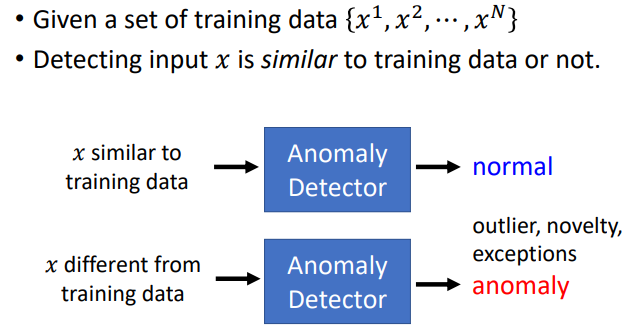
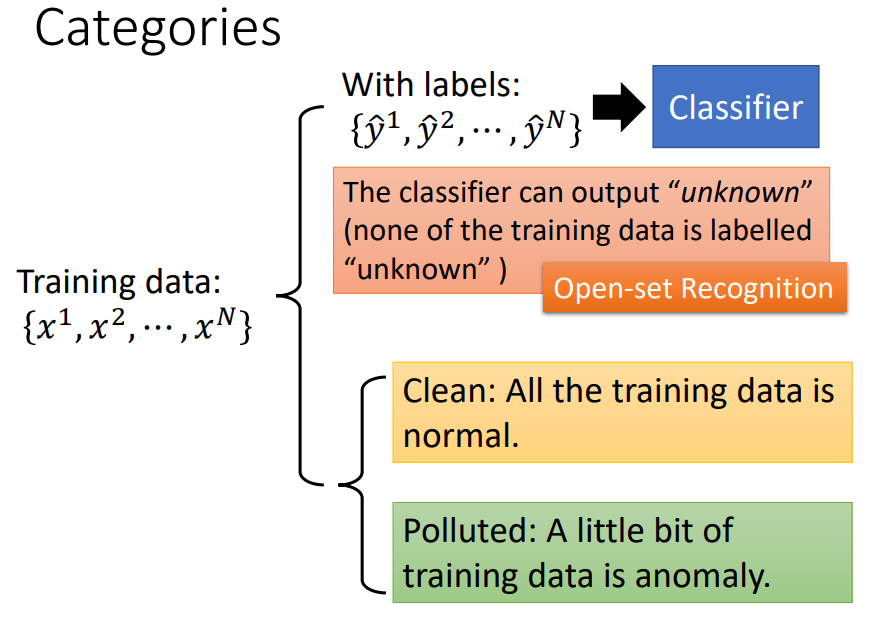
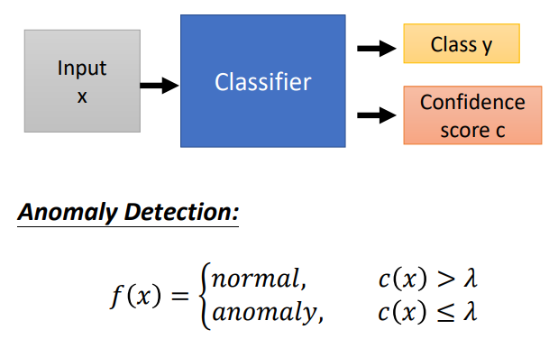
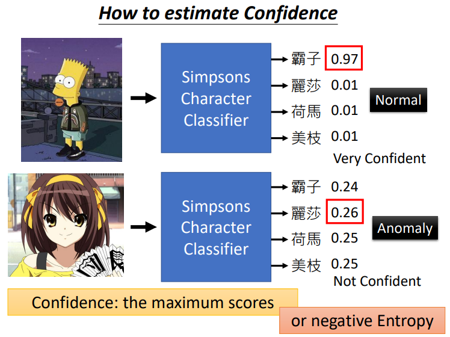
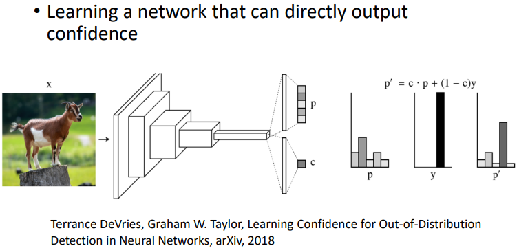
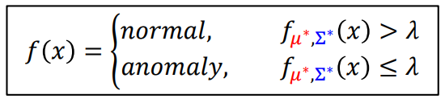
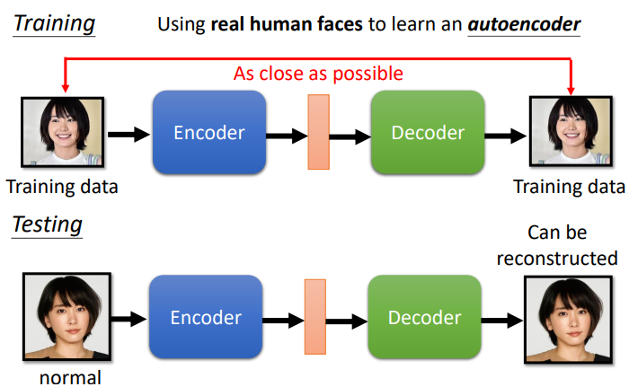
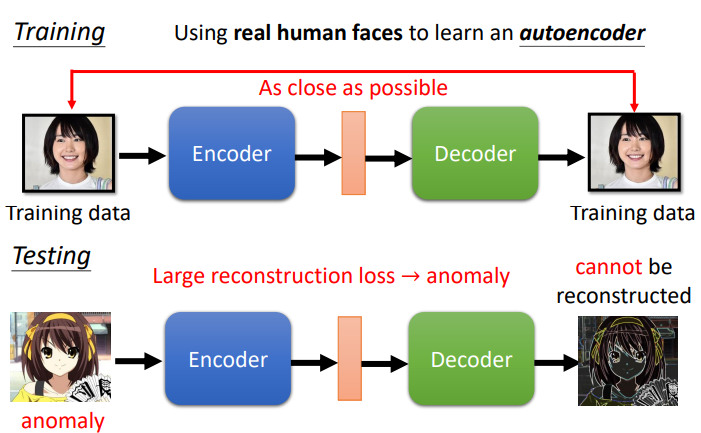
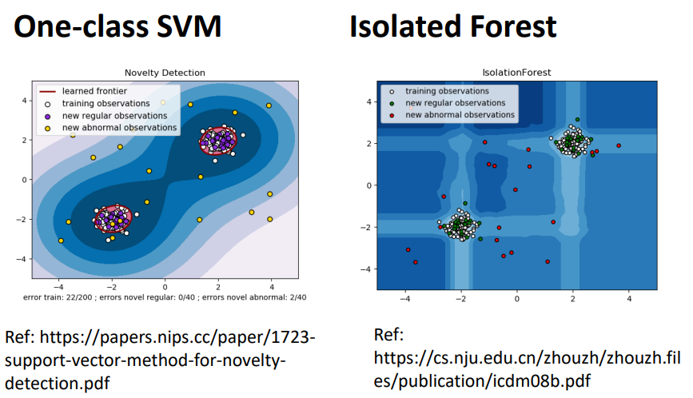

# Anomaly Detection

（异常检测，anomaly 有时也称为 outlier, novelty, exceptions 等）

判断当前数据与之前数据是否相似，这个相似的定义可以多种多样：

可以用来做：

- Fraud Detection

	Training data: credit card transactions ，判断 fraud or not 。

- Network Intrusion Detection

	Training data: connection，判断 attack or not 。

- Cancer Detection

	Training data: normal cells ，判断 cancer or not 。

## one class

为什么不用二元分类呢？

- 这些任务往往比较不容易收集到异常情况的数据，这种问题又叫 one class 的分类问题。
- 异常情况涵盖的情况过多，比如不是宝可梦的东西非常多。

## 大致分类

其中，Clean 和 Polluted 分支是没有 labels 的，也就是说，Clean 情况需要能保证训练数据都是 normal ；Polluted 情况可能存在 anomaly 数据。

## with labels

### 基于一般 Classifier

训练一个一般的 Classifier ，例如角色分类器，可以分辨辛普森的角色名称。

Classifier 会对分类结果有一系列的类别置信度 scores 。

可以在使用时设置一个门限 $\lambda$ ，用以区分 normal 和 anomaly ：

Classifier 在分类时，对于正确的分类，往往其分数较高，其余类分数较低；对于训练数据以外的数据，往往类别分数比较低且分散。

所以，也可依据分类 scores 的分布情况作为判断 anomaly 的标准：

分类器可能会学习到一些具有高度特征性但非常简单的特征来区分，当 anomaly 具有这种特征时，就容易会导致误判。

例如辛普森家族的人物脸都是黄的，当图片中有许多黄色时，分类器可能就好错误判断其为辛普森家族的人物，输出 normal 。

### Confidence Estimation

实际上，存在直接预测置信度的方法：

## without labels

### 估计分布

### auto-encoder

以判断是否是人脸为例：

输入训练数据，还原训练数据，当测试数据与训练数据是同一类时， auto-encoder 中学习到了新垣结衣的信息，所以可以比较好地还原输入，输入与还原输出相似度高：

当输入是动画人物时，比如团长，可能就无法很好地还原输入，输入与还原输出相似度低：

### SVM or Isolated Forest

