# GNN

## 总览

- 图神经网络（Graph Neural Network，GNN）（关系图）
	- 基于空间的卷积（空域卷积，Spatial-based Convolution）
		- 关系图的图神经网络（Neural Networks for Graph，NN4G）
		- 扩散卷积神经网络（Diffusion-Convolution Neural Network，DCNN）
		- 扩散图卷积（Diffusion Graph Convolution，DGC）
		- 混合模型网络（Mixture Model Networks，MoNET）
		- 图样本聚合（Graph SAmple and aggreGatE，GraphSAGE）
		- 图注意力网络（Graph Attention Networks，GAT）
		- 图同构网络（Graph Isomorphism Network，GIN）
	- 基于频谱的卷积（谱域卷积，Spectral-based Convolution）
		- 切比雪夫网络（Chebshev Network，ChebNet）
		- 图卷积网络（Graph Convolutional Network，GCN）

## 基本概念

- 空域（Spatial Domain）

	空间维度上的状态。以图片为例，空域是一张图片的一般状态，即像素的位置和像素值信息。

	- Graph 的空域是 Graph 的一般状态，即结点与边的结构关系信息。

- 傅里叶变换

	将信号在时域和频域表示形式间转换。

	- 时域（Time Domain）
		
		时间维度上的状态。
		
		- 横轴是时间。
		- 纵轴是强度（幅度，振幅）。（某时间的最终叠加信号的强度）
		
	- 频域（SpectralDomain）
		
		频率维度上的状态。
		
		- 横轴是频率。（变换到频域上即可将不同频率的信号分离出来）
		- 纵轴是强度（幅度，振幅）
	
	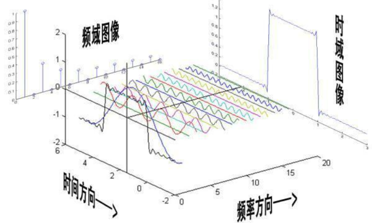

## Graph and Convolution

GNN 处理由结点（Node）和边（Edge）构成的图的数据，输入或生成 graph 。

一个结点可以从邻居上学到结构信息，可以使用卷积（能考虑一个区域的信息）考虑相邻结点的关系，将 convolution 的原理应用到 node feature 上。

有两种方式：

- Spatial-based convolution

	模仿图像中的卷积。

- Spectral-based convolution

	利用信号处理中的傅里叶变换将卷积推广到图上。

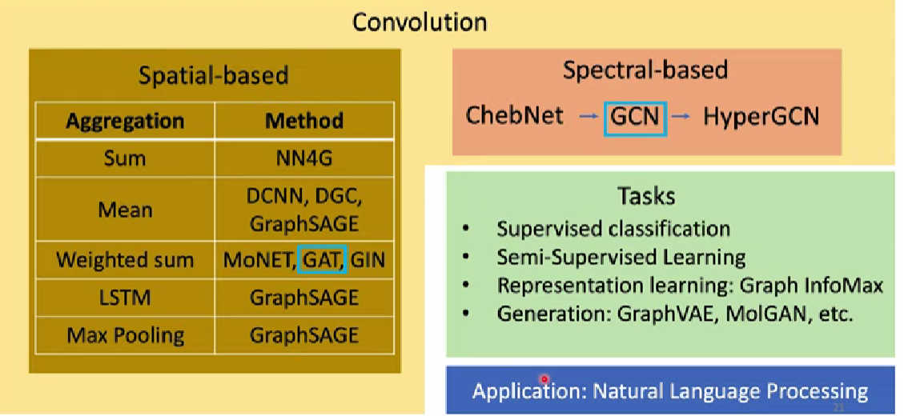

其中 GAT 和 GCN 最常用。

## Spatial-based Convolution

### 原理

每个结点具有 hidden state （$\boldsymbol h^{(l)}_i$）。

- 聚合（Aggregation）

	用 neighbor feature 更新下一层的 hidden state 。

- 读出（Readout）

	把所有 node 的 feature 集合起来代表整个 graph 。

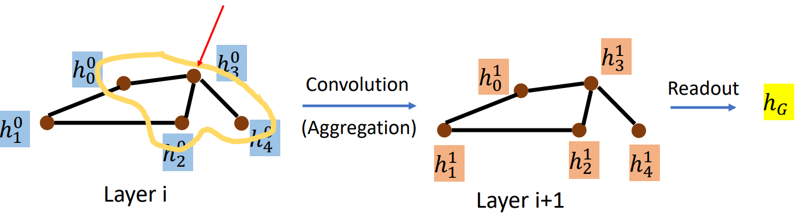

### NN4G

使用 embedding 等方式将输入 $\boldsymbol x_i$ 转换为 hidden state ：
$$
\boldsymbol h^0_i = \boldsymbol {\bar w}_i \boldsymbol x_i
$$
对邻居加和并做转换，最后再加上输入数据得到下一层的 hidden state ：（aggregation）
$$
\boldsymbol h^{(l+1)}_i = \boldsymbol {\hat w}^{(l)}_i (\sum \boldsymbol h^{(l)}_{neighbors}) + \boldsymbol {\bar w}_i \boldsymbol x_i
$$
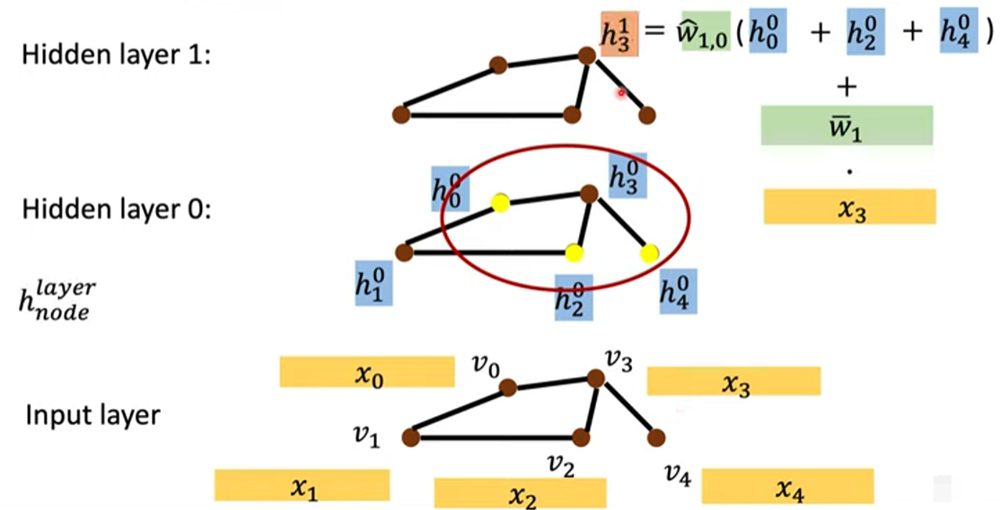

将每一层的 hidden state 取 mean 再各自转换后相加，作为整个 feature map 的输出：（readout）

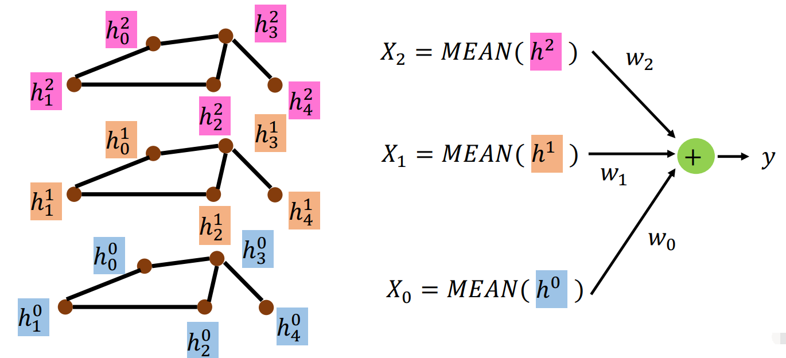

### DCNN

第 $0$ 层对与该结点距离为 $1$ 的结点的输入 $\boldsymbol x$ 取 mean，然后转换。

第 $1$ 层对与该结点距离为 $2$ 的结点的输入 $\boldsymbol x$ 取 mean，然后转换。

以此类推：（aggregation）

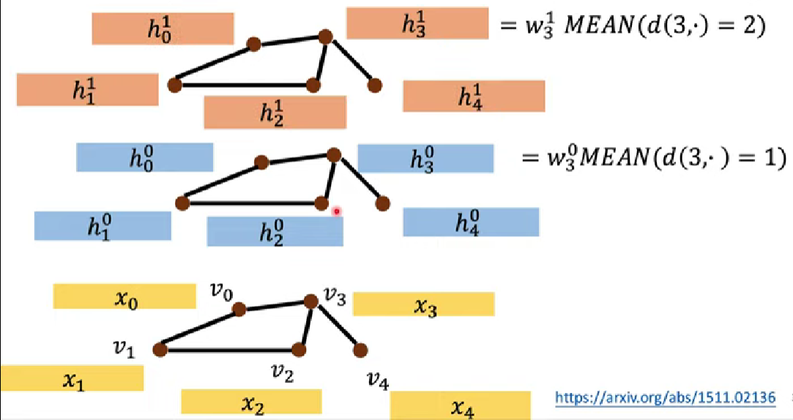

将每一层的 feature map 组合起来，做转换：（readout）

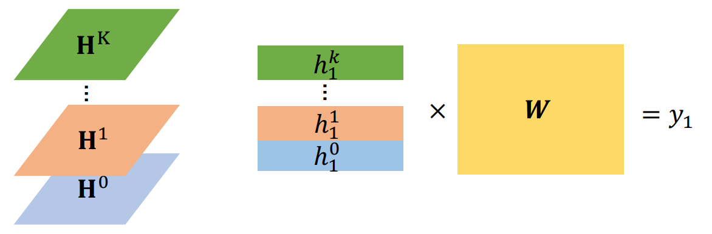

### DGC

aggregation与 DCNN 一致。

readout 只是将每一层的 feature map 加和。

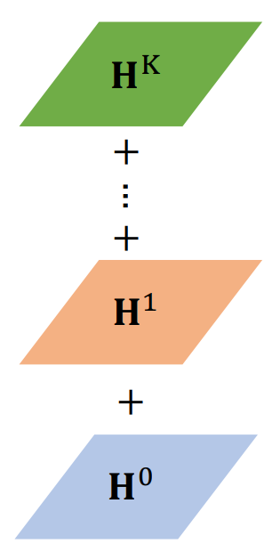

### MoNET

为相邻结点计算权重或距离：（aggregation）

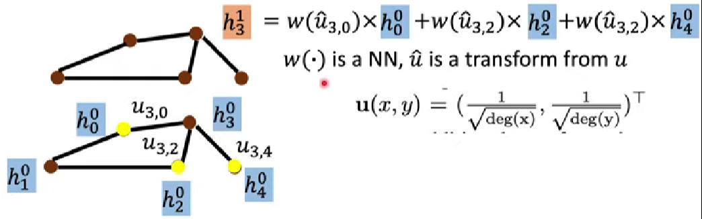

其中， $deg()$ 为取结点的度的倒数。

### GraphSAGE

尝试的 aggregation ：

- 对邻居取 mean 。

- 对邻居做 max pooling 。

- 对 LSTM 输入邻居的 feature ，最后一个 hidden state 作为最终 output 。

	邻居一般不具备顺序，每次更新随机 sample 顺序，以求忽略顺序的影响。

### GAT

对邻居做 attention ，学习邻居的权重（学习及计算邻居权重的函数）：

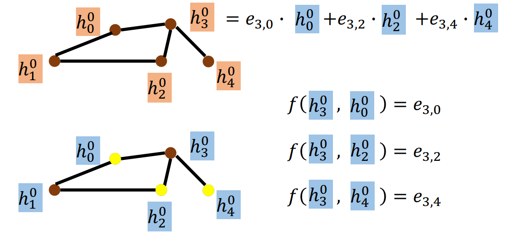

其中，$f()$ 为需要习得的函数，其内部含有需要学习的权重，其计算结果称为 Energy 。

### GIN

GIN 不仅提供了模型，还提供了理论证明，结论如下。

aggregation 应当将其邻居加和后，再加上自身与一个系数的积，即具有以下形式：
$$
\boldsymbol h^{(k)}_v = 
MLP^{(k)} \left( (1 + \epsilon^{(k)}) \boldsymbol h^{(k-1)}_v + \sum\limits_{neighbors(v)} \boldsymbol h^{(k-1)}_u \right)
$$
其中，$\boldsymbol h^{(k)}_v$ 为第 $k$ 层的 hidden representation ，$MLP$ 表示**多层感知机（Multi Layer Perception，MLP）**， $\epsilon$ 可以由模型学习，但令 $\epsilon = 0$ ，结果也不会太差，此时相当于将自身与邻居一起加和。

- 加和（Sum）

	一定要用加和才能 work ，用 mean pooling 或 max pooling 都不 work ，因为加和能综合更多的信息。

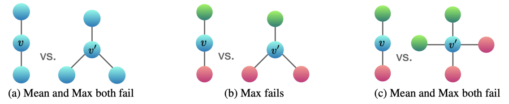

Mean 无法分辨 $(a),(c)$ 中的两个 Graph ，Max 无法分辨 $(a),(b),(c)$ 中的两个 Graph 。

## Spectral-based Convolution

### 原理

Spectral-based convolution 只支持无向图（这里的信号难以考虑方向）。

关键在于如何将对波谱的傅里叶变换（Fourier transform）和卷积，推广为对 graph 的傅里叶变换和卷积。

将信号（也就是 graph）通过傅里叶变换转化到频域，将另一组信号（也就是卷积核）也通过傅里叶变换转化到频域，最后用逆傅里叶变换转化回时域（亦空域），即得到经过 filter 的信号，完成 graph 的一次 aggregation ：

#### 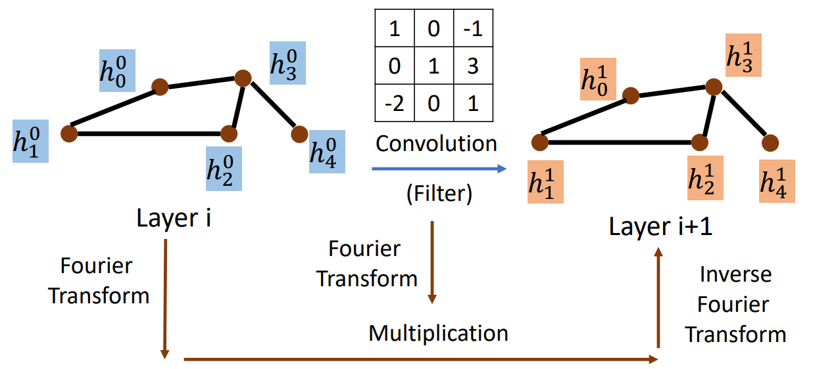拉普拉斯矩阵

- 邻接矩阵（Adjacency Matrix） $\boldsymbol A$
- 度矩阵（Degree Matrix）$\boldsymbol D$（结点的度，必定是对角矩阵） 

拉普拉斯矩阵（Laplacian Matrix）常见三种：

- Combinatorial Laplacian ：$\boldsymbol L = \boldsymbol D - \boldsymbol A$
- Symmetric Normalized Laplacian ：$\boldsymbol L^{sys} = \boldsymbol D^{- \frac 1 2} \boldsymbol L \boldsymbol D^{- \frac 1 2}$
- Random Walk Normalized Laplacian ：$\boldsymbol L^{rw} = \boldsymbol D^{- 1 } \boldsymbol L$

以 Combinatorial Laplacian 为例：

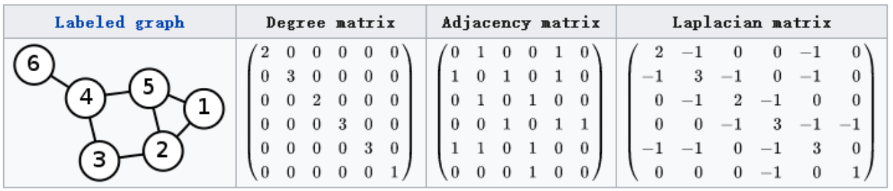

拉普拉斯矩阵是半正定矩阵（半正定意味着对称），有以下性质：

- 实对称矩阵一定有 $n$ 个线性无关的特征向量。
- 半正定矩阵的特征值一定非负。
- 实对阵矩阵的特征向量总是可以化成两两相互正交的正交矩阵。

由性质可知，拉普拉斯矩阵一定可以谱分解（也叫特征分解，对角化），即有：
$$
\boldsymbol L =
\boldsymbol U 
\begin{pmatrix}
\lambda_1 & & \\
& \ddots & \\
& & \lambda_n
\end{pmatrix}
\boldsymbol U^{-1}
=
\boldsymbol U 
\begin{pmatrix}
\lambda_1 & & \\
& \ddots & \\
& & \lambda_n
\end{pmatrix}
\boldsymbol U^T
=
\boldsymbol U 
\boldsymbol \Lambda
\boldsymbol U^T
$$
其中，$\boldsymbol U$ 一定是正交矩阵。

示例：

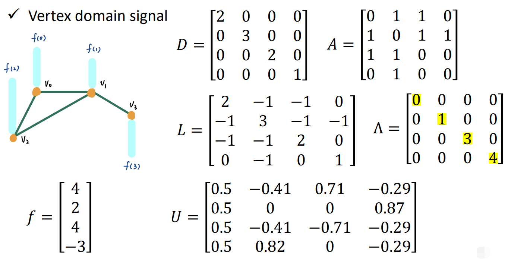

#### 推广傅里叶变换

一般傅里叶变换为：
$$
F(w) = \mathcal{F}[f(t)] = \int f(t) e^{-iwt} dt
$$
其中，$f(t)$ 为信号，$e^{-iwt}$ 为基函数。

考虑广义的特征方程：$AV = \lambda V$ ，其中 $A$ 是一种变换，$V$ 是特征向量或者特征函数（无穷维的向量），$\lambda$ 是特征值。

对于拉普拉斯算子 $\Delta$ 和 $e^{-iwt}$ ，有：$\Delta e^{-iwt} = \frac {\partial^2} {\partial t^2} e^{-iwt} = - w^2e^{-iwt}$ ，从而 $e^{-iwt}$ 也是拉普拉斯算子的特征函数（满足特征方程）,其 $w$ 与特征值有关联。

拉普拉斯矩阵也就是离散拉普拉斯算子，考虑拉普拉斯矩阵的特征向量 $\boldsymbol V$ ，有：$\boldsymbol L \boldsymbol V = \boldsymbol \lambda \boldsymbol V$ 。

用拉普拉斯矩阵替换拉普拉斯算子的位置作为信号，用其特征向量替换特征函数的位置，将连续积分换为离散积分（加和内积），得到 graph 上的傅里叶变换：
$$
F(\lambda_l) = \hat f(\lambda_l) = \sum\limits^n_{i=1} f(i) u_l(i)
$$
其中，$\lambda_l$ 是第 $l$ 个特征向量（拉普拉斯矩阵的某一列），$f(i)$ 是 graph 上的 $n$ 维向量的第 $i$ 个分量，$u_l(i)$ 是第 $l$ 个特征向量第 $i$ 个分量。

推广到矩阵形式为：
$$
\begin{pmatrix}
\hat f(\lambda_1) \\
\hat f(\lambda_2) \\
\vdots \\
\hat f(\lambda_n) 
\end{pmatrix}
=
\begin{pmatrix}
u_1(1) & u_1(2) & \cdots & u_1(n) \\
u_2(1) & u_2(2) & \cdots & u_2(n) \\
\vdots & \vdots & \vdots & \vdots \\
u_n(1) & u_n(2) & \cdots & u_n(n)
\end{pmatrix}
\begin{pmatrix}
f(1) \\
f(2) \\
\vdots \\
f(n) 
\end{pmatrix}
$$
即：
$$
\hat {\boldsymbol f} = \boldsymbol U^T \boldsymbol f
$$
推广的傅里叶逆变换为：
$$
\begin{align}
\boldsymbol f
& = (\boldsymbol U^{T})^{-1} \hat {\boldsymbol f} \\
& = (\boldsymbol U^{T})^T \hat {\boldsymbol f} \\
& = \boldsymbol U \hat {\boldsymbol f}
\end{align}
$$

#### 推广卷积

由卷积定理：函数卷积的傅里叶变换是函数傅里叶变换的乘积（一个域中的卷积相当于另一个域中的乘积，例如时域中的卷积就对应于频域中的乘积），即：
$$
\mathcal{F}(f*h) = \mathcal{F}(f) \mathcal{F}(h)
$$
从而两个函数在 graph 上的卷积：
$$
\begin{align}
(f * h)_G
& = \mathcal{F}^{-1} [ \mathcal{F}(f) \mathcal{F}(h) ] \\
& = \mathcal{F}^{-1} [(\boldsymbol U^T \boldsymbol f) \odot (\boldsymbol U^T \boldsymbol h)] \\
& = \boldsymbol U [(\boldsymbol U^T \boldsymbol f) \odot (\boldsymbol U^T \boldsymbol h)]
\end{align}
$$
其中，$\odot$  为哈达玛积（Hadamard product），即对应位置相乘，$\boldsymbol h$ 可作为卷积核（一个函数）。

$\hat {\boldsymbol f} = \boldsymbol U^T \boldsymbol f$  即为 $\boldsymbol f$ 的傅里叶变换，$\hat {\boldsymbol h} =  \boldsymbol U^T \boldsymbol h$ 即为 $\boldsymbol h$ 的傅里叶变换，后者可写为矩阵形式：
$$
\begin{pmatrix}
\hat h(\lambda_1) & & \\
& \ddots & \\
& & \hat h(\lambda_n)
\end{pmatrix}
=
h_{\lambda}(\boldsymbol \Lambda)
$$
其中, $\lambda_1 \dots \lambda_n$ 即为要学习的参数，有：
$$
(f * h)_G = \boldsymbol U h_{\lambda}(\boldsymbol \Lambda) \boldsymbol U^T \boldsymbol f
$$
假设输入为 $\boldsymbol x$ ，卷积输出为 $\boldsymbol y$ 有：
$$
\begin{align}
\boldsymbol y & = (f * h)_G \\
& = \boldsymbol U h_{\lambda}(\boldsymbol \Lambda) \boldsymbol U^T \boldsymbol x \\
& = h_{\lambda}(\boldsymbol U \boldsymbol \Lambda \boldsymbol U^T) \boldsymbol x \\
& = h_{\lambda}(\boldsymbol L) \boldsymbol x
\end{align}
$$
常见将 $\lambda$  换为 $\theta$ 表示，写为：
$$
\boldsymbol y =  g_{\theta}(\boldsymbol L) \boldsymbol x
$$
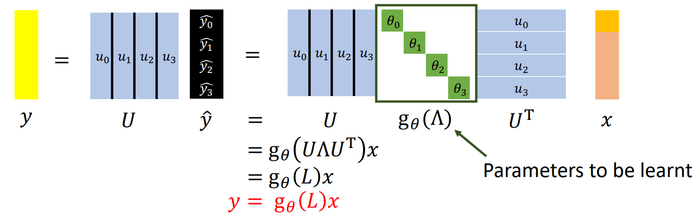

其中，$g_\theta()$ 可以是任意指定的卷积核函数，$\theta$ 是需要学习的参数。

#### 缺陷

- 复杂度

	待学习参数 $\theta$ 的数量取决于输入的图的大小，当图有 $n$ 个结点时，就有 $n$ 个 $\theta$ ，复杂度为 $O(n)$ 。

- not localize（相当于 kernel size 的限定 filter 的范围）

	选定的 $g_\theta()$ 函数，只要能够泰勒展开到 $n$ 次方，就可以考虑到该结点相连的 $n$ 个结点的信号，因此其不符合 kernel size 的限定。

### ChebNet

$g_\theta()$ 选择到 $k$ 次方的多项式函数，以实现 k-localized ，同时需要学习的参数变为 $k$ 个，即多项式函数的系数。

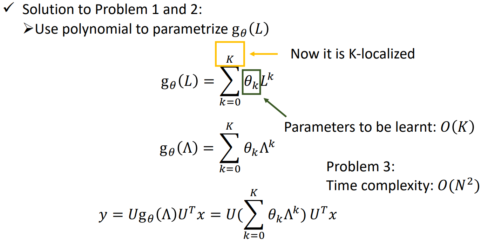

但出现了新问题，即对 $\boldsymbol x$ 做卷积时，要与 $\boldsymbol U, \boldsymbol U^T$ 相乘，会出现 $O(N^2)$ 的时间复杂度。

使用**切比雪夫多项式（Chebyshev Polynomials）**，其是由递归定义的多项式函数：
$$
\begin{cases}
T_0(x) = 1 \\
T_1(x) = x \\
T_{n+1}(x) = 2xT_n(x) - T_{n-1}(x)
\end{cases}
$$
其能够使用递推以减少计算量：

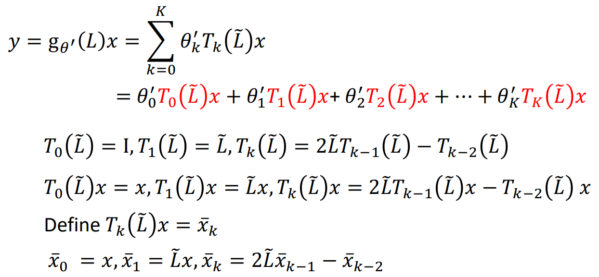

总复杂度 $O(KE)$ ，其中 $K$ 为多项式阶数，$E$ 为图的边数（拉普拉斯矩阵一般是稀疏的，可以只记录存在的边，使用稀疏张量加速运算）。

### GCN

GCN 在也适用切比雪夫多项式，取其 $K = 1$ ，然后不断推导，得到 $H^{(l+1)}$ 的式子：

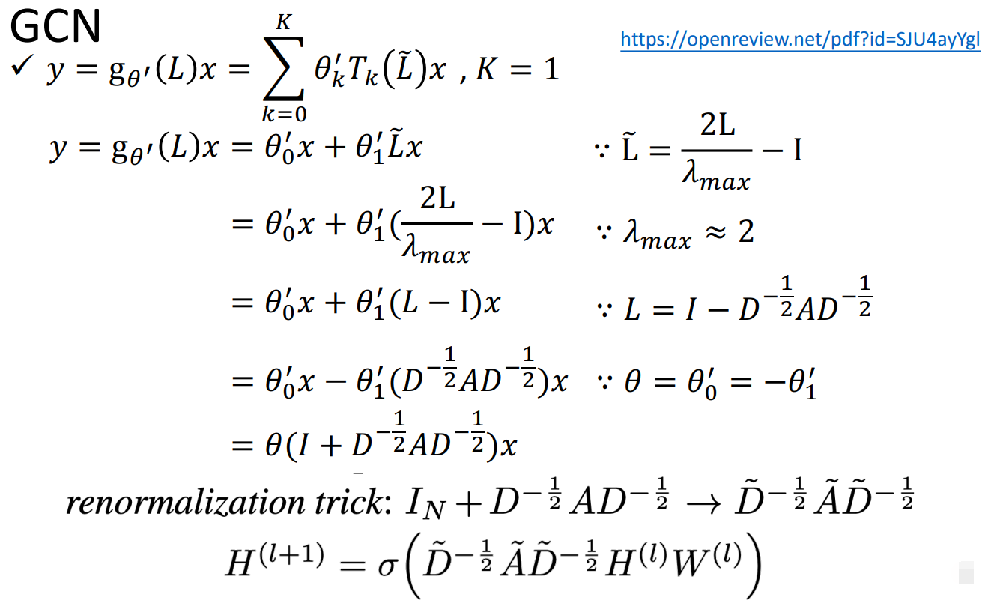

$H^{(l+1)}$ 的式子等价于：
$$
\boldsymbol h_v = A \left( \frac 1 {|Neighbor(v)|} \sum\limits_{u \in Neighbor(v)} \boldsymbol W \boldsymbol x_u + \boldsymbol b \right)
$$
即将当前结点与所有邻居经过 $\boldsymbol W$ 转换，然后取平均，再加上一个偏置项 $\boldsymbol b$，最后经过一个非线性激活函数 $A$ ，从而得到结点 $v$ 的 aggregation  的结果。
