# Flow-based Generative Model

[原理与数学细节可见](https://www.seeprettyface.com/pdf/Note_Flow.pdf)

一个 Generator 的网络 G ，其定义了一个输入分布（一般是个简单正态分布）到输出分布 $p_G$ 的映射。

要使得其 $p_G$ 与数据代表的分布 $p_{data}$ 月接近越好，即是最大化当前分布对资料（即 data）的似然：

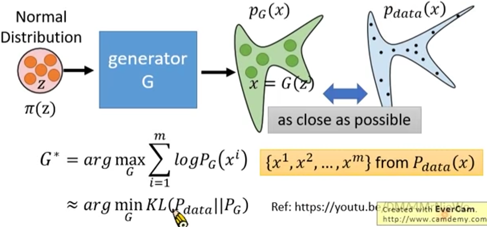

FLow model 构造了一种输入与生成图像间的双向可逆映射。

训练时输入图片，输出向量（必须与输入同维，否则不可能可逆），使用时随机输入一个向量，逆向生成图片。

Flow 串联多个 G 以增强变换能力，这也是 Flow 名称的由来。

## 建模思维

构建一个简单分布（输入数据）到一个复杂分布（图片）的映射，

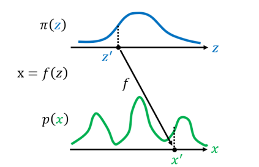

### 一维均匀分布

假设两个分布都是均匀分布，其概率总和为 $1$ ，即面积为 $1$ ：

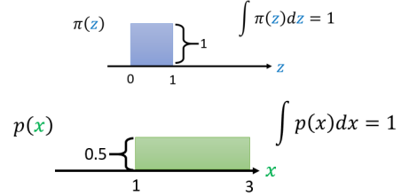

只需一个线性函数就能构建 $z \to x$  的映射 $x = f(z) = 2z + 1$：（$note\ that\ 1 = 2 \times 0 +1\  and \ 3 = 2 \times 1 + 1$）

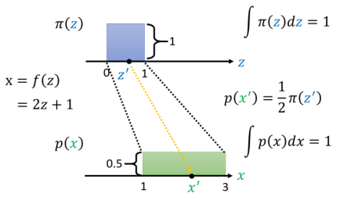

其中，$z',x'$ 分别是其分布的一个采样点。

### 一维非均匀分布

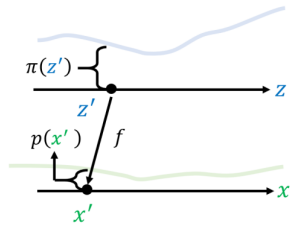

可以在很小的间隔上认为其是均匀分布，对每个小段 $\Delta$ （每个小段就是一个采样样本）计算，然后将每个小段累加起来，当 $\Delta$ 极其小时，就可以写成 $\rm d$ ：  

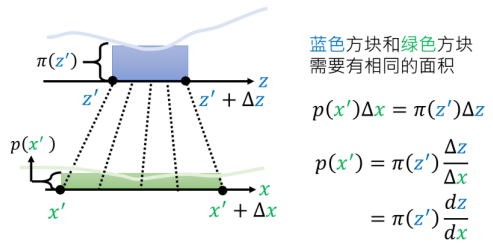

进一步的，$\Delta$ 是差值，可能为负（往负方向偏移），所以加上绝对值：

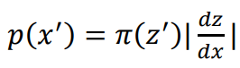

### 二维分布

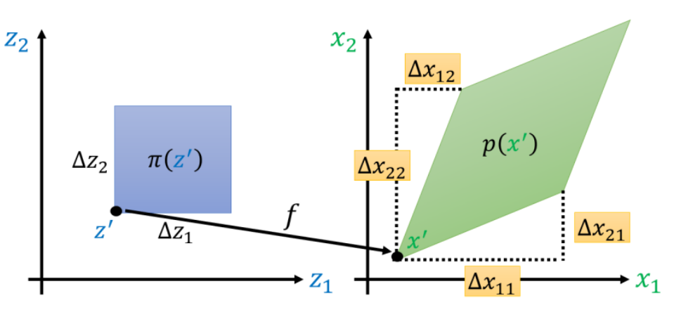

其中，高度（二元函数的函数值）未画出。

取蓝色和绿色的一小部分，有其面积相等：

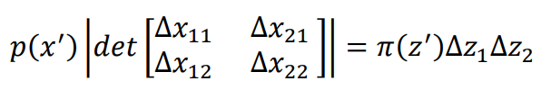

其中 $\det$ 为行列式，表示小菱形的面积。

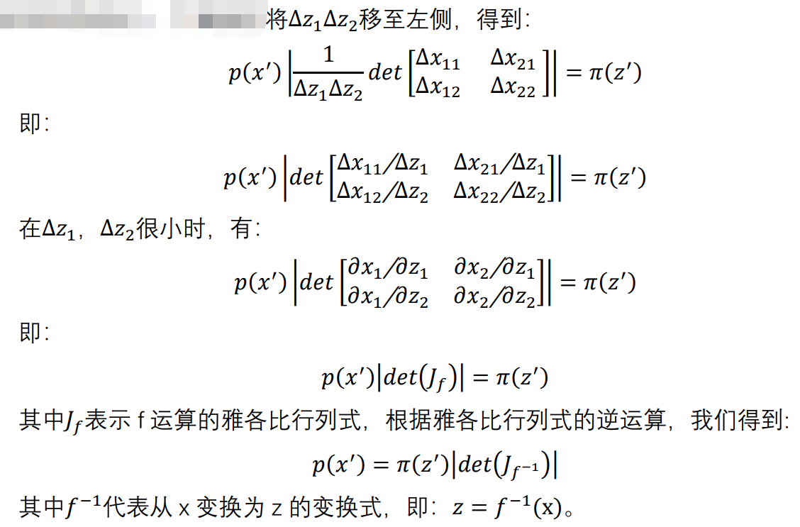

至此，可以得到 $z,x$ 中任意一组对应采样点 $z',x'$ 的关系为（二者仅仅相差一个雅各比行列式）：

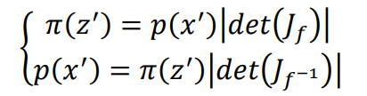

## 训练框架

可以得到样本点和样本点之间的关系为：

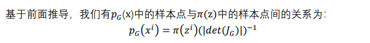

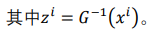

从而可以求解生成器 $G$ ：

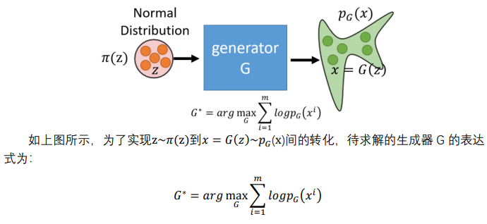

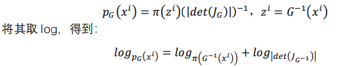

要求解这个式子有两方面的困难：

- $\det(J_{G^{-1}})$ 是不好计算得，雅各比矩阵一般具有较高的维度，行列式计算量大，需要对其进行优化。
- 表达式含 $G^{-1}$ 有关，目标是求 $G$ ，需要设计一个可逆的 $G$ ，且可逆过程容易计算。

表达式只与 $G^{-1}$ 有关，可以在训练中训练 $G^{-1}$ ，然后快速计算出 $G$ 用来生成图像：

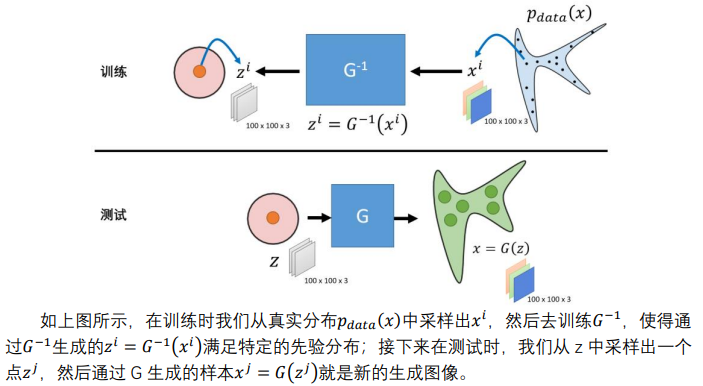

## Coupling Layer

（耦合层）

为了让 $G^{-1}$ 和其行列式易于计算，Flow-based model 采用耦合层实现：

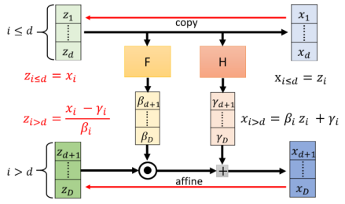

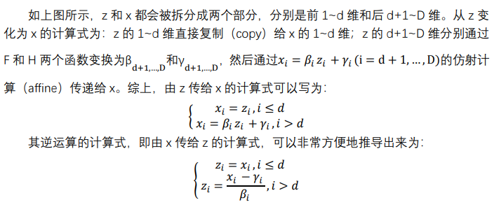

其中，$F,H$ 两个函数可以为任意函数，也可以为神经网络。

其在 $G$ 的行列式上也是容易的：

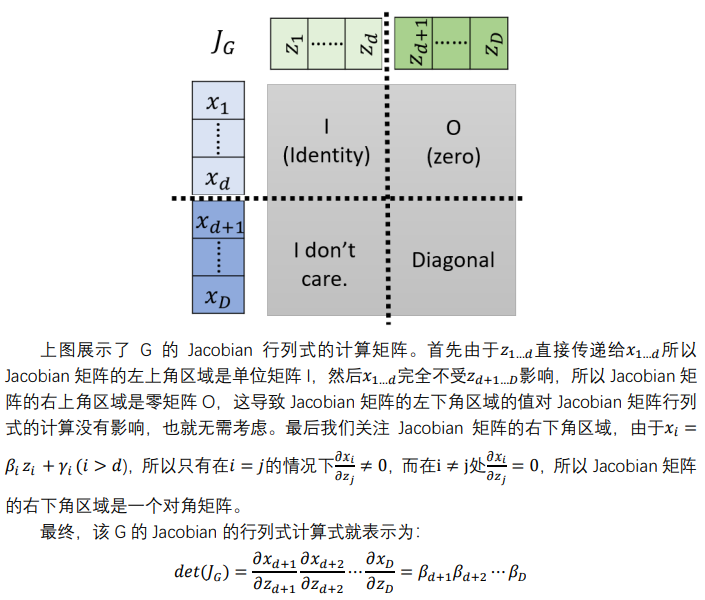

## Flow

当个耦合层的变换能力有限，可以堆叠多个耦合层（也即多个 $G$），形成 Flow：

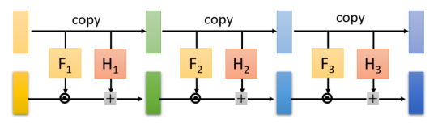

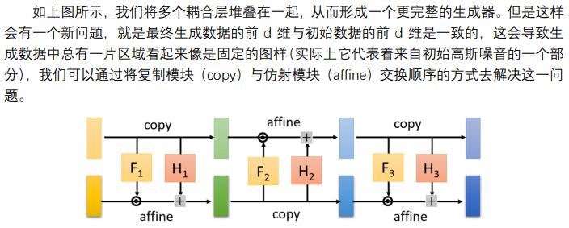

这些交换的方式有非常多种，也让模型学习变换，但要主要引入的参数要影响雅各比矩阵的逆和行列式计算得简便性。

从而堆叠多个耦合层可以实现复杂的可逆的分布变换：

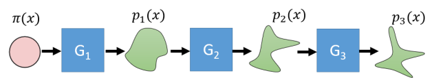