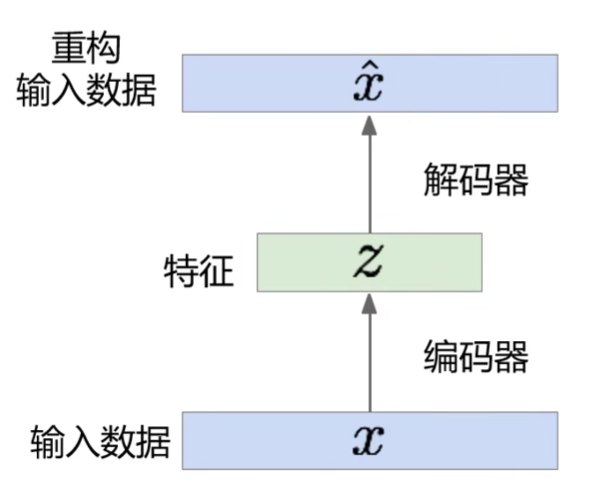

# VAE

（变分自动编码器，Variational Auto-Encoder）

[Auto-Encoding Variational Bayes 2013](https://arxiv.org/pdf/1312.6114.pdf)

## Auto-encoder

（自动编码器）

编码器对输入数据进行降维（编码，低维特征表示），然后使用解码器从编码中恢复原数据。

- 编码器应用

	使用训练好的编码器提取低维特征，然后训练一个分类器对该低维特征进行分类。

	- 这样分类效果一般不好，因为不能保证编码器学到的是最适合分类的特征。

- 解码器应用

	输入一个低维特征（可以人为指定），重构数据，可用于生成任务。

	- 模型编码的特征空间不能很好地描述输入的分布，只能建立大致的离散直接映射。
	- 模型编码的特征空间中的点不能描述图像的过渡中间态（不一定连续，分布描述不佳），可能生成不理想的效果。

- 编码概念扩展

  编码可以表示为多种事物，比如一串数字，文字串等，从而完成编码到输出的映射的构建。

- 编码可行性

	为什么 auto encoder 能够将数据进行低维表示并还原？

	- 以图片低维表示还原图片为例，并不是所有的矩阵都可能组成图片，所以可以压缩。

## VAE 结构

VAE 也有 encoder 和 decoder ：

其中，两组向量 $\boldsymbol m, \boldsymbol \sigma$ 由 encoder 生成， $\boldsymbol e$ 由正态分布 sample 出，他们运算后得到 $\boldsymbol c$ ，再输入 decoder 重建输入，希望 input 和 output 越接近越好。

$\boldsymbol m$ 是 original code ，$\boldsymbol c$ 是加上噪声的 code 。

$\boldsymbol \sigma$ 是模型自己学习的噪声方差组分，方差应当是正的，所以用对数处理 $e^{(\boldsymbol \sigma)}$ 得到方差。

$\boldsymbol e$ 由一个固定的分布 sample 出，其方差固定，经由 $\boldsymbol \sigma$ 调整。

如果只最小化重建 error（input 和 output 的相似度），则 $\boldsymbol \sigma$ 会是负无穷，方差 $e^{(\boldsymbol \sigma)} = 0$ ，这时输入和输出没有噪声，最接近。

需要添加约束项，即亦最小化上图右下角的式子（其中 $\boldsymbol \sigma$ 最小为 $0$ ，使方差不至于太小，最小为 $1$ ； $\boldsymbol m^2$ 是一个一般的正则项，起平滑作用）。

## 直观理解

VAE 对每个分布加入了噪声，噪声可能会向两边延伸，使得延伸到的部分（单）像满月或（单）像半月，延伸的交界处，最小化会使得其又像满月又像半月，可能就会出现中间态的结果：

物体的特征可能是非常多个正态分布的叠加（从而具有连续性），VAE 根据输入从其中一个正态分布中 sample 出一个样本。

缺点：VAE 往往是记住数据或对数据特征进行简单的组合，缺乏生成新样本的创新性。
