# BERT

- BERT（Bidirectional Encoder Representation from Transformers）

BERT 大量应用在 Self-supervised Learning 。

BERT 一般输入文字。

BERT 用到的一些标志位：

- [CLS] 

	句首位。

- [SEP] 

	分隔两个句子。

- [UNK] 

	未知字符。

- [MASK]

	遮盖单词。

扩展：

- [BERT Embryology](https://arxiv.org/abs/2010.02480)（BERT 胚胎学）

	BERT 的训练过程，BERT 什么时候学到了什么。

## 结构

BERT 使用 Transformer 的 Encoder ，用以提取特征。

## Self-supervised Learning

（自监督学习，SSL）

自监督学习不需要标签，属于 unsupervised learning，其主要是为其它任务做准备，进行监督学习任务。

一般 Self-supervised learning 是让模型做一些“填空”的任务。

Self-supervised learning 的过程也可以叫 Pre-train 。

何时需要标签？

- 在 pre-train 中，先用 BERT 做一些 Self-supervised 任务，此时不需要标签。

- 在针对具体下游任务 fine-tune 时，需要一些标签。
- 可以知道，pre-train 和 fine-tune 的过程合起来，是一个 semi-supervised 的过程。

BERT 的训练是一个十分艰难的过程，需要大量的资料与计算资源。

### Masking Input

把输入的文字随机 mask 掉一部分，有两种 mask 的方式：

- 将文字换为 [MASK] ，作为一个 special token 。
- 将文字随机换位某一个文字。

让 BERT 学习预测 [mask] 部分原来的文字：

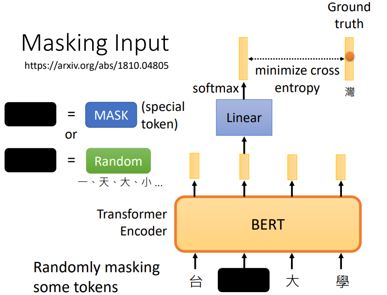

其中，Linear 指一个线性转换。

### NSP

- Next Sentence Prediction（NSP）

从资料中取出两个句子，连在一起，用 [SEP] 分隔，在句首加上 [CLS] ，输入 BERT ，只关注 BERT 在 [CLS] 处的输出，做一个二元分类，回答这两个句子是否是接续的：

一些 paper 说 NSP 对 BERT 要做的事没有用，因为 NSP 的任务可能比较容易，不能让模型学到有用的东西。

另一种 paper 说有用的任务是 SOP 。

- SOP（Sentence Order Prediction）

	从资料取出两句接续的句子，让 BERT 分辨其先后顺序。

## Fine-tune

### downstream tasks

BERT 只会做“填空题”，但其可以被调整、改造后用来做各式各样的真正在意的**下游任务（downstream task）**，这个用来做下游任务的行为叫做 fine-tune ：

相应的，不使用 fine-tune 做任务称为 train from **Scratch** （从零开始、从头开始、白手起家）。

## 使用 BERT

### GLUE

- GLUE（General Language Understanding Evaluation）

[GLUE](https://gluebenchmark.com/) 是一个任务集（benchmark），包含一系列 Text 相关的任务。

一般将模型经过各种 fine-tune 后用在 GLUE 的九个任务上，以测试一个 self-supervised 模型的能力。

- Corpus of Linguistic Acceptability (CoLA)
- Stanford Sentiment Treebank (SST-2)
- Microsoft Research Paraphrase Corpus (MRPC)
- Quora Question Pairs (QQP)
- Semantic Textual Similarity Benchmark (STS-B)
- Multi-Genre Natural Language Inference (MNLI)
- Question-answering NLI (QNLI)
- Recognizing Textual Entailment (RTE)
- Winograd NLI (WNLI)

GLUE 也有中文版本：[CLUE](https://www.cluebenchmarks.com/)  。

### Case 1

对于 Sentiment Analysis 任务，输入句子，句首加 [CLS] ，关注 [CLS] 位置的输出，输出 positive 或 negative 的类别：

- 初始化时，Linear 参数是随机初始化的，但 BERT 初始化为 pre-train 后的状态，比随机初始化 BERT 的结果好。
- 训练时，Linear 和 BERT 都由梯度下降更新参数。

对于 scrath 方式，BERT 的参数就是随机初始化的。

### Case 2

对于 POS tagging（词性标注）任务，输入句子，句首加 [CLS] ，预测词性类别：

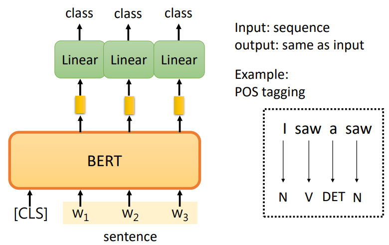

### Case 3

对于自然语言推断（Natural Language Inferencee，NLI），输入一个前提（premise）和一个假设（hypothesis)，由模型判断前提和假设的关系：

训练结构：

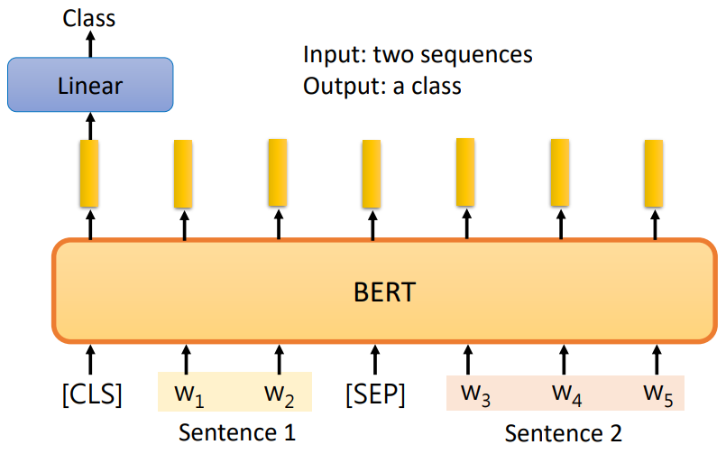

### Case 4

- 提取性问答（Extraction-based Question Answering，QA），其问题的答案一定在文本中，即提取性。

输入包含许多文字 Document 和 Query ，输出两个数字，$s$ 代表 Answer 的起始单词的位置， $e$ 代表 Answer  的结束单词的位置：

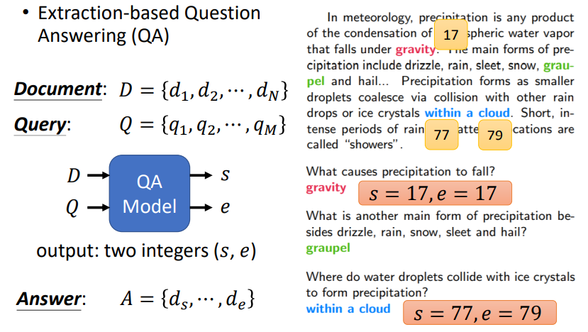

使用两个随机初始化的向量，橙色和蓝色。

首先橙色和 document 对应的输出做内积，然后 softmax 输出，分数最高的位置即是 $s$ 的值：

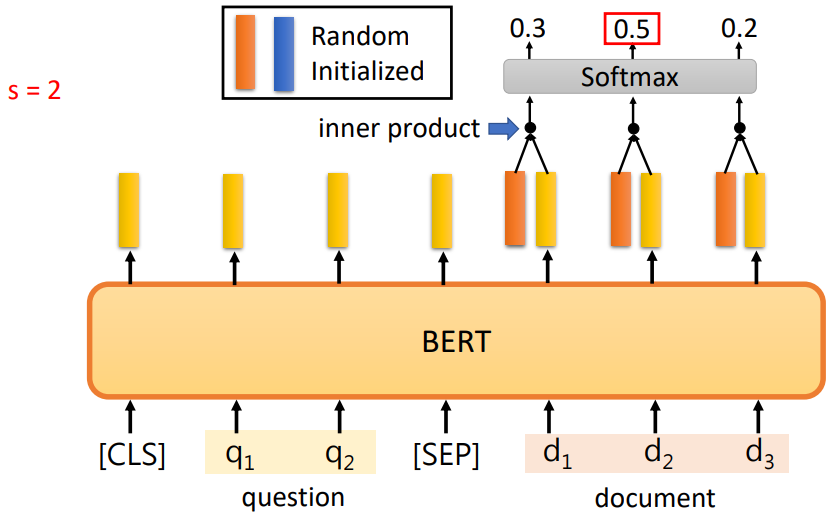

蓝色同理，分数最高的位置即是 $e$ 的值：

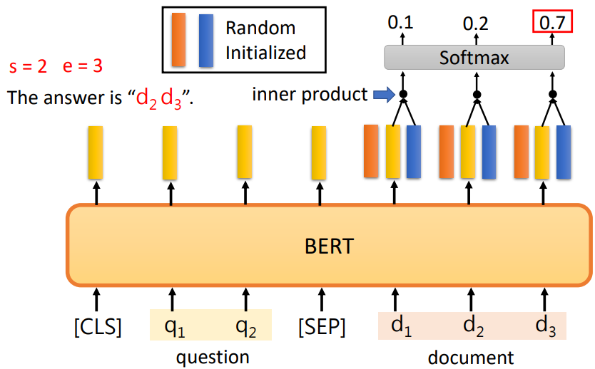

## Seq2Seq

如何 pre-train 一个 Seq2Seq model 呢？

BERT 只 pre-train 了 Encoder ，没有 pre-train Decoder ，如何 pre-train Decoder ？

对 Encoder 输入弄坏的句子，Decoder 还原句子，训练出来就是一个 pre-train 的 Seq2Seq 的 model ：

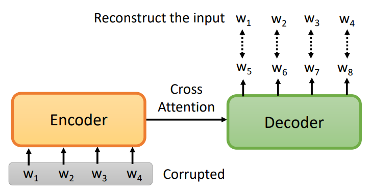

弄坏有各种各样的方法：

- 盖住单词。（MASS）
- 删除单词。
- 打乱单词。
- 旋转单词，
- 既盖住又删除等。

BART 模型发现将各种方法都用上，效果会比较好。

T5（Transfer Text-to-Text Transformer）模型在 C4（Colossal Clean Crawled Corpus）数据集上，也尝试了各种方法。

## 原理

### 上下文

使用 BERT 做 Embedding 时，不同词语中的相同字的 embedding vector 是不同的，强于 Word Embedding 的功能。

一个单词的意思可以看经常与其一同出现的单词，即其上下文，而 BERT 能够从上下文中提取信息。

BERT 的 embedding 又叫 Contextualized Word Embedding 。

### 深意

是否 BERT 就是因为能够提取上下文信息而 work 呢？

不一定，即便是没有上下文的情况，BERT 也能 work ！

用 BERT 做 蛋白质、DNA 或音乐的分类，以 DNA 为例：（类别缩写不必纠结具体意义）

将 A T C G 分别直接对应到四个单词，将序列输入 BERT ：

注意，其中 BERT 的初始参数是通过“填空题” pre-train 的，而输入序列是没有什么上下文关系的，然而使用该初始参数的 BERT 的分类结果是比随机好的：

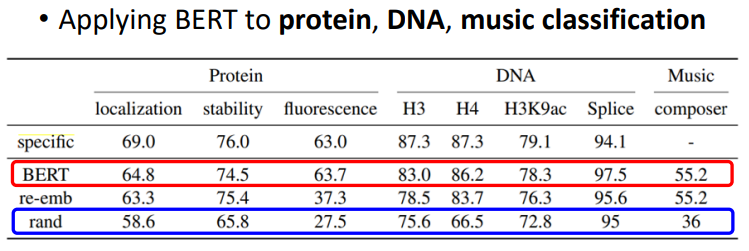

**也许** BERT pre-train 后本身就是一个比较好的初始化参数，与语义无关。

## Multi-lingual BERT

简称 Multi-BERT 。

### Cross-lingual Alignment

如图，用 104 种语言（包括中文） pre-train 的 BERT ，针对 QA 任务，只用英文做训练（fine-tune），然后用中文测试，也有 $78.8$ 的正确率：

可能不同语言间，意思相近的词汇的向量都会很接近。（这种多语言训练需要大量的资料）

### 语种差异

Multi-BERT 能够在英文问题填英文，中文问题填中文，如果不同语言词汇意义相近，那么为什么不会混填？

即使是词汇意思相近，仍然存在差异，而 Multi-BERT 能够区分这种语言的差异。

将所有中文的 embedding 平均起来，将所有英文的 embedding 平均起来，然后作差，得到蓝色的向量（中英间的差距）。然后给 Multi-BERT 一句英文，得到其的 embedding ，将这些 embedding 加上蓝色的向量，然后就变为了中文的句子。再使用 Multi-BERT 做中文的填空题，Multi-BERT 就能填中文的答案了（通过蓝色向量转化）：

详见：https://arxiv.org/abs/2010.10041 。

## for Speech and Image

在语音和图片上的自监督学习。

### SUPERB

（Speech processing Universal PERformance Benchmark）

一个语音上的任务集（benchmark）：

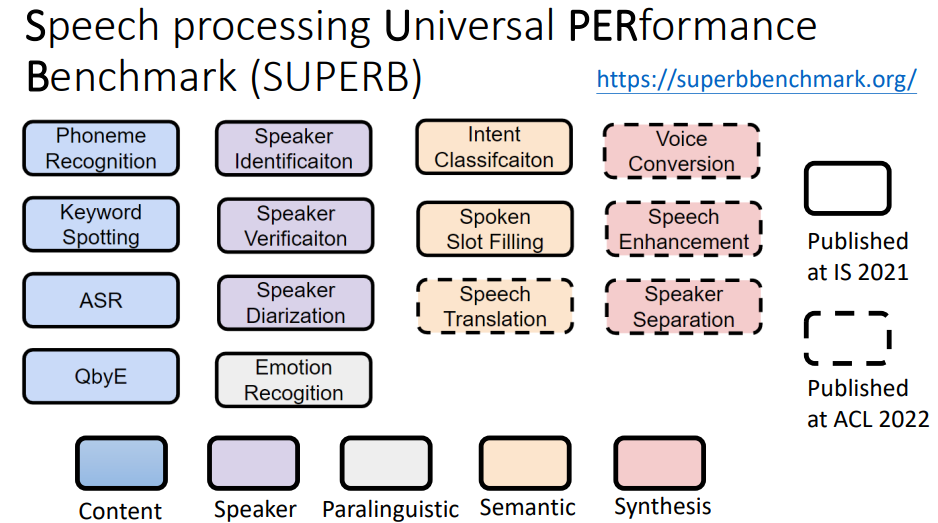

### Generative Approach

#### Masking

将一些语言片段 mask ，然后输入 Mockingjay 模型（结构与 BERT 一样，只是针对语音数据做了一些策略改动），输出一排向量，用这些向量还原输入。

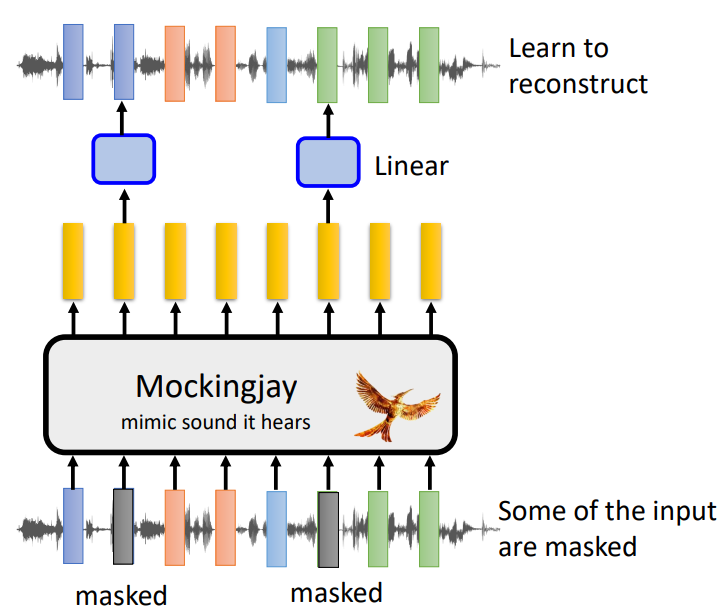

语音数据不同于文字，相邻 feature 间的差异非常小，如果一个位置只 mask 一个 feature，可能导致模型只能学到简单的内插，因此要一次 mask 多个相邻的 feature 。实际上，文字的 mask 中，也可以 mask 多个连续 token 。

对某些语音维度 mask 可以更容易学习到关于 speaker 的信息。

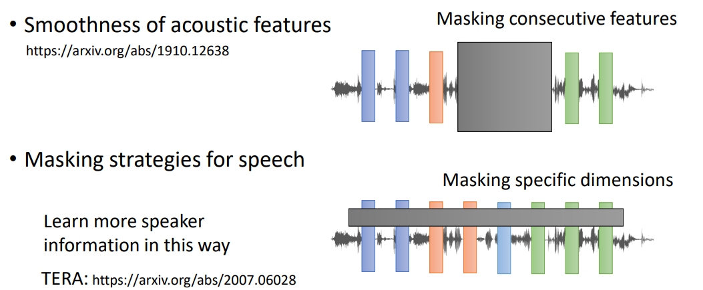

#### Predicting Future

预测下一个特征，在语音上，往往要预测下第 $n$ 个特征，

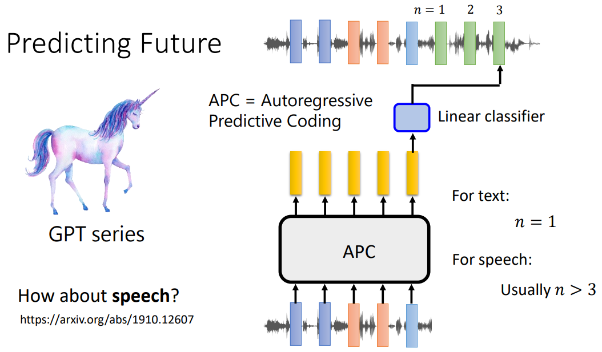

对于图片，将图片处理为 sequence ，一样可以采用 masking 和 predicting future ：

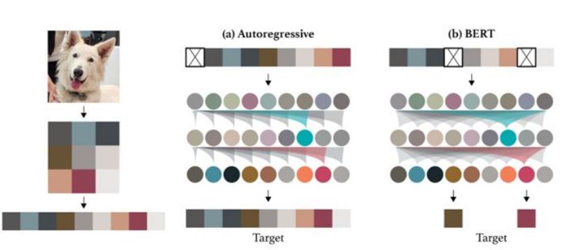

### Predictive Approach

预测图像的旋转角度：

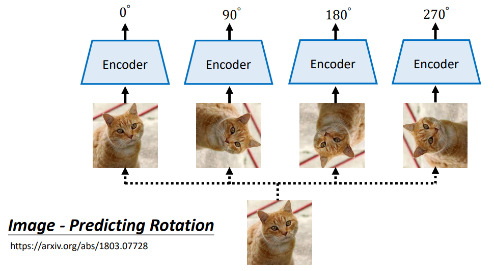

将图像切分为两块，然后预测其中一块在另一块的附近什么位置；预测语音中的两段相距多少秒：

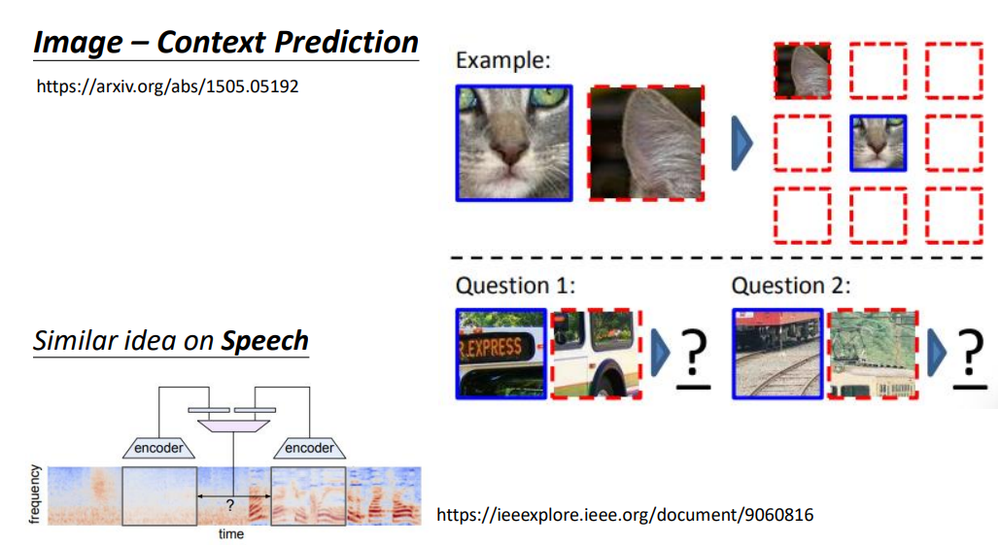

直接预测复杂的东西比较困难，可以将特征进行 clustering 后的类别作为预测对象，在 mask 输入的基础上进行训练：

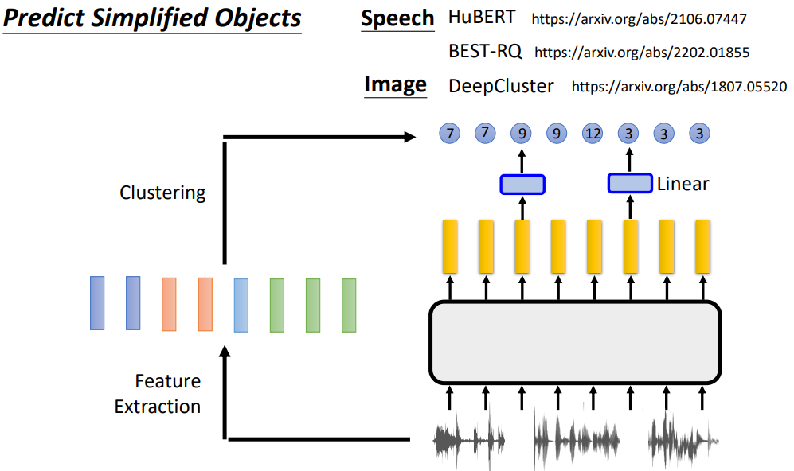

### Contrastive Learning

（对比学习）

让机器在不产生预测的情况下进行自监督学习。（属于自监督学习的范畴）

#### 基本思想

使同属于 positive 或 negative 的两个样本的特征编码越接近越好，分属于 positive 和 negative 的两个样本的特征编码越远越好：

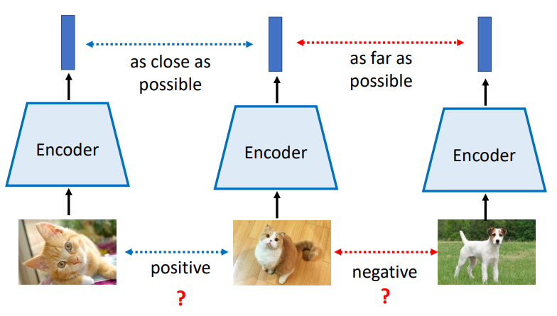

其中，猫与猫越接近越好，猫与狗越远越好。

自监督学习中并不知道样本的类别，所以需要一些处理手段。

#### for iamge

同一张图片的不同增强结果属于同一类别，另一张图片的增强结果属于不同类别：

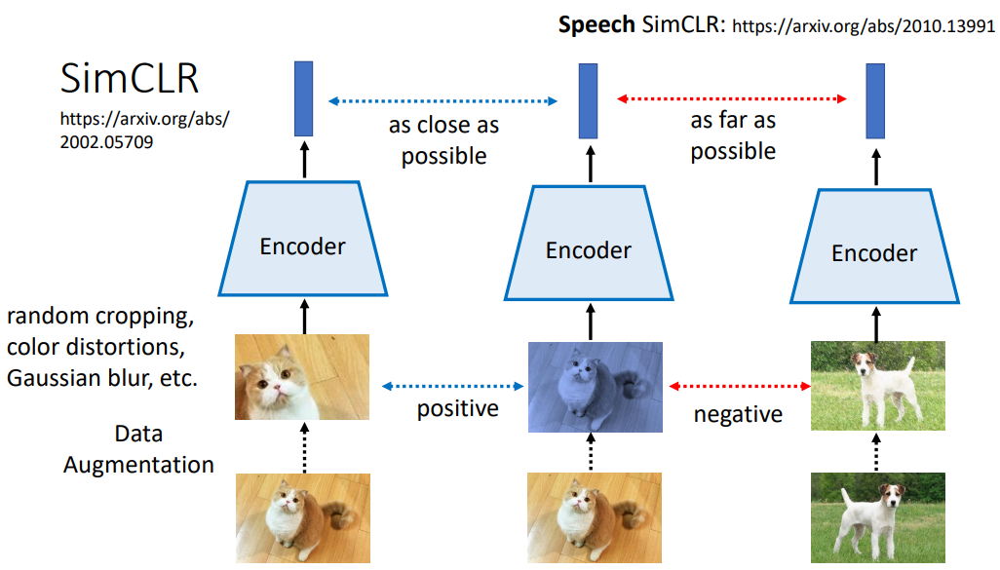

#### for speech

##### CPC 与 Wav2vec

将语言信号输入 encoder 进行编码（编码向量），然后使用 predicter 对编码预测出一个特征向量（预测向量）。

CPC 使用 GRU 作为 predicter ，Wav2vec 使用 CNN 作为 predicter 。

将预测向量和其相邻位置的编码向量同属于 positive ，与其它句子或不相邻的编码向量属于 negative 。

然后使用 liner 分类器，使同类接近，异类疏远：

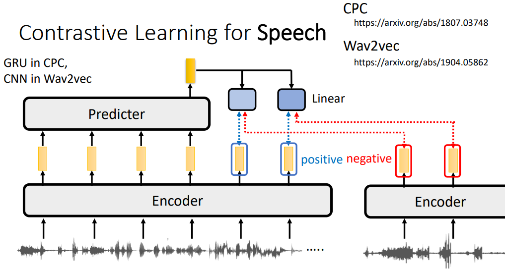

自监督训练完后，可以将 encoder 用于下游任务，也可叠加上 predicter 用于下游任务。

##### VQ-Wav2vec

VQ-Wav2vec 的 encoder 输出离散的类别（discrete token）而不是连续的特征向量：

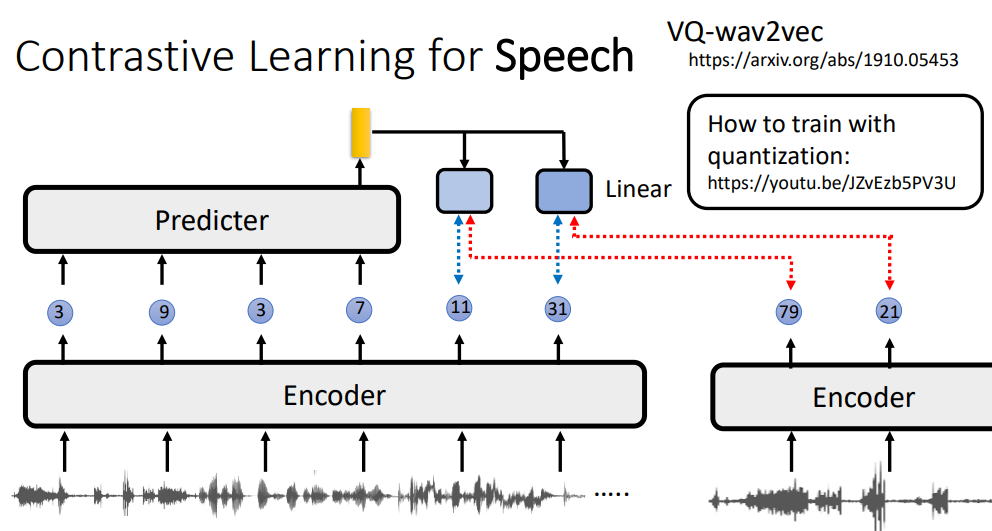

VQ-Wav2vec 想要利用输入文字的 BERT 。（文字属于 discrete token，属于离散类别）

将 VQ-Wav2vec 的 encoder 训练好后，但其固定住，用于将语音转换为 discrete token ，然后按照训练 BERT 的方法进行训练（下图演示的是 BERT 的 mask 策略）：

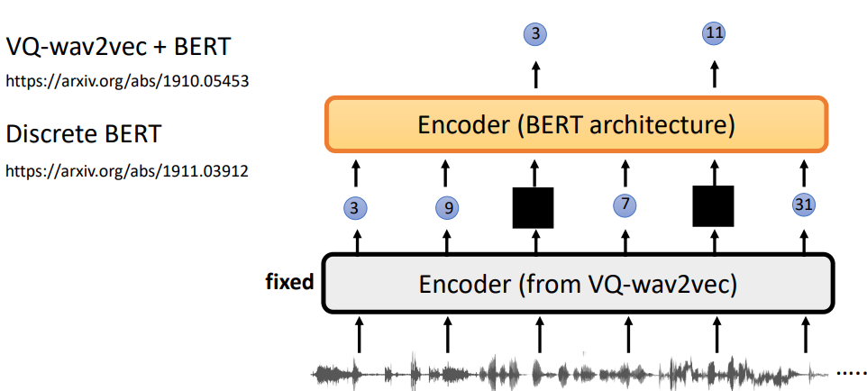

离散的 token 有助于提取语音中的类似语素的内容信息。

##### Wav2vec 2.0

- 将 encoder 和 BERT 的 encoder 一起训练。

- 离散 token 不易训练，让 encdoer 输出一般的连续向量，同时输出离散 token 。

- 将 encoder 输出的一些向量 mask 住，训练整个模型，然后进行对比学习。

- 使用一个线性分类器

	- 同类

		使 mask 位置对应的 BERT encoder 输出的向量与同一位置的离散 token 接近。

	- 异类

		使 mask 位置对应的 BERT encoder 输出的向量与其它位置的离散 token 疏远。

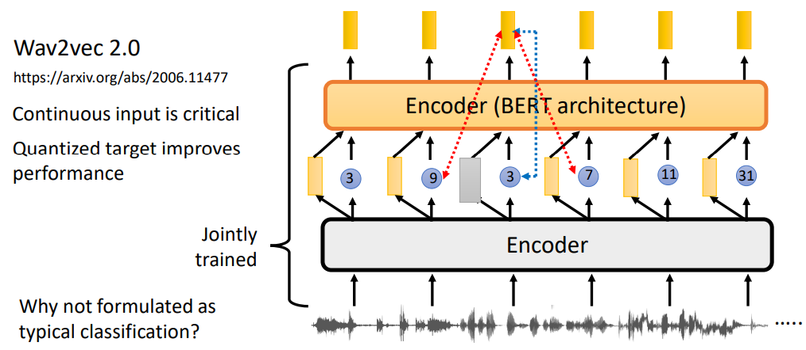

- Continuous input is critical

	作者在实验中直接将离散 token 输入 BERT 的性能比输入连续向量效果好，作者认为是因为连续向量比离散向量包含的信息更多。

- Quantized target improves performance

	整个模型最终的 target 是离散 token 的比连续向量效果好，但差距不大。

- Why not formulated as typical classification？

	见对比学习的本质。

#### 对比学习的本质

Wav2vec 2.0 为什么不作为一个一般的 classification 问题，直接预测离散 token ？

李宏毅认为语音对应的 token 数量非常多，如果直接分类计算量会非常大，所以使用对比学习的方式减少计算量。

- 直接作为分类任务预测离散 token ，需要模型对 positive 概率大，对所有的 negative 概率小。
- 使用对比学习，需要模型对 positive 接近（概率大），只需要对某几个 sample 出的 negative 疏远（概率小）。

BERT 对 mask 位置做分类，使得 ground truth 概率越大越好。

如果用对比学习理解 BERT ，它使得 mask 位置的 embedding 与 ground truth 接近与其它疏远：

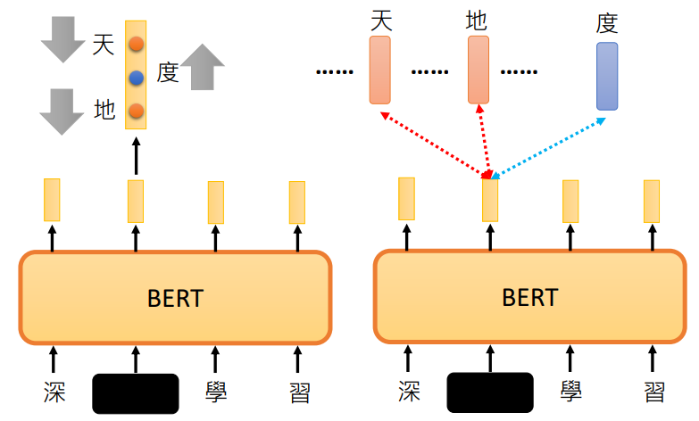

将 BERT 用在语音上时，将一段语音 mask ，要求 mask 对应位置的预测与当前位置的语音接近，其它位置的语音疏远。

但 BERT 的输出是一个 embedding ，与语音的信息量差距非常大，所以要用一些 transform 将语言转换后再对比：

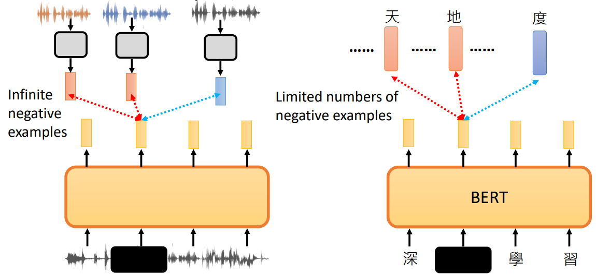

上图，在文字上，negative 的 token 是有限的，而在语言上，语言的变化穷举起来相当多，即 negative 的 sample 是无限的，所以不应该将语音转为连续向量，而应转为离散 token ：

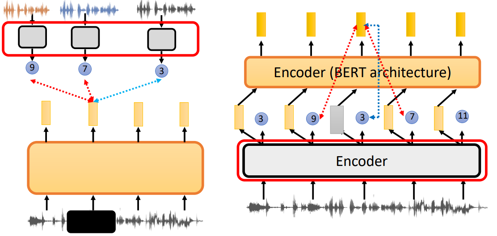

上图，红框部分的 transform 就相当于 Wav2vec 2.0 的 encoder 的一部分功能，将语言转为离散 token ，而其它功能就相当于一个预训练模型（红框部分）：

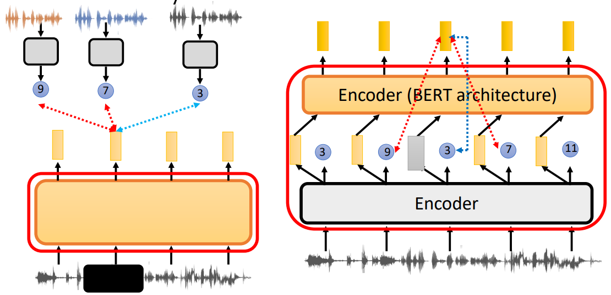

可见，Wav2vec 2.0 就是对预训练模型（比如 BERT）做了针对语音的处理。

#### negative example 的选择

negative example 不能选得太简单，否则模型学不到太多有用的东西，比如直接就能靠简单得颜色区分。

也不能选得太难，特别不能将属于同一类的样本作为 negative ，否则将导致同类的疏远，这是显然错误的。

在自监督学习中，样本没有标签，选择 negative 的策略有一定概率选择到同一类样本作为 negative ，此时可以使用 Bootstrapping Approaches 避免 negative example 的选择。

### Bootstrapping Approaches

如果只使用 positive example ，会导致模型 collapse ，即输入任何图片，模型的输出都是一样的零向量：

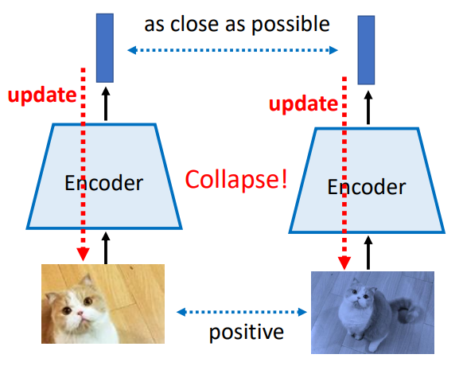

如何在没有 negative example 的情况下，又避免 collapse 呢？

可以将一张图片的增强结果作为 positive ：

- 左侧使用一个 encoder 输出向量。
- 右侧使用一个 encoder ，再使用一个较小的 predictor 输出向量。
- 两个输出向量越接近越好。
- 在训练时，只更新右侧的梯度。
- 更新梯度后，再将右侧 encoder 的参数复制到左侧 encoder ，使其保持一致。

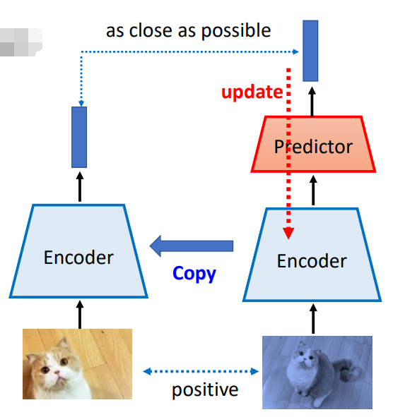

这样就可以在不使用 negative 的情况下，避免 collapse 。（原因未知）

我觉得这能让 predictor 的部分学习到 example 的增强。

由 Knowledge Distillation 理解 Bootstrapping ，每次 student 学到一点东西后，它就成为 teacher ：

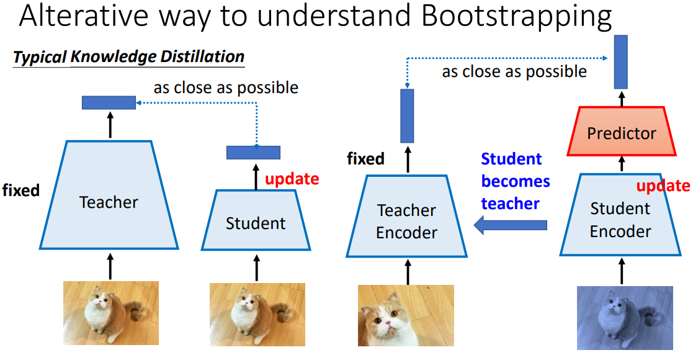

其中，初始的 encoder 的权值即使是随机的也可以起到作用

### Simply Extra Regularization

本方法也可以避免 negative example 的使用。

主要有 Barlow Twins 和 Variance-Invariance-Covariance Regularization (VICReg) ，二者比较相似，以下以 VICReg 为例。

- invariance

	只使用 positive 训练 encoder ，使其输出接近。

	- 只有  invariance 会导致 collapse 。

- variance

	给 encoder 一堆图片，要求输出的向量在对应维度上方差大于一个阈值。

	- 可以避免 encoder 对任何图片都输出一样的向量。

- covariance

	对一堆图片输出的向量计算 covariance 矩阵，希望非对角线的位置接近 0 。

	- 可以让 latent space 内对每个维度的利用更均匀。
	- 如下图，排列为一条线的点在 x 和 y 方向的方差都是够大的，但没有散开的点利用的维度多，因为直线可以用更少的维度表示。
	- 多利用维度意味着对特征表示的 laten space 的利用更充分。
	- 原论文中 covariance 是非必需的，加了 variance 就能避免 collapse 。

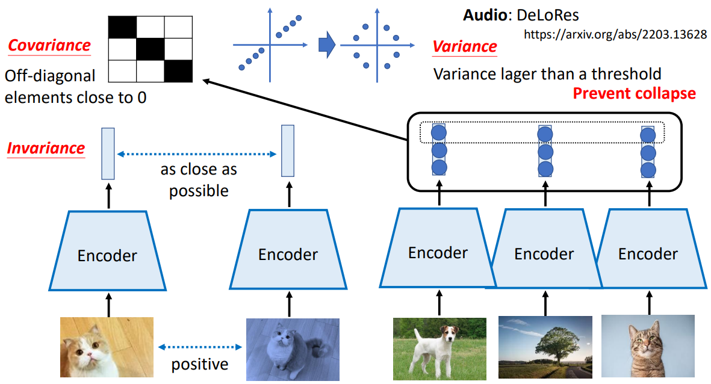

其中，对语言的应用可见 DeLoRes 。
