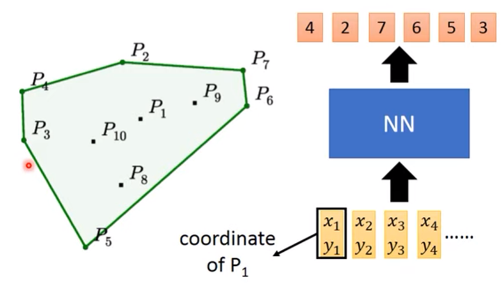
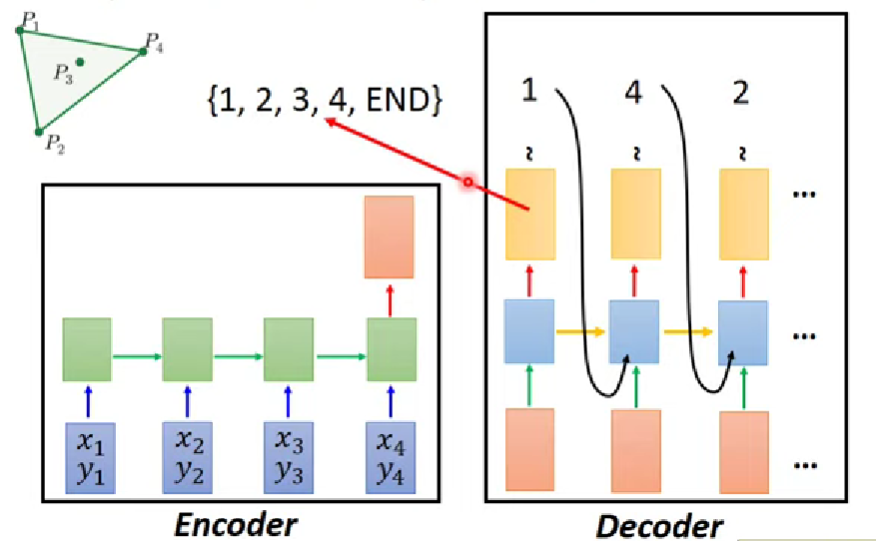
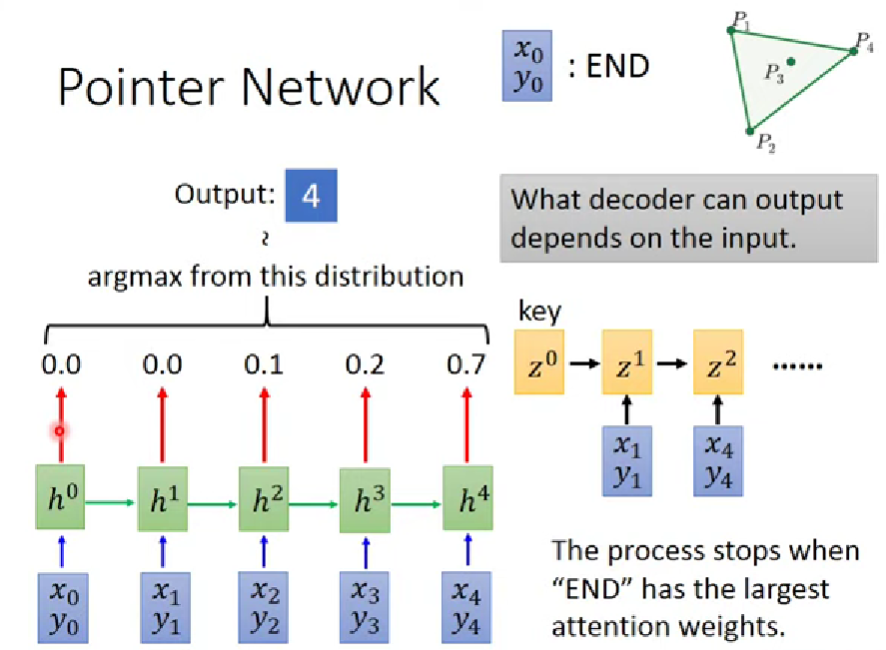
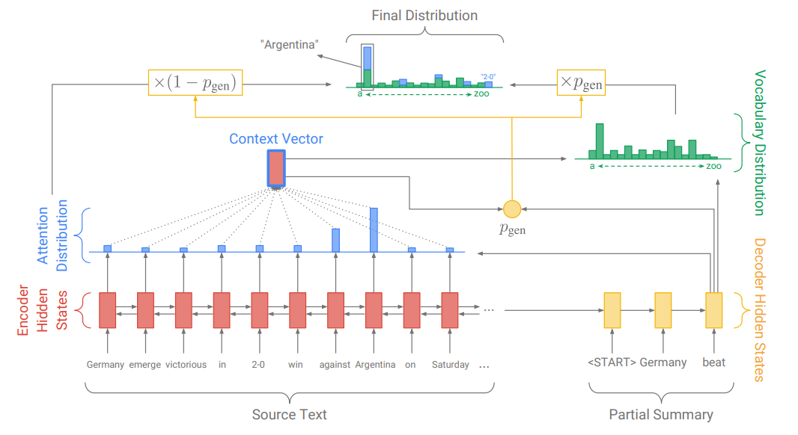
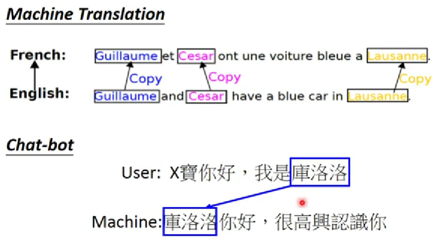

# Pointer Network

Pointer Network 原始论文中用它解决三个问题，以下以其中一个为例。

Pointer 意指需要指示重要目标的场合。

## 凸包

平面上有多个点，用模型找出连起来后可以将所有点包围住的边界点，即凸包。

输入坐标序列，输出点的编号序列：

## 尝试

若 NN 使用 Seq2Seq 模型，输入坐标序列，输出点编号序列和 END ：

这样硬 train 一发，不 work ，为什么？

输入长度对于 Encoder 不影响，但对于 Decoder ，假设长度设定为 $n$ ，则应当输出 $n $ 个数字和 $1$ 个 END ，但当输入大于 $n$ 时，此时 Decoder 可能无法选择足够的点。

## 设定标志

要**以输入数据的形式设定标志**，让 model 自动判断输出多长，以下使用 attention ：

- 为输入添加坐标 $(x_0,y_0)$ ，表示 END 。

- 将输入通过 attention ，attention weight 就是输出的 distribution ，取 argmax ，将拥有最大 attention weight 的坐标编号作为 output 。
- 当 END 坐标的 attention weight 最大时，即终止 output 。

## 应用

### Summarization

摘要其实就是将文章中重要的词汇选出来，然后接起来。

Encoder（橙色块）输入文本，Decoder（黄色块）输出摘要，Encoder 和 Decoder 都是 RNN 。

- 传统方式

	1. Decoder 生成 key ，对 Encoder 做 attention ，得到 attention distribution 。
	2. 通过 attention distribution 生成 weight sum 作为 context vector。
	3. 综合 context vector 和 decoder 的 RNN 生成的值，得到 vocabulary distribution ，其是整个词汇集中每个词汇的概率。

- 添加 pointer network

	直接利用 attention distribution ，再学习一个 weight ，即 $P_{gen}$ ，以 $P_{gen}$ 和 $1 - P_{gen}$ 的比例混合 vocabulary distribution 和 attention distribution ，用其混合得到的 final distribution 决定生成的词汇。

### more applicaitons

- Machine Translation
- Chat-bot

将不需要模型理解的词汇直接从 input 提取出来使用，比如人名，地名：

