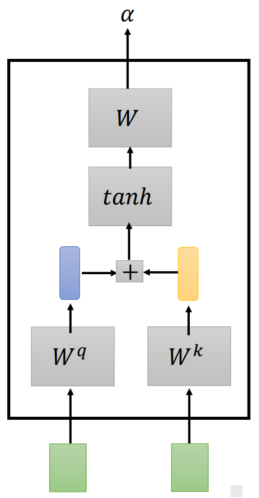
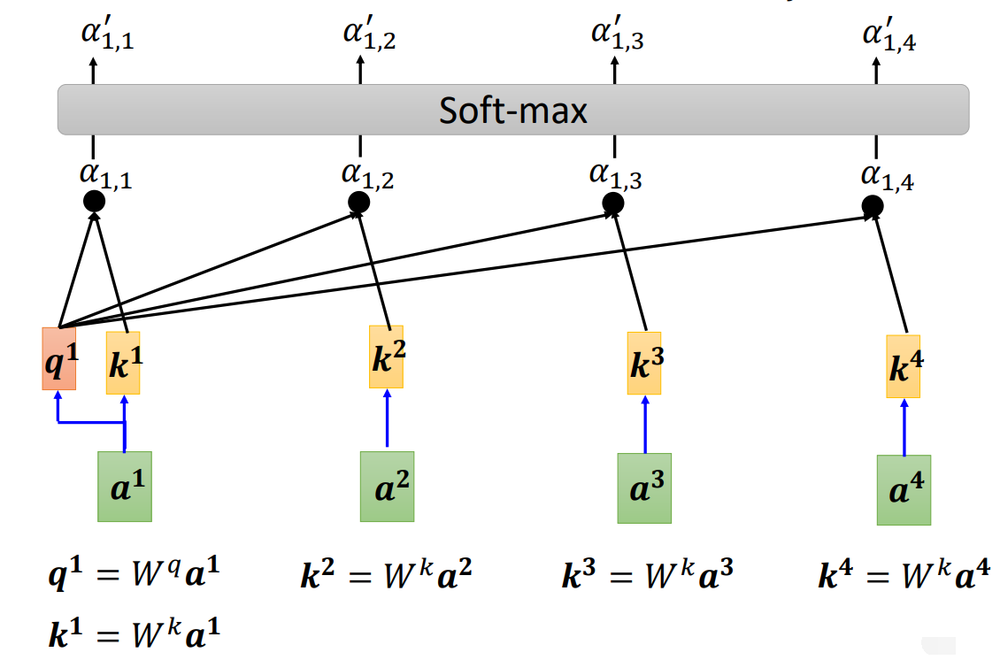
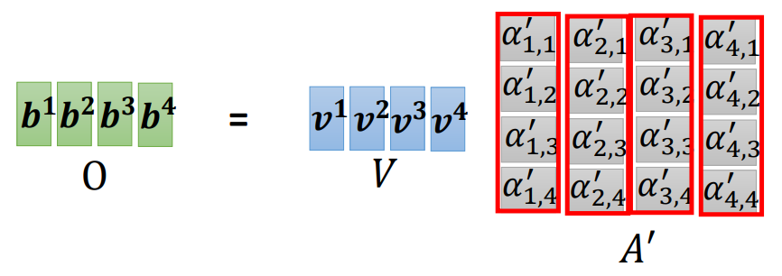
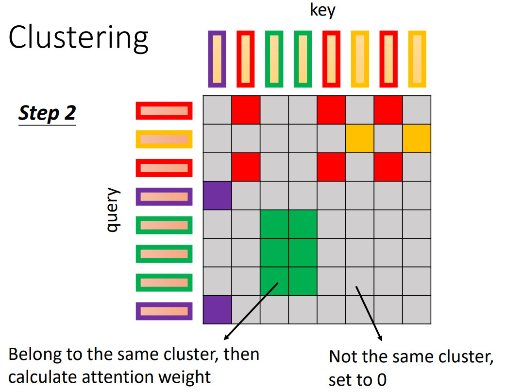
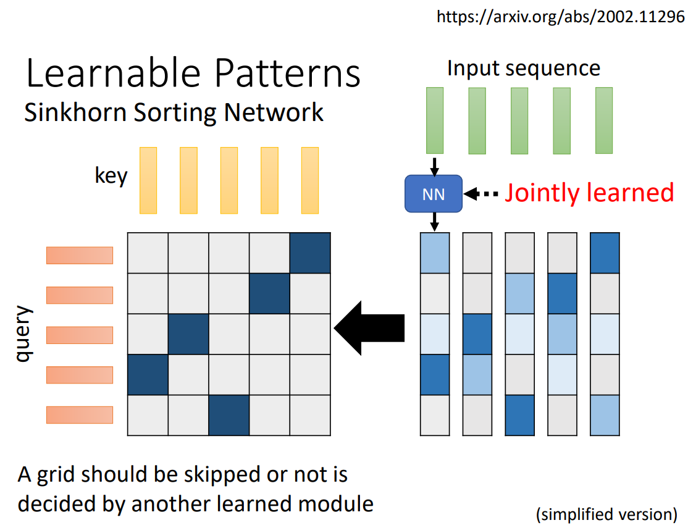

# Transformer

[Attention Is All You Need 2017](https://arxiv.org/abs/1706.03762)

Transformer 是经典的 SeqToSeq 模型，输入一个 sequence （词向量序列）， 输出一个 sequence ，分为 encoder 和 decoder 两个部分。

Transformer 的模型宽度（$d_{model}$）是 embedding 经权重矩阵转换后的长度。

在 batch 中，保持 batch 内长度一致时，序列长度在 padding 时需要填充非常小的负数，使 softmax 后这些位置的权重趋于 $0$ 。

## 输入输出维度

### 对于 Transformer 整体

输入是一段文本，输出是一段翻译为例。

概念：

- source sequence 

	Encoder 的输入序列。

- target sequence

	Decoder 的输出序列。

维度对应：

- Encoder 的输入输出维度相同。
- Decoder 的输入输出维度相同。
- Encoder 和 Decoder 的输入输出长度可以不同，embedding 维度需要相同。

编码：

- 输入整段文本（整个 sequence）
	- 实际上，受内存限制，Transformer 无法输入无限长的 sequence，具体长度限制要实际考虑。
	- 对于超长文本，有相关的处理方法。

解码：

- 自回归

	翻译时 Decoder 需要滑动多次，一次滑动翻译出一个词。

- 非自回归（平行）

	一次全部翻译。

翻译结果长度要看滑动次数和特殊字符的位置。

### 对于 Attention 机制

序列可加 mask ，表示不计算（不 attend）哪些位置。

输入：

- self-attention 中，所有 Q，K，V 的 sequence 的维度都是相同的，因为 Q，K，V 来自同一 source 。
- attention 中：
	- Q 的长度为 $L$ ，同时也是 target sequence length 。
	- K，V 的长度相同，为 $S$ 。
	- Q，K，V 的 embedding 维度需要相同。

输出：

- 维度与 Q 一致，长度为 $L$ 。

## 结构总览

- Encoder（图左）
- Decoder（图右）

encoder block 重复 $N$ 个，decoder block 重复 $N$ 个（block 也可称为 layer）。实际上，encoder layer 和 decoder layer 的个数可以不同。

一般 decoder 逐字右移（shifted right）进行翻译。 

注意：

- attention 依据 Q 和 K 的关系，然后从 V 中提取特征。
- self-attention 利用自身与自身的关联（自身内部之间的关联），从自身提取出特征。

attention 的设置：

- Encoder 中利用 self-attention 编码自身的信息，

	比如一个句子，可以由字与字的关系（自身内部的关系），从句子中提取出语义。

- Decoder 中先用 self-attention 编码输入的信息，然后再用 attention 关联 Encoder 的特征。

	不断利用已有句子的信息，然后再融合训练资料里的信息。

## 语义关联

以词性标注（Part-of-Speech Tagging，POS Tagging）为例。

相同单词在一个句子中可能呈现不同的词性，甚至需要联系整个 Sequence 判断，不能逐个输入单个向量进行标注。

若考虑单词的前后邻居，可能不够准确；若考虑设定一个窗口值，每次输入的 Sequence 可能不同，若将窗口设置得很大，会导致模型参数过多。

使用 self-attention 机制可以处理较长序列的内部关联关系。

Transformer 的参数矩阵维度与输入序列长度是无关的（FC 部分也是 position-wise 的），所以可以处理变长的数据（实际情况受存储能力所限，仍然是有限的长度）。

为了便于实现 batch 计算，有时候需要对序列 padding 到统一长度。

## Self-attention

（自注意力）

以下以 Sequence Labeling 为例。

### 向量转化

将整个 Sequence 输入 Self-attention 层，Self-attention 将每个向量转化为新的考虑了整个 Sequence 信息的向量，然后再 position-wise 对应输入多个全连接网络（FC）（输入向量在同一空间，各 FC 可共享权重）：

Self-attention 层可以任意安排次数和位置：

### 关联度

要考虑到整个 Sequence 的所有向量，可以计算输入向量之间的关联度，用一个数字 $\alpha$ 表示。

常见方法有 Dot-product（点积）（最常用）和 Additive 。

点积是内积（Inner-product）在欧几里得空间的特殊形式，一般当作内积即可。

- Dot-product

	输入向量分别与矩阵相乘，然后将得到的向量做点积，即得到关联度。

$$
\alpha = \boldsymbol q \cdot \boldsymbol k \ , \ 
\begin{cases}
\boldsymbol q = \boldsymbol W_q \boldsymbol a_1 \\\\
\boldsymbol k = \boldsymbol W_k \boldsymbol a_2
\end{cases}
$$

dot-product 比 additive 空间更少，计算更快，因为可以有矩阵乘法的优化。

- Additive

### 计算结构

以 Dot-product 为例：

其中，$\boldsymbol q_1$ 称为 query ，$\boldsymbol k_i$ 称为 key 。query 分别和每个 key 做点积，得到 $\alpha_{i,j}$ （该计算操作可称为 attend）（ $\alpha_{1,1}$ 即是自己与自己的关联性），然后通过 Soft-max 转化，得到最终的关联度，称为 attention score 。

得到各向量的关联性后，还需要抽取信息 $\boldsymbol v_i$（$\boldsymbol v_i = \boldsymbol W_v \boldsymbol a_i$），然后综合（使用矩阵乘法）上 attention score，得到最终转化后的向量 $\boldsymbol b_i$ （$\boldsymbol b_i = \sum\limits_i \alpha_{1,i}^\prime \boldsymbol v_i$）。

注意，每个 $\boldsymbol a_i$  对应的 $\boldsymbol b_i$ 是可以并行计算的。

### 特征关联

query、key 和 value 的概念来自推荐系统，给定一个 query ，根据 query 和 key 的关联性寻找最优的 value （self-attention 是寻找多个有价值的 value 再综合）。

例如在电影推荐中：query 是某人对电影的喜好信息（比如兴趣点、年龄、性别等）、key 是电影的类型（喜剧、年代等）、value 就是待推荐的电影。

在这个例子中，query、key 和 value 的属性在不同空间，但其具有一定的潜在关系，也就是说可以通过某种变换将它们都转换到一个相近的空间中，这就是学习转换矩阵 $\boldsymbol W$ 的意义。

转化矩阵只有线性转换能力，转换后的输入在 attention 计算后，还需要 FC 进行一定的非线性拟合。（FC 的参数也需要学习）

所谓 self-attention 即是指 key，value，query 都来自同一个输入，来自不同输入即是 attention 。

实际上，”attention 机制“不特指 Transformer 的 attention 模块，也有其它的 attention 模块：

- 当该模块对自身内的特征进行“注意”时，称为 self-attention 。
- 该模块对不同模态或不同来源的特征进行交叉“注意”时，称为 cross-attention 。

### 矩阵表示

整个计算结构可以表示为矩阵计算。

基本向量，query，key，value ：

attention score :

输出向量：

其中：

- $K^T$ 和 $Q$ 的相乘，实现 key 和 query 的内积。
- $V$ 和 $A^{\prime}$ 的相乘，实现 value 和 attention score 的综合。（不是内积）

总览：

其中，attention scores 构成 attention matrix，维度为 $N \times N$（在 attention 中可以不是正方形），其中，$N$ 为输入 sequence 的长度。

self-attention 计算的最终输出为 $O$ ，其维度与输入序列相同。

Self-attention 层需要学习的权重参数为 $\boldsymbol W_q,\boldsymbol W_k,\boldsymbol W_v$ ，维度都是 `(word_vector_len, word_vector_len)` 。

上图演示的矩阵相乘顺序与原论文 SDPA 中的公式相反，但操作是对称同理的，不影响效果，两种方式的输出矩阵 $O$ 互为转置，权重矩阵也互为转置（注意，权重矩阵是自学习的），建议使用公式的顺序，看图理解大致概念即可。

### Scaled Dot-Product Attention

（SDPA）

其中，$d_k$ 为 key 的维度（也等于 query 和 value 的维度）。

记 $A = QK^T$ ，$B = \frac {QK^T} {\sqrt d_k}$，$A^{\prime}$ 为 $\rm softmax(\frac {QK^T} {\sqrt d_k})$ 。

##### attention 过程理解

attention 模块输入包含 query，key，value 序列的 $Q,K,V$ 矩阵。

1. $QK^T$ 使用内积关联 query 和 key 。
2. 对 $B$ 的所有元素进行 softmax ，相当于对 key 和 query 的关联度进行了一个多类别的分类，每个元素代表一个类别概率，也即每个元素代表一个关联度的概率，概率越大，关联度越大（所有元素总概率为 $1$）。也就是说，$A^{\prime}$（即 attention score）描述了输入序列中不同 key 和 query 的关联度强度。
3. $A^{\prime}$ 与 $V$ 矩阵相乘，相当于用 query 和 key 的关联度对 value 做一次特征加权组合，得到最终的输出 $O$ 。

	某次行乘列即代表：用某个 query 向量与所有 key 向量的关联度（$A^\prime$的 行）对所有 value 向量的某个维度（$V$ 的列）进行加权选择。（权重由 attention score 描述）

attention 的最终输出 $O$ 为：value sequence 在 attention score 加权后的 feature sequence 。

##### scale

作者使用 $\frac 1 {\sqrt {d_k}}$ 进行 scale 。

原因：

当 $d_k$ 特别大时，dot-product 的结果值（即 $A$ 中元素的值）的分布的方差会变得非常大。

例子：

假设两个 $d_k$ 维的向量 key 和 query 的每个分量是相互独立的服从正态分布的随机变量，均值为 $0$ ，方差为 $1$，从而 key 和 query 点乘后的结果值的均值为 $0$ ，方差为 $d_k$ ，对每一个分量除以 $d_k$ 可以让方差变为 $1$ 。（$\boldsymbol k \cdot \boldsymbol v = k_1v_1 + k_2v_2 + \dots + k_nv_n$ ）

作用：

- 这个 scale 相当于对 $A$ 的每个元素进行 normalization ，使损失更平滑。
- 同时，方差太大，会导致 $A$ 中容易出现非常大的元素，而 softmax 又会放大输入元素的相对大小差异，从而 softmax 后的概率集中在那几个非常大的元素上，它们的梯度非常大，而其余位置概率非常小，梯度非常小，容易造成：
	- 当大梯度畅通，造成过拟合（概率分布太集中）。
	- 当大梯度被阻挡，优化停滞（其它梯度太小，陷入局部解）。
	- 最大概率的情况，更新时常有少数几个方向的梯度非常大，导致训练非常不稳定，模型收敛慢。

对于 softmax，设 $y_1 = \rm softmax(x_1), y_2 = \rm softmax(x_2)$，比较 $x_1,x_2$ 在通过 softmax 前后的相对大小差异，有：
$$
\frac {x_1 - x_2} {x_1 + x_2} \ll \frac {y_1 - y_2} {y_1 + y_2}
$$

## Encoder

### Embedding

使用嵌入后的词向量。

### Positional Encoding

（位置编码）

self-attention 只是衡量向量间的关联性，后续的 FC 也是 position-wise 的，所以 Transformer 的 encoder 和 decoder 都具有 permutation-invariant ，在需要模型考虑空间位置信息时，需要对输入进行位置编码。

比如需要向量的输入位置（次序）信息时，可以为每个位置都设置一个代表位置信息的唯一的向量 $\boldsymbol e_i$ ，然后在一开始加入 $\boldsymbol a_i$ 即可：

$\boldsymbol e_i$ 有多种设置方式，也可由机器学得。

整个 position 的编码的维度与编码目标的维度相同。

对于 NLP 中文本的一维 positional encoding，原文使用 sin 和 cos 的不同频率：

其中，$pos$ 表示 position 编码的 sequence 的位置，$i$ 表示该位置的维度。PE 表示 positional embedding ，Sinusoid 意为以 sin 为基的一类函数。

考虑 PE 某个位置的 positional embedding vector，每个 embedding 表示其在 sequence 中的位置。

一个 position 相当于一个数，对应的 positional embedding 相当于该数的编码，以二进制编码为例：

其中，编码的低数位变化频率高（波长短），高数位变化频率低（波长长），不同的频率值表示编码的不同位

表示绝对位置关系：

- 某个波长表示某数位（embedding vector 中的第几个元素的位置），$i$ 决定波长（$1000^{2i / d_{model}}$）。（上图某列）
- 某个节点表示某个 sequence position ，$pos$ 决定取波长下 sin 或 cos 值域的某个节点。（上图某行）

表示相对位置关系：（即不同位置的 PE vector 可以由线性转换得到）

- 使用 sin 和 cos 交替表示，使得数学上满足可线性转换的形式。

[由来和详细原理可见](https://zhuanlan.zhihu.com/p/454482273)

序列长度为 50，位置编码维度为 128 的位置编码可视化：

其中：

- 横轴为 depth，表示 embedding 的第几维。
- 纵轴为 position ，表示 sequence 的 position 。
- 颜色表示 PE 的值（来自 sin，cos 交替），值域为 $[-1,1]$ 。

图中每一行的所有颜色（值），即表示一个 position embedding 。

### Multi-Head Attention

（多头注意力）

有效的关联性可能不止一种，需要计算多种关联性，即使用多种 $\boldsymbol q^t_i$ 与多种 $\boldsymbol k^t_i$ （由多种转换矩阵转换而来）计算关联性，然后 concat 各个头的信息得到最终输出。

Multi-Head Attention 在 embedding 的不同位置学习它的不同子空间（subspaces ）的 representation 。

多头时，由内积计算的关联的细粒度更高。

embedding 的不同位置表示不同的输入的不同性质，对应不同的关联性。实际上，如果 embedding 维度比较大，在只有一个 head 时计算出的 attention score 对 embedding 的关联的表征能力很有可能不够。

每个 head 的计算方式与单个 head 的 attention 一致，每个 head 都包含一组 $Q,K,V$ 的转换矩阵：

其中，各个 head 输出的 attention matrix concat 起来形成 $hd_v \times d_{model}$ 的 feature，再乘以一个用于转换维度的转换矩阵 $W^O$（对各 head 的 attention score 进行加权组合），得到最终输出的 feature sequence，维度为 $L \times d_{model}$ ，与 $Q$ 维度相同。

注意，每个 head 是对 embedding 的一部分维度计算，有约束如下：
$$
d_k = d_v = \frac {d_{model}} h
$$
其中，$h$ 是 head 的个数。

每个 head 的 attention matrix 的大小相同（也与不划分 head 的 attention matrix 的大小相同），都是 $L \times S$ 。

其中，$h$ 表示 head 个数，Concat 后的 Linear 表示转换矩阵 $W^O$ 。

embedding 的不同维度反映事物不同方面的特征，Multi-Head 直接划分为多份，当 embedding 中描述相同方面的特征被 Multi-Head 的划分分隔时，对模型不会造成太大影响，模型会在 FC 中学习到描述相同方面的特征的关系。也就是说，FC 能够处理这种描述相同方面的特征被分开的情况。

### Add & Norm

线条表示**残差网络（Residual Network）**连接。

Transformer 使用 **layer normalization** ，对该层的经残差连接后的输出进行标准化：
$$
\rm LayerNorm(x + \rm Sublayer(x))
$$

注意，标准化缩放到均值为 $0$，方差为 $1$ ，保持分布，归一化缩放到一个区间，二者都没有 softmax 的输出总和为 $1$ 的限制，所以这里的 layer normalization 不会产生考虑浮点数表示误差的情况。

### FC

包含两个线性变换和一个 ReLU 的全连接网络（FFN） ，增强模型拟合能力。

也可使用两个 1x1 的卷积和一个 ReLU 描述该运算。

是 position-wise 的 FC ，即每个词向量在 attention 输出的 feature sequence 上的对应位置都有一个 FC 。（单 head 和多 head 输出维度是一样的）

FC 对 attention 输出的 feature sequence 进行处理，为网络增加非线性的拟合能力和一定的不变性能力。

其原论文维度为 $d_{model} = 512, d_{ff} = 2048, d_{model} = 512$，这是一种 Sparse Autoencoder 架构的网络，中间宽，两边窄：

这是一个将向量转换到更高维的空间（学习更高维空间的表示），然后再降维（提取主要特征）的过程，相当于完成了一个较为泛化的空间转换。

宽的隐藏层的较大向量空间能够抵御更多变化和噪音，类似 PointNet 将点升维以达成 permutation 不变性的原理。

中间的稀疏层的稀疏向量在需要不同输入的相互关系（共同特征）时才能发挥作用，如果是单独将一个输入转换到稀疏再复原，实际上是没有意义的。

## Decoder

以下以语音辨识（Speech Recognition）（输入一段声音，输出一段文字）为例。

文本字符集使用单位向量表示某一个字符。

### 输入输出方式

依据输入输出方式，Transformer 的 decoder 有两种翻译输出方式：

- Autoregressive Translation（AT，自回归翻译）
- Non-autoregressive Translation（NAT，非自回归翻译）

#### AT

图中的 max 代表选取分数最高的单位向量，圆球代表 $1$ 。

- decoder 初始输入
	- encoder 的输出。
	- 表示文本开始的文本字符集外的特殊符号（Begin of Sentence，BOS）（Special Token）
- decoder
	- 继续输入上次的 encoder 的输出。（所有的 cross attention）
	- 逐步输入上一次 decoder 的输出。（长度逐渐增加）
- decoder 逐步输出
	- 直到输出指定的结束符 END（属于 BOS ）。

#### NAT

- AT 的 decoder 逐步输入，逐步输出
- NAT 的 decoder 一次输入一排 BOS，一次输出整个句子（词数与 BOS 数量相同）。

NAT 的 decoder 可以将 masked attention 换为一般的 attention ，一次计算整个输入 sequence 。

NAT 的输出长度有两种方式：

- 额外训练一个小模型用于预测长度。
- 设定一个较大的长度，然后忽略输出中 END 后的部分。

NAT 的优势：

- 输出可并行计算。
- 输出长度更可控。

但 NAT 的效果一般不如 AT ，AT 逐步输入，反复计算，计算量更大。

### output embedding

decoder :

- AT 时
	- 反复输入所有 cross attention 。
	- 初始输入 special token，然后逐步输入 token。
- NAT 时
	- 一次输入所有 cross attention 。
	- 一次大量 special token 。

decoder 的 token 也可进行 positional encoding 。

### Masked Multi-Head Attention

masked attention 内部结构与一般 self-attention 一致，decoder 在 AT 时，在每一次移动的当前位置，只输入该位置及之前的序列数据（前缀），在移动中只有已产生的数据，没有未产生的数据，故 decoder 的 attention 只能使用 masked attention 。

对于 encoder ，其的 self-attention 需要一次输入完整的序列数据。

即移动到第 $i$ 个位置时，使用第 $i$ 个 query ，只与前 $i$ 个 key 计算 score ，$i = 2$ 为例：

### Cross Attention

decoder 中承接 masked attention 的输出和 encoder 的输出的部分，称为 cross attention 。

注意，decoder 中的 cross attention（第二个 attention）部分是 attention ，第一个 attention 部分是 self-attention 。

cross attention 中，decoder 接受 encoder 的输出作为 key 和 value（两个蓝色圈），decoder 的 masked attention 模块的结果作为 query 。

encoder 编码 query，key 和 value 三者的关系，decoder 输入 query ，通过 query 和 key 的关系找到正确的 value ，然后输出。

第一步：

第二步：（后续同理）

原始论文中 decoder 的每个 block 都输入最后一个 encoder block 的输出（Conventional Transformer），但可以有多种 cross attention 的方式：

## Loss Function

每一次 decoder 产生的输出是一个表示词的向量，其各维的数值表示该维对应的单位向量的词的概率，整个向量表示一个概率分布。将这个向量与标准的单位向量做 cross entropy ，交叉熵越小，预测越准：（即是一次 Classification）

需要对每次生成的词最小化 cross entropy ：

- 可以逐步最小化各 cross entropy 。（意味着逐步更新参数）
- 也可以一次最小化所有 cross entropy 总和。

## 对于训练 Seq2Seq 模型的 Tips

### 训练模式

- Free Runing Mode

	将上一个状态的输出作为下一个状态的输入。（逐步最小化或总和最小化）

- Teacher Forcing Mode

	使用 ground truth 作为输入进行引导。（逐步最小化或总和最小化）

Teacher Forcing Mode 在训练时，无论 decoder 当次的输出正确与否，都在下一个位置，直接输入 ground truth 中对应数据（而不是输入 decoder 上次的输出），这样可以不断更正模型的统计属性：

### Copy Mechanism

例如在 chat-bot 中，出现一个特定的词组，机器不需要彻底理解它，只需要理解它的使用方式，在使用时从输入复制到输出即可：

或是摘要任务（Summarization）中，需要识别特殊的关键词或语句。

实现可参见 Pointer Network 。

### Guided Attention

在实际训练中，attention 可能导致 input 与 output 的对应不符合应当的方式，例如方向。

在语言识别（Speech Recognition），语音合成（Text to Speech，TTS）等任务中，input 和 output 应当是从左向右单调对齐的。

guided attention 可以为 attention 添加 input 和 output 对应方式的约束。

关键词：

- Monotonic Attention
- Location-aware Attention

### Beam Search

假设字符集只有 A，B，输出一个句子的可能状态就是一颗树，当每一步都优先选分数高的路径时（贪心），最终的路径不一定是最好的。

同理，每次 minimize 当前的 cross entropy 不一定让整个句子的 cross entropy 最小。

当字符集很大时，不可能穷举所有的状态，可以尝试 beam search，但 beam search 只更适用于有明确最优结果的任务，对于高创造性的任务需要添加随机性。

### Sampling

对于 Sentence Completation 和 TTS（Text-to-Speech）等高创造性任务，需要为模型添加随机性。

不只是 training 时添加 noise，在 test 时也要添加 noise 。

### BLEU Score

- 双语替换评测（BiLingual Evaluation Understudy，BLEU）

Transformer 一般的损失函数为 cross entropy 。

可在 validation 和 test 时使用 BLEU Score ，即整个句子生成完后，再计算整个句子与 ground truth 的效果分数，效果比 cross entropy 好。

但 training 时仍需要使用 cross entropy ，因为 BLEU Score 不可微分，若一定要在 training 时使用 BLEU Score ，考虑强化学习方式。

### Schedule Sampling

- Exposure Bias

	当在生成某个词时出错，如把“器”生成“氣”，则可能导致后续的词汇也出错，从而整个句子坏掉。

若机器只学习过完全正确的例子，则容易出现 exposure bias 这样泛化能力弱的情况。可给模型一些错误的样例，以提高模型泛化能力：

- [Original Scheduled Sampling](https://arxiv.org/abs/1506.03099)

	原始版本。

- [Scheduled Sampling for Transformer](https://arxiv.org/abs/1906.07651)

	对 Transformer 特化的版本，会对并行能力有损害。

- [Parallel Scheduled Sampling](https://arxiv.org/abs/1906.04331)

	并行优化的版本。

## 与经典网络的对比

直观对比，不保证正确性。

- Self-attention 与 CNN

  - CNN 是 self-attention 的子集。（感受野范围）
  - self-attention 比 CNN 弹性更大，从而 CNN 一般比 self-attention 更适合训练资料少的情况，self-attention 在资料少时容易 overfitting 。
  - 受卷积核大小所限，CNN 能一下看到的范围更小。

- Self-attention 与 RNN

  - RNN 也是 self-attention 的子集。（联系的构建方式）
  - self-attention 比 RNN 的关联信息的能力更强，对于两头的信息，RNN 要在一定的处理后才能将其联系考虑，而 self-attention 可以直接将其联系起来。
  - self-attention 能够并行处理所有输入输出，不需要像 RNN 那样依序输入输出。

- Self-attention 与 GNN（Graph）

	- GNN 也是 self-attention 的子集。（结点间的联系的构建方式）
	- 对 Graph 处理可得出结点关联的 ”attention score“ 。

## 变体

self-attention 的变体有许多种，一般以“xxxformer”命名。

假设输入的 sequence 长度为 $N$ ，当其特别大时，self-attention 中 query 和 key 运算成的 attention score 组成的 attention matrix 也会特别大，会降低运算效率。

self-attention 一般作为网络的一个组件，当输入的 sequence 长度较小时，网络其它部分的计算量才是主要，此时加速 self-attention 的帮助不大。

### Local Attention / Truncated Attention

可能对于某个位置，只需要其两边邻居的信息，就可以理解该位置的意义，于是可以将 attention matrix 中的大部分置 $0$ ：

此时只能感受到一个小范围内的信息，即相似于 CNN 。

### Stride Attention

考虑一定间隔位置的信息。

其中，灰色为置 $0$ ，左为空两格的情况，右为空一格的情况。

### Global Attention

为原输入序列引入 special token ，每个元素只与 special token 进行计算（attend），通过 special token 传递信息：

- 将原序列内某些元素作为 special token 。（图中右上）
- 为原序列添加 special token 。（图中右下）

### 组合共用

- 在 multi-head attention 中，各个 head 可以使用不同的 attention matrix 计算策略。
- 也可将其混合，在一个 head 中使用。

### Clustering

对于 attention matrix 中较小的值，直接置 $0$ 影响不会太大，若能预测位置的值的大小（可能性），从而可以小值不计算，只关注较大的值。

依据相似度对 query 和 key 聚类，采用复杂度低于 $O(n^2)$ （$n$ 为向量个数）的聚类算法：

只计算相同 cluster 内的 query 和 key ：

### Learnable Patterns

在 Sinkhorn Sorting Network 中，直接使用 NN 学习，生成一个实数矩阵，然后转化为 binary  的矩阵表示计算 attention 的位置：

- 从 NN 输出的实数矩阵转化到 binary 矩阵的过程需要可微分，才能一起参与训练。

- 该实数矩阵的维度可以比 attention matrix 小，以加快 NN 的计算速度。

### Linformer

输入中不一定都是有用的元素，可能存在大量的冗余的（redundant）元素，将这些冗余的部分去除，就可加快计算速度。

从 $N$ 个 key 中选出有代表性的 $K$ 个 key ，同理，选出 $K$ 个 value ，然后计算 self-attention 的最终输出：

可以对 query 进行选取，但会影响输出序列的长度，具体影响 case by case 。

选取策略：

- 在 Compressed Attention 中，通过卷积减少向量的数量。
- 在 Linformer 中，通过与一个 $N \times K$ 的矩阵相乘（即做线性变换）减少向量数量。

### Performer

#### 乘法顺序

忽略 softmax ，得到输出的过程可以表示为三个矩阵相乘：

其中，$\boldsymbol V$ 的 $d^\prime$ 一般取等于 $d$ 。

将其（后乘）变为先计算 $\boldsymbol V \boldsymbol K^T$ （先乘），二者结果一致，但先乘更快：

#### 乘法次数

- 后乘共需要 $(d + d^\prime) N^2$ 次。

- 先乘共需要 $2d^\prime d N$ 次。

显然有：（$N$ 是输入序列的长度，值会非常大）
$$
(d + d^\prime) N^2 \gt 2d^\prime d N
$$

#### 考虑 softmax

一般的计算过程：

假设存在函数 $\phi(\boldsymbol x)$ ，有：
$$
exp(\boldsymbol q \cdot \boldsymbol k) = \phi(\boldsymbol q) \cdot \phi(\boldsymbol k)
$$
转换并得到分母的矩阵表示：

对于分子：

得到分子的矩阵表示：

其中，$M$ 是 $\boldsymbol q$ 和 $\boldsymbol k$ 的维度。

分子分母放在一起有：

其中，分子的蓝色矩阵和分母的黄色向量**只需要计算一次**，当计算 $\boldsymbol b^{(2)}$ 时，只需要更换 $\boldsymbol q^{(1)}$ 为 $\boldsymbol q^{(2)}$ 。

#### 简化的计算流程

1. 将 $\boldsymbol k$ 转换为 $\phi(\boldsymbol k)$ ，这个转换只需要一次。
2. $\phi(\boldsymbol k)$ 与 $\boldsymbol v$ 计算，得到 $M$ 个向量。 
3. 将 $\boldsymbol q$ 转换为 $\phi(\boldsymbol q)$ 。
4. $\phi(\boldsymbol q)$ 与 $\boldsymbol M$ 个向量计算，得到 $\boldsymbol b$ 的分子。 

分母的运算类似。

#### 函数构造

如何确定 $\phi(\boldsymbol x )$ 呢？

有以下四种模型的方式：

- [Efficient attention](https://arxiv.org/pdf/1812.01243.pdf)
- [Linear Transformer](https://linear-transformers.com/)
- [Random Feature Attention](https://arxiv.org/pdf/2103.02143.pdf)
- [Performer](https://arxiv.org/pdf/2009.14794.pdf)

### Synthesizer

Synthesizer 一样是将输入 $\boldsymbol a$ 转换为 $\boldsymbol v$ （value vector）, 然后与 attention matrix 的 $\boldsymbol a^\prime$ 运算，得到输出 $\boldsymbol b$ 。但 Synthesizer 不使用 $\boldsymbol q$ 和 $\boldsymbol k$ 产生 attention matrix ，而是直接将 attention matrix 作为网络参数，从而不需要再计算 attention 。

对于 Synthesizer ，输入不同的 sequence 的 attention matrix 都是一样的（因为作为网络参数）。

### 变体对比

- 圆点越大，用到的 memory 越多。
- 纵轴越大，表现越好。
- 横轴越大，速度越快。

## Attention-free

使用其它方式替代 attention 。

