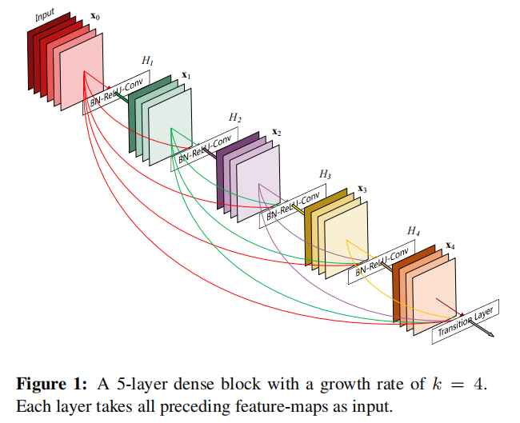
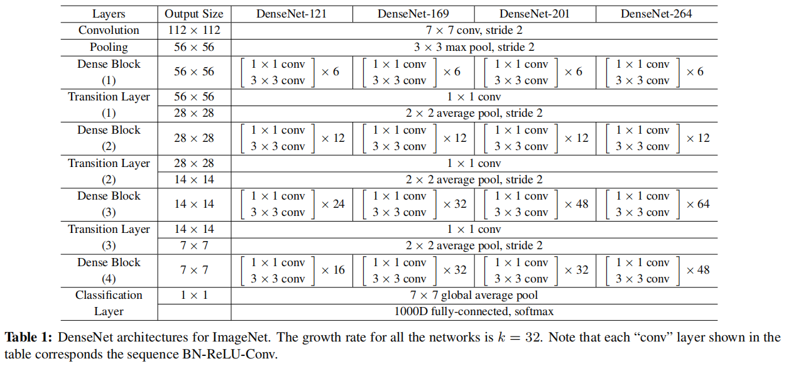
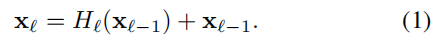
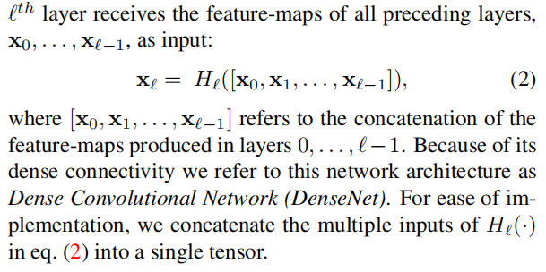
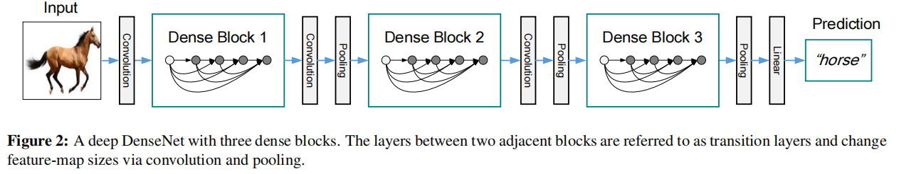

# DenseNet

（Dense Convolutional Network，DenseNet）

[Densely Connected Convolutional Networks](https://arxiv.org/abs/1608.06993)

## Introduction

为了保证信息流的充分流通，将每一层与之前所有层连接。

所有连接使用 concatenation，不使用 ResNet 的 summation 。

$L$-layer network 有 $\frac {L(L+1)} 2$ connections 。

DenseNet 使用 narrow 的 layer（每个 layer 使用较少的 filter 数目，即通道数少），以减少 feature map 的大小。

DenseNet 每个 dense block 都输出相同的 feature map 的 channel 数目。

尽管减小了通道数，但大量重复 concat 容易导致 feature map 过大（特别是低层级的大 feature map 的不断 concat），显存占用过大。

DenseNet 每一层都有直接通向 loss 的连接，这使得深层网络更好训练。

## DenseNets

在 ImageNet 上使用：

### ResNets

设第 $\scr l$ layer 的输出为 $\rm x_{\scr l}$ ，$H_{\scr l}()$ 为 composite function（例如 Batch Normalization (BN)，rectified linear units (ReLU) ，Pooling，Convolution (Conv)  ）。

ResNet 的 skip-connection 为：

### Dense connectivity

作者 introduce direct connections from any layer to all subsequent layers：

### Composite function

作者将 composite function 设置为： batch normalization (BN), followed by a rectified linear unit (ReLU) and a 3×3 convolution (Conv) 。

### Pooling layer

作者将网络划分为多个 dense blocks ：

作者将 dense block 内部的 layer 称为 dense layer，block 之间的 layer 称为 transition layers（batch normalization，convolution and pooling）。

block 和其后的 transition layers 称为一个 stage 。

### Growth rate

若 $H_{\scr l}()$ 产生 $k$ 个 feature map 通道，则第 $\scr l$ layer 将有 $k_0 + k \times ({\scr l} - 1)$  个 input channels ，其中，$k_0$ 是 dense block 的输入通道数。

DenseNet 可以非常 narrow ，即 $k$ 可以设置得非常小（例如 $k = 12$），作者将 $k$ 称为 growth rate 。

### Bottleneck layers

尽管 layer 的输出通道数少，但输入通道数会很多，作者在每个 3x3 卷积 layer 前使用 1x1 convolution layer（bottleneck layer）减少通道数，以降低计算量。

### Compression

如果一个 dense block 有 $m$ 个 feature map channels，让接下来的 transition layer 输出 $\lfloor \theta m \rfloor$ 个 feature map channels 。

称 $\theta \in (0,1]$ 为 compression factor 。