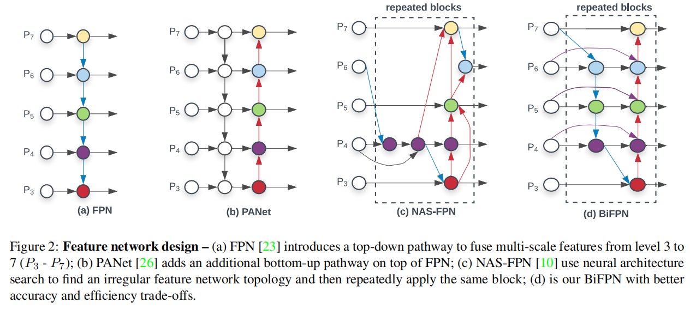
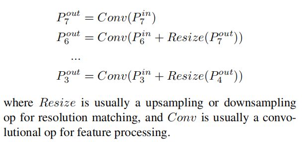
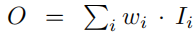
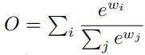
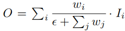
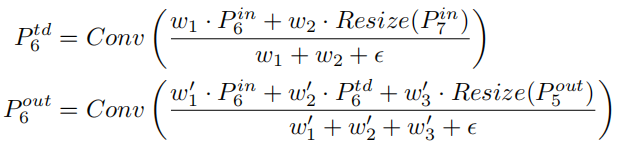
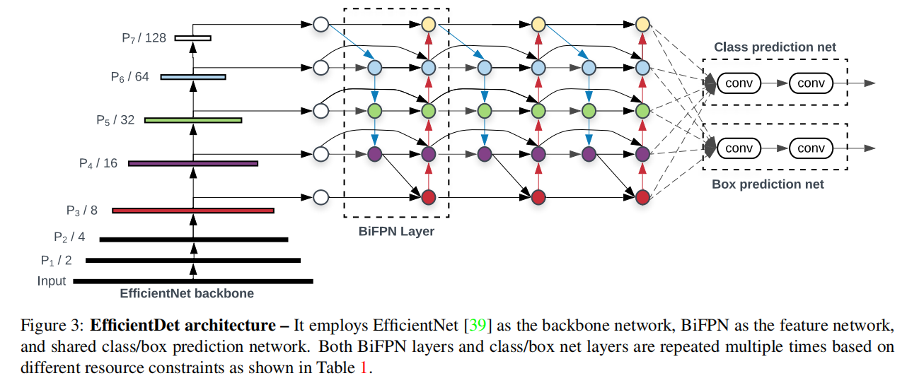

# EfficientDet 

[EfficientDet: Scalable and Efficient Object Detection](https://arxiv.org/abs/1911.09070)

## BiFPN

（weighted bi-directional feature pyramid network）

其中，某个圆代表该 scale level 的 feature，箭头表示 feature 的输入输出方向。

上图意义举例，对于 $P_6$ 这一水平线上（这一 level 上）：

- $P^{in}_6$ 是 $P_6$ 这一 level 的输入，是最左边那个圆。
- $P^{td}_6$ 是中间的那个圆。（td 表示 intermediate）
- $P^{out}_6$ 这一 level 的输出，是最右边那个圆。

没有中间的圆时，就只有 $P^{in}_6,P^{out}_6$（左右的圆）。

### Problem Formulation

FPN 在不同 level 的操作可以表示为：

### Cross-Scale Connections

NAS-FPN 使用 NAS（neural architecture search）技术搜索网络 topology 结构，但 search 耗时，而且搜索出的网络结构往往比较复杂，混乱，难以修改，解释。

作者实验发现 PANet 准确率比 FPN 和 NAS-FPN 好，但参数量和计算量更大。 

作者对 PANet 进行了一些直觉上的优化：

- 去除只有一个输入边的结点。（$P_7$ 中间的圆）

	一个输入边的结点没有 feature fusion，对网络融合特征的功能贡献小。

- 在同一 level 的 input node 和 output node 间添加 edge 。

	能 fusion 更多 feature ，而且消耗增量不大。

- 去除参数量非常大，但效果提升有限的 featue 。（$P_3$ 中间的圆）

	BiFPN 比 PANet 准确率高，而这个操作使得 BiFPN 比 PANet 参数量更少。
	
	- FPN 的 top-down path，越往下参数越多。
	- PANet 的 bottom-up path，越往上参数越少。
	
- 堆叠融合模块

	作者将每个 bidirectional (top-down& bottom-up) path 作为一个 feature network layer，堆叠它们以增强融合能力。

### Weighted Feature Fusion

在 YOLOv4 中，这个被称为 MiWRC（Multi-input weighted residual connections）。

作者认为不同 scale level 对融合的贡献是有差异的，于是在 BiFPN 内对各尺度 level 的 feature 加权（权重是可学习参数），然后计算该 level 的输出。

作者考虑了三种加权方式。

#### Unbounded fusion

其中，$w_i$ 是 learnable weight that can be a scalar (per-feature), a vector (per-channel), or a multi-dimensional tensor (per-pixel).

这个方式有较好的准确度和最低的 cost ，但 scalar weight is unbounded，可能导致  training instability 。

于是作者使用 weight normalization 去限制权重范围。

#### Softmax-based fusion

将 softmax 应用到权重上就可以实现 weight normalization，有 $w \in (0,1)$，这样，权重就表示 input 的重要性。

作者在  ablation study 中发现它 leads to significant slowdown on GPU hardware 。

#### Fast normalized fusion

其中，$\epsilon$ 是个很小的数，防止分母为 $0$ 。保证 $w_i \ge 0$ 可以在每个 $w_i$ 后用 Relu 实现，最后有 $w \in (0,1)$ 。

该方法和 Softmax-based fusion 有相似的行为和准确率，但速度更快。

### final BiFPN

final BiFPN integrates both the bidirectional cross scale connections and the fast normalized fusion.

计算示例：

为了增加效率，使用 depthwise separable convolution for feature fusion，add batch normalization and activation after each convolution 。

## EfficientDet

#### EfficientDet Architecture

使用  EfficientNet 作为 backbone ， class and box network weights are shared across all levels of features：

