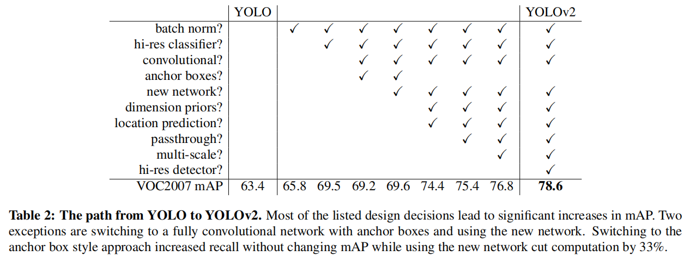
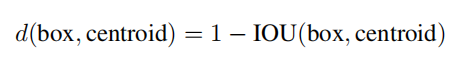
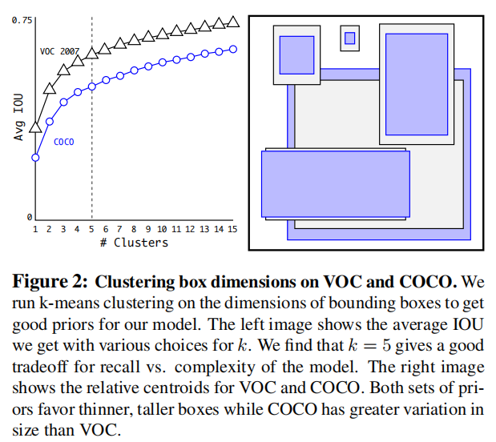
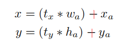
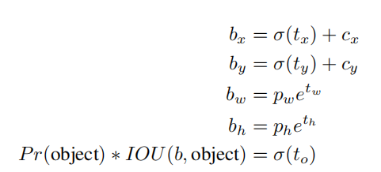
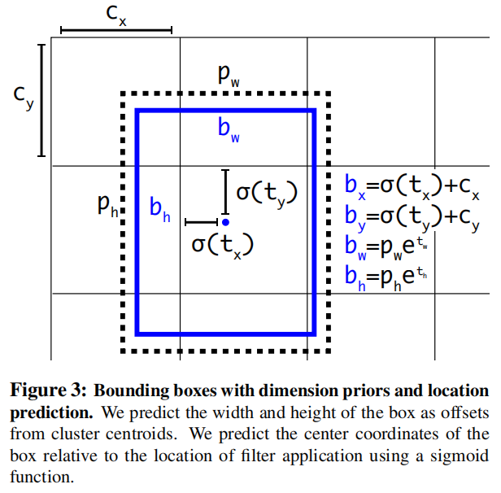
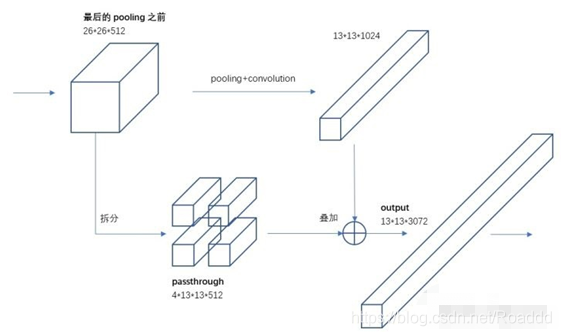
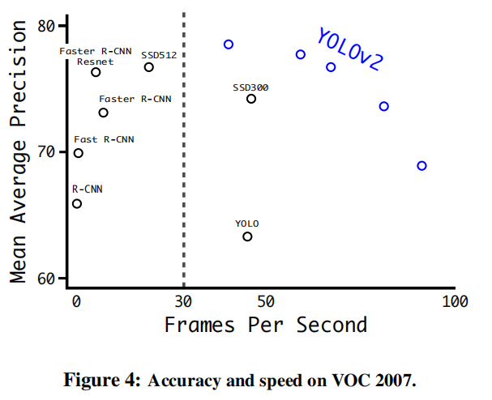
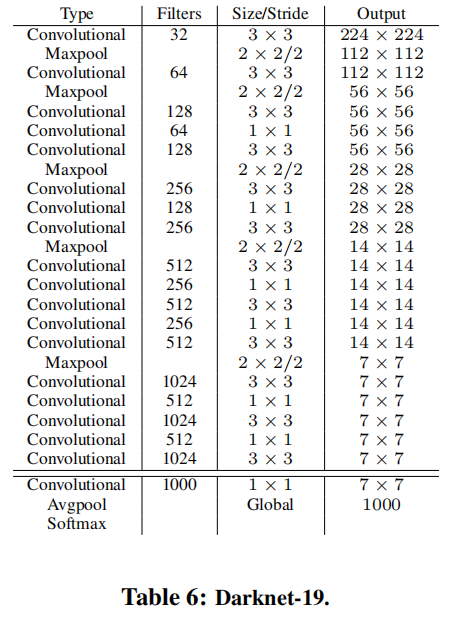
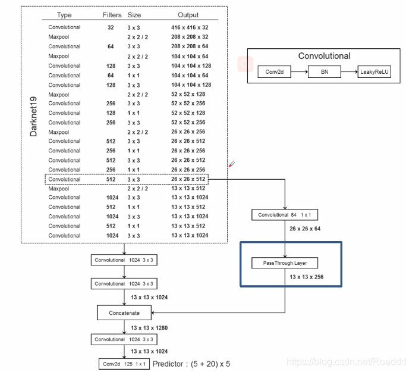

# YOLOv2

[YOLO9000: Better, Faster, Stronger](https://arxiv.org/abs/1612.08242)

## Introduction

classification dataset 往往比 detection dataset 的类别数少，detection 的标注比 classification 的标注花费更大，作者想要在节约标注的情况下将 classification 的类别规模迁移到 detection 上。

作者提出 YOLOv2 ，然后用 joint training algorithm 使用两个数据集训练出 YOLO9000（利用 ImageNet 的 9000 类 classification data，COCO 的 detection data），它能 detect 9000 个类别。

## Better

YOLO 的 localization 精度较低，且 recall 低于 region proposal-based methods 。

上图的 anchor boxes 表示传统的 anchor 设置方式，YOLOv2 最后没有采用，而是采用 dimension priors 的 anchor 设置方式。

### Batch Normalization

在 YOLO 所有卷积 layer 后加入 batch normalization ，可以在移除 dropout 的情况下不 overfitting 。

mAP 提升 2% 。

### High Resolution Classififier

The original YOLO trains the classifier network at 224 *×* 224 and increases the resolution to 448 for detection. 

For YOLOv2 we first fine tune the classification network at the full 448 *×* 448 resolution for 10 epochs on ImageNet.

mAP 提升 4% 。

### Convolutional With Anchor Boxes

尝试传统的 anchor 机制。

作者使用 416 input images instead of 448*×*448 ，YOLO’s convolutional layers downsample the image by a factor of 32 so by using an input image of 416 we get an output feature map of 13 *×* 13 。这使得 feature map 的边长是奇数，只有一个中心，大目标往往可以利用 1 个中心去预测，而不是相邻的 4 个点。

引入 anchor 后不再直接对网格划分的空间位置预测类别，而是对每个 anchor 预测类别。（预测要考虑 anchor 数量产生的维度）

使用 anchor 机制后，Without anchor boxes our intermediate model gets 69*.*5 mAP with a recall of 81%. With anchor boxes our model gets 69*.*2 mAP with a recall of 88%.

### Dimension Clusters

Instead of choosing priors by hand ，作者使用 k-means 对 bounding boxes 聚类，以找到最好的 anchor 长宽和数量设置方式。

作者使用欧氏距离时，大的 box 比小的 box 产生了更多的错误，考虑到最终目的是好的 IOU scores ，which is independent of the size of the box ，作者提出一个距离度量：

不同 $k$ 值的 avg IOU 如下：

作者选择了 5 个 cluster 的聚类中心代表的 boxes 作为 anchors 。

在 average IOU 上，作者的 5 个先验框达到了 61.0 ， Faster-RCNN 为 60.9 ，达到了相当甚至略微超越的效果。

### Direct location prediction

在 Fast R-CNN 的 RPN 中，RPN 预测中心的调节因子 $t_x , t_y$ ，然后计算回归后的中心 $x,y$ ：（论文中原图与论文描述矛盾，应为加号）

其中，下标 $a$ 表示 anchor ，当 $t_x = 1$ 时，box 中心将右移，当 $t_x = -1$ 时，box 中心将左移。

这个式子中，anchor 的中心是无约束的，每一个 anchor 的中心在回归中都可能偏移到图像的任何一个点，这导致模型不稳定，需要长时间的训练才能收敛。

我觉得如果偏移就太远就不再能当作是线性变换，会导致错误率增加。同时，即使存在物体的重叠，需要偏移到其它 anchors 的区域的情况是比较少的，允许漂移太远会影响精度，也会导致在其它 anchors 负责的区域进行多余的计算。

YOLOv2 与 YOLO 一样，预测相对于 grid cell 左上角的比例 offset ，这使得 GT 位于 0 到 1 之间，可以使用 logistic activation 达到这一限制。（$x$ 坐标和 $y$ 坐标都在 $[0,1]$ ，可以覆盖整个 cell）

Sigmoid 函数在 $y$ 轴上符合正态分布，这假设了边框中心两个分量的坐标的 offset 的值呈正态分布。

注意，anchor 的宽高使用聚类结果，anchor 的中心就是 cell 的左上角。

YOLOv2 网络在 feature map 的每个 cell 预测 5 个 bounding boxes ，对每个 box 由网络特征预测 $t_x, t_y, t_w, t_h$ （ $t_x,t_y$ 经 sigmoid 后，$t_w,t_h$ 经 $e$ 后，即为 4 个调节因子）和 $t_o$（结果的 confidence）。

先将网格大小归一化，使得 cell 宽高都为 $1$ ，这样调节因子的系数即为 $1$ （ $1 \times \sigma(t_x) + c_x$ ）。

有最终回归为：

其中，$c_x, c_y$ 为 cell 左上角的坐标（其相对于 image 左上角），$p_w, p_y$ 为 bounding box prior width and height ，$\sigma$ 表示 sigmoid 函数。

$b$ 表示回归后的 box（即 detection 结果的 box ），$\sigma(t_0)$  表示对该 box 的 detection 的 confidence（confidence 混合表示 object 是否存在的概率和 IOU 效果，与 YOLOv1 相同）

RPN 中，中心点的回归与宽高是相关的，而 YOLOv2 的策略将中心点与宽高解绑，使得中心点和宽高可以独立回归调整，同时以 cell 为基础，使得中心偏移的幅度不至于过大。（中心点的平移不再依赖宽高，而是依赖长度固定的 cell，损失了一定的尺度不变性）

这个策略 improves YOLO by almost 5% over the version with anchor boxes.

### Fine-Grained Features

（细致的特征，细粒度特征）

YOLO 从最终 13 *×* 13 feature map 上预测，对于小目标检测不足。

作者增加了一个 passthrough layer ，将先前的 resolution 的 feature 作为当前 feature 的新的通道，即先将早先的 26 × 26 × 512 feature map into a 13 × 13 × 2048 feature map ，然后 concat 上 original features 。

This gives a modest 1% performance increase.

### Multi-Scale Training

训练时不断 resize 图片， Every 10 batches our network randomly chooses a new image dimension size. Since our model downsamples by a factor of 32, we pull from the following multiples of $32: \{320, 352, ..., 608\}$. Thus the smallest option is 320 *×* 320 and the largest is 608 *×* 608.

We resize the network to that dimension and continue training.

## Faster

### Darknet-19

作者设置新的分类网络结构作为 YOLOv2 的基本结构 ，有 19 个卷积层，5 个 maxpooling 层：

其网络参数较 VGG-16 更少，在 ImageNet 上，仍然可以达到 top-1 72.9% 以及 top-5 91.2% 的精度

### 模型结构

为了继续做 detection，要继续修改 Darknet-19 ：

移除最后一个卷积层及之后的层，增加 3x3 卷积层（1024 个 filter），最后 1x1 卷积层，输出为 detection 需要的数量。

For VOC（一个 dataset） we predict 5 boxes with 5 coordinates（有一个代表置信度） each cell and 20 classes per box so 125 filters.

We also add a passthrough layer from the final 3 *×* 3 *×* 512 layer to the second to last convolutional layer so that our model can use fine grain features.

### 训练方式

YOLOv2 的先验框匹配和 loss 函数可以参考 YOLOv1 。

在 YOLOv2 中：

- 若 GT 的中心落在某个 cell 中，该 cell 内的 5 个 anchors 就负责预测它。
- 一样要假定每个 cell 最多只有一个 GT 。
- 与 GT 匹配的先验框计算坐标误差、置信度误差（此时 target 为 1 ）和分类误差，而其它的边界框只计算置信度误差（此时 target 为 0 ）。
- YOLOv2 的 loss 函数比 YOLOv1 有一定改动，影响不大。

## Stronger

混合 detection 和 classification 的数据，训练遇到 detection 数据时，计算完整的 loss ；遇到 classification 数据时，只反向传播分类部分的网络。

challenges：

- detection 数据集往往只有平常的类别和标签，而 classification 数据集有更多种类更深入细分种类的类别。
- 存在非互斥（包含关系）的类别，无法直接使用 softmax 多分类。

### Hierarchical classification

ImageNet 使用 WordNet 结构描述类别关系，WordNet 是一个有向图，而不是一个树，因为语言是复杂的，存在交叉的类别。

作者简化了问题，构建一个 hierarchical tree 描述这些关系，即构建一个 WordTree 。

遍历 WordNet ，对于到 root 只有一条 path 的结点，直接添加到 WordTree ，对于到 root 有多条 path 的结点，选择最短的 path 添加到 WordTree 。

利用 WordTree 合并两个数据集。

在每个子树的根结点使用 softmax ，一个结点的概率等于其到 root 的 path 上所有条件概率的乘积，root 的概率为 $1$ 。

采用贪心策略，每次只选择子结点概率最大的方向，计算这条路径的概率，当到达某个阈值时停止，或在叶子停止，停止的结点即为预测的类别。

检测使用 COCO 数据集，分类使用 ImageNet 数据集的 top 9000 个类别。

两个数据集量的差异较大，所以对较小的 COCO oversampling ，形成 ImageNet 比 COCO 为 $4 : 1$ 的两个数据集的样本数量。

为了控制输出大小，只使用 3 个 anchors 。

YOLO9000 gets 19.7 mAP overall with 16.0 mAP on the disjoint 156 object classes that it has never seen any labelled detection data for. 