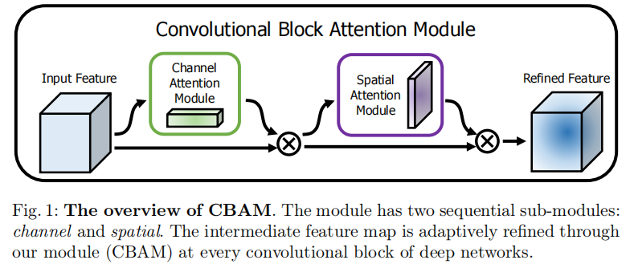
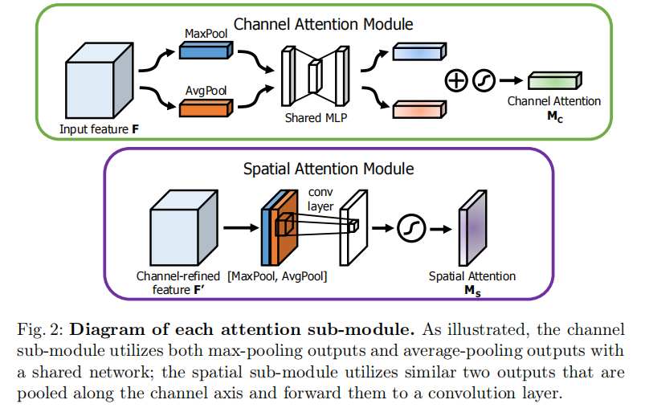
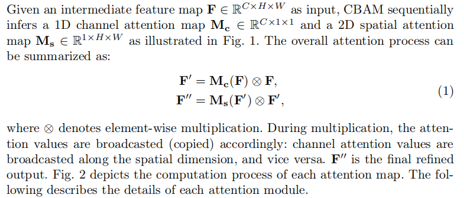
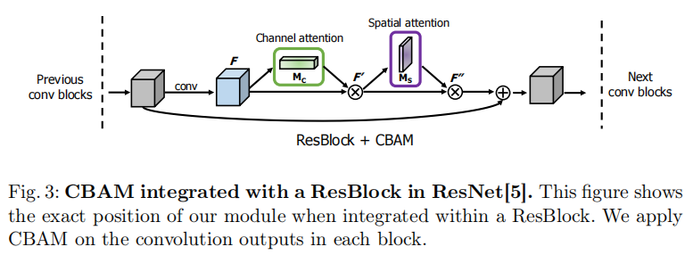
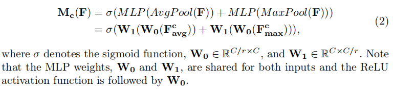
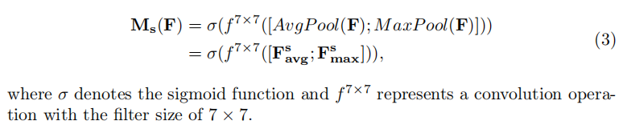

# CBAM

 [CBAM: Convolutional Block Attention Module](https://arxiv.org/abs/1807.06521)

## Introduction

作者提出 CBAM ，想要提升卷积网络对 channel 和 spatial axes 的注意能力。

CBAM 包含两个子模块：

- Channel Attention Module（CAM）

	对 channel 的注意力，对 channel 的特征选择。（what 信息）

- Spatial Attention Module（SAM）

	对 spatial axes 的注意力，对 spatial 信息的特征选择。（where 信息）

这两个模块可以被放在任意两个 convolution layer 之间，也可以单独使用。

CBAM 相当于对网络的 what 和 where 信息进行了增强。

## Convolutional Block Attention Module

集成方法：

子模块输出的值被 broadcasted (copied)，然后和 feature map 进行 element-wise 的相乘。

将 CBAM 集成到 ResNet：

### Channel attention module

1. 对 input feature $F$ 的每个 channel 进行 map pooling 和 average pooling，得到两个向量 $\boldsymbol F^c_{max}, \boldsymbol F^c_{avg}$ ，上标 $c$ 代表 channel。
2. 两个向量分别输入 shared weight MLP ，输出两个向量。
	- MLP 只有一个 hidden layer，size 为 $\mathbb R^{C/r \times 1 \times 1}$ ，其中 $r$ 为 reduction ratio ，$C$ 为 channel 数。
3. 两个向量综合得到 channel Attention $\boldsymbol M_c \in \mathbb R^{C \times 1 \times 1}$ 。

CAM 描述每个 channel 的重要信息，channel 是 filter 产生，不同 filter 描述不同的 what 信息，所以 CAM 注意 what 信息。

### Spatial attention module

1. 对 input feature $F$ 进行 cross channel 的 max pooling，得到两个 map $\boldsymbol F^s_{avg},\boldsymbol F^s_{max}$ ，都 $\in \mathbb R^{1 \times H \times W}$ ，其中，上标 $s$ 表示 spatial ，$H,W$ 表示高和宽。
2. 将两个 map 进行 concat 。
3. 用一般 convolution layer 卷积，得到 spatial attention map 。

SAM 描述 cross channel 的每个位置的重要信息，注重 where 信息。

### Arrangement of attention modules

作者在实验中发现：

- CAM 和 SAM 顺序使用比平行使用好。
- CAM 在 SAM 前使用效果好一点。

