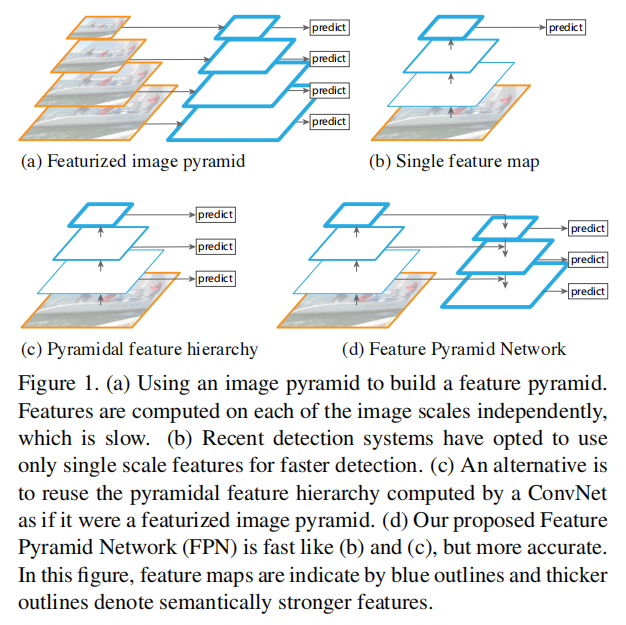
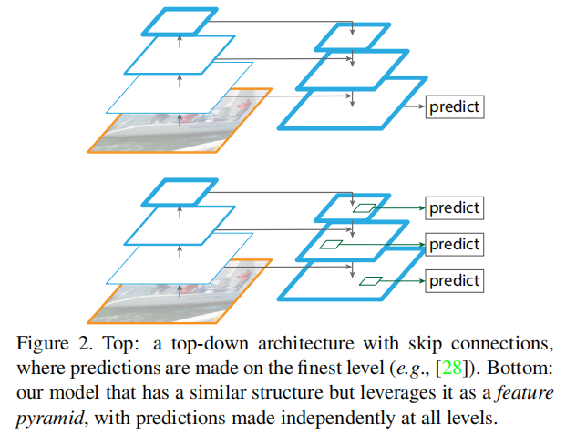
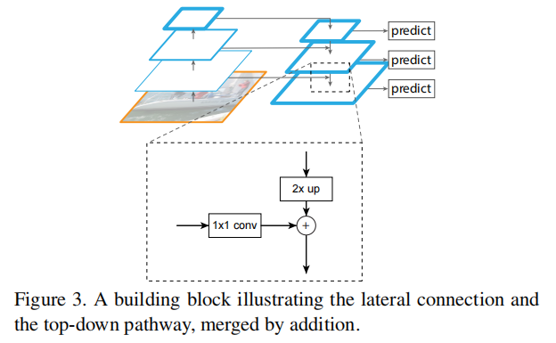
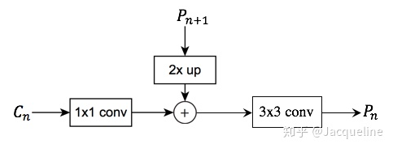
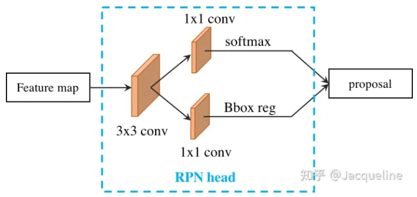
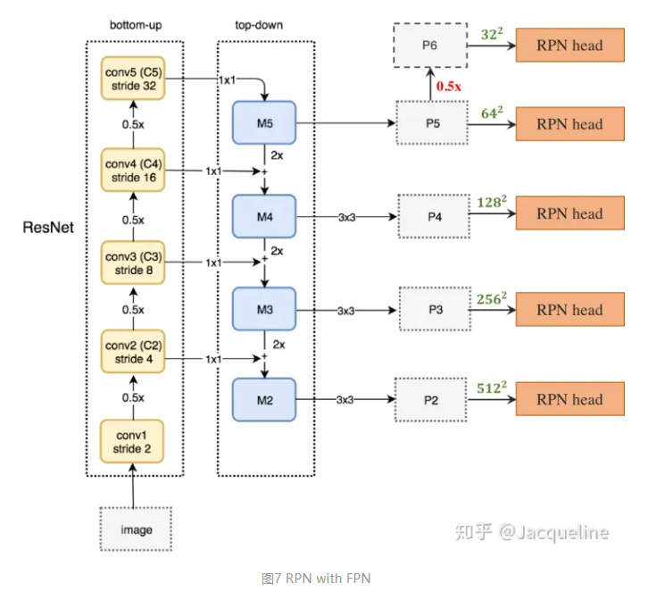
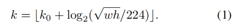

# FPN

[Feature Pyramid Networks for Object Detection](https://arxiv.org/abs/1612.03144)

FPN 提升了小目标的检测能力，引入的低层级信息也提升了 box 的准确度。

## Introduction

上图，蓝色线越粗代表语义特征越强。

Feature pyramids built upon image pyramids（for short we call these featurized image pyramids）

Featurized image pyramids 在早期是基于手工特征的检测器的必需。

手工特征随后被卷积取代，卷积能够表达高层级的语义信息，也在单一尺度的图片输入上具有更好的尺度不变性。

尽管如此，Feature pyramids 仍然能够提升卷积网络的准确率。

但是，Feature pyramids 在时间和空间上的消耗非常大，如果只在 test inference 时才使用 pyramid ，又会导致  train/test-time inference 的不一致。

feature pyramids 一般是指尺度特征的上的金字塔，多层卷积网络的 feature hierarchy 本身，可以说是语义特征上的金字塔。

作者希望他们的 feature pyramid 具有 semantics 和 scales 上的较强的能力。

To achieve this goal, we rely on an architecture that combines low-resolution, semantically strong features with high-resolution, semantically weak features via a top-down pathway and lateral connections .

传统的不同层级的 merge 的 skip connection 仍然是在最终单一尺度的 feature map 上 predict 。

而 FPN 在所有 level 上 predict （每个 level 的 prediction 都是最终结果，只是针对的目标大小不同）：

## Feature Pyramid Networks

FPN 可以输入任意 size 的单一 scale 的 image ，输出一定比例大小的 feature maps at multiple levels 。

这个操作独立于卷积网络 backbone（作者使用的 backbone 为 ResNets）。

FPN 包含 bottom-up pathway, top-down pathway, lateral connections 三个部分。

### Bottom-up pathway

bottom-up pathway 是 backbone ConvNet 的前向传播过程。

backbone 有很多卷积 layer ，这些卷积 layer 输出 maps ，同时被包含在组件（称为 stage）中。

We choose the output of the last layer of each stage as our reference set of feature maps to create our pyramid 。

作者认为每个 stage 的最后一个 layer 包含最有用的信息。

### Top-down pathway and lateral connections

Top-down pathway 从 higher pyramid levels 中 upsample 空间更粗糙，但语义更强的特征图，来产生 higher resolution features ，即使得语义特征在空间上扩张。

每个 lateral connection 连接 bottom-up path way 和 the top-down pathway 的相同空间大小的 feature map ，同时，FPN 上所有 feature level 共享 classifier 和 regressor ，因此需要统一的 channel 维度。

低层级的 feature map 具有较少的语义信息，但能够提升定位问题的准确度，对应的 merge 使得低层级的 feature map 具备了丰富的语义信息。

lateral connections 传递的低级特征也可以指导高级特征的进一步扩张。

在 merged map 后还要有一个 3*×*3 convolution 生成最终的 final feature map ，即：

上采样过程可以采用：

- 最近邻插值（原论文采用）

	直接赋予最近的值。

	- 可以在上采样过程中最大程度保留语义信息，有利于分类。
	- 计算量较小，但生成的图像容易在灰度上不连续，在灰度变化大的地方出现明显的锯齿状。（混叠效应，aliasing effect）
	- 作者在 merged map 后使用 3x3 convolution 应对混叠效应。

- 双线性插值

	对相邻 4 个位置加权。

	- 对语义信息可能有破坏。

- 转置卷积（建议采用）

	模型自动学习。

## Applications

### Feature Pyramid Networks for RPN

对 Faster R-CNN 的 RPN 的 single-scale feature map 采用 FPN 策略。

添加一个 head of the same design (3×3 conv and two sibling 1×1 convs layer) to each level on our feature pyramid ：

这个 head 能够 slide 到 pyramid levels 的所有位置，所以不需要在一个 level 上使用多尺度的 anchors 。

作者在一个 level 上只使用一个 scale 的 anchors ，但仍然在一个 level 上使用多个长宽 ratio 。

使用 IOU 进行 positive 和 negative 的选择。

作者经过实验，head 的参数是否共享对产生的准确率没有大的影响，这说明 FPN 的各 level 都含有相似的语义信息（语义信息被充分扩张），只是具有不同的 resolution 。

其中，绿色数字代表 anchor 尺寸（上图标反了，对应关系应该是 ${32^2,64^2,128^2,256^2,512^2} \to {P_2,P_3,P_4,P_5,P_6}$），表示 P 的各 level 的 feature map 对应的 anchor 大小。（其中 anchor 比 feature map 大的情况没有问题，feature map 只是用于计算 anchor 的调节因子，image size 才需要大于 anchor size）

conv1 的特征图太大，所以不使用，也就没有 M1 以及 P1 。

P 的层级：（FPN 的高级低级特征的融合还不够充分，PANet 对其进行了改进）

- 层级越低，分辨率越高，用于检测越小的目标（使用越原始的低级特征 feature map）。
- 层级越高，分辨率越低，用于检测越大的目标（使用越原始的高级特征 feature map）。

### Feature Pyramid Networks for Fast R-CNN

To use it with our FPN, 需要将不同尺度的 RoIs 对应到相应的 pyramid level 。

分配方式如下：

其中，$w,h$ 是 ROI 的宽高，$k$ 表示 FPN 的 level $P_k$ ，$224$​ 是图片大小（使用的网络是在 ImageNet 训练的网络上做 transfer learning 得到的，ImageNet 的  pre-training size 为 224）。$k_0$ is the target level on which an RoI with $w \times h = 224^2$ should be mapped into.

公式表明，如果一个 ROI 宽高比较小，那么应该被映射到更高 resolution 的 level 。

作者让 ROI pooling 提取 7x7 的特征，然后添加两个 1024 维 hidden layer 的 FC ，然后接 classification 和 regression 的 head 。

同样的，head 在每个 level 上共享权重。