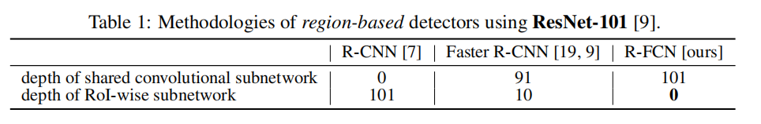
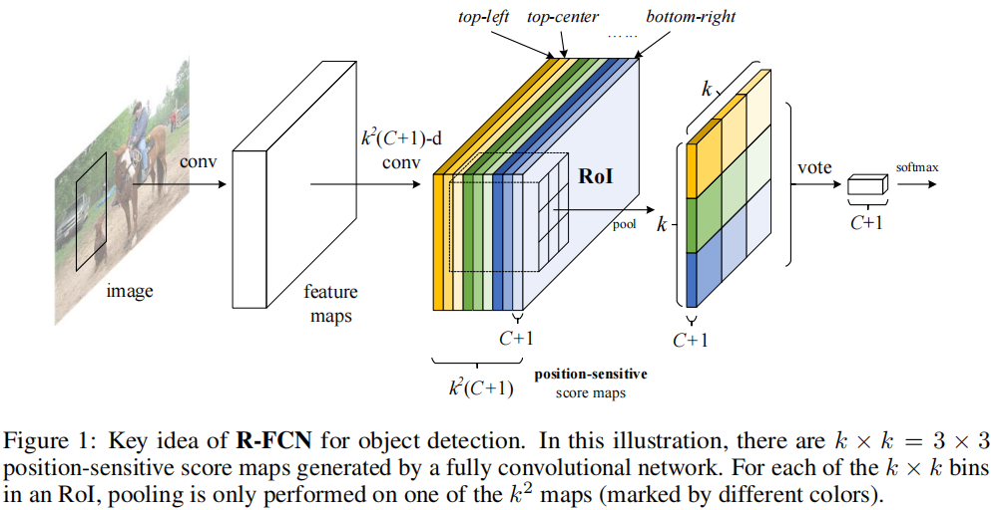
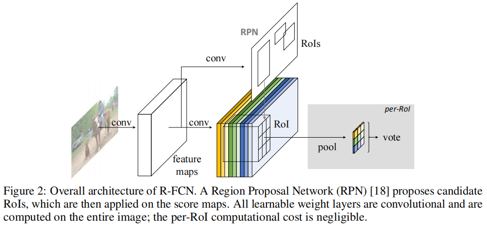
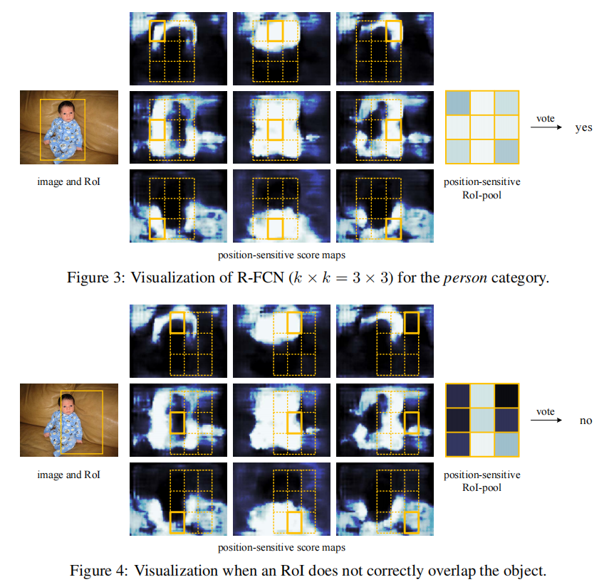

# R-FCN

[R-FCN: Object Detection via Region-based Fully Convolutional Networks](https://arxiv.org/abs/1605.06409)

R-FCN 比 Faster R-CNN 快，精度差不多。

## Introduction

之前的网络可以由 ROI pooling 分为两个各个子网络，一部分是共享的卷积网络，一部分是对每个 ROI 分别计算的  RoI-wise 分类 subnetwork ，后者的 unshared per-RoI computation 导致了大量的重复计算量。

- image classification（图像分类）

	粗略的高级语义，具有 translation invariance（平移不变性）。

-  object detection（目标检测）

	需要 object 的 localization 信息，在一定程度上具有 translation variance（平移敏感性）。

作者假设 deeper convolutional layers in an image classification network are less sensitive to translation ，ResNet（一个分类网络）的 detection pipeline 插入了 ROI pooling 层，其之后的卷积 layer 分别对不同 ROI 计算，解决了分类网络的 translation invariance 问题，但这样对每个 ROI 分别计算牺牲了时间效率。

在都利用 ResNet-101 的情况下，R-CNN 卷积 layer 都用于 ROI 后，Faster R-CNN 分为两部分，而 R-FCN 将 ROI 放在最后，全部卷积 layer 都用作 shared 计算：

作者提出了一种 position-sensitive score maps 的卷积 layer ，其编码了 position 信息，用以解决 translation invariance 。

在使用 position-sensitive RoI pooling layer 后，不再有任何含有 weight 的 layer（conv 或 fc），直接预测 detection ：

注意原理图的颜色对应。

R-FCN 使用 ResNet-101 作为 backbone 。

## Our approach

作者使用 Region Proposal Network (RPN) 提取 candidate regions（RPN 本身是一个全卷积网络，卷积层具有平移不变性），即生成 ROI ：

### classification

#### Position-sensitive score maps

R-FCN 将 ROIs 分类为 object 类别和 background（$C+1$），将 feature maps 卷积为有 $k^2(C+1)$ 个通道的 score maps 。

这样，每个类别的 object 都有了其各个位置的 feature 。（object 对应的框内各个位置应有的特征）

例如，当 $k = 3$ 时，score maps 有 $9(C+1)$ 个通道，分别表示 object 边框的 {top-left, top-center, top-right, ..., bottom-right（共 9个 cell）} 的各类别特征。

#### Position-sensitive RoI pooling

将每个 ROI 划分为 $k^2$ 的网格（每格称为 bin），进行 selective pooling， 每个 bin 的响应值来自其对应的那些 score map 通道（$C+1$）。

得到 $k^2$ 宽高，$C+1$ 通道的输出，然后每个通道对不同位置的 response 进行 vote ，得到类别特征向量。

### box regression

#### Position-sensitive score maps

与 $k^2(C+1)$ 的 score maps 平行地，将 feature map 卷积为 $4k^2$ 个通道的 maps 用于 box regression 。（相当于 $4$ 个类别的分类）

#### Position-sensitive RoI pooling

position-sensitive ROI pooling 用于这些 maps ，对每个 ROI 生成 $4k^2$ 维的向量，然后 vote 出 $4$ 维表示边框的向量。

### visualization

## Experiments

By setting $k = 1$ we remove the position-sensitivity of the R-FCN. This is equivalent to global pooling within each RoI.