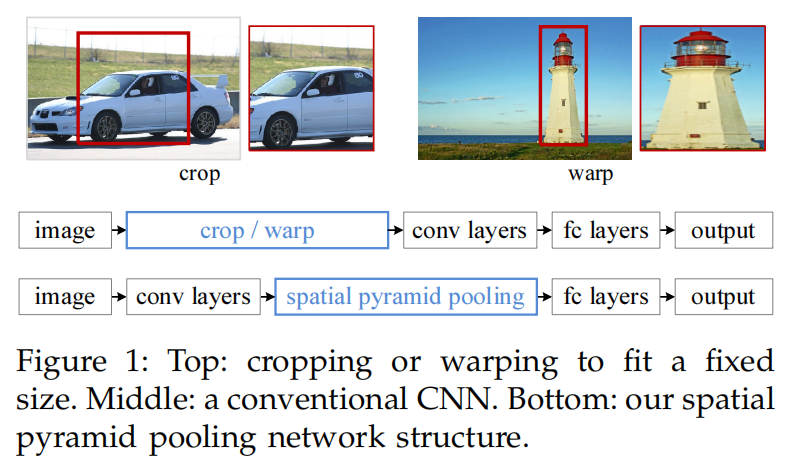
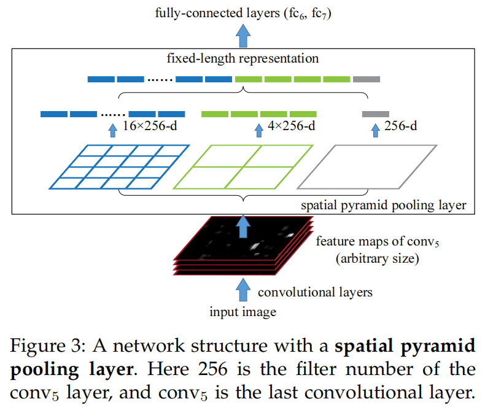
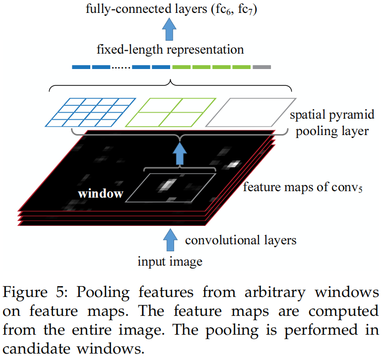

# SPP

（Spatial Pyramid Pooling）

[Spatial Pyramid Pooling in Deep Convolutional Networks for Visual Recognition](https://arxiv.org/abs/1406.4729)

## introduction

之前的 CNN 需要 fixed size 的 image 输入，当面对 arbitrary sizes 的 image ，一般采用 fit to fixed size 或者 cropping 和 warping 方法：

- cropped region 可能无法包含整个 object 。
- warped content 可能导致 unwanted geometric distortion（几何形变，失真）。

当前的 CNN 主要包含 conv layer 和 FC：

- convolution layer 采用 sliding-window manner 输出 feature map ，不需要 fixed size input 。
- fully-connected layers 需要固定的 fixed size input 。

问题在于 fully-connected layers 的输入。

SPP layer（SPP-net）放在 convolution layer 后，可以产生 fixed length output ，然后输入 fully connected layers (or other classifiers) 。（这个过程也可以叫 information aggregation）

这样，SPP 使得 CNN 能够输入任意 size 的 image 。

## SPP layer

### global single level

设置一些 spatial bins ，它们的 size 按一定比例从 image 计算，所以 bin 的数量是固定的。

对每个 bin 进行 pooling 就可以得到固定长度的输出。

bin 有 $M$ 个，last convolutional layer 有 $k$ 个 filter（通道数），则 SPP layer 输出 $kM$ 维的 vector ，相当于 global pooling 操纵。

### global multi-level

SPP 也可以进行多 scale（level）的操作，每个 level 进行不同比例 bin 的划分，然后将各 level 的输出拼接起来。

每个 level 的输出长度都是固定的，所以多 level SPP 的输出也是固定长度的。

使用 max pooling 时，多 level 的 pooling 使得不同 level 的重要特征被提取出来，越重要的特征越可能被提取出多份，而不重要的特征被舍弃，相当于一个重要特征加强的操作。

### local window

SPP 也可以用于 feature map 上任意大小的区域 windows：

