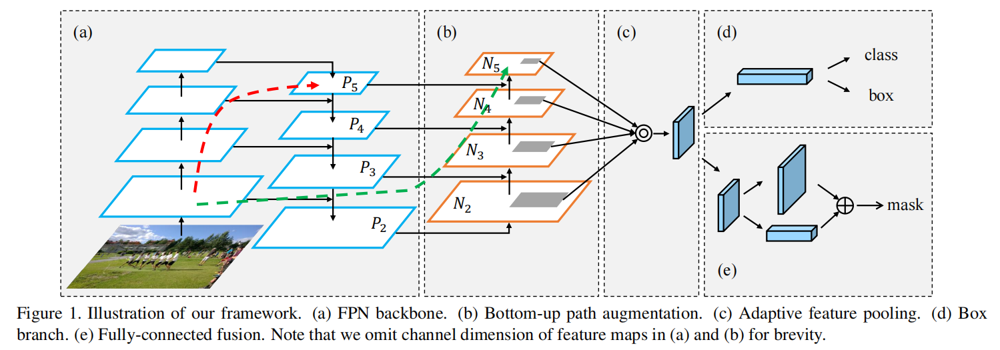
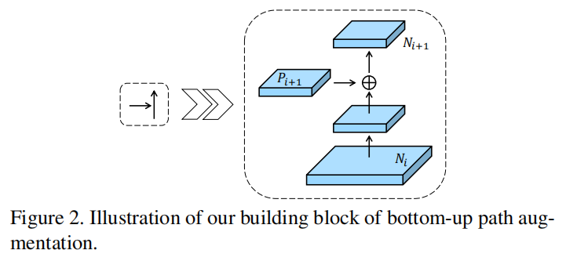
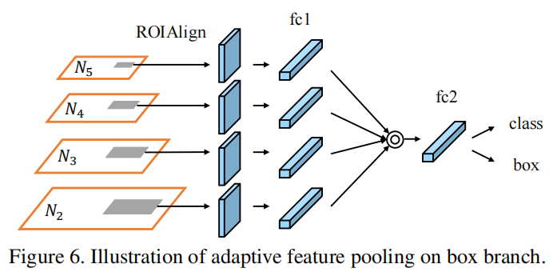
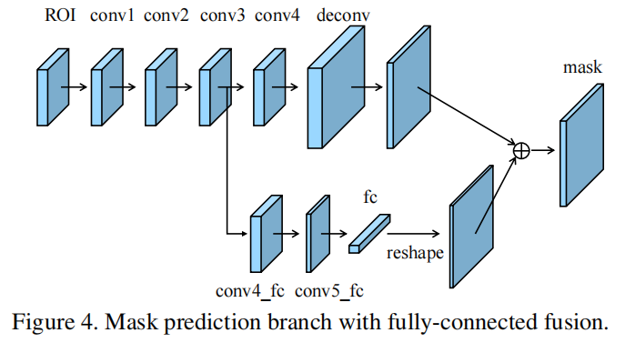

# PANet

[Path Aggregation Network for Instance Segmentation](https://arxiv.org/abs/1803.01534)

PANet 基于 Mask R-CNN 进行实例分割，同时改进了 neck 部分 FPN 的结构。

instance segmentation 即在 object detection 的 box 内进行分割。

## Framework

### Bottom-up Path Augmentation

#### Motivation

通过 propagating low-level patterns，增强了 localization 能力 ，因为低级特征对 edges or instance parts 的描述能提升 instances 定位的准确度。

FPN 只有高级特征向下的传播过程，PANet 还进行了低级特征向上的传播过程，有更充分的信息融合。

Figure 1 中，输入图片上方的四个蓝色矩形从下到上分别是 ResNet 的 res2，res3，res4，res5 的输出，总共层数在 FPN 的不同网络规模设置下，从几十到上百层不等。

- 红色虚线

	表示低级特征在 FPN 中的传播过程，最低级特征首先向上，然后经过 lateral connection 到达最高层 P5 ，需要经过几十或者上百层 layer ，低级特征丢失严重。

- 绿色虚线

	表示低级特征在 PANet 中的传播过程，最低级特征首先经过 lateral connection 到 P2，然后向上即到达最高层 N5 ，只经过十层不到的 layers ，减少了高级特征和低级特征融合的距离。

#### Augmented Bottom-up Structure

与 FPN 的设置一样，FANet 在每个 ResNet network stage 有相同的 spatial size ，每个 feature level 对应一个 stage 。

$P_5$ 到 $P_2$ 每个 level 上采样 $2$ 倍，$N_2$ 到 $N_5$ 每个 level 下采样 $2$ 倍，其中，$N_2$ 等同于 $P_2$ ，没有经过任何处理。

对于每个 building block，$P_{i+1}$ 通过 lateral connection 与下采样（通过 3x3 卷积 $stride = 2$ 实现）后的 $N_i$ 相加（add），然后再经过 3x3 卷积生成 $N_{i+1}$ 。

### Adaptive Feature Pooling

#### Motivation

在 FPN 中，proposals 被根据 size 分配到不同的 feature level ，small proposal to low feature level（$P_{low}$），large proposal to high feature level （$P_{high}$）。

作者对每个 proposal ，将所有 level 的 features 进行 pooling 后再 fusing ，然后 prediction ，以综合多个 level 的信息。

#### Adaptive Feature Pooling Structure

对于每个 proposal ，将它映射到各 level 上，进行 ROIAlign ，然后使用 element-wise max or sum 进行 fusing ：

依据 FPN 论文，各层的特征是相近的，使用 element-wise max，sum or product 即可，使用 concat 比较多余。

### Fully-connected Fusion

#### Motivation

FCN 对不同空间位置有相同的权重（局部小卷积核，共享权重），FC（MLP）对不同空间位置有不同的权重（相当于全局大卷积核，不共享权重），所以 FC 对空间位置更敏感，能够区分不同的空间位置，

使用 FC layer 增加 segmentation 的敏感度和区分 instance（将 instance 从 background 中定位出来）。

#### Mask Prediction Structure

对每个 proposal 预测 mask ：

- A 分支
	- 通过一个 small FCN ，然后 deconv 。
	- 与 Mask R-CNN 类似，它对每个类别独立地 predicts a binary pixel-wise mask 。
- B 分支
	- short path 从 conv3 到 conv4_fc，然后 conv5_fc 会压缩 channel 数，降低计算量，fc layer 会输出一个向量，然后 reshape 。
	- mask size 为 $28 \times 28$ , fc layer 产生 $784 \times 1 \times 1$ vector 。（FC 部分只有一个 hidden layer）
	- FC predict a class-agnostic（类别未知的）foreground/background mask 。
- 最终 mask 由 FCN 分支的结果和 FC 分支的结果相加而得。

