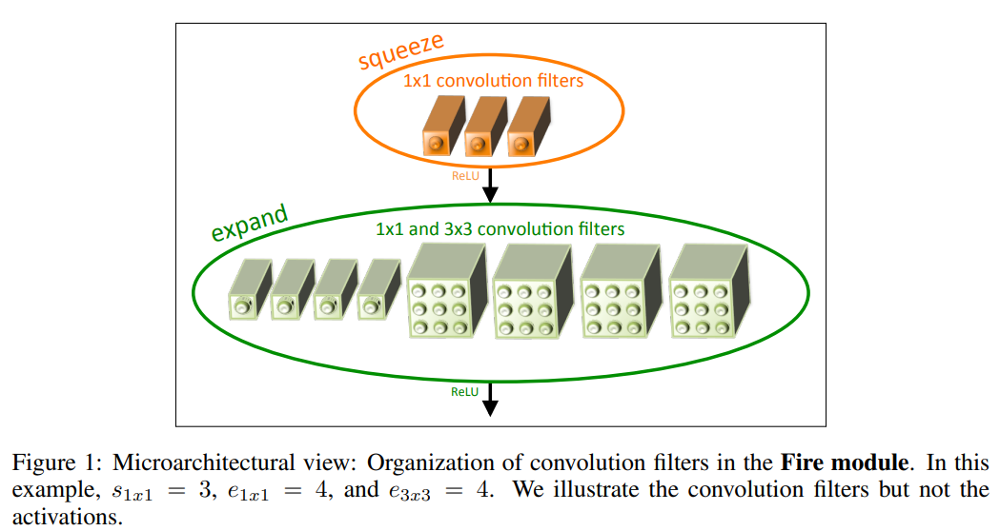
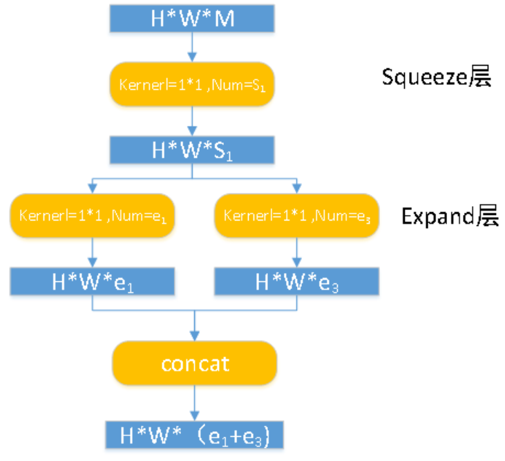
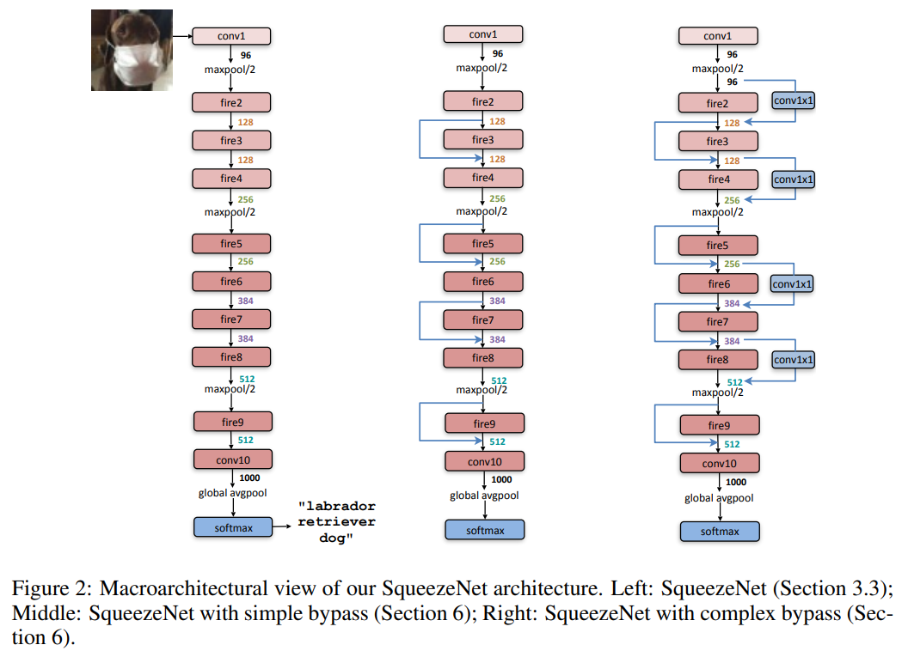
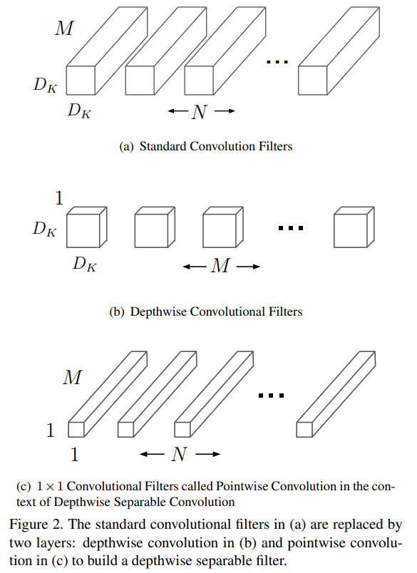
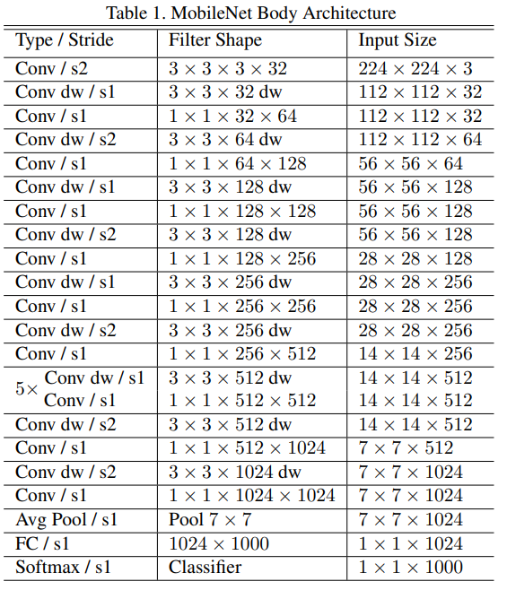
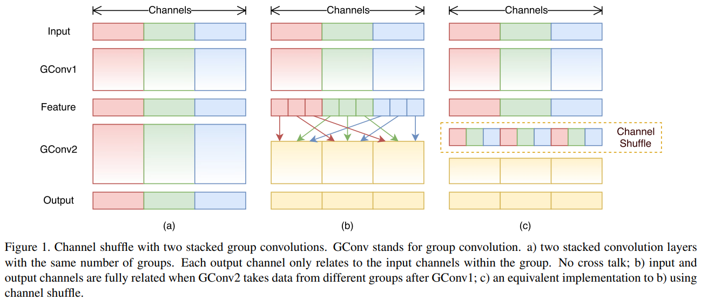
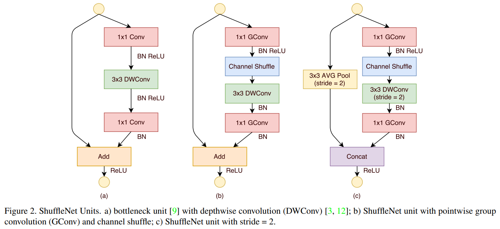

# 轻量化网络

## SqueezeNet

[SqueezeNet: AlexNet-level accuracy with 50x fewer parameters and <0.5MB model size](https://arxiv.org/abs/1602.07360)

与 AlexNet 准确率相当，但参数量更少。

SqueezeNet 的主要贡献在于开创了轻量化这一研究路线。

提出 fire module，包含：

- squeeze 层

	1x1 卷积，减少通道数。

- expand 层

	1x1 和 3x3 卷积，然后 concat 。

一个 fire module 所含的 filter ：

维度变化如下：

其中，$e_3$ 对应的 kernel 应当是 3x3 。

$S_1, e_1, e_3$ 是三个可调整的参数，分别 Squeeze 层的 1x1 filter 的个数，和 Expand 层的 1x1 和 3x3 filter 个数。

整个 fire module 的主要变化在通道上。

完整的网络结构堆叠 fire module：（SqueezeNet 是一个分类网络）

## MobileNet

[MobileNets: Efficient Convolutional Neural Networks for Mobile Vision Applications](https://arxiv.org/abs/1704.04861)

MobileNet 目标的应用场景为移动端。

MobileNet 常可用作轻量化的网络 backbone 。

贡献：

- 提出 Depthwise Separable Convolution（深度可分离卷积）

	详见 《Network Compression》

	- 使用 depth-wise convolution 以减少网络参数。

		depth-wise convolution 不是 MobileNet 提出来的，文中给的参考文献是 2014 年的一篇博士论文——《L. Sifre. Rigid-motion scattering for image classification. hD thesis, Ph. D. thesis, 2014》

	- 使用 point-wise convolution 解决了 depth-wise convolution 不同通道间信息交流不通畅的问题，即一个输出通道只含有一个输入通道的信息。

结构参数如下：

其中，在 depth-wise convolution 使用为 $2$ 的步长进行下采样。

## ShuffleNet

[ShuffleNet: An Extremely Efficient Convolutional Neural Network for Mobile Devices](https://arxiv.org/abs/1707.01083)

shuffle 指 channel shuffle，是将各部分的 feature map 的 channel 进行有序的打乱，构成新的 feature map，以解决 group convolution 带来的不同通道间信息流通不畅问题。（MobileNet 采用 point-wise convolution 解决这个问题）

使用 group convolution 时才有可能需要 shuffle，当然也可以用 point-wise convolution 解决这个问题。

在 MobileNet 中，1x1 卷积层有较多的卷积核，计算量巨大 ，ShuffleNet 采用 shuffle 替换掉 1x1 卷积，大量减少了权重参数。

ShuffleNet  使用 ShuffleNet bottleneck unit 堆叠组成完整的网络。

作者的 ShuffleNet unit 的改进过程：

其中：

- （b）对于（a）

	- 1x1 Conv 换成了 1x1 GConv 。
	- 添加了 Channel Shuffle 。

- （c）对于（b）

	- DWConv 采用 stride = 2 ，进行下采样。

	- 添加了 AVG Pool ，进行下采样，

	- 最后不采用 Add ，使用 Concat 弥补下采样的信息损失。

	- 提升了通道数数目。

		作者认为对于小型网络，通道数多一些比较好。

