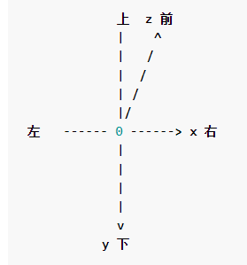
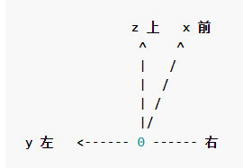
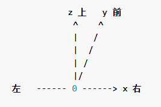
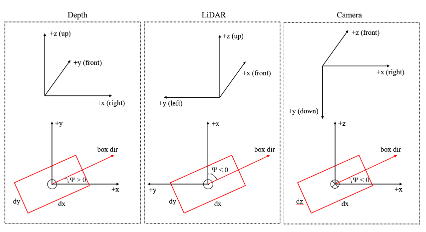
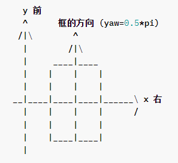
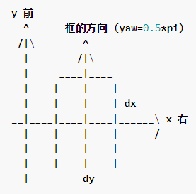
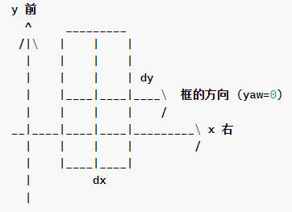

# 3D 坐标系

详见 [MMDetection3D 文档](https://mmdetection3d.readthedocs.io/zh_CN/latest/user_guides/coord_sys_tutorial.html)

3D 目标检测存在多种坐标系，各种 3D 数据采集设备使用不同的坐标系，模型使用不同的坐标系，数据集使用不同的坐标系。

## 常见坐标系

按一般情况，坐标系大致分为 3 类：

- 相机坐标系

	y 轴正方向指向地面，x 轴正方向指向右侧，z 轴正方向指向前方。

- 激光雷达坐标系

	z 轴负方向指向地面，x 轴正方向指向前方，y 轴正方向指向左侧。

- 深度坐标系

	z 轴负方向指向地面，x 轴正方向指向右侧，y 轴正方向指向前方。

坐标系不仅仅定义了三个轴，对于形如 $(x, y, z, dx, dy, dz, r)$ 的框来说，坐标系也定义了如何解释框的尺寸 $(dx, dy, dz)$ 和转向角 (yaw) 角度 $r$。

其中，上方是坐标系，下方是鸟瞰图。

三个坐标系都是右手坐标系，即右手张开，手指伸直，虎口垂直，其余四指并拢，这时，若拇指指向 x 轴，其余指指向 z 轴，则穿过掌心，从掌心指向手背的方向即为 y 轴方向。

## 转向角 (yaw) 的定义

目前一般的数据集，标注不包括俯仰角 (pitch) 和滚动角 (roll)，这意味着在预测框和计算框之间的重叠时只需考虑转向角 (yaw)。

参考方向一般是 x 轴的正方向，而如果一个框的转向角 (yaw) 为 0，则其方向被定义为与 x 轴平行。

$\Psi$ 的大小缩小到 $0$ 时 box dir 的指向就是 box 的 $\rm yaw = 0$ 的指向。

## 框尺寸的定义

$dx$ 的方向总是与 box dir 的方向平行。