# PointNet and PointNet++

[原作者 presentation video](https://www.bilibili.com/video/BV1As411377S/?t=949.0&vd_source=cafe7452ab275bd6570fc6a28a44ee23)

## PointNet

[ PointNet: Deep Learning on Point Sets for 3D Classification and Segmentation](https://arxiv.org/abs/1612.00593)

[ppt](http://stanford.edu/~rqi/pointnet/docs/cvpr17_pointnet_slides.pdf)

point cloud feature：

- intrinsic（local feature，几何信息）
- extrinsic（global feature，语义信息）

输入为三维点集合，对分类任务，输出为 $k$ 个类的分数；对分割任务，输出为 $n \times m$ 的 $n$ 个点的 $m$ 个语义类分数。

点集的特征：

- Unordered

	与点的顺序无关。

- Interaction among points

	需要考虑点与相邻点间的局部特征。

- Invariance under transformations

	几何物体的旋转和平移不应当改变分类和分割的结果。

### Model Architecture

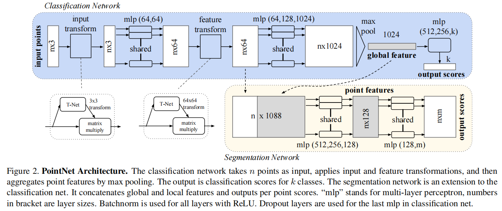

其中，mlp 的括号内数字表示该层神经元的数目（输出维数）。

相近的 mlp 分享权值。

PointNet (vanilla) 是 PointNet 没有 input transform 和 feature transform（主要是 T-Net）的用于 classification 的部分。

### Symmetry Function for Unordered Input

In order to make a model invariant to input permutation，有三种策略：（本文采用对称函数）

1. 对输入规范化

	- 输入易受扰动，排序不能很好地让模型保持一致的结果。

2. 用输入的所有 permutation 的 sequences 训练 RNN 。

	- RNN 对短序列具有好的不变性，但对于长序列效果不佳。

3. 使用一个对称函数从每个点中提取信息。

	- 输入 $n$ 个向量，输出新的与输入顺序无关的特征向量。

	- 比如加法 $+$ 和乘法 $\times$ 就是顺序无关的二元运算。

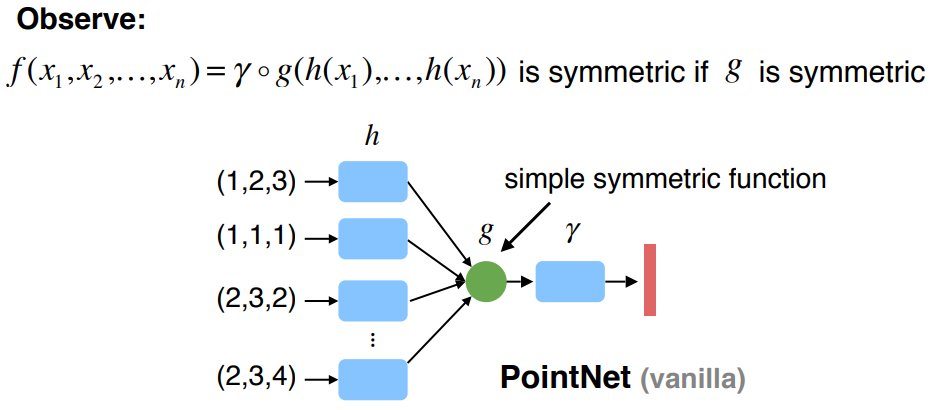

basic module 使用 MLP 作为 $h$ ，使用单变量函数的组合的 max pooling 作为 $g$ ：

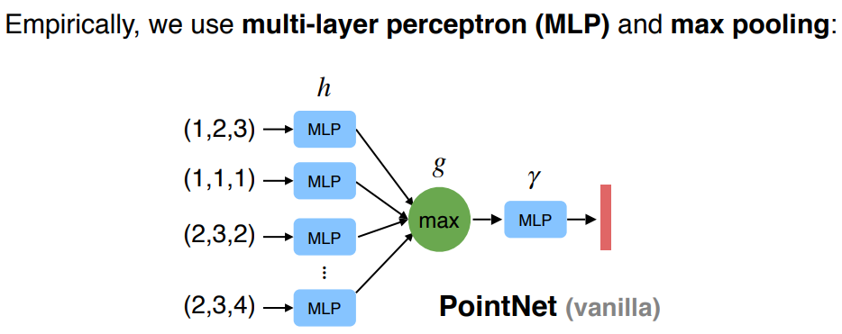

输出一个 vector : $[f_1,\dots,f_K]$，which is a global signature of the input set 。

MLP 将一个三维点映射到高维空间中，以使其具备顺序不变性，同时这种升维的映射必定存在冗余，这样的冗余使其在 max pooling 时减少了信息的丢失。

max pooling 的矩阵运算：

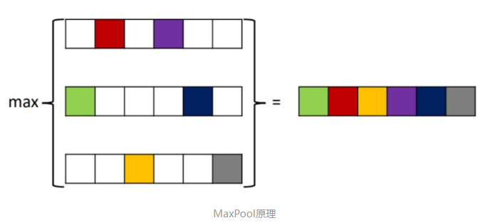

作者认为 max pooling 使 PointNet 具备相当强的提取描述形状的关键点（critical point）的能力（在 max pooling 中全部特征维度落选的点是非关键点），将关键点（max pooling 中有特征维度胜利的点）画出：

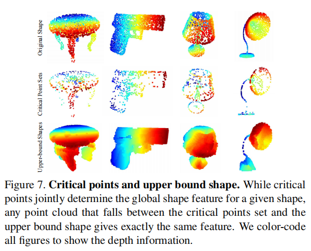

max pooling 在作者的策略对比实验中取得了最好的表现：

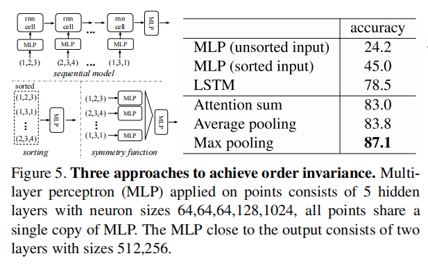

其中，attention sum 是自适应的加权和。

### Local and Global Information Aggregation

可以使用简单的 SVM 或 MLP 对 global signature 进行 classification 。

对于 segmentation ，其需要 local 和 global特征的结合，作者将 global feature vector 与之前的 per point feature（local embedding）拼接（每个点的特征都与 global feature 拼接，global feature 重复 $n$ 次），从而得到含有 local 和 global 信息的结合表示。

### Joint Alignment Network

预测一个 affifine transformation matrix 用于应对仿射变换下的不变性，即 T-net 部分。

特征空间的变换矩阵比空间变换的变换矩阵具有更高的维数，这增加了优化的难度，因此作者添加一个 loss 的正则项，使变换矩阵接近于是一个 orthogonal matrix（正交矩阵）。

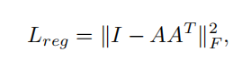

其中，$A$ 即变换矩阵。

作者希望正交变换不会损失输入的信息，经实验，这确实让 model 得到了更好的表现，但提升非常小。

## PointNet++

[PointNet++: Deep Hierarchical Feature Learning on Point Sets in a Metric Space](https://arxiv.org/abs/1706.02413)

PoinNet 对全局特征的提取能力较强，但对局部特征的提取能力较弱，因此在分割能力上表现一般。

PointNet++ 将点云划分（partitioning）为 overlapping local regions by the distance metric of the underlying space（一般是欧式空间）。

局部特征被 grouped into larger units and 生成更高等级的特征，重复这个过程，直到得到点云全局的特征。

PointNet++ 要处理的两个主要问题：

-  how to generate the partitioning of the point set
	- partitioning 的策略必须产生一般的结构在 partitions 间，以便于 local feature learners 共享权值，就像卷积一样。
	- 将每个 partition 定义为  neighborhood ball ，由 centroid location and scale 描述。
	- centroid 由 farthest point sampling (FPS) algorithm 生成，详见 Sampling layer 部分。
	- 体素化的 CNN 以固定的 strides 扫描空间，而作者的局部感受野取决于输入数据和 metric 的选择，相当于一个动态适应性的感受野。
- how to abstract sets of points or local features through a local feature learner
	- 作者将 PointNet 作为 local feature learner 。

作者假设处理的输入的点云 have variable density at different areas ，这是点云的一般情况，由近到远，由密集到稀疏。

作者认为 PointNet++ leverages neighborhoods at multiple scales ，能够 detected at different scales and combine multi-scale features 。

PointNet++ 在分类和分割上准确率只提升了 2 到 4 个点，提升较小，但 encoder 部分常用做网络组件，作为特征提取器。

### Hierarchical Point Set Feature Learning

PointNet++ 分层级地 group 点，逐步地 abstract（抽象）越来越大的区域特征：

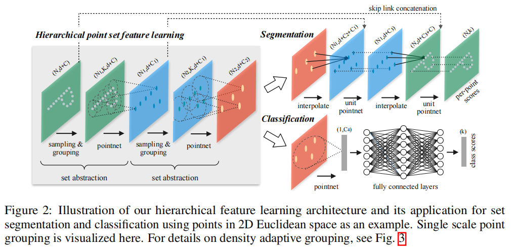

整体是一个 encoder-decoder 架构，注意点个数 $N$ 的下标的前后关系以及维度的 skip link 变化。

每个 point set abstraction（SA）由三个部分组成：

- Sampling layer

	从输入中提取代表局部区域的 centroid（形心）的点。

- Grouping layer

	利用 centroid 的邻居构建 local region sets 。

- PointNet layer

	使用 mini-PointNet 对局部区域编码为特征向量。

一个 set abstraction ：

- 输入 $N \times (d +C)$ 矩阵，$N$ 个点，$d$ 维坐标，$C$ 维 point feature 。
- 输出 $N' \times (d + C')$ 矩阵，$N'$ 个 subsampled points，$d$ 维坐标，$C'$ 维 feature vectors summarizing local context 。

PointNet++ 仍然能够保证 translation（在 set abstraction 中使用局部坐标系）和 permutation（对区域使用 PointNet）的不变性。

#### Sampling layer

使用 farthest point sampling (FPS) 迭代地从输入点集中选取点，其中点 $x_j$ 是距离已有子集 $x_{1 \dots j-1}$ 的最远的点。（随机选一个初始点）

相比于随机 sampling ，它在相同数量的 centroid 的完整点集上有更好的 coverage 效果。

我觉得 FPS 能够更好地覆盖区域，以利用提取出关键点。

注意 FPS 是在坐标空间做的，不是在特征空间做到，因为 FPS 是不可微的，无法反向传播。

#### Grouping layer

- 输入 $N \times (d +C)$ 和 centroids 的坐标集和 $N' \times d$ 。
- 输出 $N' \times K \times (d + C)$ 。
	- 每个 group 关系一个 local region 。
	- $K$ 是 centroid 的邻居数量
		- 可设定距离上限，找球半径内的点（ball query）的数量。（邻居点数量不固定）
		- 也可设定点个数上限，找最近邻点（K nearest neighbor，KNN）（邻居点数量固定）
	- $K$ 的值在不同 group 中可能不同，但其后的 PointNet 会将其转化为固定长度的 local region feature vector （对维度的 max pooling ）。

球半径内的点具有固定的区域大小尺度，这使得 local region feature 更具泛化性，更适合需要 local pattern recognition 的任务，比如 semantic point labeling 。

#### PointNet layer

- 输入每个局部区域的点信息， $N' \times K \times (d + C)$ 。
- 输出特征局部区域的特征， $N' \times (d + C')$ 。

 点的坐标首先被转换到 local region 的相对于 centroid 的局部坐标系，以提取 local region 中点与点的局部关系。

作者使用 PointNet (vanilla) ，去掉了 PoinNet 中 input transform 和 feature transform（T-Net）部分。

### Robust Feature Learning under Non-Uniform Sampling Density

point set comes with nonuniform density in different areas ，在密集区域的特征提取在稀疏区域不一定有效，反之亦然。

稀疏区域应当寻求更大尺度的邻域中的特征，作者提出 density adaptive PointNet layers ，包括两种类型：MSG，MRG 。

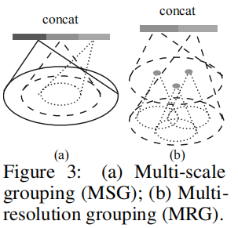

#### Multi-scale grouping (MSG)

分别从多个尺度的邻域中提取特征，然后 concat 起来。

MSG 对每个 centroid 的不同尺度的邻域做计算，特别是在低的网络层级，centroid 的数量多，计算量非常大。

#### Multi-resolution grouping (MRG)

$L_i$ 层的特征，即从 $L_{i-1}$ 提取出的特征，由两部分特征向量 concat 而成：

- left vector

	来自 level $L_{i-1}$ 的 subregion 的综合特征，使用 set abstraction（包括 sampling，grouping，PointNet）。

- right vector

	提取自 level $L_{i-1}$ 的 all raw points in the local region 的特征，直接使用单个 PointNet 。

分析：

- When the density of a local region is low，left vector 没有 right vector 可信，因为 subregion contains even sparser points and suffers more from sampling deficiency ，此时 right vector 应该有更高的权重。
- when the density of a local region is high ，left vector 能提供更充分的信息，因为它 at higher resolutions recursively in lower levels 。
- 左右的 vector 的权值可根据当前区域的密集程度动态选择。

MRG 能够完成 MSG 的功能，且计算量小。

### Point Feature Propagation for Set Segmentation

（为分割任务上采样的过程）

在 set abstraction layer ，原始点云被 smaple ，对于 segmention，一般希望保留所有原始点的信息：

- 一个解决方法是 to always sample all points as centroids in all set abstraction levels ，这会导致巨大的计算量。
- 另一个方式就是 propagate（繁殖）features from subsampled points to the original points 。
	- 使用 distance based interpolation 增加点数量
	- 和 across level skip links 拼接低层级和高层级的特征。

在 feature propagation level ，作者 propagate point features from $N_l \times (d + C)$ to $N_{l-1} \times (d + C)$ ，（$N_l \le N_{l-1} $，这里的下标是和编码器部分的层对应的），增加点数量。

对于 $N_{l-1}$ 的每个点 $x$ ，在 $N_l$ 中找到原始点云坐标空间（不再是局部坐标空间）的与其最接近的 $k$ 个 点，从而计算 $x$ 的特征，计算方式如下：

使用基于 $k$ 最近邻（KNN）的 inverse distance weighted average（逆距离加权平均）（即越远权值越小）的 interpolation 方法：

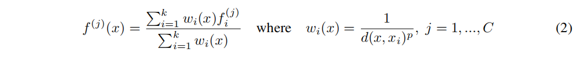

其中，$d$ 是距离函数，KNN 的参数取为 $p = 2, k = 3$ ，$w$ 是权重 ，$f^{(j)}(x)$ 是点 $x$ 的第 $j$ 个特征维度的值，$f^{(j)}_i$ 是点 $x$ 周围第 $i$ 个点的第 $j$ 个特征维度。

插值后的特征图随即与 skip link 的特征 concat ，然后通过 unit pointnet 。

插值，concat，unit pointnet 反复，直到还原为原输入尺寸，完成分割任务的解码准备。

### 补充

- SSG (single scale grouping) 

	精简后的 PointNet++ ，每一层只有单一尺度的 grouping ，即只有一个 SA 。（MSG 有多个尺度的 SA）

-  DP（dropout）

	random input dropout during training 。

网络结构的详细描述可见论文附录  Network Architectures 部分：

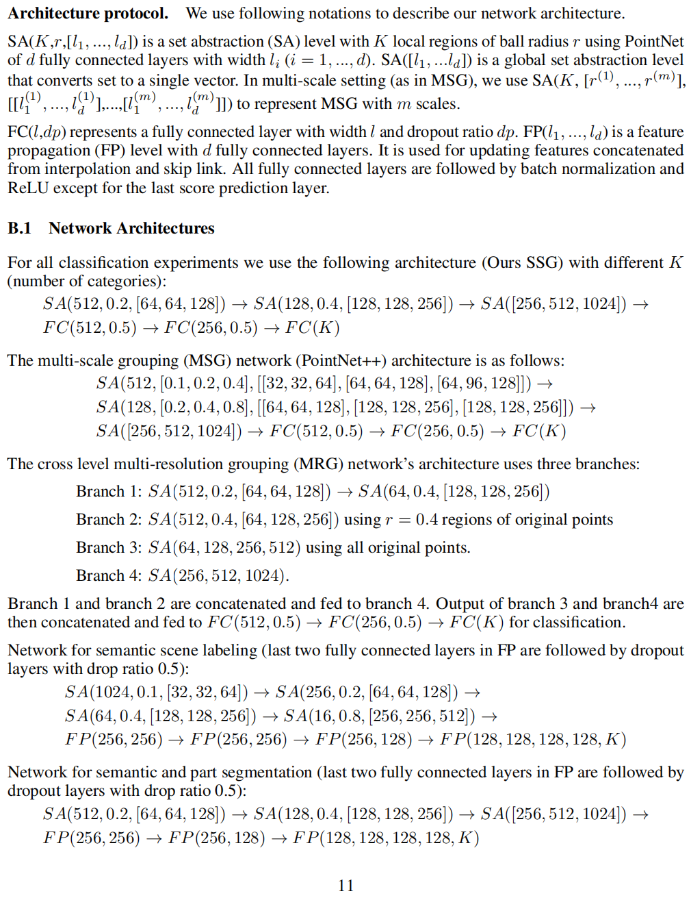